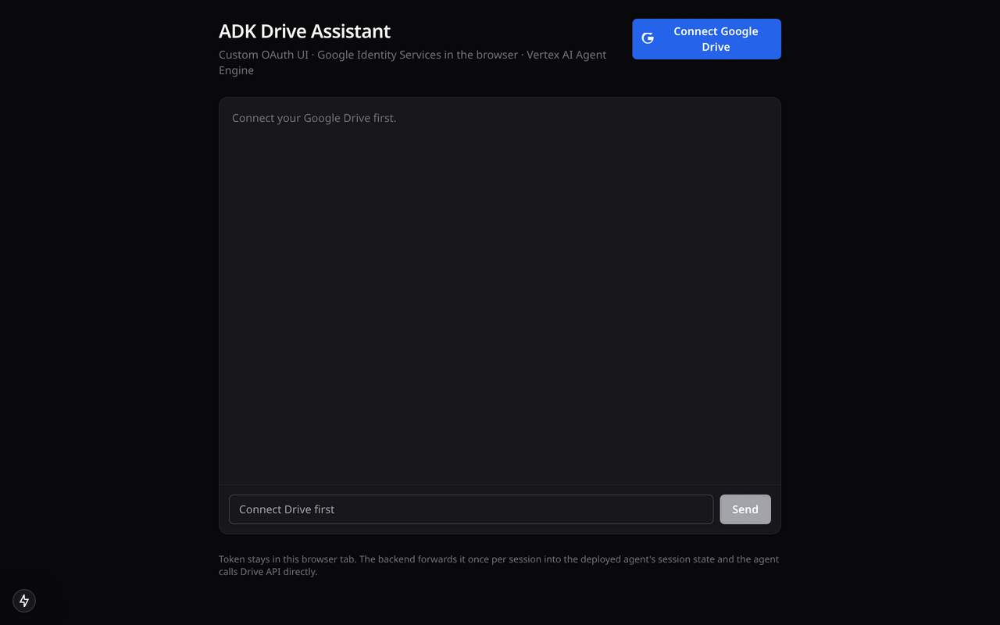
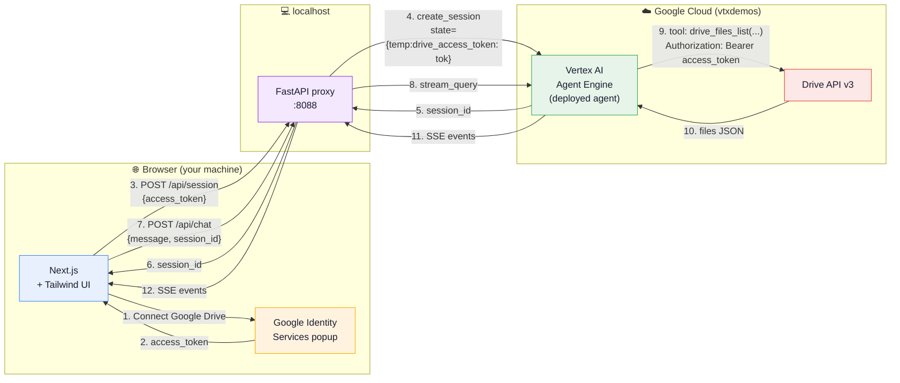
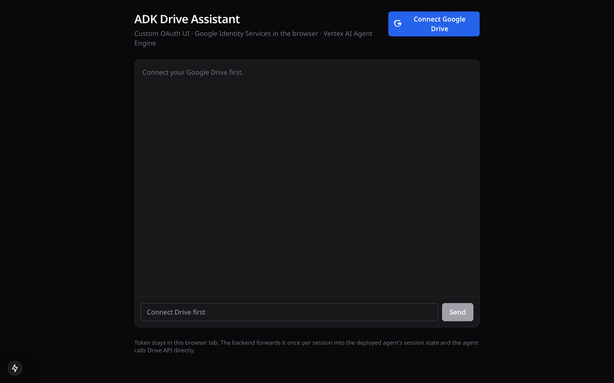
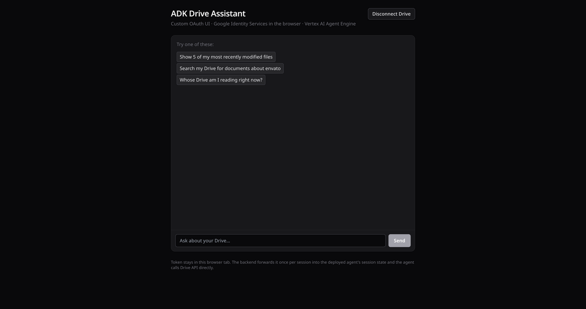
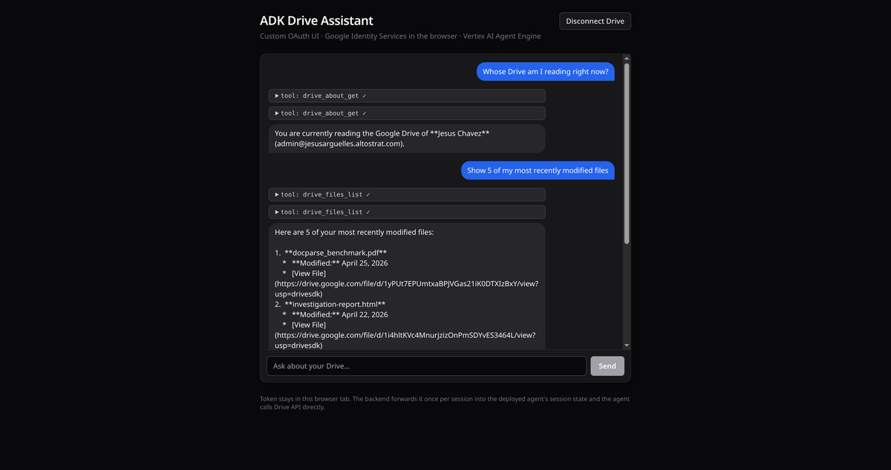
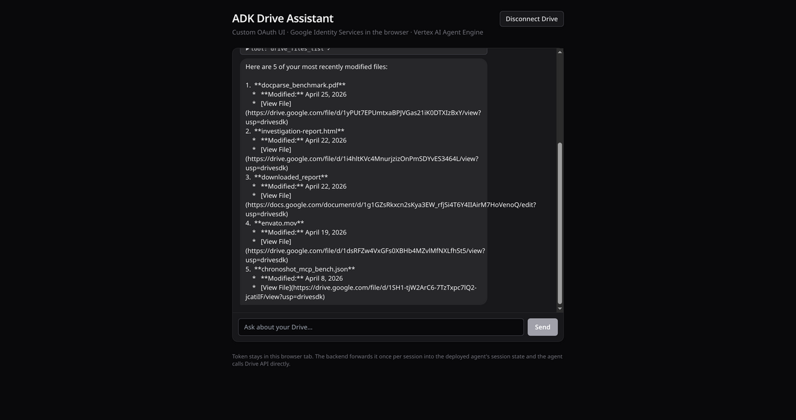
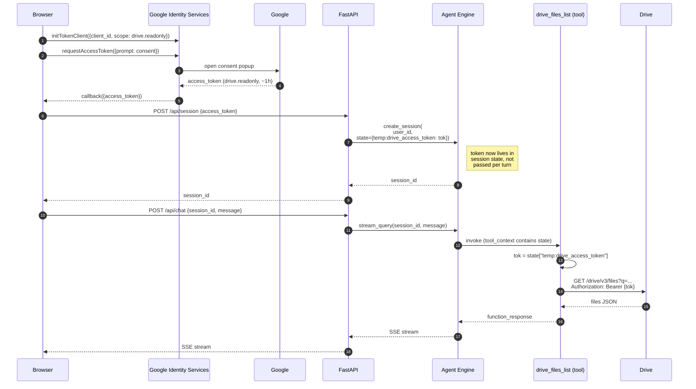

<h1 align="center">adk-drive-ae</h1>

<p align="center">
  <strong>An ADK Drive agent on Vertex AI Agent Engine, with a custom Next.js OAuth UI that injects the user's Drive access token into the agent's session.</strong>
</p>

<p align="center">
  
  
  
  
  
  
  
</p>

<p align="center">
  
</p>

---

## TL;DR

The sibling [`adk-drive-via-appint`](../adk-drive-via-appint/) uses ADK's built-in dev-UI OAuth popup. Fine for prototyping — but the popup is owned by the dev UI, the agent runs locally, and there is no separation between *where the user signs in* and *where the agent runs.* This project flips that:

- 🌐 **Browser** owns the OAuth popup (Google Identity Services).
- 🐍 **FastAPI** forwards the access token into Agent Engine's session state via `create_session(state={...})`.
- 🤖 **Agent** — deployed to Vertex AI Agent Engine — calls Drive API v3 directly with that token. No Application Integration in the loop.

Same architecture as [`sharepoint_wif_portal`](../sharepoint_wif_portal/), generalized for Google Drive.

## Table of Contents

- [Architecture](#architecture)
- [End-to-end sequence](#end-to-end-sequence)
- [Quickstart](#quickstart)
- [Setup — once per project](#setup--once-per-project)
- [Run](#run)
- [Verify each layer](#verify-each-layer-independently)
- [Troubleshooting](#troubleshooting)
- [How the auth flow actually works](#how-the-auth-flow-actually-works)
- [Adapting for production](#adapting-for-production)
- [Project layout](#project-layout)
- [Reference: similar projects](#reference-similar-projects)

## Architecture



## End-to-end sequence

```mermaid
sequenceDiagram
    autonumber
    actor User
    participant UI as Next.js UI<br/>(localhost:3000)
    participant GIS as Google Identity<br/>Services
    participant Google as Google OAuth<br/>servers
    participant BE as FastAPI<br/>(localhost:8088)
    participant AE as Vertex AI<br/>Agent Engine
    participant Tool as ADK Tool<br/>(inside Agent)
    participant Drive as Drive API v3

    User->>UI: open localhost:3000
    UI->>UI: load page; GIS script attached in <head>

    User->>UI: click "Connect Google Drive"
    UI->>GIS: initTokenClient({client_id, scope: drive.readonly})
    UI->>GIS: requestAccessToken({prompt: consent})
    GIS->>Google: open popup, user signs in + consents
    Google-->>GIS: access_token (~1h TTL, drive.readonly scope)
    GIS-->>UI: callback({access_token})
    UI->>UI: setAccessToken(token) — kept only in React state

    User->>UI: type "list 5 most recent files"
    UI->>BE: POST /api/session<br/>{access_token, user_id}
    BE->>AE: agent.create_session(<br/>  user_id,<br/>  state={"temp:drive_access_token": tok,<br/>          "drive_access_token": tok})
    AE-->>BE: {session_id}
    BE-->>UI: {session_id}
    UI->>UI: cache session_id for the chat

    UI->>BE: POST /api/chat<br/>{message, session_id, user_id, access_token}
    BE->>AE: agent.stream_query(user_id, session_id, message)

    activate AE
    AE->>AE: model picks tool: drive_files_list(q, page_size)
    AE-->>BE: SSE event: function_call
    BE-->>UI: SSE event: tool_call

    AE->>Tool: invoke drive_files_list(...)<br/>tool_context.state["temp:drive_access_token"]
    Tool->>Tool: _get_token() — read from session state
    Tool->>Drive: GET /drive/v3/files?q=...&pageSize=10<br/>Authorization: Bearer {access_token}
    Drive-->>Tool: 200 {files: [...]}
    Tool-->>AE: return {files: [...]}
    AE-->>BE: SSE event: function_response
    BE-->>UI: SSE event: tool_result

    AE->>AE: model summarizes results
    AE-->>BE: SSE event: text chunks
    BE-->>UI: SSE event: text chunks
    UI->>User: render answer + tool trace
    deactivate AE

    Note over UI,AE: Subsequent messages reuse the same session_id<br/>so the token does not get re-injected per turn.
```

## Quickstart

For someone who already has Python 3.11+, Node 20+, `uv`, `gcloud` set up against a GCP project, and an OAuth Web client (see [Setup](#setup--once-per-project) for details), the entire flow is **five commands** plus one OAuth Console step.

```bash
git clone https://github.com/jchavezar/vertex-ai-samples.git
cd vertex-ai-samples/semiautonomous-agents/adk-drive-ae

# 1. install deps
uv sync && (cd frontend && npm install)

# 2. config
cp .env.example .env                      # edit: GOOGLE_CLOUD_PROJECT, DEPLOY_STAGING_BUCKET
cp frontend/.env.local.example frontend/.env.local   # edit: NEXT_PUBLIC_GOOGLE_CLIENT_ID

# 3. deploy the agent (~3 min)
uv run python scripts/deploy.py new       # paste resource_name into .env as AGENT_ENGINE_RESOURCE

# 4. run backend (terminal 1)
uv run uvicorn backend.main:app --port 8088 --reload

# 5. run frontend (terminal 2)
cd frontend && npm run dev
```

Open <http://localhost:3000>, click **Connect Google Drive**, ask `whose Drive am I reading?`.

## Setup — once per project

### 1. Prerequisites

```bash
# Required APIs
gcloud services enable aiplatform.googleapis.com drive.googleapis.com --project=YOUR_PROJECT

# Staging bucket for Agent Engine deploy artifacts
gcloud storage buckets create gs://YOUR_PROJECT-agent-engine \
    --location=us-central1 --project=YOUR_PROJECT
```

### 2. Create the OAuth Web client (the only manual Console step)

The browser-side popup uses a Web Application OAuth client. **One-time, manual.**

1. Open **APIs & Services → Credentials**:
   `https://console.cloud.google.com/apis/credentials?project=YOUR_PROJECT`

2. **Configure OAuth consent screen** (skip if already done):
   - User type: **Internal** if your org uses Workspace, **External** otherwise
   - Add scope: `https://www.googleapis.com/auth/drive.readonly`
   - For **External + Testing**: add your test user emails

3. **+ CREATE CREDENTIALS → OAuth client ID**
   - Application type: **Web application**
   - Name: `adk-drive-ae`
   - **Authorized JavaScript origins** → ADD URI: `http://localhost:3000`

   > ⚠️ This is the **top** section *("For use with requests from a browser")*.
   > **Not** "Authorized redirect URIs" — leave that empty. The popup token flow does not redirect.

4. **CREATE** → copy the **Client ID** (the secret is unused).

### 3. Configure environment files

```bash
cd vertex-ai-samples/semiautonomous-agents/adk-drive-ae

cp .env.example .env
# .env:
#   GOOGLE_CLOUD_PROJECT=your-project
#   DEPLOY_STAGING_BUCKET=gs://your-project-agent-engine
#   AGENT_ENGINE_RESOURCE=                 (filled after step 5)

cp frontend/.env.local.example frontend/.env.local
# frontend/.env.local:
#   NEXT_PUBLIC_GOOGLE_CLIENT_ID=...apps.googleusercontent.com
#   NEXT_PUBLIC_BACKEND_URL=http://localhost:8088
```

### 4. Install dependencies

```bash
uv sync                      # Python (agent + backend)
cd frontend && npm install   # Frontend
cd ..
```

### 5. Deploy the agent to Agent Engine

```bash
uv run python scripts/deploy.py new
```

~3-5 minutes. At the end you will see:

```
[deploy] resource_name = projects/.../reasoningEngines/...

Add to .env:
AGENT_ENGINE_RESOURCE="projects/.../reasoningEngines/..."
```

Paste that line into `.env`. From here on, `uv run python scripts/deploy.py update` (or just `deploy.py` with `AGENT_ENGINE_RESOURCE` already set) redeploys the same engine in place.

## Run

You need three things running: the deployed agent (already up after `deploy.py`), the FastAPI backend, and the Next.js frontend.

| Terminal | Command | What it does |
|---|---|---|
| **1 — backend** | `uv run uvicorn backend.main:app --port 8088 --reload` | FastAPI proxy on :8088 |
| **2 — frontend** | `cd frontend && npm run dev` | Next.js dev server on :3000 |

If you are running on a remote VM, tunnel both ports from your laptop:

```bash
gcloud compute ssh YOUR_VM -- -L 3000:localhost:3000 -L 8088:localhost:8088
```

Then open <http://localhost:3000>.

### What you'll see

| 1. Landing | 2. Signed in |
|---|---|
|  |  |
| **3. Tool call streaming** | **4. Final answer** |
|  |  |

Try one of these prompts:

- `Show 5 of my most recently modified files`
- `Search my Drive for documents about envato`
- `Whose Drive am I reading right now?`

## Verify each layer independently

When something breaks, isolate which layer is at fault.

```bash
# 1. Backend health (should print agent_engine_configured: true)
curl -s http://localhost:8088/api/health | jq

# 2. Backend → Agent Engine plumbing test (uses a fake token; Drive returns 401, that's fine)
SID=$(curl -s -X POST http://localhost:8088/api/session \
  -H 'Content-Type: application/json' \
  -d '{"access_token":"FAKE","user_id":"test","message":""}' | jq -r .session_id)

curl -sN -X POST http://localhost:8088/api/chat \
  -H 'Content-Type: application/json' \
  -d "{\"access_token\":\"FAKE\",\"user_id\":\"test\",\"session_id\":\"$SID\",\"message\":\"call drive_about_get\"}"
```

Expect: `function_call` event → `function_response` with HTTP 401 from Drive → model text explaining the auth error. Three SSE events = pipeline OK end-to-end. Then check Cloud Logging for the agent itself.

## Troubleshooting

<details>
<summary><strong><code>Access blocked: no registered origin</code> / <code>invalid_client</code></strong></summary>

The OAuth client doesn't have `http://localhost:3000` under **Authorized JavaScript origins** (the *browser* section, not the *web server* "redirect URIs" section). Add it, save, wait ~30 seconds.

</details>

<details>
<summary><strong>Popup never opens</strong></summary>

Browser blocked it. Allow popups for `localhost:3000` and click again.

</details>

<details>
<summary><strong><code>Access blocked: ... has not completed the Google verification process</code></strong></summary>

OAuth consent screen is in **Testing** publishing status and the signing-in account isn't in the test users list. Console → APIs & Services → OAuth consent screen → Test users → Add user.

</details>

<details>
<summary><strong>Stream returns one event then stops</strong></summary>

A tool inside the agent is raising an unhandled exception, which silently kills `stream_query`. Every tool in `agent/agent.py` already wraps its body in `try/except` — if you add a new tool, do the same.

</details>

<details>
<summary><strong><code>HTTP 401: Request had invalid authentication credentials</code> from a Drive tool</strong></summary>

The token in session state is invalid or expired. Click **Disconnect Drive** in the UI and reconnect to get a fresh token (~1h TTL).

</details>

<details>
<summary><strong><code>port 8080 already in use</code></strong></summary>

On this VM port 8080 is taken by the ms365-mcp Cloud Run proxy. The backend uses **8088** — make sure your tunnel and `frontend/.env.local` both point at 8088.

</details>

<details>
<summary><strong><code>404 Publisher Model ... was not found</code></strong></summary>

The agent uses `gemini-3-flash-preview`, which only serves from the `global` model location. The deploy script sets `GOOGLE_CLOUD_LOCATION=global` as a runtime env var on the deployed agent. If you change the model, update that env var too.

</details>

<details>
<summary><strong>Updates to <code>agent/agent.py</code> aren't reflected</strong></summary>

Run `uv run python scripts/deploy.py update` and wait for the LRO to finish (~3-4 min). The backend will pick up the new code on its next session.

</details>

## How the auth flow actually works



Two things make this work:

1. **`create_session(state=...)` actually persists state into `tool_context.state` on the deployed agent.** This is the same mechanism Agentspace / Gemini Enterprise uses to pass per-user OAuth tokens to ADK tools (the `temp:` prefix is the runtime-only convention). Verified end-to-end in this project; also used in [`sharepoint_wif_portal/backend/agent_client.py:60`](../sharepoint_wif_portal/backend/agent_client.py).

2. **The agent's tool reads from state, not from a request body.** That keeps the agent's API surface unchanged — the tool signature is just `drive_files_list(q, page_size, tool_context)` — and means the same agent code works under any caller that can populate session state (this UI, Agentspace, Gemini Enterprise, a different SDK).

## Adapting for production

This setup is local-first by design. To productionize:

| Step | Change |
|---|---|
| **Host the backend** | Deploy `backend/` to **Cloud Run + IAP**. Stateless, ~150 lines. Update CORS allow-list to the production frontend origin. |
| **Host the frontend** | Deploy `frontend/` to **Cloud Run** or **Firebase Hosting**. Update `NEXT_PUBLIC_BACKEND_URL` to the Cloud Run URL of the backend. |
| **OAuth origins** | Add `https://yourdomain.com` to **Authorized JavaScript origins** on the same OAuth client. |
| **Consent screen** | Move from **Testing** to **In Production** if you'll have external users (otherwise only test users can sign in). |
| **Session pooling** | Currently each `/api/session` call creates a fresh Agent Engine session. For high-traffic apps, reuse sessions per `(user_id, day)` so token-injection state stays coherent across many turns. |

## Project layout

```
adk-drive-ae/
├── README.md                 ← you are here
├── pyproject.toml            ← Python deps for agent + backend
├── .env / .env.example       ← project + Agent Engine resource
├── .gitignore
│
├── agent/                    ← ADK agent (deployed to Agent Engine)
│   ├── __init__.py
│   └── agent.py              ← root_agent + 4 FunctionTools (list/get/export/about)
│
├── backend/                  ← FastAPI proxy
│   └── main.py               ← /api/session, /api/chat (SSE), /api/health
│
├── scripts/
│   ├── deploy.py             ← AdkApp + agent_engines.create()/update()
│   └── test_local.py         ← InMemoryRunner sanity test (optional)
│
├── frontend/                 ← Next.js 15 + Tailwind
│   ├── package.json
│   ├── .env.local            ← OAuth client ID + backend URL
│   ├── app/
│   │   ├── layout.tsx        ← loads GIS script
│   │   └── page.tsx          ← auth gate + chat panel
│   ├── components/
│   │   ├── DriveAuthButton.tsx   ← GIS popup
│   │   └── ChatPanel.tsx         ← chat UI + SSE consumer
│   └── lib/
│       └── api.ts            ← createSession + streamChat helpers
│
└── docs/
    └── img/                  ← README assets (GIF + screenshots)
```

## Reference: similar projects

| Project | What it does | Why look at it |
|---|---|---|
| [`adk-drive-via-appint`](../adk-drive-via-appint/) | Same Drive agent, but uses ADK dev UI's built-in OAuth popup | Compare against this project to see what changes when the UI owns auth |
| [`sharepoint_wif_portal`](../sharepoint_wif_portal/) | Same architecture as this project, for SharePoint instead of Drive | Frontend uses MSAL/Entra; backend forwards JWT in `state["sharepointauth2"]` — confirms the pattern is reusable across any third-party identity |
| [`gemini-enterprise-sharepoint-agent`](../gemini-enterprise-sharepoint-agent/) | Discovery Engine + WIF, runs under Gemini Enterprise | Source of the dual-key state lookup pattern (`temp:KEY` first, then `KEY`) used in `_get_token` here |

---

<p align="center">
  <em>Built by <a href="https://www.linkedin.com/in/jchavezar/">Jesús Chávez</a> · part of <a href="https://github.com/jchavezar/vertex-ai-samples">vertex-ai-samples</a></em>
</p>
