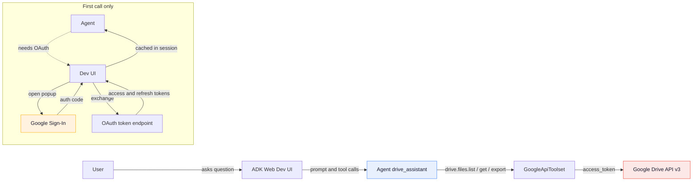

# ADK Drive Agent (User OAuth)

A Google ADK agent that searches and reads the user's Google Drive. The first time the agent calls a Drive tool, the ADK dev UI opens a Google sign-in popup; once the user authorizes, the access token is cached in session state and the agent answers using only retrieved file content.

No Application Integration in the runtime path — it's `GoogleApiToolset("drive", "v3", ...)` plus ADK's native OAuth flow.

## Architecture



## Prerequisites

- A GCP project (this README uses `vtxdemos`).
- `gcloud` CLI authenticated against that project.
- Python 3.11+ and `uv` (`curl -LsSf https://astral.sh/uv/install.sh | sh`).
- Vertex AI API enabled.
- Google Drive API enabled in the project.

```bash
gcloud services enable drive.googleapis.com aiplatform.googleapis.com --project=YOUR_PROJECT
```

## Step 1 — Create the OAuth client (this is the part everyone gets wrong)

The agent uses an OAuth 2.0 **Web Application** client with the user's identity (not the VM's service account). You only do this once per project.

1. Open the Credentials page:
   `https://console.cloud.google.com/apis/credentials?project=YOUR_PROJECT`

2. **Configure the OAuth consent screen** (only required if not already done for this project):
   - User type: **Internal** if your org uses Google Workspace, **External** otherwise.
   - App name, user support email, developer email — minimal info is fine for testing.
   - **Scopes** — add: `https://www.googleapis.com/auth/drive.readonly`. The agent works with `drive.readonly` for read-only ops; if you want create/update/delete you need broader scopes.
   - **Test users** (External + Testing publishing status): add the Google accounts that will sign in.

3. **+ CREATE CREDENTIALS → OAuth client ID**
   - Application type: **Web application**
   - Name: `adk-drive-test` (anything)
   - **Authorized redirect URIs** → ADD URI:
     - `http://localhost:8000/dev-ui/`
     - Plus any other origin you'll open in the browser (e.g., `http://localhost:9000/dev-ui/` if you use a different port).

   The redirect URI MUST match exactly — trailing slash included. ADK web's dev UI is served at `/dev-ui/` so that's the path to register.

4. **CREATE** — copy the **Client ID** and **Client Secret**. Treat them as secrets.

## Step 2 — Project setup

```bash
git clone https://github.com/jchavezar/vertex-ai-samples.git
cd vertex-ai-samples/semiautonomous-agents/adk-drive-via-appint

cp .env.example .env
# Edit .env and paste OAUTH_CLIENT_ID / OAUTH_CLIENT_SECRET from Step 1
# Also set GOOGLE_CLOUD_PROJECT to your project ID

uv sync
```

## Step 3 — Run

```bash
GOOGLE_CLOUD_LOCATION=global uv run adk web . --host 0.0.0.0 --port 8000
```

Why the `GOOGLE_CLOUD_LOCATION=global` override: the `gemini-3-flash-preview` model is only served from the `global` region. ADK respects environment variables that are explicitly set in the shell over `.env`, so if your shell exports `GOOGLE_CLOUD_LOCATION=us-central1` (common on GCP VMs), `.env` will not win. Setting it inline at launch time is the simplest fix.

If you're running on a remote VM, tunnel the port from your laptop:

```bash
gcloud compute ssh YOUR_VM -- -L 8000:localhost:8000
```

Then open `http://localhost:8000` in your browser, pick the `agent` app from the left sidebar, and ask:

```
list 5 most recent files in my Drive
```

The first tool call will open a Google sign-in popup. After consent, the access token is cached in the session and subsequent calls go straight through.

## Sample queries

```
What does my notes file about envato say?
Find spreadsheets I edited this month.
Open the doc named "Q3 strategy" and summarize it.
```

## Project layout

```
adk-drive-via-appint/
├── README.md
├── pyproject.toml
├── .env.example
├── .gitignore
├── agent/
│   ├── __init__.py
│   └── agent.py            # Agent + GoogleApiToolset("drive", "v3", ...)
├── scripts/
│   └── check_connection.py # Healthcheck for the Application Integration variant
└── test_local.py           # Run a single query without the dev UI
```

## Troubleshooting

**`404 Publisher Model ... was not found`**
The model lives in a different region than the request. Set `GOOGLE_CLOUD_LOCATION=global` in the shell where you launch `adk web`, not just in `.env`.

**OAuth popup says `redirect_uri_mismatch`**
The redirect URI in your OAuth client does not match what the dev UI sent. Add the exact URL (including trailing slash and port) to **Authorized redirect URIs** in the Console and wait a minute for propagation.

**Popup never appears**
Browser blocked it. Allow popups for `localhost:8000` and re-run the question.

**`Access blocked: ... has not completed the Google verification process`**
Your OAuth consent screen is in **Testing** publishing status and the signing-in account isn't in the test users list. Add it: Console → APIs & Services → OAuth consent screen → Test users → Add user.

**Tools don't show up / collide on the same name**
The `googledrive` Integration Connector currently returns empty `displayName` from `getAction`, which collapses every tool name to `drive` if you use `ApplicationIntegrationToolset`. This project sidesteps that by using `GoogleApiToolset` instead. If you want the Application Integration path, you need a connector with non-empty displayNames.

## Alternative: Application Integration path

If you want the agent to call Drive through Application Integration / Integration Connectors instead of the Drive API directly:

1. Create a connection of type `googledrive` in Integration Connectors. **Use `OAUTH2_AUTH_CODE_FLOW` (user OAuth), not service-account auth** — the SA has no Drive of its own and runtime calls fail with HTTP 500.
2. The `ExecuteConnection` integration is auto-created when you set up the first connector.
3. Replace the body of `agent/agent.py` with `ApplicationIntegrationToolset(project=..., location=..., connection=..., actions=[...])`.
4. Note the `displayName` collision caveat above.
