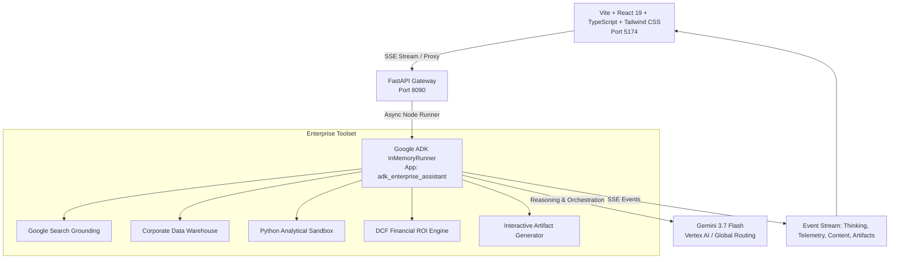

# Track 2: The Modern TypeScript + Google ADK Enterprise Agentic Platform (`adk-enterprise-assistant`)

A production-ready autonomous enterprise intelligence platform pairing **Google Agent Development Kit (ADK 2.7+)** and **Gemini 3.7 Flash** with real-time reasoning token streaming, live tool telemetry cards, and interactive SVG/canvas artifact rendering.

---

## 🏛️ Architecture Overview



---

## 🚀 Key Capabilities & Highlights

1. **Gemini 3.7 Reasoning Stream & Animated Thinking Drawer**:
   - Captures and displays real-time agent thought tokens and step-by-step logic in an animated drawer with pulsing telemetry indicators.

2. **Live Tool Execution Telemetry Cards**:
   - **🔍 Enterprise Search**: Real-time grounding citations, confidence scoring, and market insights.
   - **🗄️ Database Query**: Data warehouse metrics (ARR, Cloud Spend, EBITDA, Net Dollar Retention, Variance vs Target).
   - **💻 Python Sandbox**: SOC2-isolated code execution for numerical analytics and Monte Carlo simulations.
   - **📊 Financial Modeling**: Discounted Cash Flow (DCF), Net Present Value (NPV), Payback Period, and ROI scheduling.
   - **📈 Dynamic Visualization**: Structured interactive chart definitions with live data rendering.

3. **Artifact Preview Panel**:
   - High-performance native interactive SVG visualizations (multi-series Line, Bar, Area, Donut charts with cursor inspection).
   - Executive Brief strategy documents with 1-click Markdown copy and JSON export.
   - Syntax-highlighted code snippets with clipboard copy.

4. **Zero-Leak Security Protocol**:
   - Strict `.gitignore` policy preventing credential and token leaks.

---

## 🛠️ Tech Stack & Ports

- **Backend**: Python 3.12+, FastAPI, `google-adk>=2.0.0`, `google-genai>=2.0.0`, `pydantic>=2.0` (Runs on port `8090`).
- **Frontend**: Vite, React 19, TypeScript, Tailwind CSS v4, Lucide Icons (Runs on port `5174` with proxy to `8090`).

---

## ⚡ Quick Start

### 1. Launch All Services
```bash
cd semiautonomous-agents/adk-enterprise-assistant
./start_all.sh
```

### 2. Manual Startup
**Backend**:
```bash
cd semiautonomous-agents/adk-enterprise-assistant/backend
uv run uvicorn main:app --host 0.0.0.0 --port 8090 --reload
```

**Frontend**:
```bash
cd semiautonomous-agents/adk-enterprise-assistant/frontend
npm run dev -- --port 5174 --host
```

---

## 📡 API Endpoints

- `GET /health`: Health status, active model (`gemini-3.7-flash`), runner, project, and registered capabilities.
- `GET /api/tools`: Enumerates registered enterprise tool schemas and category metadata.
- `POST /api/session`: Initializes or resets an ADK conversation session.
- `POST /api/chat`: Server-Sent Events (SSE) streaming endpoint delivering thinking tokens, tool start/end telemetry, content deltas, and artifact objects.
