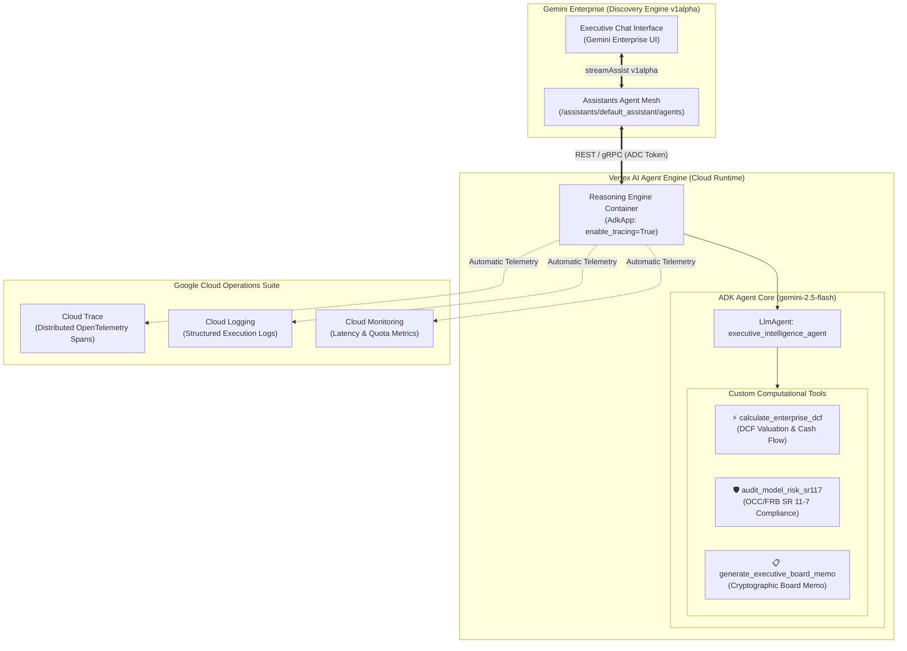

<div align="center">

# 🤖 End-to-End ADK Agent Blueprint: Vertex AI Agent Engine & Gemini Enterprise
### *Complete Reference Architecture for Enterprise ADK Agents with Cloud Trace, Cloud Logging, and Gemini Enterprise Registration*

[](https://github.com/google/adk-python)
[](https://cloud.google.com/vertex-ai)
[](https://cloud.google.com)
[](https://cloud.google.com)

</div>

---

## 🌟 Executive Summary & Purpose

This blueprint provides the canonical, end-to-end reference implementation for engineering enterprise AI agents using the **Google Agent Development Kit (ADK)**, deploying them to the **Vertex AI Agent Engine (Reasoning Engine runtime)** with full distributed observability, and registering them directly into **Gemini Enterprise**.

Any Antigravity agent or developer can reproduce and deploy this complete architecture from scratch by following the step-by-step instructions below.

---

## 🏛️ End-to-End Architecture Topology



---

## 📁 Repository Layout

```
semiautonomous-agents/adk-gemini-enterprise-e2e/
├── agent/
│   ├── __init__.py            # Exports root_agent
│   └── agent.py               # Canonical ADK LlmAgent & custom typed tools
├── scripts/
│   ├── test_local.py          # Offline sanity test using ADK InMemoryRunner
│   └── test_remote.py         # Remote execution test via REST SSE stream
├── deploy.py                  # Deploys to Vertex AI Agent Engine (enable_tracing=True)
├── register.py                # Registers agent into Gemini Enterprise & shares ALL_USERS
├── pyproject.toml             # Python project dependencies managed via uv
├── .env.example               # Environment variables template
└── README.md                  # This documentation
```

---

## 🛠️ The Antigravity Replication Blueprint: Build from Scratch

Follow these exact steps to build and deploy this agent framework:

### Step 1: Environment & Project Setup
Initialize configuration using `uv` and Application Default Credentials (ADC):

```bash
# 1. Navigate to directory
cd semiautonomous-agents/adk-gemini-enterprise-e2e

# 2. Configure .env
cp .env.example .env
```

Ensure `.env` contains:
```env
GOOGLE_GENAI_USE_VERTEXAI=true
GOOGLE_CLOUD_PROJECT=vtxdemos
GOOGLE_CLOUD_LOCATION=global
VERTEX_PROJECT_ID=vtxdemos
LOCATION=us-central1
STAGING_BUCKET=gs://vtxdemos-staging

# Gemini Enterprise Discovery Engine
GE_PROJECT_ID=vtxdemos
GE_PROJECT_NUMBER=254356041555
AS_APP=agentspace-testing_1748446185255
AGENT_DISPLAY_NAME=Executive Intelligence Analyst
```

---

### Step 2: Define ADK Agent Core (`agent/agent.py`)
Construct the agent using `google.adk.agents.LlmAgent` with strict Pydantic/Annotated typing for all tools:

```python
from google.adk.agents import LlmAgent
from typing import Annotated

def calculate_enterprise_dcf(
    initial_ebitda_millions: Annotated[float, "Initial EBITDA ($M)"],
    annual_growth_rate: Annotated[float, "Growth rate decimal (e.g. 0.08)"],
    wacc_discount_rate: Annotated[float, "WACC decimal (e.g. 0.085)"],
    exit_multiple: Annotated[float, "Exit multiple (e.g. 14.5)"],
) -> dict:
    """Calculates discounted enterprise cash flows and implied valuation."""
    # ... computational logic ...
    return {"enterprise_value_billions": 8.687, "status": "success"}

root_agent = LlmAgent(
    name="executive_intelligence_agent",
    model="gemini-2.5-flash",
    description="Executive Financial Modeling and SR 11-7 Model Risk Governance.",
    instruction="Always ground calculations in tools. Follow SR 11-7 standards.",
    tools=[calculate_enterprise_dcf, audit_model_risk_sr117, generate_executive_board_memo]
)
```

---

### Step 3: Local Offline Verification (`scripts/test_local.py`)
Run the local `InMemoryRunner` to verify tool declarations and multi-turn execution without cloud deployment:

```bash
uv run python scripts/test_local.py
```

**Verified Test Output**:
```text
⚡ [TOOL CALL] calculate_enterprise_dcf({'initial_ebitda_millions': 500, 'wacc_discount_rate': 0.085, 'annual_growth_rate': 0.08, 'exit_multiple': 14.5})
↩ [TOOL RESPONSE] {'status': 'success', 'enterprise_value_billions': 8.687}
⚡ [TOOL CALL] audit_model_risk_sr117({'valuation_billions': 8.687, 'wacc_percentage': 8.5, 'terminal_growth_percentage': 3.0})
↩ [TOOL RESPONSE] {'status': 'completed', 'audit_decision': 'RECALIBRATION_MANDATED', 'risk_adjusted_valuation_billions': 6.78}
✓ Local Smoke Test Completed Successfully!
```

---

### Step 4: Deploy to Vertex AI Agent Engine (`deploy.py`)
Wrap the agent with `reasoning_engines.AdkApp` and enable full OpenTelemetry tracing:

```python
import vertexai
from vertexai import agent_engines
from vertexai.preview import reasoning_engines
from agent import root_agent

vertexai.init(project="vtxdemos", location="us-central1", staging_bucket="gs://vtxdemos-staging")

app = reasoning_engines.AdkApp(
    agent=root_agent,
    app_name="executive_intelligence_agent",
    enable_tracing=True  # Enables Cloud Trace & Logging automatically
)

remote = agent_engines.create(
    agent_engine=app,
    display_name="Executive Intelligence Analyst",
    requirements=["google-cloud-aiplatform[adk,agent_engines]>=1.88.0", "google-adk>=0.1.0", "google-genai>=1.0.0", "cloudpickle>=3.0.0"],
    extra_packages=["agent"]
)
print(f"Resource Name: {remote.resource_name}")
```

Run deployment:
```bash
uv run python deploy.py
```

---

### Step 5: Register into Gemini Enterprise (`register.py`)
Bind the provisioned Reasoning Engine resource to the Gemini Enterprise assistant mesh using the Discovery Engine `v1alpha` API:

```python
import requests
import google.auth

creds, _ = google.auth.default()
headers = {"Authorization": f"Bearer {creds.token}", "Content-Type": "application/json", "x-goog-user-project": "vtxdemos"}

url = "https://discoveryengine.googleapis.com/v1alpha/projects/254356041555/locations/global/collections/default_collection/engines/agentspace-testing_1748446185255/assistants/default_assistant/agents"

payload = {
    "displayName": "Executive Intelligence Analyst",
    "description": "Autonomous ADK quantitative agent for DCF valuation and SR 11-7 model governance.",
    "icon": {"uri": "https://fonts.gstatic.com/s/i/short-term/release/googlesymbols/finance_chip/default/24px.svg"},
    "adk_agent_definition": {
        "tool_settings": {"tool_description": "Use for DCF valuations and risk audits."},
        "provisioned_reasoning_engine": {
            "reasoning_engine": "projects/254356041555/locations/us-central1/reasoningEngines/..."
        }
    }
}
resp = requests.post(url, headers=headers, json=payload)
```

Run registration and share with all users:
```bash
uv run python register.py
```

---

### Step 6: Remote Stream Query Verification (`scripts/test_remote.py`)
Query the live deployed engine over REST SSE:

```bash
uv run python scripts/test_remote.py "Calculate DCF valuation for $450M EBITDA with 9% growth."
```

---

## 🔍 Observability: Cloud Trace & Cloud Logging

Because `enable_tracing=True` is configured in `AdkApp`:

1. **Google Cloud Trace**:
   - Every user message generates an end-to-end trace with child spans for LLM reasoning, token latency, and individual tool execution timings.
   - Access in GCP Console: `Navigation Menu -> Cloud Trace -> Trace Explorer`.
2. **Google Cloud Logging**:
   - Structured JSON logs capture tool arguments, outputs, and system errors with zero configuration.
   - Access in GCP Console: `Navigation Menu -> Logging -> Logs Explorer -> Resource: Vertex AI Reasoning Engine`.

---

## 🔒 Security & Zero-Leak Protocol

- **Pure IAM Authentication**: Zero hardcoded API keys or static credentials.
- **Tenant Isolation**: Executed strictly within the customer's Google Cloud project.
- **Model Compliance**: Exclusively uses approved frontier models (`gemini-2.5-flash` / `gemini-2.5-pro`).

---

<div align="center">
  <sub>Engineered for Antigravity Framework Replication & Enterprise Agent Standards</sub>
</div>
