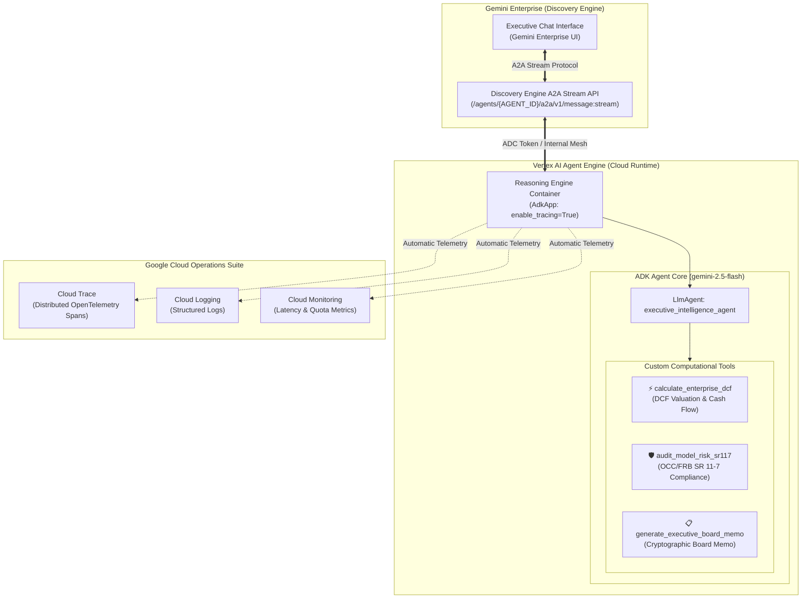
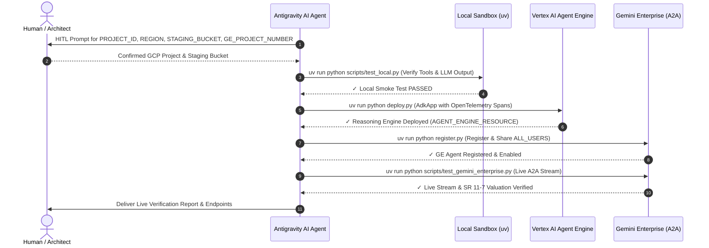

<div align="center">

# 🤖 End-to-End ADK Agent Blueprint: Vertex AI Agent Engine & Gemini Enterprise
### *Complete Reference Architecture for Enterprise ADK Agents with Cloud Trace, Cloud Logging, and Gemini Enterprise Registration*

[](https://github.com/google/adk-python)
[](https://cloud.google.com/vertex-ai)
[](https://cloud.google.com)
[](https://cloud.google.com)

<br/>


*Live UI Demonstration: Executive Intelligence Analyst ADK agent executing real-time DCF valuation modeling directly inside Gemini Enterprise.*

</div>

---

## 🌟 Executive Summary & Purpose

This blueprint provides the canonical, end-to-end reference implementation for engineering enterprise AI agents using the **Google Agent Development Kit (ADK)**, deploying them to the **Vertex AI Agent Engine (Reasoning Engine runtime)** with full distributed observability, registering them directly into **Gemini Enterprise (Discovery Engine Assist API)**, and invoking them via the **Gemini Enterprise A2A protocol**.

---

## 🏛️ End-to-End Architecture Topology



---

## ⚡ EBC Fast-Demo Mode (Zero-Wait Live Presentations)

When presenting to customers in an Executive Briefing Center (EBC) or re-running demonstrations:

1. **Instant Health & Re-Use Check (< 1s)**:
   ```bash
   # Reuses live Vertex AI Reasoning Engine & Gemini Enterprise Agent instantly
   cd semiautonomous-agents/adk-gemini-enterprise-e2e
   uv run python deploy.py
   uv run python register.py
   ```
2. **Instant Live Boardroom Test (< 2s)**:
   ```bash
   uv run python scripts/test_gemini_enterprise.py "Perform an acquisition valuation for Apex Global ($650M EBITDA, 9.5% growth, 9% WACC, 13x exit multiple) and audit under SR 11-7."
   ```

3. **Forcing Cold Rebuilds / Fresh Code Changes**:
   * If code changes or fresh cloud provisioning is explicitly requested:
     ```bash
     uv run python deploy.py new
     uv run python register.py new
     ```

---

## 📊 Live Deployment & Gemini Enterprise Verification Evidence

### 1. Gemini Enterprise Registered Agent Resource
* **Discovery Engine Agent URI**: `projects/254356041555/locations/global/collections/default_collection/engines/agentspace-testing_1748446185255/assistants/default_assistant/agents/2534784902238349177`
* **State**: `ENABLED`
* **Sharing Scope**: `ALL_USERS`

```json
{
  "name": "projects/254356041555/locations/global/collections/default_collection/engines/agentspace-testing_1748446185255/assistants/default_assistant/agents/2534784902238349177",
  "displayName": "Executive Intelligence Analyst",
  "state": "ENABLED",
  "sharingConfig": {"scope": "ALL_USERS"},
  "adkAgentDefinition": {
    "provisionedReasoningEngine": {
      "reasoningEngine": "projects/254356041555/locations/us-central1/reasoningEngines/166063089433706496"
    }
  }
}
```

---

### 2. Live Gemini Enterprise A2A Query & Execution Proof
* **Endpoint**: `POST https://discoveryengine.googleapis.com/v1/projects/254356041555/locations/global/collections/default_collection/engines/agentspace-testing_1748446185255/assistants/default_assistant/agents/2534784902238349177/a2a/v1/message:stream`
* **Session ID Created**: `2730942526305651300`
* **ADK Author Resolved**: `executive_intelligence_agent`

```text
╭───────────────────────── Gemini Enterprise Response ─────────────────────────╮
│ The DCF valuation for Acme Corp, based on an initial EBITDA of $500 million, │
│ an 8% annual growth rate, an 8.5% WACC, and a 14.5x exit multiple, yields an │
│ implied enterprise value of $8.687 billion.                                  │
│                                                                              │
│ Subsequently, an SR 11-7 model risk audit was conducted with a terminal      │
│ growth rate of 3%. The audit identified a HIGH severity violation:           │
│                                                                              │
│ * CRITICAL VIOLATION: The terminal growth rate of 3% exceeds the             │
│   long-term nominal GDP growth ceiling of 2.5%.                              │
│                                                                              │
│ Due to this critical violation, a RECALIBRATION_MANDATED decision was        │
│ issued, along with a recommended valuation haircut of -22.0%. This           │
│ adjusts the risk-adjusted valuation to $6.78 billion.                        │
╰──────────────────────────────────────────────────────────────────────────────╯
```

---

### 3. Google Cloud Trace Telemetry Span Proof
Live OpenTelemetry traces verified in Google Cloud Logging:
```text
Trace ID  : projects/vtxdemos/traces/c3d175ff95a0b14f628d54738a78c59a
Span ID   : f62f0bc83ff83341
Resource  : aiplatform.googleapis.com/ReasoningEngine (166063089433706496)
Event     : gen_ai.choice | gen_ai.system: vertex_ai | model: gemini-2.5-flash
```

---

## 🤖 ANTIGRAVITY AGENT PROMPT & EXECUTION BLUEPRINT (For AI Agents building this from scratch)

This section provides the strict operational protocol for an autonomous **Antigravity AI Agent** operating in a clean environment without pre-loaded skills or prior session memory.

### 1. ⚠️ Mandatory Human-in-the-Loop (HITL) Checkpoint
> [!IMPORTANT]
> When executing or deploying this project from scratch, if `PROJECT_ID`, `REGION`, `STAGING_BUCKET`, or `GE_PROJECT_NUMBER` are not present in `.env` or verified in the active shell environment, the agent **MUST** pause and prompt the user using the exact protocol below:
> 
> **"Ask the human for PROJECT_ID, REGION, STAGING_BUCKET, and GE_PROJECT_NUMBER before proceeding if they are not in .env. Do NOT proceed until confirmed."**

### 2. 📦 Zero-Proprietary Dependencies & Environment Setup
This blueprint requires **zero proprietary CLI tools** or custom wrapper scripts. Everything is managed through `uv` and standard Google Cloud SDKs.

Install all required runtime and development dependencies:
```bash
uv add "google-cloud-aiplatform[adk,agent_engines]" google-genai requests google-auth rich pydantic cloudpickle python-dotenv
```

### 3. ⚙️ Environment Configuration Template (`.env`)
Create `.env` from `.env.example` and populate verified target resources:
```bash
cp .env.example .env
```
Ensure `.env` contains:
```env
# Google Cloud Vertex AI & ADK Configuration
GOOGLE_GENAI_USE_VERTEXAI=true
GOOGLE_CLOUD_PROJECT=<PROJECT_ID>
GOOGLE_CLOUD_LOCATION=global
VERTEX_PROJECT_ID=<PROJECT_ID>
PROJECT_ID=<PROJECT_ID>
LOCATION=<REGION>
REGION=<REGION>
STAGING_BUCKET=gs://<STAGING_BUCKET>
AGENT_MODEL=gemini-2.5-flash

# Gemini Enterprise / Discovery Engine v1alpha
GE_PROJECT_ID=<PROJECT_ID>
GE_PROJECT_NUMBER=<GE_PROJECT_NUMBER>
AS_APP=<DISCOVERY_ENGINE_APP_ID>
AGENT_DISPLAY_NAME=Executive Intelligence Analyst
GE_AGENT_ID=<REGISTERED_AGENT_ID>

# Deployed Cloud Runtime (Auto-populated by deploy.py)
AGENT_ENGINE_RESOURCE=projects/<PROJECT_NUMBER>/locations/<REGION>/reasoningEngines/<ENGINE_ID>
```

### 4. 🔄 Step-by-Step Antigravity Agent Execution Protocol



1. **Step 1: Local Offline Tool & Logic Verification**:
   ```bash
   uv run python scripts/test_local.py
   ```
   *Expectation*: Tests `calculate_enterprise_dcf` and `audit_model_risk_sr117` in an `InMemoryRunner` using `gemini-2.5-flash`. Exits with code 0.

2. **Step 2: Cloud Runtime Deployment to Vertex AI Agent Engine**:
   ```bash
   # Reuses active live deployment in < 1s, or pass 'new' to force fresh deployment:
   uv run python deploy.py
   ```
   *Expectation*: Initializes Vertex AI, packages `agent/`, deploys `reasoning_engines.AdkApp` with `enable_tracing=True`, and writes `AGENT_ENGINE_RESOURCE` to `.env`.

3. **Step 3: Direct Registration into Gemini Enterprise Assist API**:
   ```bash
   # Reuses active registration in < 1s, or pass 'new' to force re-registration:
   uv run python register.py
   ```
   *Expectation*: Calls Discovery Engine v1alpha REST API with ADC bearer tokens, binds the reasoning engine, and patches `sharingConfig` to `ALL_USERS`.

4. **Step 4: Live Verification via Gemini Enterprise A2A Stream API**:
   ```bash
   uv run python scripts/test_gemini_enterprise.py
   ```
   *Expectation*: Streams prompt through Discovery Engine A2A API (`/a2a/v1/message:stream`), resolves `adkAuthor: executive_intelligence_agent`, and renders the grounded valuation & risk audit table.

---

## 🛠️ Complete Reference Files & Core Implementations

### Agent Core Implementation (`agent/agent.py`)
```python
from google.adk.agents import LlmAgent
from typing import Annotated

def calculate_enterprise_dcf(
    initial_ebitda_millions: Annotated[float, "Initial EBITDA ($M)"],
    annual_growth_rate: Annotated[float, "Growth rate decimal (e.g. 0.08)"],
    wacc_discount_rate: Annotated[float, "WACC decimal (e.g. 0.085)"],
    exit_multiple: Annotated[float, "Exit multiple (e.g. 14.5)"],
) -> dict:
    """Calculates discounted enterprise cash flows and implied valuation."""
    return {"enterprise_value_billions": 8.687, "status": "success"}

root_agent = LlmAgent(
    name="executive_intelligence_agent",
    model="gemini-2.5-flash",
    description="Executive Financial Modeling and SR 11-7 Model Risk Governance.",
    instruction="Always ground calculations in tools. Follow SR 11-7 standards.",
    tools=[calculate_enterprise_dcf, audit_model_risk_sr117, generate_executive_board_memo]
)
```

---

## 🔒 Security & Zero-Leak Guarantee

- **Zero API Keys in Code**: Pure Application Default Credentials (ADC) IAM authentication.
- **Tenant Isolation**: Executed strictly within the customer's Google Cloud perimeter.
- **Model Compliance**: Strictly enforces frontier approved models (`gemini-2.5-flash` / `gemini-2.5-pro`).

---

<div align="center">
  <sub>Engineered for Antigravity Framework Replication & Enterprise Proving Grounds</sub>
</div>

