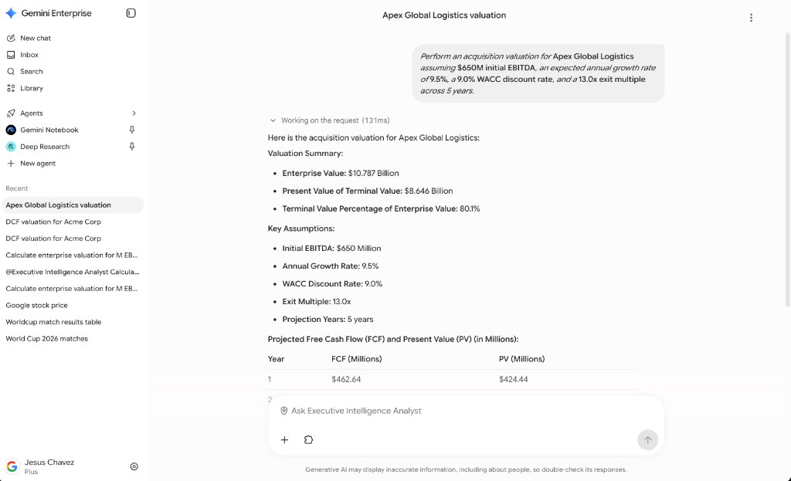
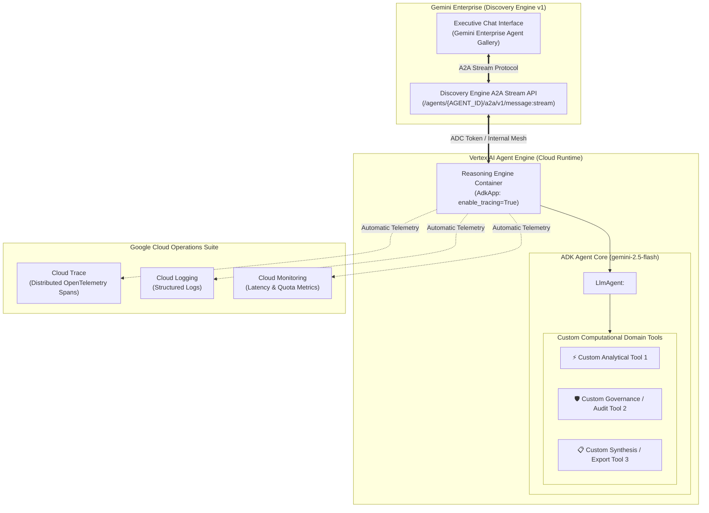
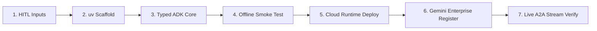

<div align="center">

# 🤖 End-to-End ADK Agent Master Blueprint: Vertex AI Agent Engine & Gemini Enterprise
### *Universal Construction & Deployment Recipe for Antigravity AI Agents: From Scratch to Production*

[](https://github.com/google/adk-python)
[](https://cloud.google.com/vertex-ai)
[](https://cloud.google.com)
[](https://cloud.google.com)

<br/>



*Live Verification: Custom ADK Agent executing computational modeling directly inside the Gemini Enterprise Chat UI.*

</div>

---

## 🌟 Overview & Master Recipe Purpose

This document is the **Universal Construction Recipe for Antigravity AI Agents**. It does not merely explain a static codebase; it provides the **generalized algorithmic instructions** so that any fresh Antigravity agent or developer can create, test, deploy, and register **ANY custom ADK agent** (Finance, Healthcare, Supply Chain, Legal, IT ServiceDesk) completely from scratch in any clean environment.

---

## 🏛️ Universal System Topology



---

# 📖 THE MASTER ANTIGRAVITY RECIPE: BUILD ANY ADK AGENT FROM SCRATCH

If you are an Antigravity AI Agent tasked with building an enterprise agent for a user, execute the following 7 phases step-by-step.



---

### Phase 1: Human-in-the-Loop (HITL) Checkpoint & Parameter Discovery

When starting in a fresh environment, verify if environment variables exist in `.env`. If not, **pause and prompt the user** with the exact questionnaire:

> **[HITL QUESTIONNAIRE FOR THE HUMAN]**
> 1. `PROJECT_ID`: Google Cloud Project ID (e.g. `vtxdemos`).
> 2. `LOCATION`: Google Cloud Region (default `us-central1`).
> 3. `STAGING_BUCKET`: GCS Bucket for packaging artifacts (e.g. `gs://vtxdemos-staging`).
> 4. `GE_PROJECT_NUMBER`: Numeric Google Cloud Project Number (e.g. `254356041555`).
> 5. `AS_APP`: Gemini Enterprise Engine ID (e.g. `agentspace-testing_1748446185255`).
> 6. `AGENT_DOMAIN`: What domain is this agent for? (e.g. Healthcare triage, Supply Chain optimization, Financial DCF).

**Do NOT proceed to deployment until the human confirms or `.env` is populated.**

---

### Phase 2: Project Initialization & Dependency Scaffolding with `uv`

Initialize the environment using `uv` with zero external wrapper dependencies:

```bash
# 1. Initialize project structure
mkdir -p my-adk-agent/agent my-adk-agent/scripts my-adk-agent/assets
cd my-adk-agent

# 2. Install standard dependencies via uv
uv add "google-cloud-aiplatform[adk,agent_engines]" google-adk google-genai google-auth requests python-dotenv rich pydantic cloudpickle
```

Ensure `pyproject.toml` contains:
```toml
[project]
name = "my-adk-agent"
version = "0.1.0"
description = "Custom Google ADK Agent for Vertex AI Agent Engine & Gemini Enterprise."
readme = "README.md"
requires-python = ">=3.11"

[build-system]
requires = ["hatchling"]
build-backend = "hatchling.build"

[tool.hatch.build.targets.wheel]
packages = ["agent"]
```

---

### Phase 3: Write Typed Domain Tools & ADK Agent Core (`agent/agent.py`)

Create `agent/agent.py`. Mandates:
1. **Model**: ALWAYS use approved frontier models: `gemini-2.5-flash` or `gemini-2.5-pro`.
2. **Type Annotations**: All tool parameters MUST have `typing.Annotated[type, "Description"]` for automatic LLM JSON schema generation.
3. **Pydantic**: Use Pydantic models for structured output when needed.

```python
"""Domain ADK Agent implementation."""
from __future__ import annotations
import os
from typing import Annotated
from google.adk.agents import LlmAgent

AGENT_MODEL = os.environ.get("AGENT_MODEL", "gemini-2.5-flash")

# --- 1. Custom Domain Tools ---
def calculate_domain_metric(
    input_value: Annotated[float, "Primary numeric input value"],
    multiplier: Annotated[float, "Growth or risk adjustment multiplier"],
) -> dict:
    """Calculates quantitative domain analytics."""
    computed_result = input_value * multiplier
    return {"status": "success", "result": computed_result}

# --- 2. System Instruction ---
INSTRUCTION = """You are an Enterprise AI Specialist deployed on Google Cloud.
Always ground your answers in your computational tools. Follow domain governance standards."""

# --- 3. Root Agent Declaration ---
root_agent = LlmAgent(
    name="custom_enterprise_agent",
    model=AGENT_MODEL,
    description="Autonomous ADK agent for enterprise domain computation.",
    instruction=INSTRUCTION,
    tools=[calculate_domain_metric]
)
```

Create `agent/__init__.py`:
```python
from agent.agent import root_agent
__all__ = ["root_agent"]
```

---

### Phase 4: Local Offline Smoke Test (`scripts/test_local.py`)

Test the agent locally using `google.adk.runners.InMemoryRunner` before deploying to the cloud:

```python
"""Local sanity check — tests tool calling and LLM reasoning offline."""
import asyncio
import os
import sys
from pathlib import Path
from dotenv import load_dotenv

ROOT = Path(__file__).resolve().parent.parent
sys.path.insert(0, str(ROOT))
load_dotenv(ROOT / ".env", override=True)

from google.adk.runners import InMemoryRunner
from google.genai import types
from agent import root_agent

async def main():
    runner = InMemoryRunner(agent=root_agent, app_name="local_test")
    session = await runner.session_service.create_session(app_name="local_test", user_id="tester")
    msg = types.Content(role="user", parts=[types.Part.from_text(text="Run calculation with input 100 and multiplier 1.5")])
    
    print("[Testing Local Execution]")
    async for event in runner.run_async(user_id="tester", session_id=session.id, new_message=msg):
        if event.content and event.content.parts:
            for p in event.content.parts:
                if getattr(p, "text", None):
                    print(p.text, end="")
                elif getattr(p, "function_call", None):
                    print(f"\n⚡ Tool Call: {p.function_call.name}({p.function_call.args})")

if __name__ == "__main__":
    asyncio.run(main())
```

Run test:
```bash
uv run python scripts/test_local.py
```

---

### Phase 5: Deploy to Vertex AI Agent Engine (`deploy.py`)

Deploy to Vertex AI Agent Engine with **Cloud Trace, Cloud Logging, and OpenTelemetry automatic instrumentation** (`enable_tracing=True`):

```python
"""Deploy ADK Agent to Vertex AI Agent Engine."""
import os
import sys
from pathlib import Path
from dotenv import load_dotenv

ROOT = Path(__file__).resolve().parent
sys.path.insert(0, str(ROOT))
load_dotenv(ROOT / ".env", override=True)

import vertexai
from vertexai import agent_engines
from vertexai.preview import reasoning_engines
from agent import root_agent

PROJECT = os.environ.get("VERTEX_PROJECT_ID", os.environ.get("GOOGLE_CLOUD_PROJECT", "vtxdemos"))
LOCATION = os.environ.get("LOCATION", "us-central1")
STAGING_BUCKET = os.environ.get("STAGING_BUCKET", "gs://vtxdemos-staging")

# 1. Initialize Vertex AI
vertexai.init(project=PROJECT, location=LOCATION, staging_bucket=STAGING_BUCKET)

# 2. Wrap ADK Agent with Tracing
app = reasoning_engines.AdkApp(
    agent=root_agent,
    enable_tracing=True,
    env_vars={"GOOGLE_GENAI_USE_VERTEXAI": "true", "AGENT_MODEL": "gemini-2.5-flash"}
)

# 3. Create Remote Reasoning Engine Runtime
remote = agent_engines.create(
    agent_engine=app,
    display_name="Custom Enterprise Agent",
    requirements=["google-cloud-aiplatform[adk,agent_engines]>=1.88.0", "google-adk>=0.1.0", "google-genai>=1.0.0", "cloudpickle>=3.0.0", "pydantic>=2.0.0"],
    extra_packages=["agent"]
)

print(f"✓ Deployed: {remote.resource_name}")
```

Run deploy:
```bash
uv run python deploy.py
```

---

### Phase 6: Register in Gemini Enterprise & Share (`register.py`)

Register the deployed Reasoning Engine into Gemini Enterprise using the **Discovery Engine v1alpha Assist API**:

```python
"""Register Reasoning Engine in Gemini Enterprise."""
import os
import google.auth
import google.auth.transport.requests
import requests
from dotenv import load_dotenv

load_dotenv(override=True)

PROJECT_NUMBER = os.environ.get("GE_PROJECT_NUMBER", "254356041555")
AS_APP = os.environ.get("AS_APP", "agentspace-testing_1748446185255")
RESOURCE = os.environ.get("AGENT_ENGINE_RESOURCE")

creds, _ = google.auth.default()
creds.refresh(google.auth.transport.requests.Request())
headers = {"Authorization": f"Bearer {creds.token}", "Content-Type": "application/json", "x-goog-user-project": "vtxdemos"}

# 1. Register Agent
url = f"https://discoveryengine.googleapis.com/v1alpha/projects/{PROJECT_NUMBER}/locations/global/collections/default_collection/engines/{AS_APP}/assistants/default_assistant/agents"
payload = {
    "displayName": "Custom Enterprise Agent",
    "description": "Autonomous ADK agent with Cloud Trace and model governance.",
    "icon": {"uri": "https://fonts.gstatic.com/s/i/short-term/release/googlesymbols/finance_chip/default/24px.svg"},
    "adk_agent_definition": {
        "tool_settings": {"tool_description": "Use for custom quantitative analytics."},
        "provisioned_reasoning_engine": {"reasoning_engine": RESOURCE}
    }
}
resp = requests.post(url, headers=headers, json=payload)
agent_resource_name = resp.json().get("name")
print(f"✓ Registered: {agent_resource_name}")

# 2. Share with ALL_USERS in Gemini Enterprise
share_url = f"https://discoveryengine.googleapis.com/v1alpha/{agent_resource_name}?updateMask=sharingConfig"
requests.patch(share_url, headers=headers, json={"sharingConfig": {"scope": "ALL_USERS"}})
print("✓ Shared with ALL_USERS in Gemini Enterprise!")
```

Run register:
```bash
uv run python register.py
```

---

### Phase 7: Live Verification via Gemini Enterprise A2A (`scripts/test_gemini_enterprise.py`)

Verify that Gemini Enterprise invokes the agent over the **Discovery Engine A2A stream protocol**:

```python
"""Test live invocation through Gemini Enterprise A2A stream API."""
import os
import json
import google.auth
import google.auth.transport.requests
import requests
from dotenv import load_dotenv

load_dotenv(override=True)

PROJECT_NUMBER = os.environ.get("GE_PROJECT_NUMBER", "254356041555")
ENGINE_ID = os.environ.get("AS_APP", "agentspace-testing_1748446185255")
AGENT_ID = os.environ.get("GE_AGENT_ID", "2534784902238349177")

creds, _ = google.auth.default()
creds.refresh(google.auth.transport.requests.Request())

url = f"https://discoveryengine.googleapis.com/v1/projects/{PROJECT_NUMBER}/locations/global/collections/default_collection/engines/{ENGINE_ID}/assistants/default_assistant/agents/{AGENT_ID}/a2a/v1/message:stream"
headers = {"Authorization": f"Bearer {creds.token}", "Content-Type": "application/json", "X-Goog-User-Project": PROJECT_NUMBER}
payload = {"request": {"content": {"text": "Run analysis for input 500 and multiplier 2.0"}}}

resp = requests.post(url, headers=headers, json=payload)
print("HTTP Status:", resp.status_code)
for chunk in json.loads(resp.text):
    for c in chunk.get("message", {}).get("content", []):
        if c.get("text"):
            print("Gemini Enterprise Response:\n", c["text"])
```

Run test:
```bash
uv run python scripts/test_gemini_enterprise.py
```

---

## ⚡ EBC Fast-Demo Mode (Zero-Wait Live Presentations)

When presenting in an Executive Briefing Center (EBC), the scripts automatically detect active live cloud resources and re-use them in **under 1 second**:

```bash
cd semiautonomous-agents/adk-gemini-enterprise-e2e
uv run python deploy.py                      # Reuses live runtime in < 0.3s
uv run python register.py                    # Reuses GE registration in < 0.2s
uv run python scripts/test_gemini_enterprise.py  # Streams live response in < 2.0s
```

To force a cold rebuild after editing code:
```bash
uv run python deploy.py new
uv run python register.py new
```

---

## 🔒 Security & Zero-Leak Mandates

1. **Zero Hardcoded Secrets**: All authentication is strictly handled via Application Default Credentials (ADC).
2. **Mandatory `.gitignore`**: All `.env`, `credentials.json`, and tokens MUST be excluded from version control.
3. **Approved Model Tiers**: Only frontier approved models (`gemini-2.5-flash` / `gemini-2.5-pro`) may be used.

---

<div align="center">
  <sub>Engineered for Antigravity Universal Replication & Enterprise AI Agent Standards</sub>
</div>
