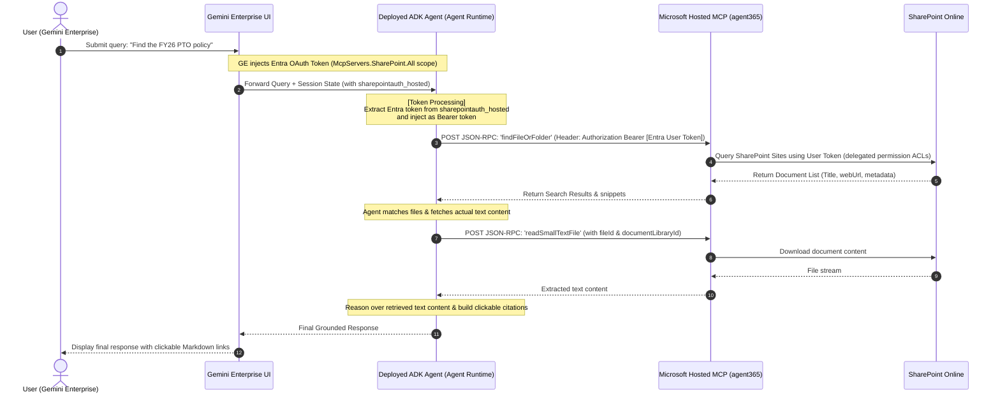

# SharePoint Hosted Explorer Agent (Google ADK & Microsoft-hosted Work IQ MCP)

The **SharePoint Hosted Explorer Agent** is a secure, enterprise-grade virtual assistant grounded in Gemini Enterprise (GE). Built with the **Google Agent Development Kit (ADK)** and running on **Vertex AI Agent Runtime**, this agent leverages Microsoft's hosted **Work IQ SharePoint MCP server** (`agent365.svc.cloud.microsoft`) to dynamically search, retrieve, and inspect corporate documents directly inside your Microsoft 365 tenant, returning clickable citations to users with zero pretrained hallucinations.

By using Microsoft's hosted server, you eliminate the need to deploy and manage a custom MCP server on Cloud Run, while inheriting SharePoint's native ACL model directly.

---

## 1. Architectural Overview

The agent extracts the delegated Entra ID token from the Gemini Enterprise session state and forwards it directly to the Microsoft-hosted Work IQ endpoint.



### Authentication Model
* **Delegated Auth**: End-user delegates their identity to Gemini Enterprise via Microsoft Entra OAuth. The token (requested with the scope `https://agent365.svc.cloud.microsoft/McpServers.SharePoint.All`) is dynamically injected into the agent's `CallbackContext` session state key `sharepointauth_hosted`.
* **Direct Access**: The ADK agent extracts this token and places it in the standard `Authorization: Bearer <token>` header, sending it directly to the hosted server at `https://agent365.svc.cloud.microsoft/agents/servers/mcp_SharePointRemoteServer`.

---

## 2. Directory Structure

```
adk-hosted-mcp-iq/
├── README.md                 # Project root documentation
└── adk-agent/                # Google ADK Python Project
    ├── agent.py              # Main Agent logic (hosted MCP tool surface mapping)
    ├── deploy.py             # Reasoning Engine deployer script
    ├── register.py           # Discovery Engine agent registration script (with Work IQ scopes)
    ├── requirements.txt      # Python dependencies
    ├── pyproject.toml        # Build and packaging configuration
    └── .env.example          # Environment variables template
```

---

## 3. Developer Guide & Setup

### 3.1 Setup Local Environment

We recommend using Python 3.12+. Initialize virtual environment and install dependencies:

```bash
cd adk-agent

# Create virtual environment
python3 -m venv .venv
source .venv/bin/activate

# Install dependencies using uv (recommended per rules)
uv pip install -r requirements.txt
```

### 3.2 Configure Environment Variables
Copy `.env.example` to `.env`:
```bash
cp .env.example .env
```
Fill in the `CLIENT_SECRET` (the client secret of the Entra App registered for your tenant).

### 3.3 Deploy to Vertex AI Agent Runtime
Run the deployment script to wrap your ADK Agent inside a Reasoning Engine:
```bash
python3 deploy.py
```
This script will print the `Resource ID` of the deployed Reasoning Engine. Copy that ID.

### 3.4 Register in Gemini Enterprise
Export the resource ID and run the registration script:
```bash
export REASONING_ENGINE_ID="your_reasoning_engine_id_here"
python3 register.py
```
This registers the authorization configuration (with correct scopes) and the agent in Gemini Enterprise.

---

## 4. Work IQ Hosted Tool Surface

The ADK Agent maps directly to Microsoft's hosted tools:

* `findSite(searchQuery)`: Discovery of accessible sites.
* `listDocumentLibrariesInSite(siteId)`: List document libraries inside a site.
* `getFolderChildren(documentLibraryId, parentFolderId)`: Enumerate files and folders (returns top 20).
* `findFileOrFolder(searchQuery)`: Cross-site text search of files.
* `readSmallTextFile(fileId, documentLibraryId)`: Read text content of a file (<= 5 MB limit).
* `readSmallBinaryFile(fileId, documentLibraryId)`: Read binary/base64 content of a file (<= 5 MB limit).

*Note: Large files (> 5 MB) are not supported by the Microsoft Hosted MCP server.*
