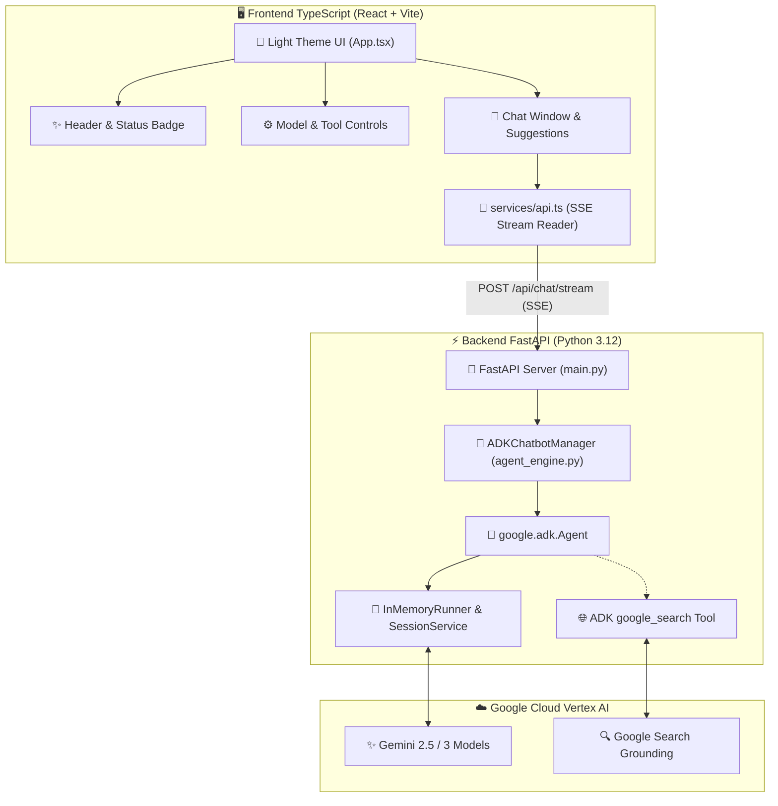

# ✨ Google ADK Light Chatbot (TypeScript + React)

Una aplicación conversacional full-stack con **interfaz gráfica moderna en TypeScript (React + Vite + Tailwind)** y tema claro (**Light Theme**), orquestada por **Google ADK (Agent Development Kit 2.1.0)** y la familia de modelos **Gemini** en **Vertex AI** (`gemini-2.5-flash`, `gemini-2.5-pro`, `gemini-3-flash-preview`).

---

## 🌟 Características Principales

- ⚡ **Frontend en TypeScript (React 18 + Vite)**:
  - Totalmente tipado con interfaces TypeScript estrictas (`Message`, `GroundingData`, `ModelInfo`, `StreamEvent`).
  - Renderizado en **Light Theme** inspirado en Google Material Design (fondos blancos `#ffffff`, acentos `#1a73e8`, tipografía clara, scrollbars estilizadas).
  - Streaming en tiempo real con protocolo **Server-Sent Events (SSE)** y decodificador `ReadableStream`.
  - Renderizado Markdown con resaltado sintáctico de bloques de código y botón de copiado.
  - Tarjetas interactivas de sugerencias de preguntas para inicio rápido.
  - Indicadores visuales de ejecución de herramientas (`🛠️ Ejecutando herramienta ADK...`).
  - Tarjetas desplegables de citas web con enlaces directos para resultados con Grounding.

- 🧠 **Backend en Python con Google ADK 2.1.0 & FastAPI**:
  - Orquestación nativa mediante `google.adk.Agent`, `InMemoryRunner` e `InMemorySessionService`.
  - Integración fluida con la herramienta oficial `google_search` de Google ADK.
  - Streaming asíncrono eficiente con `sse-starlette` y FastAPI.
  - Servidor unificado: sirve tanto la API REST/SSE como la SPA compilada de TypeScript en el mismo puerto.

- 🤖 **Modelos Gemini Soportados (Vertex AI)**:
  - **Gemini 2.5 Flash** (`gemini-2.5-flash`): Modelo insignia por defecto para streaming ultra veloz y baja latencia.
  - **Gemini 2.5 Pro** (`gemini-2.5-pro`): Razonamiento complejo, código y análisis profundo.
  - **Gemini 3 Flash Preview** (`gemini-3-flash-preview`): Vista previa de nueva generación.
  - **Gemini 3 Pro Preview** (`gemini-3-pro-preview`): Vista previa avanzada.

---

## 🏗️ Arquitectura del Sistema



---

## 📂 Estructura del Proyecto

```
adk-light-chatbot/
├── backend/
│   ├── main.py              # Servidor FastAPI con endpoints SSE y archivos estáticos
│   ├── agent_engine.py      # Motor Google ADK (Agent, Runner, Sessions, Gemini 2.5 Flash)
│   ├── requirements.txt     # Dependencias Python (FastAPI, uvicorn, google-adk, etc.)
│   └── .env.example         # Plantilla de variables de entorno
├── frontend/
│   ├── package.json         # Dependencias React + TypeScript + Vite + Tailwind
│   ├── tsconfig.json        # Configuración estricta de TypeScript
│   ├── vite.config.ts       # Configuración Vite con proxy a backend
│   ├── index.html           # Plantilla HTML con tipografía Google Sans / Roboto
│   ├── src/
│   │   ├── main.tsx         # Punto de entrada de React
│   │   ├── App.tsx          # Orquestador de UI y estado de chat
│   │   ├── index.css        # Estilos Tailwind y tema claro
│   │   ├── types/
│   │   │   └── chat.ts      # Tipos e interfaces TypeScript
│   │   ├── services/
│   │   │   └── api.ts       # Cliente SSE en TypeScript
│   │   └── components/
│   │       ├── Header.tsx           # Barra superior con estado del agente
│   │       ├── Sidebar.tsx          # Panel de configuración y modelos
│   │       ├── MessageItem.tsx      # Burbujas de mensajes y markdown
│   │       ├── GroundingCard.tsx    # Tarjetas de citas web
│   │       ├── ChatSuggestions.tsx  # Sugerencias iniciales
│   │       └── ChatInput.tsx        # Área de entrada con atajos
├── run.sh                   # Script de inicio rápido (Prod / Dev)
├── README.md                # Documentación del proyecto
└── .gitignore               # Exclusión estricta de secretos (Zero-Leak Protocol)
```

---

## 🚀 Instalación y Puesta en Marcha

### 1. Prerrequisitos
- **Node.js**: v18+ (v22 recomendado)
- **Python**: 3.10+ (Python 3.12 recomendado)
- Credenciales de Vertex AI configuradas (`gcloud auth application-default login`).

### 2. Ejecutar en Modo Producción (Servidor Unificado)

Para iniciar la aplicación en el puerto **8005**:

```bash
cd /Users/jesusarguelles/IdeaProjects/vertex-ai-samples/semiautonomous-agents/adk-light-chatbot
./run.sh
```

Abre en tu navegador:
👉 **[http://localhost:8005](http://localhost:8005)**

### 3. Ejecutar en Modo Desarrollo (Hot-Reload)

Si deseas modificar código en caliente (HMR):

```bash
./run.sh dev
```
- **Backend API**: `http://localhost:8005`
- **Frontend Vite (Hot-Reload)**: `http://localhost:5180`

---

## 🔒 Protocolo de Seguridad (Zero-Leak)
- Ningún archivo `.env`, clave de API o secreto se incluye en el control de versiones.
- El archivo `.gitignore` incluye la protección estricta requerida para salvaguardar credenciales.
