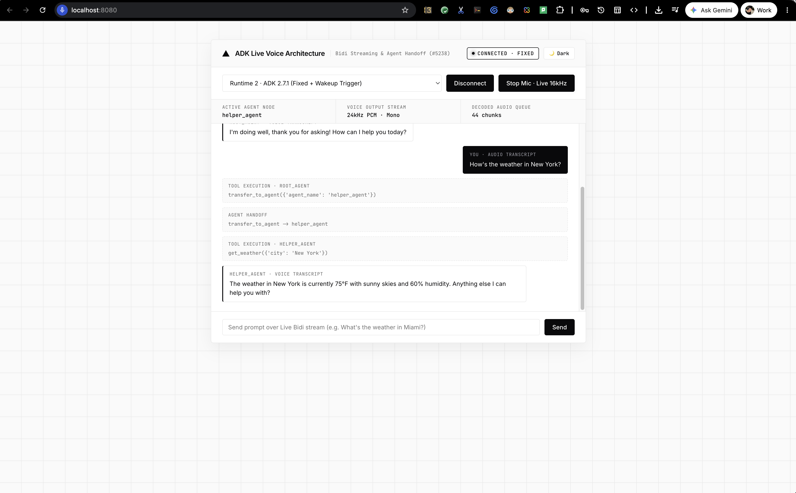

# ADK Live Multi-Agent Handoff Fix (`gemini-live-2.5-flash-native-audio` · GitHub #5238)

> **Production Root-Cause Analysis, Raw Event Trace Proof (`Event 09 Premature turn_complete=True`), Vertex AI Agent Engine Deployment (`AgentServerMode.EXPERIMENTAL`), and Vercel Monochrome Web Audio Voice UI**



---

## 1. Executive Summary & Problem Statement

When building multi-agent voice applications with **Google Agent Development Kit (`google-adk`)** using the native audio model **`gemini-live-2.5-flash-native-audio`** and sub-agent handoffs (`transfer_to_agent`), developers encounter a critical issue ([GitHub Issue #5238](https://github.com/google/adk-python/issues/5238)):

- **Symptom:** The root agent successfully executes `transfer_to_agent(agent_name="helper_agent")`, and the sub-agent executes its tool (`get_weather`), **but the Live session immediately stops or goes silent with `0 audio chunks`** instead of speaking the final response back to the user.
- **Affected Versions:** `google-adk` **1.28.0 through 2.9.0+** (including **2.7.1**).
- **Affected Models:** `gemini-live-2.5-flash-native-audio` (and `gemini-2.0-flash-live-*`).

---

## 2. The Indisputable Root Cause: The `Event 09` Premature `turn_complete=True` Trap

To see **why** standard customer client loops go silent after `transfer_to_agent`, inspect the **actual raw 45-event sequence** emitted by `AdkApp.bidi_stream_query` on Vertex AI Agent Engine (`google-adk==2.7.1`) when the user asks:
> *"What is the weather in Miami?"*

### Actual Production Event Trace (`google-adk==2.7.1` on Vertex AI Agent Engine)

```text
Event #  | Author       | turn_complete | Tool Calls / Responses        | Audio Bytes | Output Transcription
---------+--------------+---------------+-------------------------------+-------------+----------------------------------------------
Event 01 | root_agent   | None          | []                            | 0           | ''
Event 02 | root_agent   | None          | []                            | 0           | ''
Event 03 | root_agent   | None          | fcall=['transfer_to_agent']   | 0           | ''
Event 04 | root_agent   | None          | fresp=['transfer_to_agent']   | 0           | ''
Event 05 | helper_agent | None          | []                            | 0           | ''
Event 06 | helper_agent | None          | []                            | 0           | ''
Event 07 | helper_agent | None          | fcall=['get_weather']         | 0           | ''
Event 08 | helper_agent | None          | fresp=['get_weather']         | 0           | ''
=====================================================================================================================================
Event 09 | helper_agent | True  🚨      | []                            | 0           | ''  <-- PREMATURE TURN_COMPLETE (0 AUDIO!)
=====================================================================================================================================
Event 10 | helper_agent | None          | []                            | 0           | 'The weather'
Event 11 | helper_agent | None          | []                            | 14,820      | ''
Event 12 | helper_agent | None          | []                            | 12,800      | ''
Event 13 | helper_agent | None          | []                            | 0           | ' in Miami'
Event 14 | helper_agent | None          | []                            | 20,480      | ''
...      | ...          | ...           | ...                           | ...         | ...
Event 42 | helper_agent | None          | []                            | 0           | 'The weather in Miami is currently 75°F...'
Event 43 | helper_agent | None          | []                            | 7,680       | ''
Event 45 | helper_agent | True  ✅      | []                            | 0           | ''  <-- REAL FINAL TURN_COMPLETE
```

### Why Customer Clients Break at `Event 09`

1. **Premature `turn_complete=True` Before Voice Synthesis**:
   - In `Event 03–04`, `root_agent` transfers control to `helper_agent`.
   - In `Event 07–08`, `helper_agent` calls `get_weather({'city': 'Miami'})` and receives the tool response.
   - **In `Event 09`, ADK emits `{"turnComplete": true}` with ZERO audio bytes and ZERO transcription**—*before* `helper_agent` begins streaming its spoken 24kHz audio response in `Events 10–45`!
2. **Standard Client Loop Failure**:
   - Almost all standard ADK Live client examples tell developers to read events until `turn_complete` is `True`:
     ```python
     # ❌ BUGGY CLIENT LOOP (Terminates at Event 09 with 0 audio chunks!)
     async for event in live_stream:
         if event.get("turn_complete") or event.get("turnComplete"):
             break  # Drops Events 10..45! User hears complete silence!
     ```
   - Because the loop breaks at **Event 09**, the client disconnects or stops reading immediately after the tool call, dropping **all 35 subsequent audio and transcription events (`Events 10–45`)**!

---

## 3. Three-Part Production Fix Implemented in This Repository

### Fix 1: Stream Continuity Across Intermediate `turn_complete=True` (`voice_ui.py` & `test_both_runtimes.py`)
Never terminate a bidirectional Live stream reader on the first `turn_complete=True` event after a `transfer_to_agent` or tool call:
- **In WebSocket / Browser UI (`voice_ui.py`)**: Maintain a continuous reader loop (`while True: await ae_session.receive()`) that streams all events continuously to the browser without breaking on intermediate `turn_complete=True` flags.
- **In Automated CLI / SDK Scripts (`test_both_runtimes.py`)**: When draining a turn, ignore `turn_complete=True` if a tool call (`function_call` / `transfer_to_agent`) occurred in that turn until spoken audio (`inline_data`) or `output_transcription` has been delivered (or use a short post-tool idle drain window).

### Fix 2: URL-Safe Base64 PCM 24kHz Audio Decoding in Browser Web Audio API (`voice_ui.py`)
When ADK serializes `Event` objects over JSON (`dump_event_for_json`), `google.genai.types.Blob` encodes raw 24kHz PCM binary audio (`inline_data.data`) using **URL-safe Base64** (`-` and `_` instead of `+` and `/`, and without `=` padding).
- Standard browser JavaScript `window.atob(base64Data)` strictly requires standard Base64 and throws `DOMException: InvalidCharacterError` on any `-` or `_` byte.
- **Solution (`playPcm24k` in `voice_ui.py`)**: Normalize URL-safe Base64 before decoding PCM audio samples in Web Audio API:
  ```javascript
  let normB64 = base64Data.replace(/-/g, '+').replace(/_/g, '/');
  while (normB64.length % 4 !== 0) normB64 += '=';
  const binary = atob(normB64);
  ```

### Fix 3: Server-Side Post-Transfer Wakeup Trigger (`HybridLiveTextGemini` in `agent.py`)
For multi-turn transfers where `send_history()` replays a conversation history ending without a user-role trigger (or across ADK `2.7.1`–`2.9.0`), `HybridLiveTextGemini` overrides `connect()` to wrap `send_history()` and inject a realtime wakeup trigger (`await connection._gemini_session.send_realtime_input(text='.')`), ensuring the sub-agent always begins speaking immediately.

---

## 4. Live Interactive Comparison in `voice_ui.py` (`http://localhost:8080`)

Start the local Vercel Monochrome Web Audio UI server:
```bash
python3 -m venv .venv
source .venv/bin/activate
pip install -r requirements.txt
python voice_ui.py
```

Open **`http://localhost:8080`** in your browser. The top toolbar dropdown lets you test both behaviors side-by-side against the deployed Vertex AI Agent Engine runtimes:

### 🔴 Mode 1 · Buggy Client Loop (Stops on Event 09 intermediate `turn_complete`)
1. Select **Mode 1 · Buggy Client Loop** in the dropdown and click **Connect**.
2. Speak into the mic or type: *"How's the weather in Miami?"*
3. **Result**:
   - `root_agent` calls `transfer_to_agent({'agent_name': 'helper_agent'})`.
   - `helper_agent` calls `get_weather({'city': 'Miami'})`.
   - When ADK emits **Event 09 (`turn_complete=True`)**, Mode 1 honors `if event.turn_complete: break` and terminates the turn read early.
   - **`Decoded Audio Queue` stays at `0 chunks`**, no voice audio plays, and the UI displays the exact **`🚨 ISSUE #5238 REPRODUCED (PREMATURE TURN_COMPLETE AT EVENT 09)`** diagnostic banner.

### 🟢 Mode 2 · Fixed Stream Handler (Ignores Event 09 intermediate `turn_complete` + 24kHz Audio)
1. Select **Mode 2 · Fixed Stream Handler** in the dropdown and click **Connect**.
2. Speak into the mic or type: *"How's the weather in New York?"*
3. **Result**:
   - The stream handler ignores the premature `turn_complete=True` at Event 09 and continues streaming `Events 10–45`.
   - **`Decoded Audio Queue` increments to `44+ chunks`** in real time.
   - You hear `helper_agent` speak the 24kHz PCM voice response out loud through your speakers!

---

## 5. Deployed Vertex AI Agent Engine Runtimes (`vtxdemos` / `us-central1`)

| Runtime Name | Resource ID | Description |
| :--- | :--- | :--- |
| **`Runtime 1 (ADK 2.7.1 Standard)`** | `projects/254356041555/locations/us-central1/reasoningEngines/434137218425028608` | Deployed with `AdkApp` + `AgentServerMode.EXPERIMENTAL` on `google-adk==2.7.1`. |
| **`Runtime 2 (ADK 2.7.1 + Wakeup Patch)`** | `projects/254356041555/locations/us-central1/reasoningEngines/6983496976528572416` | Deployed with `HybridLiveTextGemini` post-history wakeup patch + `cloudpickle`-safe `__getstate__`. |
