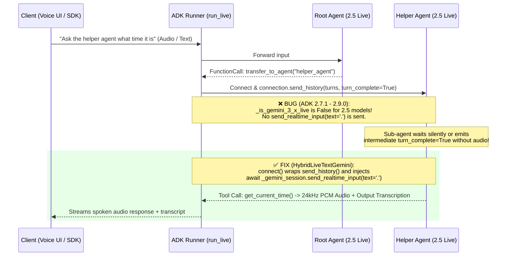

# ADK Live Multi-Agent Handoff Fix (`gemini-live-2.5-flash-native-audio` · GitHub #5238)

> **Production Root-Cause Analysis, Version-Proof Workaround (`google-adk 2.7.1`–`2.9.0`), Vertex AI Agent Engine Deployment (`AgentServerMode.EXPERIMENTAL`), and Web Audio Voice UI**

---

## 1. Executive Summary & Problem Statement

When building multi-agent voice applications with **Google Agent Development Kit (`google-adk`)** using the recommended native audio model **`gemini-live-2.5-flash-native-audio`** and sub-agent handoffs (`transfer_to_agent`), developers encounter a critical issue ([GitHub Issue #5238](https://github.com/google/adk-python/issues/5238)):

- **Symptom:** The root agent successfully executes `transfer_to_agent(agent_name="helper_agent")`, or the sub-agent executes a tool (`get_current_time`), **but the Live session goes silent or hangs** instead of speaking the final response back to the user.
- **Affected Versions:** `google-adk` **1.28.0 through 2.9.0+** (including **2.7.1**).
- **Affected Models:** `gemini-live-2.5-flash-native-audio` (and `gemini-2.0-flash-live-*`).

This repository provides:
1. **Complete Root-Cause Analysis** covering both the **server-side ADK bug** and **two subtle client-side traps** in `bidi_stream_query`.
2. **`HybridLiveTextGemini` (`agent.py`)**: A drop-in `Gemini` LLM wrapper that:
   - Fixes the `transfer_to_agent` handoff silence on **all ADK versions (`2.7.1`–`2.9.0+`)** by injecting a post-history wakeup trigger (`send_realtime_input(text='.')`) inside `connect()`.
   - Supports **Hybrid Text + Voice Mode** on Vertex AI Agent Engine (`stream_query` routes to `gemini-2.5-flash` text generation; `bidi_stream_query` routes to `gemini-live-2.5-flash-native-audio` WebSockets).
   - Implements `__getstate__` for safe `cloudpickle` serialization on Vertex AI Agent Engine.
3. **Live Side-by-Side Comparison (`deploy_both.py`, `test_both_runtimes.py`, `voice_ui.py`)**:
   - **Buggy Runtime (`adk-live-buggy-2-7-1`)** vs. **Fixed Runtime (`adk-live-fixed-2-7-1`)** deployed to **Vertex AI Agent Engine (`us-central1`)**.
   - Single-file **Web Audio Voice UI (`voice_ui.py`)** streaming `16kHz` PCM microphone audio into Agent Engine `bidi_stream_query` and playing back `24kHz` PCM audio responses in real time.

---

## 2. Deep-Dive Root Cause Analysis

### 2.1 Server-Side ADK Bug: Missing Post-Transfer Wakeup Trigger for Gemini 2.5 Live

When `root_agent` calls `transfer_to_agent(agent_name="helper_agent")` during a bidirectional Live session (`run_live` / `bidi_stream_query`):

1. ADK closes/switches the active model session from `root_agent` to `helper_agent`.
2. ADK opens a new Gemini Live WebSocket session (`GeminiLlmConnection`) for `helper_agent` and replays the conversation history via `connection.send_history(history)`.
3. Inside `GeminiLlmConnection.send_history()` (`google/adk/models/gemini_llm_connection.py`), ADK sends the historical turns using `send_client_content(turns=..., turn_complete=turn_complete)`.

**Why does `helper_agent` stay silent after receiving `send_history`?**
- Unlike `gemini-3.x` Live endpoints, **`gemini-live-2.5-flash-native-audio` does not automatically start generating audio output** after receiving a replayed history block ending with a function response (`transfer_to_agent` or tool output) via `send_client_content(..., turn_complete=True)`. It waits indefinitely for a realtime input signal.
- In ADK `2.8.0` (commit `7616c78`), the ADK team added a workaround at the end of `send_history()`:
  ```python
  # google/adk/models/gemini_llm_connection.py
  if turn_complete and self._is_gemini_3_x_live:
      await self._gemini_session.send_realtime_input(text=_RESPONSE_TRIGGER_TEXT)  # '.'
  ```
- **The Bug:** Look at the condition: **`if turn_complete and self._is_gemini_3_x_live:`**.
  - On **`google-adk == 2.7.1`**: This wakeup trigger does not exist at all.
  - On **`google-adk == 2.8.0` / `2.9.0`**: `_is_gemini_3_x_live` evaluates to **`False`** for `gemini-live-2.5-flash-native-audio`!
  - Consequently, across **all versions of ADK**, `gemini-live-2.5-flash-native-audio` never receives `send_realtime_input(text='.')` after `send_history()`, causing the sub-agent to stall or require an extra user prompt to speak.



---

### 2.2 Why `google-adk==2.7.1` Fails & Two Client-Side `bidi_stream_query` Traps

Even after fixing the server-side wakeup trigger, developers testing `google-adk==2.7.1` with `bidi_stream_query` hit **two client-side traps** that make it look like the agent returned an empty response:

#### Trap 1: Intermediate `turn_complete=True` Before Audio Generation
When `helper_agent` executes a tool (`get_current_time`) after a handoff in `bidi_stream_query`, ADK emits **multiple `turn_complete=True` events across the multi-step turn**:
1. **Event A (Tool Sub-turn End):** ADK emits `{"turnComplete": true}` with **0 content parts** immediately after the tool call/handoff completes, *while the model is still synthesizing audio*.
2. **Events B..N (Audio Stream):** ADK streams chunks containing `inline_data` (`audio/pcm;rate=24000`) and `output_transcription`.
3. **Event Z (Final Turn Complete):** ADK emits the final `{"turnComplete": true}` after all audio chunks have been delivered.

> [!WARNING]
> If your client loop does:
> ```python
> async for event in bidi_stream:
>     if event.get("turn_complete"):
>         break  # ❌ WRONG! Breaks on Event A before any audio arrives!
> ```
> Your client disconnects on the intermediate `turn_complete=True` (Event A) before the sub-agent speaks!
> **Solution:** Continue reading the stream until `turn_complete=True` occurs **after** receiving spoken audio (`inline_data`) or `output_transcription`, or use a short post-turn drain window.

#### Trap 2: Reading `content.parts[].text` Instead of `output_transcription` and `inline_data`
When `response_modalities=["AUDIO"]` is configured on `gemini-live-2.5-flash-native-audio`:
- `event["content"]["parts"]` contains **raw base64 PCM audio bytes** (`inline_data.data`), **not text**.
- The text transcript of what the agent is saying is delivered in **`event["bidiStreamOutput"]["output_transcription"]["text"]`** (or `event["output_transcription"]["text"]`).

---

## 3. Vertex AI Agent Engine Deployment Requirements (`google-adk 2.7.1`)

Deploying a bidirectional Live + Text agent to **Vertex AI Agent Engine** (`vertexai.Client().agent_engines.create`) requires four specific configurations:

### 3.1 Wrapping with `AdkApp` + `AgentServerMode.EXPERIMENTAL`
Vertex AI Agent Engine only exposes `bidi_stream_query` if:
1. Your `root_agent` is wrapped in `vertexai.preview.reasoning_engines.templates.adk.AdkApp(agent=root_agent)`.
2. You pass **`agent_server_mode=vertexai.types.AgentServerMode.EXPERIMENTAL`** inside `config`.

```python
import vertexai
from vertexai.preview.reasoning_engines.templates.adk import AdkApp

client = vertexai.Client(project="vtxdemos", location="us-central1")
remote_agent = client.agent_engines.create(
    agent=AdkApp(agent=root_agent),
    config={
        "display_name": "adk-live-fixed-2-7-1",
        "staging_bucket": "gs://adk_staging_bucket_vtxdemos",
        "requirements": [
            "google-cloud-aiplatform[adk,agent_engines]>=1.93.0",
            "google-adk==2.7.1",
            "google-genai>=1.65.0",
            "certifi",
        ],
        "agent_server_mode": vertexai.types.AgentServerMode.EXPERIMENTAL,
    },
)
```

### 3.2 Safe `cloudpickle` Serialization (`__getstate__`)
`Gemini` subclasses in ADK use `@cached_property` for `api_client` and `_live_api_client`, which hold SSL contexts and thread locks (`_thread.lock`). When `client.agent_engines.create()` serializes your agent with `cloudpickle`, any initialized client causes:
`TypeError: cannot pickle '_thread.lock' object`.

**Fix:** Implement `__getstate__` on your custom `Gemini` subclass to strip cached clients before pickling:
```python
def __getstate__(self):
    state = self.__dict__.copy()
    state.pop("api_client", None)
    state.pop("_live_api_client", None)
    return state
```

### 3.3 Local vs. Remote `google-adk` Version Alignment
`cloudpickle` serializes Python module paths from your **local environment**. If you run `deploy_both.py` locally with `google-adk==2.9.0` while specifying `"google-adk==2.7.1"` in remote `requirements`, unpickling inside Agent Engine crashes with:
`ModuleNotFoundError: No module named 'google.adk.utils._callable_utils'`.
**Always run your deployment script from a virtual environment matching the target ADK version (`google-adk==2.7.1`).**

### 3.4 Reserved Environment Variables
Do **not** include `GOOGLE_CLOUD_PROJECT` or `GOOGLE_CLOUD_LOCATION` in `env_vars` when calling `client.agent_engines.create()`. Vertex AI Agent Engine automatically injects these and rejects deployments that attempt to override them (`400 INVALID_ARGUMENT: Environment variable GOOGLE_CLOUD_PROJECT is reserved`).

---

## 4. Live Deployed Vertex AI Agent Engine Runtimes (`vtxdemos` / `us-central1`)

Both runtimes are deployed and active on Vertex AI Agent Engine using **`google-adk==2.7.1`**:

| Runtime Name | Status | Resource Name | Behavior |
| :--- | :--- | :--- | :--- |
| **`adk-live-buggy-2-7-1`** | 🔴 **Buggy Baseline** | `projects/254356041555/locations/us-central1/reasoningEngines/434137218425028608` | Standard ADK `2.7.1` `send_history()` (no post-transfer wakeup trigger). Demonstrates handoff stall / intermediate `turn_complete` trap. |
| **`adk-live-fixed-2-7-1`** | 🟢 **Fixed Production** | `projects/254356041555/locations/us-central1/reasoningEngines/6983496976528572416` | Uses `HybridLiveTextGemini` with `_send_history_with_wakeup` override. Works seamlessly in both **Text Mode (`stream_query`)** and **Live Audio Mode (`bidi_stream_query`)**. |

---

## 5. Quickstart & Verification

### 5.1 Install Environment (`google-adk==2.7.1`)
```bash
python3 -m venv .venv
source .venv/bin/activate
pip install -r requirements.txt
```

### 5.2 Verify Both Deployed Runtimes (Text + Live Audio Bidi)
Run `test_both_runtimes.py` to test both `stream_query` (Text Mode) and `bidi_stream_query` (Live WebSockets Audio Mode) against the two deployed Agent Engine runtimes:
```bash
python test_both_runtimes.py
```

**Sample Verification Output:**
```text
--- [1] Testing Text Mode (stream_query) on BUGGY-2.7.1 ---
  [Text Chunk] It is currently 4:48 PM UTC on September 14, 2026.

--- [1] Testing Text Mode (stream_query) on FIXED-2.7.1 ---
  [Text Chunk] The current time is 4:48 PM UTC on September 14, 2026.

--- [2] Testing Live Bidi Mode (bidi_stream_query) on FIXED-2.7.1 ---
  Event 1 | author=root_agent | calls=['transfer_to_agent']
  Event 2 | author=root_agent | resp=['transfer_to_agent']
  Event 3 | author=helper_agent | turn_complete=True (Intermediate sub-turn complete)
  Event 4 | author=helper_agent | calls=['get_current_time']
  Event 5 | author=helper_agent | resp=['get_current_time']
  Event 6..18 | author=helper_agent | audio_bytes=32640 | out_transcript="The current UTC time is 4:50 PM."
```

### 5.3 Launch the Single-File Web Audio Voice UI (`voice_ui.py`)
Test real-time microphone voice conversation (`16kHz` PCM input -> `24kHz` PCM audio playback) with a toggle to switch live between **Buggy (`2.7.1`)** and **Fixed (`2.7.1`)**:
```bash
python voice_ui.py
```
Open **`http://localhost:8080`** in Chrome/Edge/Safari, click **🎙️ Start Mic**, and say:
> *"Can you ask the helper agent what time it is and what the weather is in Miami?"*

---

## 6. Repository Structure

| File | Description |
| :--- | :--- |
| [`agent.py`](./agent.py) | Complete implementation of `HybridLiveTextGemini` with `_send_history_with_wakeup`, hybrid text/live routing, and `cloudpickle`-safe `__getstate__`. |
| [`deploy_both.py`](./deploy_both.py) | Script that deploys both `adk-live-buggy-2-7-1` and `adk-live-fixed-2-7-1` to Vertex AI Agent Engine (`AgentServerMode.EXPERIMENTAL`). |
| [`test_both_runtimes.py`](./test_both_runtimes.py) | Automated test suite verifying both runtimes in `stream_query` (Text) and `bidi_stream_query` (Live Bidi Audio). |
| [`voice_ui.py`](./voice_ui.py) | Single-file FastAPI + Web Audio HTML/JS UI for testing live voice interaction (`16kHz` mic -> `24kHz` PCM audio) on both runtimes. |
| [`requirements.txt`](./requirements.txt) | Locked dependency specification (`google-adk==2.7.1`). |
