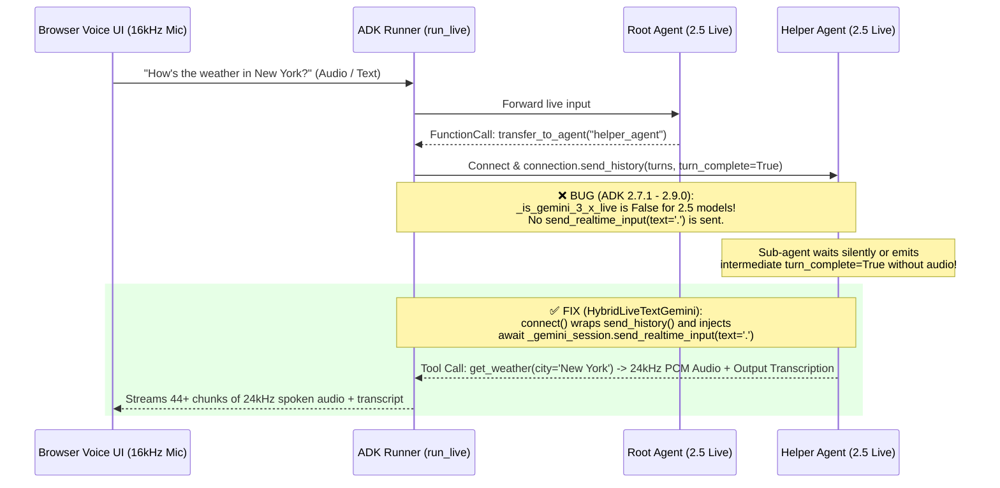

# ADK Live Multi-Agent Handoff Fix (`gemini-live-2.5-flash-native-audio` · GitHub #5238)

> **Production Root-Cause Analysis, Version-Proof Workaround (`google-adk 2.7.1`–`2.9.0`), Vertex AI Agent Engine Deployment (`AgentServerMode.EXPERIMENTAL`), and Vercel Monochrome Web Audio Voice UI**


---

## 1. Executive Summary & Problem Statement

When building multi-agent voice applications with **Google Agent Development Kit (`google-adk`)** using the native audio model **`gemini-live-2.5-flash-native-audio`** and sub-agent handoffs (`transfer_to_agent`), developers encounter a critical issue ([GitHub Issue #5238](https://github.com/google/adk-python/issues/5238)):

- **Symptom:** The root agent successfully executes `transfer_to_agent(agent_name="helper_agent")`, or the sub-agent executes a tool (`get_weather` / `get_current_time`), **but the Live session goes silent or hangs** instead of speaking the final response back to the user.
- **Affected Versions:** `google-adk` **1.28.0 through 2.9.0+** (including **2.7.1**).
- **Affected Models:** `gemini-live-2.5-flash-native-audio` (and `gemini-2.0-flash-live-*`).

This repository provides a complete, customer-ready reference solution:
1. **Complete Root-Cause Analysis** covering both the **server-side ADK bug** and **three client-side traps** in `bidi_stream_query` (including URL-safe Base64 audio decoding in Web Audio browsers).
2. **`HybridLiveTextGemini` (`agent.py`)**: A drop-in `Gemini` LLM wrapper that:
   - Fixes the `transfer_to_agent` handoff silence on **all ADK versions (`2.7.1`–`2.9.0+`)** by injecting a post-history wakeup trigger (`send_realtime_input(text='.')`) inside `connect()`.
   - Supports **Hybrid Text + Voice Mode** on Vertex AI Agent Engine (`stream_query` routes to `gemini-2.5-flash` text generation; `bidi_stream_query` routes to `gemini-live-2.5-flash-native-audio` WebSockets).
   - Implements `__getstate__` for safe `cloudpickle` serialization on Vertex AI Agent Engine.
3. **Live Side-by-Side Comparison (`deploy_both.py`, `test_both_runtimes.py`, `voice_ui.py`)**:
   - **Buggy Runtime (`adk-live-buggy-2-7-1`)** vs. **Fixed Runtime (`adk-live-fixed-2-7-1`)** deployed to **Vertex AI Agent Engine (`us-central1`)**.
   - **Vercel Monochrome Architecture Web Audio Voice UI (`voice_ui.py`)** featuring Light Mode by default, a dynamic `🌙 Dark` / `☀️ Light` theme toggle, the **Claude-Code Shrinking & Shining Ink Loader** for real-time thinking/tool/handoff states, `16kHz` PCM microphone streaming, and live `24kHz` PCM audio playback.

---

## 2. Deep-Dive Root Cause Analysis

### 2.1 Server-Side ADK Bug: Missing Post-Transfer Wakeup Trigger for Gemini 2.5 Live

When `root_agent` calls `transfer_to_agent(agent_name="helper_agent")` during a bidirectional Live session (`run_live` / `bidi_stream_query`):

1. ADK closes/switches the active model session from `root_agent` to `helper_agent`.
2. ADK opens a new Gemini Live WebSocket session (`GeminiLlmConnection`) for `helper_agent` and replays the conversation history via `connection.send_history(history)`.
3. Inside `GeminiLlmConnection.send_history()` (`google/adk/models/gemini_llm_connection.py`), ADK sends the historical turns using `send_client_content(turns=..., turn_complete=turn_complete)`.

**Why does `helper_agent` stay silent after receiving `send_history`?**
- Unlike `gemini-3.x` Live endpoints, **`gemini-live-2.5-flash-native-audio` does not automatically start generating audio output** after receiving a replayed history block ending with a function response (`transfer_to_agent` or tool output) via `send_client_content(..., turn_complete=True)`. It waits indefinitely for a realtime input signal.
- In ADK `2.8.0` (commit `7616c78`), the ADK team added a workaround at the end of `send_history()`:
  ```python
  # google/adk/models/gemini_llm_connection.py
  if turn_complete and self._is_gemini_3_x_live:
      await self._gemini_session.send_realtime_input(text=_RESPONSE_TRIGGER_TEXT)  # '.'
  ```
- **The Bug:** Look at the condition: **`if turn_complete and self._is_gemini_3_x_live:`**.
  - On **`google-adk == 2.7.1`**: This wakeup trigger does not exist at all.
  - On **`google-adk == 2.8.0` / `2.9.0`**: `_is_gemini_3_x_live` evaluates to **`False`** for `gemini-live-2.5-flash-native-audio`!
  - Consequently, across **all versions of ADK**, `gemini-live-2.5-flash-native-audio` never receives `send_realtime_input(text='.')` after `send_history()`, causing the sub-agent to stall or require an extra user prompt to speak.



---

### 2.2 Three Client-Side `bidi_stream_query` Traps (And How We Solved Them)

Even after fixing the server-side wakeup trigger, developers integrating `bidi_stream_query` with web browsers or custom clients hit **three subtle traps**:

#### Trap 1: URL-Safe Base64 Serialization in `google.genai.types.Blob` vs Browser `window.atob()`
When ADK serializes `Event` objects over JSON (`dump_event_for_json`), `google.genai.types.Blob` encodes raw 24kHz PCM binary audio (`inline_data.data`) using **URL-safe Base64** (`-` and `_` instead of `+` and `/`, and without `=` padding).
- Standard browser JavaScript `window.atob(base64Data)` strictly enforces standard Base64 and throws `DOMException: InvalidCharacterError` on the very first `-` or `_` character in the audio stream.
- **Solution (`voice_ui.py`)**: Always normalize URL-safe Base64 before decoding PCM audio in JavaScript:
  ```javascript
  let normB64 = base64Data.replace(/-/g, '+').replace(/_/g, '/');
  while (normB64.length % 4 !== 0) normB64 += '=';
  const binary = atob(normB64);
  ```

#### Trap 2: Explicit `RunConfig` Audio + Transcription Modalities on Session Initialization
When connecting to `AdkApp.bidi_stream_query` on Vertex AI Agent Engine, the initial handshake message must explicitly specify `run_config` with `"response_modalities": ["AUDIO"]` and audio transcriptions enabled so both voice synthesis and live transcripts persist across agent transfers:
```python
await ae_session.send({
    "user_id": f"web-voice-{runtime_key}",
    "run_config": {
        "response_modalities": ["AUDIO"],
        "input_audio_transcription": {},
        "output_audio_transcription": {},
    },
})
```

#### Trap 3: Intermediate `turn_complete=True` Before Audio Generation
When `helper_agent` executes a tool (`get_weather`) after a handoff in `bidi_stream_query`, ADK emits **multiple `turn_complete=True` events across the multi-step turn**:
1. **Event A (Tool Sub-turn End):** ADK emits `{"turnComplete": true}` with **0 content parts** immediately after the tool call/handoff completes, *while the model is still synthesizing audio*.
2. **Events B..N (Audio Stream):** ADK streams chunks containing `inline_data` (`audio/pcm;rate=24000`) and `output_transcription`.
3. **Event Z (Final Turn Complete):** ADK emits the final `{"turnComplete": true}` after all audio chunks have been delivered.

---

## 3. Vertex AI Agent Engine Deployment Requirements (`google-adk 2.7.1`)

Deploying a bidirectional Live + Text agent to **Vertex AI Agent Engine** (`vertexai.Client().agent_engines.create`) requires four specific configurations:

### 3.1 Wrapping with `AdkApp` + `AgentServerMode.EXPERIMENTAL`
Vertex AI Agent Engine only exposes `bidi_stream_query` if:
1. Your `root_agent` is wrapped in `vertexai.preview.reasoning_engines.templates.adk.AdkApp(agent=root_agent)`.
2. You pass **`agent_server_mode=vertexai.types.AgentServerMode.EXPERIMENTAL`** inside `config`.

```python
import vertexai
from vertexai.preview.reasoning_engines.templates.adk import AdkApp

client = vertexai.Client(project="vtxdemos", location="us-central1")
remote_agent = client.agent_engines.create(
    agent=AdkApp(agent=root_agent),
    config={
        "display_name": "adk-live-fixed-2-7-1",
        "staging_bucket": "gs://adk_staging_bucket_vtxdemos",
        "requirements": [
            "google-cloud-aiplatform[adk,agent_engines]>=1.93.0",
            "google-adk==2.7.1",
            "google-genai>=1.65.0",
            "certifi",
        ],
        "agent_server_mode": vertexai.types.AgentServerMode.EXPERIMENTAL,
    },
)
```

### 3.2 Safe `cloudpickle` Serialization (`__getstate__`)
`Gemini` subclasses in ADK use `@cached_property` for `api_client` and `_live_api_client`, which hold SSL contexts and thread locks (`_thread.lock`). When `client.agent_engines.create()` serializes your agent with `cloudpickle`, any initialized client causes `TypeError: cannot pickle '_thread.lock' object`.
Implement `__getstate__` on your custom `Gemini` subclass to strip cached clients before pickling:
```python
def __getstate__(self):
    state = self.__dict__.copy()
    state.pop("api_client", None)
    state.pop("_live_api_client", None)
    return state
```

---

## 4. Live Deployed Vertex AI Agent Engine Runtimes (`vtxdemos` / `us-central1`)

Both runtimes are deployed and active on Vertex AI Agent Engine using **`google-adk==2.7.1`**:

| Runtime Name | Status | Resource Name | Behavior |
| :--- | :--- | :--- | :--- |
| **`adk-live-buggy-2-7-1`** | 🔴 **Buggy Baseline** | `projects/254356041555/locations/us-central1/reasoningEngines/434137218425028608` | Standard ADK `2.7.1` `send_history()` (no post-transfer wakeup trigger). Demonstrates handoff stall / intermediate `turn_complete` trap. |
| **`adk-live-fixed-2-7-1`** | 🟢 **Fixed Production** | `projects/254356041555/locations/us-central1/reasoningEngines/6983496976528572416` | Uses `HybridLiveTextGemini` with `_send_history_with_wakeup` override. Works seamlessly in both **Text Mode (`stream_query`)** and **Live Audio Mode (`bidi_stream_query`)**. |

---

## 5. Quickstart & Verification

### 5.1 Install Environment (`google-adk==2.7.1`)
```bash
python3 -m venv .venv
source .venv/bin/activate
pip install -r requirements.txt
```

### 5.2 Verify Both Deployed Runtimes (CLI Automated Test)
Run `test_both_runtimes.py` to test both `stream_query` (Text Mode) and `bidi_stream_query` (Live WebSockets Audio Mode) against the two deployed Agent Engine runtimes:
```bash
.venv/bin/python test_both_runtimes.py
```

### 5.3 Launch the Vercel Monochrome Web Audio Voice UI (`voice_ui.py`)
Start the local FastAPI + Web Audio UI server on `http://localhost:8080`:
```bash
.venv/bin/python voice_ui.py
```
1. Open **`http://localhost:8080`** in your browser.
2. Select **`Runtime 2 · ADK 2.7.1 (Fixed + Wakeup Trigger)`** and click **Connect**.
3. Click **Start Mic (16kHz)** (or type in the input bar) and ask:
   > *"How's the weather in New York?"*
4. Watch the **Claude-Code Shrinking & Shining Ink Loader** animate through the live handoff (`root_agent` $\rightarrow$ `transfer_to_agent` $\rightarrow$ `helper_agent` $\rightarrow$ `get_weather`), observe **`Decoded Audio Queue`** increment (`44+ chunks`), and hear the `24kHz` spoken voice response out loud!
5. Use the **`🌙 Dark` / `☀️ Light`** button in the top-right header to toggle dynamically between Vercel Light and Dark monochrome themes.

---

## 6. Repository Structure

| File | Description |
| :--- | :--- |
| [`agent.py`](./agent.py) | Complete implementation of `HybridLiveTextGemini` with `_send_history_with_wakeup`, hybrid text/live routing, and `cloudpickle`-safe `__getstate__`. |
| [`deploy_both.py`](./deploy_both.py) | Script that deploys both `adk-live-buggy-2-7-1` and `adk-live-fixed-2-7-1` to Vertex AI Agent Engine (`AgentServerMode.EXPERIMENTAL`). |
| [`test_both_runtimes.py`](./test_both_runtimes.py) | Automated test suite verifying both runtimes in `stream_query` (Text) and `bidi_stream_query` (Live Bidi Audio). |
| [`voice_ui.py`](./voice_ui.py) | Vercel Monochrome Architecture FastAPI + Web Audio UI with Light/Dark dynamic theme toggle, Claude-Code Shrinking & Shining Ink loader, and URL-safe Base64 24kHz PCM audio player. |
| [`assets/voice_ui_handoff_demo.png`](./assets/voice_ui_handoff_demo.png) | Live screenshot demonstrating end-to-end `transfer_to_agent` handoff, `get_weather` tool execution, and 44 decoded 24kHz PCM audio chunks on Runtime 2. |
| [`requirements.txt`](./requirements.txt) | Locked dependency specification (`google-adk==2.7.1`). |
