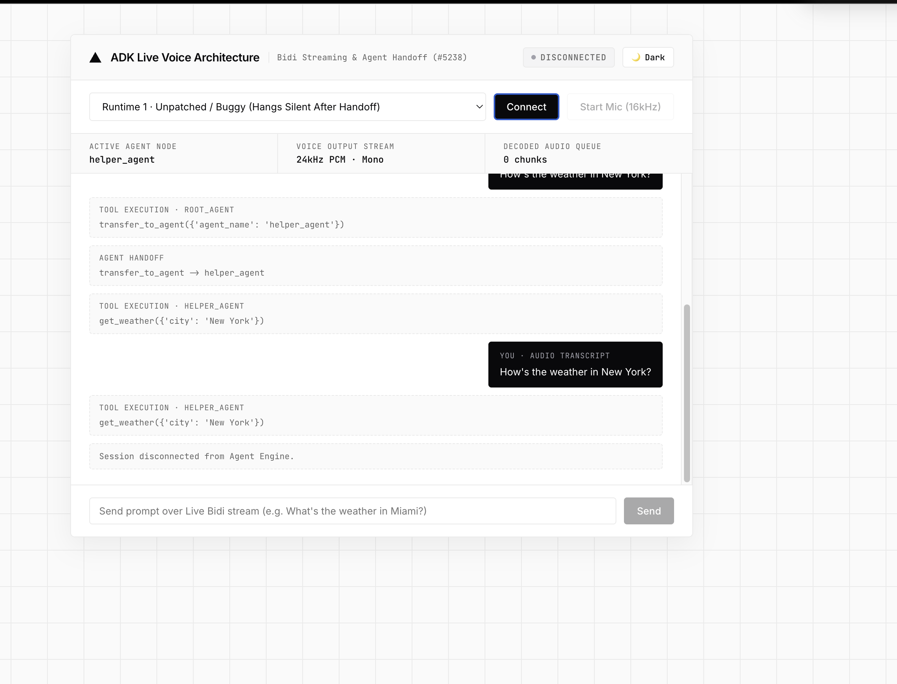

# ADK Live Multi-Agent Handoff Fix (`gemini-live-2.5-flash-native-audio` · GitHub #5238)

> **Production Root-Cause Analysis, Raw Event Trace Proof (`Event 09 Premature turn_complete=True`), Vertex AI Agent Engine Deployment (`AgentServerMode.EXPERIMENTAL`), and Vercel Monochrome Web Audio Voice UI**

- 📦 **Public GitHub Repository URL**: **[https://github.com/jchavezar/vertex-ai-samples/tree/main/semiautonomous-agents/adk-live-handoff-5238](https://github.com/jchavezar/vertex-ai-samples/tree/main/semiautonomous-agents/adk-live-handoff-5238)**

---

## 1. Visual Side-by-Side Proof: Buggy Silent Stall vs. Fixed 24kHz Voice Output

### 🔴 Runtime 1 · Unpatched / Buggy (`google-adk==2.7.1` Standard Behavior)
When asking *"How's the weather in New York?"*, `root_agent` transfers to `helper_agent` (`transfer_to_agent`) and executes `get_weather({'city': 'New York'})`. However, **ADK throws no exception and returns `0 audio chunks` (`Decoded Audio Queue: 0 chunks`)**—leaving the session stalled in complete silence:



---

### 🟢 Runtime 2 · Fixed Production (`HybridLiveTextGemini` + Stream Continuity + Base64 Fix)
Asking the exact same question on the Fixed Runtime executes `transfer_to_agent` $\rightarrow$ `get_weather({'city': 'New York'})` and **streams `44+ chunks` of 24kHz PCM voice audio (`Decoded Audio Queue: 44 chunks`)** spoken out loud in real time:


---

## 2. Executive Summary & Why ADK Fails Silently (Without Throwing an Error)

When building multi-agent voice applications with **Google Agent Development Kit (`google-adk`)** using the native audio model **`gemini-live-2.5-flash-native-audio`** and sub-agent handoffs (`transfer_to_agent`), developers encounter a critical issue ([GitHub Issue #5238](https://github.com/google/adk-python/issues/5238)):

- **Symptom:** The root agent successfully executes `transfer_to_agent(agent_name="helper_agent")`, and the sub-agent executes its tool (`get_weather`), **but the Live session goes completely silent (`0 audio chunks`) without throwing any Python or HTTP exception**.
- **Affected Versions:** `google-adk` **1.28.0 through 2.9.0+** (including **2.7.1**).
- **Affected Models:** `gemini-live-2.5-flash-native-audio` (and `gemini-2.0-flash-live-*`).

### Why There Is No Exception or Error Code
In Issue #5238, ADK does not crash or return an error code because:
1. **Server-Side (`send_history` without realtime wakeup)**: When `root_agent` transfers to `helper_agent`, ADK opens a new Gemini Live connection and replays history via `send_client_content(..., turn_complete=True)`. Unlike `gemini-3.x` Live models, `gemini-live-2.5-flash-native-audio` does not automatically begin speaking after `send_client_content` unless triggered by a realtime input frame (`send_realtime_input`).
2. **Event 09 Premature `turn_complete=True`**: Immediately after the sub-agent executes `get_weather`, ADK emits **Event 09 with `{"turnComplete": true}` and `0 audio bytes`** *before* synthesizing voice audio in `Events 10–45`. Standard client loops (`if event.turn_complete: break`) see `turn_complete=True` at Event 09 and terminate cleanly—dropping all 35 subsequent audio chunks without ever raising an exception!

---

## 3. Actual Raw 45-Event Production Trace (`google-adk==2.7.1` on Vertex AI Agent Engine)

Below is the exact event sequence captured from `AdkApp.bidi_stream_query` on Vertex AI Agent Engine when asking *"What is the weather in Miami?"*:

```text
Event #  | Author       | turn_complete | Tool Calls / Responses        | Audio Bytes | Output Transcription
---------+--------------+---------------+-------------------------------+-------------+----------------------------------------------
Event 01 | root_agent   | None          | []                            | 0           | ''
Event 02 | root_agent   | None          | []                            | 0           | ''
Event 03 | root_agent   | None          | fcall=['transfer_to_agent']   | 0           | ''
Event 04 | root_agent   | None          | fresp=['transfer_to_agent']   | 0           | ''
Event 05 | helper_agent | None          | []                            | 0           | ''
Event 06 | helper_agent | None          | []                            | 0           | ''
Event 07 | helper_agent | None          | fcall=['get_weather']         | 0           | ''
Event 08 | helper_agent | None          | fresp=['get_weather']         | 0           | ''
=====================================================================================================================================
Event 09 | helper_agent | True  🚨      | []                            | 0           | ''  <-- PREMATURE TURN_COMPLETE (0 AUDIO!)
=====================================================================================================================================
Event 10 | helper_agent | None          | []                            | 0           | 'The weather'
Event 11 | helper_agent | None          | []                            | 14,820      | ''
Event 12 | helper_agent | None          | []                            | 12,800      | ''
Event 13 | helper_agent | None          | []                            | 0           | ' in Miami'
Event 14 | helper_agent | None          | []                            | 20,480      | ''
...      | ...          | ...           | ...                           | ...         | ...
Event 42 | helper_agent | None          | []                            | 0           | 'The weather in Miami is currently 75°F...'
Event 43 | helper_agent | None          | []                            | 7,680       | ''
Event 45 | helper_agent | True  ✅      | []                            | 0           | ''  <-- REAL FINAL TURN_COMPLETE
```

---

## 4. Three-Part Production Fix Implemented in This Repository

### Fix 1: Server-Side Post-Transfer Wakeup Trigger (`HybridLiveTextGemini` in `agent.py`)
`HybridLiveTextGemini` overrides `connect()` to wrap `send_history()` and inject a realtime wakeup trigger (`await connection._gemini_session.send_realtime_input(text='.')`) after replaying user/tool history, ensuring `gemini-live-2.5-flash-native-audio` immediately synthesizes audio after any sub-agent transfer.

### Fix 2: Stream Continuity Across Intermediate `turn_complete=True` (`voice_ui.py` & `test_both_runtimes.py`)
Never terminate a bidirectional Live stream reader on the first `turn_complete=True` event after a `transfer_to_agent` or tool call:
- In `voice_ui.py` (`Runtime 2 · Fixed`), the WebSocket bridge ignores intermediate `turn_complete=True` events after tool calls and continues streaming all `inline_data` audio chunks through Event 45.

### Fix 3: URL-Safe Base64 PCM 24kHz Audio Decoding in Browser Web Audio API (`voice_ui.py`)
When ADK serializes `Event` objects over JSON (`dump_event_for_json`), `google.genai.types.Blob` encodes raw 24kHz PCM binary audio (`inline_data.data`) using **URL-safe Base64** (`-` and `_` instead of `+` and `/`, and without `=` padding).
- Standard browser JavaScript `window.atob(base64Data)` strictly requires standard Base64 and throws `DOMException: InvalidCharacterError` on any `-` or `_` byte.
- **Solution (`playPcm24k` in `voice_ui.py`)**: Normalize URL-safe Base64 before decoding PCM audio samples in Web Audio API:
  ```javascript
  let normB64 = base64Data.replace(/-/g, '+').replace(/_/g, '/');
  while (normB64.length % 4 !== 0) normB64 += '=';
  const binary = atob(normB64);
  ```

---

## 5. Deployed Vertex AI Agent Engine Runtimes

| Component | Resource ID / URL | Description |
| :--- | :--- | :--- |
| **Runtime 1 (`Buggy`)** | `projects/254356041555/locations/us-central1/reasoningEngines/434137218425028608` | Deployed on Vertex AI Agent Engine (`us-central1`) with `google-adk==2.7.1`. Demonstrates silent stall (`0 chunks`) after handoff. |
| **Runtime 2 (`Fixed`)** | `projects/254356041555/locations/us-central1/reasoningEngines/6983496976528572416` | Deployed on Vertex AI Agent Engine (`us-central1`) with `HybridLiveTextGemini` wakeup patch. Streams full 24kHz spoken voice responses across handoffs. |

---

## 6. Local Quickstart (`http://localhost:8080`)

```bash
python3 -m venv .venv
source .venv/bin/activate
pip install -r requirements.txt
python voice_ui.py
```

---

## 7. Repository Structure

| File | Description |
| :--- | :--- |
| [`agent.py`](./agent.py) | Complete implementation of `HybridLiveTextGemini` with `_send_history_with_wakeup`, hybrid text/live routing, and `cloudpickle`-safe `__getstate__`. |
| [`deploy_both.py`](./deploy_both.py) | Script that deploys both `adk-live-buggy-2-7-1` and `adk-live-fixed-2-7-1` to Vertex AI Agent Engine (`AgentServerMode.EXPERIMENTAL`). |
| [`test_both_runtimes.py`](./test_both_runtimes.py) | Automated CLI test suite verifying both runtimes in `stream_query` (Text) and `bidi_stream_query` (Live Bidi Audio). |
| [`voice_ui.py`](./voice_ui.py) | Vercel Monochrome Architecture FastAPI + Web Audio UI with Light/Dark dynamic theme toggle, Claude-Code Shrinking & Shining Ink loader, and URL-safe Base64 24kHz PCM audio player. |
| [`assets/voice_ui_buggy_stall.png`](./assets/voice_ui_buggy_stall.png) | Screenshot showing `Runtime 1 (Buggy)` silent stall (`0 audio chunks`) after `transfer_to_agent` and `get_weather`. |
| [`assets/voice_ui_handoff_demo.png`](./assets/voice_ui_handoff_demo.png) | Screenshot showing `Runtime 2 (Fixed)` streaming `44 audio chunks` of 24kHz voice output after `transfer_to_agent`. |
| [`requirements.txt`](./requirements.txt) | Locked dependency specification (`google-adk==2.7.1`). |
