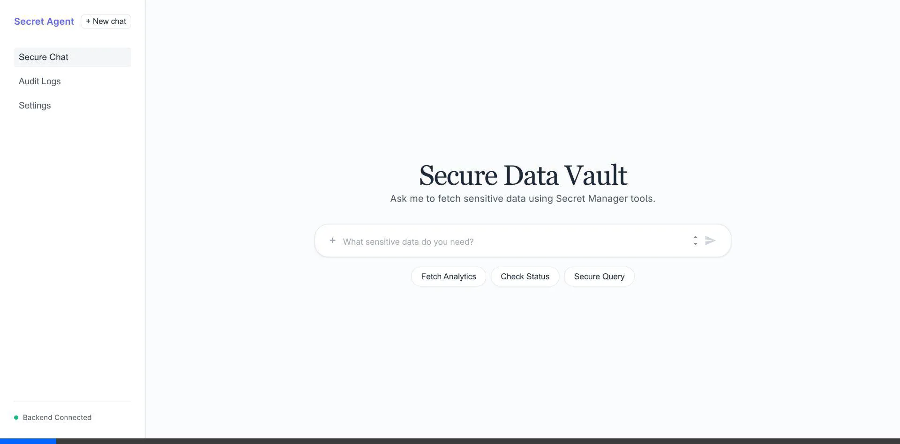

# ADK Secret Manager Demo

This project demonstrates a **Semiautonomous Agent** architecture using the Google Agent Development Kit (ADK), showcasing secure secret handling with Google Secret Manager and Vertex AI.

## 🎬 Demo



## 🏗 System Architecture & Test Flow

The following diagram illustrates the system components and the secure flow being tested:

```mermaid
graph TD
    User([User / Browser]) -->|"1. Query: 'Fetch analytics...'"| FE[Frontend: React + Vite]
    FE -->|2. POST /chat| BE[Backend: FastAPI]
    BE -->|3. Execute| Agent[ADK LlmAgent]
    Agent -->|4. Recognize Intent| LLM[Gemini 2.5 Flash]
    Agent -->|5. Call Tool| Tool[secure_data_fetch]
    Tool -->|6. Get Secret| SM[Google Secret Manager]
    SM -->|7. Return API Key| Tool
    Tool -->|8. Fetch Data (Simulated)| Data[Secure Source]
    Data -->|9. Return Result| Tool
    Tool -->|10. Return Summary| Agent
    Agent -->|11. Stream Response| FE
    FE -->|12. Render Output| User

    style SM fill:#f9f,stroke:#333,stroke-width:2px
    style Agent fill:#bbf,stroke:#333,stroke-width:2px
    style Tool fill:#bfb,stroke:#333,stroke-width:2px
```

## 🛡 Best Practices for Secure Agentic Apps

When building agents that handle sensitive data, we follow these core security principles:

### 1. Zero-Leak Secret Management
- **Never hardcode secrets** in code or environment files committed to source control.
- Use **Google Secret Manager** as the single source of truth for sensitive credentials.
- Agents access secrets **just-in-time** via specialized tools, and the secret values are never returned directly to the user.

### 2. Application Default Credentials (ADC)
- Avoid static API keys for Google Cloud services.
- Leverage **ADC** (via `gcloud auth application-default login` or service accounts) to securely authenticate the backend with Vertex AI and Secret Manager.
- Set `GOOGLE_GENAI_USE_VERTEXAI=TRUE` to ensure the SDK uses Vertex AI infrastructure.

### 3. Principle of Least Privilege (Tool Isolation)
- The agent itself does not have direct access to the database or external APIs.
- Access is mediated through **strongly-typed tools** (functions) registered with the agent.
- The agent only calls the tool when the user's intent matches the tool's description, reducing the attack surface.

## 🚀 How to Run

### Prerequisites
- Python 3.10+
- Node.js 18+
- `uv` (Python package manager)
- Google Cloud project with Vertex AI and Secret Manager enabled.

### Setup
1. Authenticate with Google Cloud:
   ```bash
   gcloud auth application-default login
   ```
2. Configure environment variables in `.env`:
   ```env
   GOOGLE_GENAI_USE_VERTEXAI=TRUE
   GOOGLE_CLOUD_PROJECT=YOUR_PROJECT_ID
   GOOGLE_CLOUD_LOCATION=us-central1
   ```

### Execution
1. **Start Backend**:
   ```bash
   uv run main.py
   ```
2. **Start Frontend**:
   ```bash
   cd frontend
   npm run dev
   ```
   Open the displayed URL in your browser.
