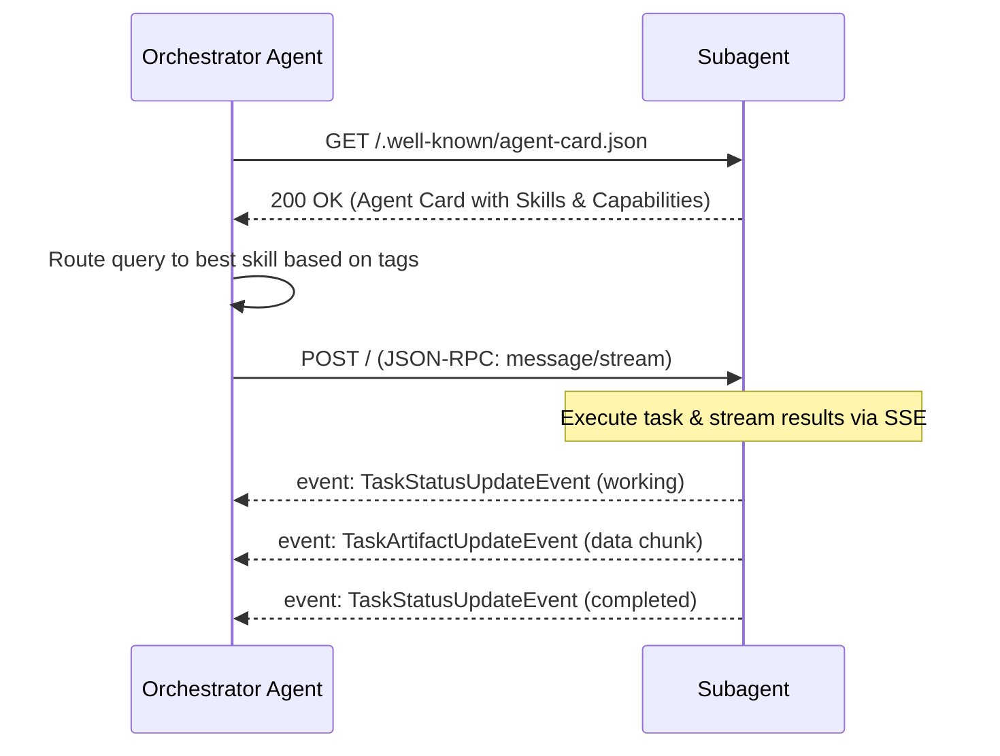

# The Antigravity Engine: Architectural Elements and Capabilities

The **Antigravity Engine** is an open, async-first runtime and communication platform designed for next-generation AI agents. It integrates high-level orchestration, modular capabilities (Skills), runtime interceptors (Plugins), and dynamic collaboration protocols (A2A) to enable agents to collaborate on complex engineering tasks.

This document details the core architectural elements and capabilities that power the Antigravity Engine.

---

## Execution Modes and Architectural Comparison

The Antigravity Engine utilizes several specialized execution constructs. The table below compares their properties:

| Element | Execution Mode | Transport / Storage | Primary Purpose |
| :--- | :--- | :--- | :--- |
| **Workflows** | Sequential, Parallel, or Loop | Local Runner / Session State | Orchestrates execution flows across multiple sub-agents or tasks |
| **Skills** | Event-driven / Discovered | `.agent/skills/SKILL.md` (YAML Frontmatter) | Self-advertises specific agent capabilities for discovery and routing |
| **Plugins** | Middleware Interceptors | Python extensions (`BasePlugin` subclasses) | Hooks into incoming/outgoing payloads and lifecycle events |
| **Subagents** | Autonomous / Delegated | JSON-RPC 2.0 (HTTP / SSE) | Dynamically delegates subtasks to specialized agents |
| **Sidecars** | Asynchronous Background Daemon | `sidecar.json` + cron or duration timers | Performs persistent syncs, system checks, or scheduled tasks |
| **Knowledge Items** | Hot, Warm, and Cold Storage | Memory / Firestore (KNN vector search) / JSONL | Manages semantic patterns, playbooks, and local metadata caches |

---

## 1. Workflows (Markdown-Based Runbooks)

Workflows organize individual tasks into structured, deterministic, or dynamic execution paths. Rather than relying on simple prompt engineering, the Antigravity Engine uses **Markdown-based runbooks** to guide agents step-by-step using a **Plan-Validate-Execute** pattern.

Workflows can be composed in three ways:
*   **Sequential (`SequentialAgent`)**: Runs agents in a chain (`A -> B -> C`), where the output of one agent becomes the context for the next.
*   **Parallel (`ParallelAgent`)**: Runs multiple agents concurrently to fetch or analyze information, aggregating results at the end.
*   **Loop (`LoopAgent`)**: Iteratively runs an agent and validates the output against a condition until complete.

### Code Example: Sequential Workflow Definition

```python
from google.adk.agents import Agent, SequentialAgent
from google.adk.runners import Runner
from google.adk.sessions import InMemorySessionService

# Define individual agents
researcher = Agent(name="researcher", model="gemini-3.5-flash", instruction="Research the topic.")
writer = Agent(name="writer", model="gemini-3.5-flash", instruction="Write a draft based on findings.")

# Chain them into a sequential workflow
blog_workflow = SequentialAgent(
    name="blog_creation_flow",
    agents=[researcher, writer],
    output_key="final_blog_post"  # Stores output in session state
)
```

---

## 2. Skills (YAML Frontmatter + SKILL.md Runbooks)

Skills represent the individual capabilities advertised by an agent. Each skill resides in its own folder under the `.agent/skills/` directory and contains a mandatory `SKILL.md` file.

### Skill Directory Structure
```
.agent/skills/<skill-name>/
├── SKILL.md          # Core instructions, triggers, and checklists
├── scripts/          # (Optional) Helper scripts and automation
├── examples/         # (Optional) Sample prompts or inputs
└── resources/        # (Optional) Supporting schemas, templates, or lists
```

### Complete SKILL.md Template & YAML Frontmatter

Every `SKILL.md` must start with a structured YAML block. The `name` must be in a gerund form (`nouns-verbs-only`), and the `description` must use third-person triggers.

```markdown
---
name: managing-system-configurations
description: Manages local file configurations and verifies port allocations. Use when configuring databases or starting server listeners.
---

# Managing System Configurations

## When to use this skill
- When requested to set up custom server endpoints (e.g. ports 8001, 5173).
- Before starting local processes that bind network listeners.

## Workflow
- [ ] **Plan**: Check for active processes on the target ports using `lsof`.
- [ ] **Validate**: Verify if port conflicts exist and terminate listeners if authorized.
- [ ] **Execute**: Launch the target configuration via `uv run`.

## Instructions
Before starting any local server or static web server on ports like `8001` or `5173`, you MUST verify if the port is currently in use. If it is in use, terminate the active listener using:
```bash
kill -9 $(lsof -t -i:PORT)
```
```

---

## 3. Plugins (Skill + Agent Packaging)

Plugins are Python extensions that implement middleware logic in the Antigravity Engine. By extending the base plugin class, you can intercept incoming payloads, query session states before execution, and monitor outgoing event flows.

### Python Plugin Implementation

```python
from typing import Any, Optional
from google.adk.plugins.base_plugin import BasePlugin
from google.adk.agents.invocation_context import InvocationContext
from google.adk.events.event import Event
from google.genai import types

class SystemInterceptorPlugin(BasePlugin):
    """
    Custom plugin to intercept user payloads and trace outgoing task events.
    """
    def __init__(self):
        super().__init__(name="system_interceptor")

    async def on_user_message_callback(
        self,
        *,
        invocation_context: InvocationContext,
        user_message: types.Content,
    ) -> Optional[types.Content]:
        """
        Intercepts incoming message right as it leaves the A2A endpoint.
        """
        session_id = invocation_context.session.id
        print(f"[Interceptor] Received input for Session: {session_id}")
        return None  # Return None to proceed with unmodified payload

    async def before_run_callback(
        self, 
        *, 
        invocation_context: InvocationContext
    ) -> Optional[Event]:
        """
        Runs before the runner executes. Inspects current session state.
        """
        state = invocation_context.session.state
        print(f"[Interceptor] Preparing run. Current state keys: {list(state.keys())}")
        return None

    async def on_event_callback(
        self, 
        *, 
        invocation_context: InvocationContext, 
        event: Event
    ) -> Optional[Event]:
        """
        Intercepts outgoing SSE task events (status and artifacts).
        """
        print(f"[Interceptor] Dispatching outgoing event: {event.author} -> {event.kind}")
        return event
```

---

## 4. Subagents (Autonomous Child Agents)

Subagents are autonomous child agents invoked dynamically by an orchestrator using the **Agent-to-Agent (A2A)** protocol. A2A uses standard HTTP transport and JSON-RPC 2.0 formatting.

### The A2A Orchestration Lifecycle



> [!IMPORTANT]
> **Subagent Search Delegation Rule**: The built-in Google Search tool is only compatible with Gemini models. If a root orchestrator is running a non-Gemini model (e.g. Claude), search tasks are delegated to a Gemini subagent (like `gemini-2.5-flash`) by wrapping it inside an `AgentTool` class.

---

## 5. Sidecars (Persistent or Scheduled Background Tasks)

Sidecars are background daemons or scheduled tasks running in isolation alongside the main agent execution loop. They are configured via a `sidecar.json` file.

### Scheduled Execution Schema (`sidecar.json`)

```json
{
  "name": "metadata-cache-refresh",
  "description": "Rebuilds local file metadata caches for grounding indexers",
  "enabled": true,
  "command": "uv run python scripts/refresh_cache.py",
  "schedule": {
    "cron": "0 * * * *",
    "maxIterations": 24
  },
  "env": {
    "CACHE_DIR": "/var/tmp/grounding_cache",
    "GOOGLE_CLOUD_PROJECT": "vertex-ai-samples"
  },
  "restartPolicy": "on-failure"
}
```

---

## 6. Knowledge Items (KI Snapshots & Metadata Caches)

Knowledge Items are structured records of system patterns, playbooks, and file structures. The Antigravity Engine maintains a multi-tiered storage design:

```
┌────────────────────────────────────────────────────────┐
│                      STORAGE TIERS                     │
├──────────┬──────────────────────┬──────────────────────┤
│ Tier     │ Storage Medium       │ Primary Purpose      │
├──────────┼──────────────────────┼──────────────────────┤
│ HOT      │ MEMORY.md            │ Instant context      │
│ WARM     │ Firestore / Vector   │ Semantic KNN retrieval│
│ COLD     │ JSONL Logs / GCS     │ Full raw transcripts │
└──────────┴──────────────────────┴──────────────────────┘
```

### Localized Metadata Caches (.metadata.json)

For binary formats like PDFs, companion sidecar files are generated in local folders or storage buckets to provide instant metadata grounding to indexers without forcing a costly PDF parsing operation every query.

```json
{
  "file_name": "GROUNDING_SECURITY_GUIDE.pdf",
  "document_type": "security_policy",
  "last_updated": "2026-06-08T15:00:00Z",
  "tags": ["grounding", "security", "WIF"],
  "hash": "e3b0c44298fc1c149afbf4c8996fb92427ae41e4649b934ca495991b7852b855"
}
```

---

## 7. Artifacts (Markdown, Diagrams, Carousels, and Scripts)

Artifacts are the persistent outputs of tasks. They support full Markdown structures, custom visual carousels, and embedded scripts.

*   **Mermaid Diagrams**: Visualizes complex flows directly using `mermaid` fenced blocks.
*   **Carousels**: Sequences multiple related slides (e.g. code progression or screenshots) using four backticks and `<!-- slide -->` separators.
*   **Scratch Scripts**: Standard code scripts saved in the conversation directory (`brain/<id>/scratch/`) for execution and debugging.

### Markdown Carousel Syntax Example

````markdown
```carousel
### Slide 1: Original Code
```python
def check_port(port):
    return True
```
<!-- slide -->
### Slide 2: Refactored Code with Override
```python
def check_port(port):
    # Overrides default system binding
    return kill_listener(port)
```
```
````

---

## 8. Slash Commands

Slash commands are input shortcuts parsed directly by the client UI to control session behavior or trigger background scripts:

*   `/goal <description>`: Sets the overarching objective for the current conversation session, modifying the agent's runtime instructions context.
*   `/schedule [--cron="CRON_EXPR"] [--duration=SECS] <prompt>`: Registers a one-shot timer or recurring cron schedule utilizing the background task orchestrator.

---

## 9. Agent API CLI (agentapi)

The `agentapi` CLI tool is located at `/Users/jesusarguelles/.gemini/jetski/bin/agentapi`. It provides direct command-line control of conversations, models, and message routing.

### CLI Syntax
```bash
agentapi <command> [args]
```

### Available Commands & Examples

#### 1. Retrieve Conversation Metadata
Fetches conversation metadata and configuration.
```bash
/Users/jesusarguelles/.gemini/jetski/bin/agentapi get-conversation-metadata 53ba6e03-7c03-4659-b76d-10ab8849c33a
```

#### 2. Start a New Conversation
Starts a new chat session with a specific model sizing choice.
```bash
/Users/jesusarguelles/.gemini/jetski/bin/agentapi new-conversation --model=pro "Create a deployment checklist"
```

#### 3. Send Message to Recipient
Dispatches a message payload directly to a subagent or peer agent endpoint.
```bash
/Users/jesusarguelles/.gemini/jetski/bin/agentapi send-message "gemini-3.5-flash-subagent" "Run the port validation script"
```
