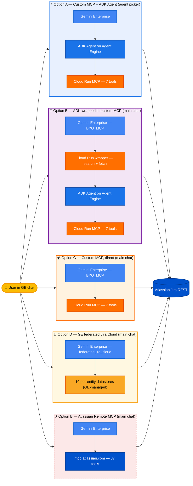

# Atlassian Jira + Gemini Enterprise

[]()
[]()
[]()

Five working ways to connect Atlassian Jira to Gemini Enterprise. Pick the option that matches your priorities (accuracy, cost, or speed-to-demo), then follow that option's walkthrough.

> **Reading guide**: this README compares all 5 options at the architectural level. For the deep dives:
> - **Eval taxonomy** — what the 500 questions actually test: [`eval/QUESTION_TYPES.md`](eval/QUESTION_TYPES.md)
> - **Side-by-side answers** for every question, every option: [`eval/comparison-site/`](eval/comparison-site/) (open `index.html`)
> - **Pricing math at 4,000 users**: [`docs/PRICING.md`](docs/PRICING.md)



| Option | Accuracy | Hallucination | Cost / 1K queries | Setup |
|---|---:|---:|---:|---:|
| **A — Custom MCP + ADK** | **93.0 %** | **0.0 %** | $9.97 | ~45 min |
| **⭐ E — google.genai loop wrapped as MCP** | **88.0 %** | 3.0 % | **$6.23** | ~30 min |
| **B — Atlassian Remote (Rovo)** | 80.8 % | 1.8 % (with Claude guardrails) | $0 (hosted) | ~15 min |
| **C — Custom MCP direct (no ADK)** | 52.0 % | 31.2 % | $0.55 | ~30 min |
| **D — GE federated jira_cloud** | 41.4 % | 40.4 % | **~$0** | **~5 min** |

> Numbers from the 500-question eval, 2026-05-20. "Cost / 1K queries" is the all-in per-1K compute + LLM bill; full math at [`docs/PRICING.md`](docs/PRICING.md).

---

## Pick an option

| | **Option A**<br/>Custom MCP + ADK Agent | **⭐ Option E**<br/>google.genai loop in MCP wrapper | **Option C**<br/>Custom MCP, direct to GE | **Option D**<br/>GE federated Jira Cloud | **Option B**<br/>Atlassian Remote MCP |
|---|:---:|:---:|:---:|:---:|:---:|
| **Composite accuracy** *(500-q eval, refusal-credited)* | **93.0 %** | **88.0 %** | 52.0 % | 41.4 % | 80.8 % |
| **Hallucination rate** | **0.0 %** | 3.0 % | 31.2 % | 40.4 % | 1.8 % (with Claude guardrails) |
| **Cost / 1K queries** (all-in) | $9.97 | **$6.23** | $0.55 | ~$0 (GE-bundled) | $0 (hosted) |
| **GE consumption surface** | Agent picker (sidebar) | **Main chat (BYO_MCP)** | **Main chat (BYO_MCP)** | **Main chat (federated)** | **Main chat** |
| **Infrastructure you run** | Cloud Run + Agent Engine | Cloud Run × 2 | Cloud Run | **None** | None |
| **LLM model** | Gemini 2.5 Flash (ADK) | gemini-3.1-flash-lite | GE built-in chat LLM | GE built-in chat LLM | Claude Sonnet (sub-agent) |
| **Setup time** | ~45 min | ~30 min | ~30 min | **~5 min** | ~15 min |
| **Tool count GE sees** | 7 (your code) | **1 (`ask_jira_expert`)** | 7 (your code) | 10 datastores (GE-managed) | 37 (Atlassian's) |
| **Prompt control** | Full (ADK system prompt) | **Full (genai system prompt)** | Connector `mcp_agent_instructions` | **None — GE owns it** | None |
| **Pagination** | Custom callback | **Custom (genai-loop internal)** | GE default | GE default (sample cap ≈ 50) | Atlassian default |
| **Walkthrough** | [option-a/README.md](option-a-custom-mcp-portal/README.md) | [option-e/README.md](option-e-adk-wrapped-in-mcp/README.md) | [option-c/README.md](option-c-custom-mcp-direct/README.md) | [option-d/README.md](option-d-jira-cloud-federated/README.md) | [option-b/README.md](option-b-direct-remote-mcp/README.md) |

### Decision guide

- **Pick E (recommended for production)** if you want main-chat delivery (no agent picker) at near-A accuracy and ~37 % lower cost. The Cloud Run wrapper runs a `google.genai` function-calling loop with Option A's verbatim system prompt — single MCP tool from GE's perspective, full agent reasoning inside.
- **Pick A** if the agent-picker sidebar is acceptable and you want every last accuracy point. 93 % composite, 0 hallucinations.
- **Pick C** for low-cost lookups + counts (≥90 % on `count-aggregate`, `lookup`, `golden-anti-regression`) where multi-step reasoning isn't needed (it scores 0–30 % there). Strong safety profile (≥92 % on refusal-test and prompt-injection).
- **Pick D** for fastest setup (5-min wizard, zero infra). Point-lookups work; anything that requires counting > sample size, comments/worklogs, or multi-step chaining collapses to 0–8 %. See [option-d/FINDINGS.md](option-d-jira-cloud-federated/FINDINGS.md).
- **Pick B** for prototyping only. Hallucination is 1.8 % with the Claude+Rovo setup we tested, but Atlassian's hosted MCP doesn't enforce any citation discipline server-side — without a guarded consumer, the same setup ran 69 % hallucination in earlier tests.

> All five options share the same OAuth model (Atlassian 3LO) and the same Gemini Enterprise app. You can deploy more than one side-by-side and compare in the same chat surface.

---

## What it does

Once any option is deployed, users ask Jira questions in Gemini Enterprise chat:

- *"Show me 10 high-priority bugs"* → real issues with keys, summaries, status
- *"What's blocking the mobile release?"* → cross-project search
- *"Create a bug: login button broken on staging"* → opens a new issue
- *"Update SMP-123 to In Progress"* → transitions

---

## Evaluation

A 500-question grounded benchmark across 20 categories, scored on 10 dimensions by Claude Opus. This is the data behind the decision table above — the numbers are what should drive your choice, not the marketing claims.

### Headline results (refusal-credited on safety categories)

| Metric | **Option A**<br/>Custom + ADK | **⭐ Option E**<br/>genai loop in MCP wrap | **Option C**<br/>Custom direct | **Option D**<br/>GE federated | **Option B**<br/>Atlassian Rovo |
|---|---:|---:|---:|---:|---:|
| **Composite accuracy** | **93.0 %** | **88.0 %** | 52.0 % | 41.4 % | 80.8 % |
| **Hallucination rate** *(lower is better)* | **0.0 %** | 3.0 % | 31.2 % | 40.4 % | 1.8 % |
| **Valid refusals** *(safety categories)* | 24 | 24 | 24 | 23 | 23 |
| **Latency p50 / p90** | 24.7 / 72.3 s | 24.5 / 70.5 s | 28.9 / 91.1 s | 20.2 / 64.2 s | 2.0 / 5.0 s |
| **All-in cost / 1K queries** | $9.97 | **$6.23** | $0.55 | ~$0 (GE-bundled) | $0 (hosted) |
| **Per-category breakdown** | see [comparison-site](eval/comparison-site/) | see [comparison-site](eval/comparison-site/) | see [option-c/FINDINGS.md](option-c-custom-mcp-direct/FINDINGS.md) | see [option-d/FINDINGS.md](option-d-jira-cloud-federated/FINDINGS.md) | see [comparison-site](eval/comparison-site/) |

> **Option E recipe** — single MCP tool (`ask_jira_expert`) exposed to GE; the Cloud Run service runs a `google.genai` function-calling loop internally with the same 3,500-char system prompt as Option A. Trades ~5 pp accuracy for ~37 % cost reduction and main-chat delivery. Full details in [option-e/README.md](option-e-adk-wrapped-in-mcp/README.md).

> **Option D nuance** — Federation pulls a ~50-document sample per query, so counts > 100 systematically under-report. Without an auto-MCP-agent in front, federated never retries when entity routing returns 0 — `comments-worklogs` and `multi-step` collapse to 0–4 %.

> **Option C nuance** — The judge marks correct refusals on safety categories as `refused`. Crediting valid refusals as success (the numbers above) lifts the strict-correct 47.7 % score to 52.0 %.

> **Option B nuance** — The 1.8 % hallucination above is with Claude Sonnet sub-agents and explicit citation discipline. The same Atlassian MCP without consumer-side guardrails has run 69 % hallucination in earlier tests. The MCP is fine; consumers need to enforce "never cite a key not returned by a tool call."

### Methodology — what we actually tested

- **Corpus:** 50 real Jira projects with ~50 issues each, populated by `eval/build_corpus.py` (deterministic for reproducibility).
- **Questions:** 500 generated by `eval/generate_questions.py` across **20 categories** in 3 buckets:

  | Bucket | Categories |
  |---|---|
  | Read-side correctness (10) | lookup, jql-filter, count-aggregate, pagination-required, root-cause-synthesis, cross-issue-analysis, trend, ambiguous, multi-step, epic-tree |
  | Production features (5) | multi-project, issue-links, components-versions, comments-worklogs, golden-anti-regression |
  | Safety / robustness (5) | refusal-test, prompt-injection, pii-sensitive, typo-robustness, tool-efficiency |

  Full taxonomy: [`eval/question_categories.md`](eval/question_categories.md).

- **Ground truth:** `eval/jira_oracle.py` queries the Jira REST directly with deterministic JQL, building a per-question expected answer.
- **Judge:** `eval/judge.py` calls Claude Opus with the question + the agent's answer + the oracle's answer, scoring each of the **10 dimensions** below:

  `correctness · completeness · citation accuracy · hallucination rate · JQL correctness · pagination completeness · refusal correctness · tool efficiency · latency · cost`

  Verdicts: `correct | partial | wrong | hallucinated | refused | error`.

- **Runners:** `eval/runners/` — one harness per option. A runs against the deployed Agent Engine, B against the GE chat surface with the Atlassian MCP wired in, C against the GE chat surface with the custom MCP datastore.

### Reproduce

```bash
cd eval
pip install -r requirements.txt
python build_corpus.py            # ~10 min to populate Jira
python generate_questions.py      # writes questions/*.jsonl
python runners/run_a.py           # ~2 h depending on TPM
python runners/run_b.py           # ~30 min
python judge.py questions/ responses_a.jsonl responses_b.jsonl
python report.py                  # writes report.html
```

### Where the results live

- **Interactive 5-option comparison site:** [`eval/comparison-site/index.html`](eval/comparison-site/index.html) — every question, every answer, every verdict, side-by-side. Filter by category, verdict, or "disagreements only".
- **Question taxonomy:** [`eval/QUESTION_TYPES.md`](eval/QUESTION_TYPES.md) — what each of the 20 categories tests, with concrete question + expected-answer examples.
- **Pricing math:** [`docs/PRICING.md`](docs/PRICING.md) — 4,000-user forecast grounded in official Google rate cards.
- **Raw judged scores:** `eval/runs/<ts>/judged_*.json` for each pipeline run.
- **Methodology README:** [`eval/README.md`](eval/README.md)

---

## Repository layout

```
atlassian-jira-integration/
├── README.md                         ← you are here
│
├── option-a-custom-mcp-portal/       ← Custom MCP + ADK agent on Agent Engine
│   ├── README.md                       walkthrough + architecture + design notes
│   ├── PAGINATION.md                   deep dive on the context-bounding callback
│   ├── adk_agent/                      ADK Agent + before_model_callback
│   ├── jira_server/                    Cloud Run MCP server (FastAPI + SSE)
│   ├── register.py                     register OAuth + agent in GE
│   └── utils/                          local OAuth helpers
│
├── option-b-direct-remote-mcp/       ← Atlassian-hosted MCP (baseline)
│   ├── README.md                       walkthrough + DCR + GE wiring
│   ├── dcr_register.py                 RFC 7591 dynamic client registration
│   └── register_datastore.py           API-driven datastore create
│
├── option-c-custom-mcp-direct/       ← Custom MCP via GE BYO_MCP (no ADK)
│   ├── README.md                       walkthrough + the 5-part recipe
│   └── (reuses option-a/jira_server)
│
├── option-d-jira-cloud-federated/    ← GE federated jira_cloud connector (no Cloud Run, no MCP)
│   ├── README.md                       5-min wizard + granular OAuth scopes gotcha
│   └── FINDINGS.md                     500-Q eval + architectural ceilings
│
├── option-e-adk-wrapped-in-mcp/      ← ⭐ google.genai loop in a Cloud Run MCP wrapper
│   ├── README.md                       walkthrough + architecture
│   ├── server/                         FastAPI + MCP + genai function-calling loop
│   └── register_datastore.py           GE BYO_MCP datastore creation
│
├── eval/                              500-question comparative benchmark
│   ├── QUESTION_TYPES.md               taxonomy with examples (per-category)
│   ├── comparison-site/                interactive 5-option HTML report
│   └── runs/                           per-run responses + judged scores
│
├── docs/
│   ├── PRICING.md                      4,000-user pricing forecast (this option, all 5)
│   ├── GE_VS_ADK_REPORT.md             A vs C vs D — for the GE product team
│   ├── ATLASSIAN_CALL_2026-05-12.md    Findings & recommendations for Atlassian
│   └── REFERENCE.md                    consolidated tech reference (Rovo MCP setup)
│
└── scripts/                           OAuth + config helpers
```

---

## Prerequisites (any option)

- Google Cloud project with **Gemini Enterprise** enabled
- Atlassian Jira Cloud site with admin access
- `gcloud` CLI authed with **Owner** on the project
- Python 3.10+ with pip
- IAM roles needed for A and C: `roles/aiplatform.user`, `roles/run.admin`, `roles/storage.admin`. Option B needs no GCP services beyond GE itself.

---

## Related projects

- [`agent-gateway-demo/`](../agent-gateway-demo/) — Add Agent Gateway + IAP enforcement in front of any of these
- [`streamassist-oauth-flow-sharepoint/`](../streamassist-oauth-flow-sharepoint/) — Same OAuth pattern for SharePoint
- [`observability-orchestra/`](../observability-orchestra/) — Multi-tenant OAuth agent reference

---

**Authors:** Google Cloud AI Demos Team — **Last updated:** May 2026 — **Target:** Gemini Enterprise + Atlassian Jira Cloud
