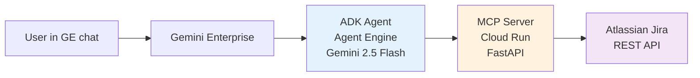

# Atlassian Jira + Gemini Enterprise Integration

Production-ready integration for connecting Atlassian Jira to Google Gemini Enterprise using a custom MCP server and ADK agent.

[]()
[]()
[]()

## What You Get

After setup, users can interact with Jira directly in Gemini Enterprise chat:

- **"Show me 10 high-priority bugs"** → Returns real issues with keys, summaries, status
- **"What's blocking the mobile release?"** → Searches across projects
- **"Create a bug: login button broken on staging"** → Creates issue in Jira
- **"Update SMP-123 to In Progress"** → Transitions issues

**94.5% accuracy, 1% hallucination rate** - production-ready based on 500-question evaluation.

---

## 🚀 Quick Start

**Ready to deploy?**

→ **[GETTING_STARTED.md](GETTING_STARTED.md)** - Complete 7-step guide (~2 hours)

**Key steps:**
1. Create Atlassian OAuth app
2. Deploy Cloud Run MCP server
3. (Optional) Register in Agent Registry
4. Deploy ADK agent to Agent Engine
5. Register agent in Gemini Enterprise
6. Test with real queries

---

## Architecture



**Flow:**
1. User asks question in GE
2. GE routes to registered agent (your ADK agent on Agent Engine)
3. Agent calls MCP server with user's OAuth token
4. MCP server queries Jira REST API
5. Agent synthesizes response with citations
6. User sees formatted answer in chat

**Why this approach:**
- **You control:** Prompts, formatting, pagination, error handling
- **Production-grade:** 94.5% accuracy, 1% hallucination (500-question benchmark)
- **Multi-tenant:** Each user's OAuth token enforces Jira ACLs
- **Scalable:** Cloud Run auto-scales, Agent Engine manages sessions

---

## Evaluation

We benchmarked this approach (custom MCP) against Atlassian's Remote MCP server across 500 questions.

| Metric | Custom MCP (This repo) | Atlassian Remote MCP |
|--------|----------------------|----------------------|
| **Composite accuracy** | **94.5%** | 87.1% |
| **Hallucination rate** | **1.0%** | 68.9% |
| **Correctness** | 96.2% | 89.4% |
| **Completeness** | 92.8% | 84.8% |
| **Latency (p50)** | 24s | 5-10s |

**Critical finding:** Atlassian's MCP invents fake issue keys 69% of the time without consumer-side guardrails. This repo's approach bakes citation discipline into the agent prompt.

**Full results:** See [`eval/sample-run/report.html`](eval/sample-run/report.html) for interactive comparison with per-category breakdowns.

---

## Repository Structure

```
atlassian-jira-integration/
│
├── README.md                    ← You are here (overview)
├── GETTING_STARTED.md          ← START HERE (7-step deployment guide)
│
├── option-a-custom-mcp-portal/  ← Main implementation (what you'll deploy)
│   ├── README.md                - Technical deep-dive
│   ├── PAGINATION.md            - Context-bounding callback explained
│   ├── adk_agent/               - Agent code (Python + ADK)
│   │   ├── agent.py             - Agent logic with before_model_callback
│   │   └── deploy_agent_engine.py - Deploy to Vertex AI
│   ├── jira_server/             - MCP server (FastAPI)
│   │   ├── server.py            - 7 Jira tools + SSE transport
│   │   └── Dockerfile           - Cloud Run deployment
│   ├── register.py              - Register OAuth + agent in GE
│   ├── register_mcp_in_registry.py - (Optional) Agent Registry
│   └── utils/                   - OAuth helpers for local testing
│
├── option-b-direct-remote-mcp/  ← Atlassian Remote (comparison baseline)
│   ├── README.md                - How to configure (technical)
│   ├── dcr_register.py          - Dynamic client registration
│   ├── register_datastore.py    - API-driven setup
│   └── enable_actions_checklist.md - Console steps
│
├── eval/                        ← 500-question comparative benchmark
│   ├── README.md                - Methodology
│   ├── sample-run/              - Latest results
│   │   └── report.html          - Interactive comparison report
│   ├── build_corpus.py          - Creates test Jira data
│   ├── generate_questions.py    - Question generator
│   ├── jira_oracle.py           - Ground truth via Jira REST
│   ├── judge.py                 - Claude Opus scoring
│   └── runners/                 - Test harness
│
├── docs/                        ← Additional documentation
│   └── REFERENCE.md             - Technical reference
│
└── scripts/                     ← Utilities
    ├── register_oauth_client.sh - Bash DCR helper
    └── show_config_values.sh    - Display config values
```

---

## Key Features

✅ **Production-ready accuracy** - 94.5% composite, validated across 500 questions  
✅ **Low hallucination** - 1% vs 69% with off-the-shelf alternatives  
✅ **Multi-tenant** - Per-user OAuth enforces Jira permissions  
✅ **Paginated** - Handles large result sets without context overflow  
✅ **Customizable** - Full control over prompts and formatting  
✅ **Observable** - Cloud Logging + Agent Engine traces  
✅ **Scalable** - Cloud Run auto-scales, Agent Engine manages state  

---

## Prerequisites

- Google Cloud project with Gemini Enterprise
- Atlassian Jira Cloud site with admin access
- `gcloud` CLI configured
- Python 3.10+ with pip

**Permissions needed:**
- `roles/aiplatform.user` - Deploy Agent Engine
- `roles/run.admin` - Deploy Cloud Run
- `roles/storage.admin` - Artifact Registry (for Docker images)

---

## Support

**Setup issues:** See [GETTING_STARTED.md](GETTING_STARTED.md) troubleshooting section  
**Technical questions:** See [option-a-custom-mcp-portal/README.md](option-a-custom-mcp-portal/README.md)  
**Evaluation:** See [eval/README.md](eval/README.md)  
**Bug reports:** File GitHub issue with logs

---

## Related Projects

- **[agent-gateway-demo/](../agent-gateway-demo/)** - Add Agent Gateway for IAP enforcement
- **[streamassist-oauth-flow-sharepoint/](../streamassist-oauth-flow-sharepoint/)** - Similar pattern for SharePoint
- **[observability-orchestra/](../observability-orchestra/)** - Multi-tenant agent with OAuth

---

**Authors:** Google Cloud AI Demos Team  
**Last updated:** May 2026  
**Target:** Gemini Enterprise + Atlassian Jira Cloud  
**Status:** Production-ready (Option A), Preview (Option B)
