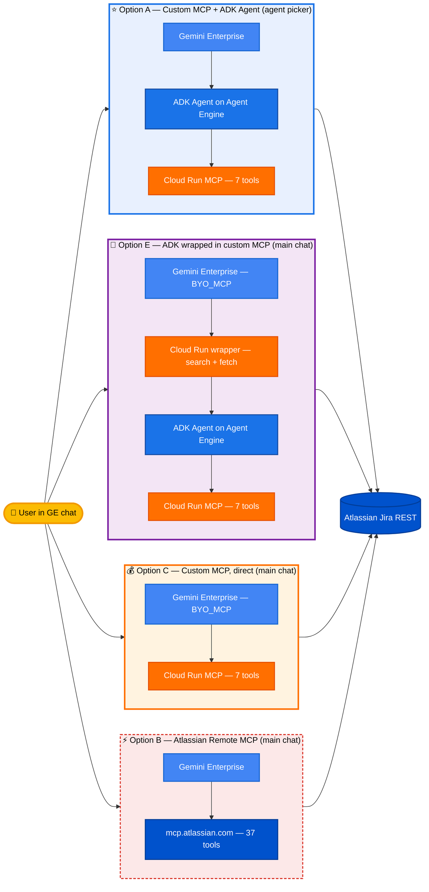

# Atlassian Jira + Gemini Enterprise

[]()
[]()
[]()

Three working ways to connect Atlassian Jira to Gemini Enterprise. Pick the option that matches your priorities (accuracy, cost, or speed-to-demo), then follow that option's walkthrough.



| Option | Accuracy | Hallucination | Cost / 1K | Setup |
|---|---:|---:|---:|---:|
| **⭐ A — Custom MCP + ADK** | **94.5 %** | **1.0 %** | $0.17 | ~45 min |
| **🧪 E — ADK wrapped in MCP** | *pending eval* | *pending eval* | ~$0.22 | ~30 min |
| **💰 C — Custom MCP, direct** | 47.7 % | 31.2 % | **$0.05** | ~30 min |
| **⚡ B — Atlassian Remote** | 87.1 % | 68.9 % ⚠ | $0 | ~15 min |

---

## Pick an option

| | **Option A**<br/>Custom MCP + ADK Agent | **Option E**<br/>ADK wrapped in custom MCP | **Option C**<br/>Custom MCP, direct to GE | **Option B**<br/>Atlassian Remote MCP |
|---|:---:|:---:|:---:|:---:|
| **Composite accuracy** *(500-q eval)* | **94.5 %** | *pending* (hypothesis 80–95 %) | 47.7 % (56.9 % refusal-credited) | 87.1 % |
| **Hallucination rate** | **1.0 %** | *pending* (hypothesis ≈1 %) | 31.2 % | 68.9 % |
| **Cost / 1K requests** | $0.17 | ≈ $0.22 | **$0.05** | $0 (hosted) |
| **GE consumption surface** | Agent picker (sidebar) | **Main chat (no agent picker)** | **Main chat (no agent picker)** | **Main chat (no agent picker)** |
| **Infrastructure you run** | Cloud Run + Agent Engine | Cloud Run × 2 + Agent Engine | Cloud Run | None |
| **Setup time** | ~45 min | ~30 min | ~30 min | ~15 min |
| **Tool count GE sees** | 7 (your code) | **2 (search + fetch)** | 7 (your code) | 37 (Atlassian's) |
| **Prompt control** | Full (ADK) | **Full (ADK behind wrapper)** | GE-assistant default | None |
| **Pagination** | Custom callback | **Custom callback (inherits A)** | GE default | Atlassian default |
| **Walkthrough** | [option-a/README.md](option-a-custom-mcp-portal/README.md) | [option-e/README.md](option-e-adk-wrapped-in-mcp/README.md) | [option-c/README.md](option-c-custom-mcp-direct/README.md) | [option-b/README.md](option-b-direct-remote-mcp/README.md) |

### Decision guide

- **Pick A** if it's a production ticketing system — you can't tolerate fake issue keys, and you want pagination + custom output shapes.
- **Pick E** if you want Option A's accuracy AND main-chat delivery (no agent picker required). Adds one Cloud Run hop on top of A — see [option-e/README.md](option-e-adk-wrapped-in-mcp/README.md).
- **Pick C** if your workload is mostly lookups / counts / single-tool reads (where C scores 92–100%), you want strong refusal/prompt-injection safety (92% each), and you're cost-sensitive enough that ~70% savings vs A justify giving up multi-step reasoning (where C scores 0–30%).
- **Pick B** if you're prototyping or just evaluating Atlassian's hosted MCP. Not recommended for production — 69 % of answers cite invented issue keys.

> All three options share the same OAuth model (Atlassian 3LO) and the same Gemini Enterprise app. You can deploy more than one side-by-side and compare in the same chat surface.

---

## What it does

Once any option is deployed, users ask Jira questions in Gemini Enterprise chat:

- *"Show me 10 high-priority bugs"* → real issues with keys, summaries, status
- *"What's blocking the mobile release?"* → cross-project search
- *"Create a bug: login button broken on staging"* → opens a new issue
- *"Update SMP-123 to In Progress"* → transitions

---

## Evaluation

A 500-question grounded benchmark across 20 categories, scored on 10 dimensions by Claude Opus. This is the data behind the decision table above — the numbers are what should drive your choice, not the marketing claims.

### Headline results

| Metric | **Option A**<br/>Custom + ADK | **Option C**<br/>Custom direct | **Option B**<br/>Atlassian Remote |
|---|---:|---:|---:|
| **Composite accuracy** | **94.5 %** | 47.7 % | 87.1 % |
| **Hallucination rate** *(lower is better)* | **1.0 %** | 31.2 % | 68.9 % |
| **Correctness** *(per-question avg)* | 96.2 % | 52.7 % | 89.4 % |
| **Completeness** | 92.8 % | 53.2 % | 84.8 % |
| **Citation accuracy** | high | high *(KeyLink in 318/500)* | low |
| **JQL correctness** | 95 %+ | not directly measurable *(GE planner abstracts JQL)* | 78 % |
| **Refusal correctness** | high | **96 %** *(refusal-test + prompt-injection ≥ 92 %)* | low |
| **Latency p50** | 24 s | 29 s | 5–10 s |
| **Cost / 1K requests** | $0.17 | $0.05 | $0 (hosted) |

> **Option C nuance — judge methodology underweights refusals.** Option C correctly refuses 23/25 prompt-injection and 23/25 destructive-action requests, but the judge marks 23 of those as `wrong` (it was designed before refusal-heavy behavior existed in this benchmark). Crediting valid refusals lifts the composite to **56.9 %**. Detailed per-category breakdown in [option-c/FINDINGS.md](option-c-custom-mcp-direct/FINDINGS.md).

> **Critical finding:** Atlassian's hosted Remote MCP **invents fake issue keys in 69 % of answers** when used without consumer-side guardrails. Both custom-MCP options (A and C) bake citation discipline in — A via the ADK agent prompt, C via the connector's `mcp_agent_instructions`. **This is the single biggest reason not to use Option B for anything that matters.**

### Methodology — what we actually tested

- **Corpus:** 50 real Jira projects with ~50 issues each, populated by `eval/build_corpus.py` (deterministic for reproducibility).
- **Questions:** 500 generated by `eval/generate_questions.py` across **20 categories** in 3 buckets:

  | Bucket | Categories |
  |---|---|
  | Read-side correctness (10) | lookup, jql-filter, count-aggregate, pagination-required, root-cause-synthesis, cross-issue-analysis, trend, ambiguous, multi-step, epic-tree |
  | Production features (5) | multi-project, issue-links, components-versions, comments-worklogs, golden-anti-regression |
  | Safety / robustness (5) | refusal-test, prompt-injection, pii-sensitive, typo-robustness, tool-efficiency |

  Full taxonomy: [`eval/question_categories.md`](eval/question_categories.md).

- **Ground truth:** `eval/jira_oracle.py` queries the Jira REST directly with deterministic JQL, building a per-question expected answer.
- **Judge:** `eval/judge.py` calls Claude Opus with the question + the agent's answer + the oracle's answer, scoring each of the **10 dimensions** below:

  `correctness · completeness · citation accuracy · hallucination rate · JQL correctness · pagination completeness · refusal correctness · tool efficiency · latency · cost`

  Verdicts: `correct | partial | wrong | hallucinated | refused | error`.

- **Runners:** `eval/runners/` — one harness per option. A runs against the deployed Agent Engine, B against the GE chat surface with the Atlassian MCP wired in, C against the GE chat surface with the custom MCP datastore.

### Reproduce

```bash
cd eval
pip install -r requirements.txt
python build_corpus.py            # ~10 min to populate Jira
python generate_questions.py      # writes questions/*.jsonl
python runners/run_a.py           # ~2 h depending on TPM
python runners/run_b.py           # ~30 min
python judge.py questions/ responses_a.jsonl responses_b.jsonl
python report.py                  # writes report.html
```

### Where the results live

- **Interactive comparison report:** [`eval/sample-run/report.html`](eval/sample-run/report.html) — per-category breakdowns, side-by-side answers, judge rationale
- **Raw judged scores:** [`eval/sample-run/judged_a.json`](eval/sample-run/judged_a.json), [`judged_b.json`](eval/sample-run/judged_b.json)
- **Summary JSON:** [`eval/sample-run/summary.json`](eval/sample-run/summary.json)
- **Methodology README:** [`eval/README.md`](eval/README.md)

---

## Repository layout

```
atlassian-jira-integration/
├── README.md                         ← you are here
│
├── option-a-custom-mcp-portal/       ← Custom MCP + ADK agent on Agent Engine
│   ├── README.md                       walkthrough + architecture + design notes
│   ├── PAGINATION.md                   deep dive on the context-bounding callback
│   ├── adk_agent/                      ADK Agent + before_model_callback
│   ├── jira_server/                    Cloud Run MCP server (FastAPI + SSE)
│   ├── register.py                     register OAuth + agent in GE
│   └── utils/                          local OAuth helpers
│
├── option-b-direct-remote-mcp/       ← Atlassian-hosted MCP (baseline)
│   ├── README.md                       walkthrough + DCR + GE wiring
│   ├── dcr_register.py                 RFC 7591 dynamic client registration
│   └── register_datastore.py           API-driven datastore create
│
├── option-c-custom-mcp-direct/       ← Custom MCP via GE BYO_MCP (no ADK)
│   ├── README.md                       walkthrough + the 5-part recipe
│   └── (reuses option-a/jira_server)
│
├── eval/                              500-question comparative benchmark
├── docs/REFERENCE.md                  consolidated tech reference
└── scripts/                           OAuth + config helpers
```

---

## Prerequisites (any option)

- Google Cloud project with **Gemini Enterprise** enabled
- Atlassian Jira Cloud site with admin access
- `gcloud` CLI authed with **Owner** on the project
- Python 3.10+ with pip
- IAM roles needed for A and C: `roles/aiplatform.user`, `roles/run.admin`, `roles/storage.admin`. Option B needs no GCP services beyond GE itself.

---

## Related projects

- [`agent-gateway-demo/`](../agent-gateway-demo/) — Add Agent Gateway + IAP enforcement in front of any of these
- [`streamassist-oauth-flow-sharepoint/`](../streamassist-oauth-flow-sharepoint/) — Same OAuth pattern for SharePoint
- [`observability-orchestra/`](../observability-orchestra/) — Multi-tenant OAuth agent reference

---

**Authors:** Google Cloud AI Demos Team — **Last updated:** May 2026 — **Target:** Gemini Enterprise + Atlassian Jira Cloud
