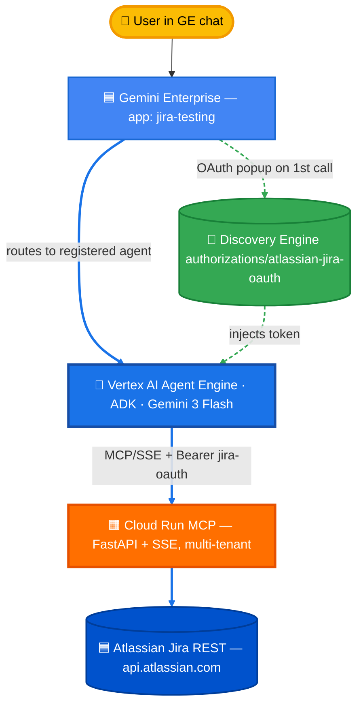

# Option A — Custom MCP + ADK Agent

You run the MCP server, you run the agent (Vertex AI Agent Engine + ADK), Gemini Enterprise just routes chats to it. Maximum control over prompts, pagination, and formatting.

**93.0 % accuracy, 0.0 % hallucination** on the latest 500-question eval (2026-05-20, refusal-credited on safety categories). See [parent README](../README.md) for the comparison vs Options B, C, D, E, and [`../eval/comparison-site/`](../eval/comparison-site/) for the interactive side-by-side.

---

## Architecture



**OAuth flow:** Gemini Enterprise drives an Atlassian 3LO popup the first time a user asks the agent a question. The token is injected into the ADK session state, then passed to the MCP server in the `Authorization` header. ACL enforcement is end-to-end — each user only sees the Jira issues their own account can see.

---

## Project layout

```
option-a-custom-mcp-portal/
├── README.md                       ← you are here (walkthrough + design)
├── PAGINATION.md                   ← context-bounding callback deep dive
├── register.py                     ← registers OAuth + agent in GE
├── register_mcp_in_registry.py     ← (optional) Agent Registry for governance
├── adk_agent/
│   ├── agent.py                    ← LlmAgent + before_model_callback
│   ├── deploy_agent_engine.py      ← create/update the Agent Engine
│   ├── requirements.txt
│   ├── .env                        ← generated in Step 3 below
│   └── .env.example
├── jira_server/
│   ├── server.py                   ← 7 Jira tools + SSE transport
│   ├── Dockerfile
│   ├── requirements.txt
│   └── start_server.sh             ← local dev runner
└── utils/
    ├── oauth_oneshot.py            ← one-shot OAuth → ATLASSIAN_OAUTH_TOKEN
    └── get_access_token.py         ← tkinter variant
```

---

## Prerequisites

- Google Cloud project with **Gemini Enterprise** enabled
- Atlassian Jira Cloud site with admin access
- `gcloud` CLI authed with **Owner** on the project
- Python 3.10+ with pip

Roles needed: `roles/aiplatform.user`, `roles/run.admin`, `roles/storage.admin`.

---

## Walkthrough

### Step 0 — Set your variables (do this once)

Paste this block, **edit the 3 lines marked `← EDIT`**, then run it. Every later command reads from these — you'll never re-type your project id.

```bash
export PROJECT_ID="my-gcp-project"                                  # ← EDIT
export ATLASSIAN_CLIENT_ID="paste-after-step-1"                     # ← EDIT (Step 1)
export ATLASSIAN_CLIENT_SECRET="paste-after-step-1"                 # ← EDIT (Step 1)

# Derived
export PROJECT_NUMBER=$(gcloud projects describe "$PROJECT_ID" --format='value(projectNumber)')
export REGION="us-central1"
export REPO_ROOT="$(pwd)"   # run from atlassian-jira-integration/
```

> If `PROJECT_NUMBER` is empty, your gcloud auth can't see the project — fix that before continuing.

### Step 1 — Create the Atlassian OAuth app

1. <https://developer.atlassian.com/console/myapps/> → **Create → OAuth 2.0 integration**
2. Name: `gemini-jira-agent`
3. **Permissions → Jira API:** `read:jira-work`, `write:jira-work`, `read:jira-user`
4. **Authorization → Callback URL:** `https://vertexaisearch.cloud.google.com/oauth-redirect`
5. **Settings → Copy** Client ID + Secret → paste back into the Step 0 block and re-run that block.

### Step 2 — Deploy the MCP server to Cloud Run

```bash
cd "$REPO_ROOT/option-a-custom-mcp-portal/jira_server"

gcloud run deploy jira-mcp-server \
  --source . \
  --project "$PROJECT_ID" \
  --region "$REGION" \
  --allow-unauthenticated \
  --port 8080 --memory 1Gi --cpu 2 --timeout 600 --max-instances 5

export MCP_SERVER_URL=$(gcloud run services describe jira-mcp-server \
  --project "$PROJECT_ID" --region "$REGION" --format='value(status.url)')/sse
echo "MCP URL: $MCP_SERVER_URL"
```

The server is multi-tenant — it reads the per-request `Authorization: Bearer <token>` header and uses that token to call Jira. No secret embedded at deploy time. If org policy forbids `--allow-unauthenticated`, deploy private and grant `roles/run.invoker` to the Agent Engine SA.

### Step 3 — Write the agent's `.env` (one heredoc, all variables substituted)

```bash
cat > "$REPO_ROOT/option-a-custom-mcp-portal/adk_agent/.env" <<EOF
# Google Cloud — all three keys are the same value; libraries look for different names.
GOOGLE_CLOUD_PROJECT=${PROJECT_ID}
GOOGLE_CLOUD_QUOTA_PROJECT=${PROJECT_ID}
GOOGLE_CLOUD_PROJECT_NUMBER=${PROJECT_NUMBER}
GOOGLE_CLOUD_LOCATION=${REGION}
GOOGLE_GENAI_USE_VERTEXAI=True
STAGING_BUCKET=gs://${PROJECT_ID}-agent-staging

MCP_SERVER_URL=${MCP_SERVER_URL}
MCP_SERVICE_RESOURCE=projects/${PROJECT_NUMBER}/locations/${REGION}/services/jira-mcp-server

ATLASSIAN_CLIENT_ID=${ATLASSIAN_CLIENT_ID}
ATLASSIAN_CLIENT_SECRET=${ATLASSIAN_CLIENT_SECRET}

AGENTSPACE_AUTH_ID=atlassian-jira-oauth
EOF

chmod 600 "$REPO_ROOT/option-a-custom-mcp-portal/adk_agent/.env"
```

That heredoc IS the whole config. No script hides what's happening — you can see `${PROJECT_ID}` lands in 3 places, `${PROJECT_NUMBER}` in 2, `${REGION}` in 1. To change a value, edit the exports at the top of Step 0 and re-run this heredoc.

### Step 4 — Deploy the ADK agent to Vertex AI Agent Engine

```bash
cd "$REPO_ROOT/option-a-custom-mcp-portal/adk_agent"
pip install -r requirements.txt
python deploy_agent_engine.py
```

Save the Reasoning Engine ID printed at the end.

### Step 5 — Register OAuth + agent in Gemini Enterprise

```bash
cd "$REPO_ROOT/option-a-custom-mcp-portal"
python register.py all
```

Reads `adk_agent/.env`, no prompts. Three things happen:

1. **`register_auth`** — creates a Discovery Engine `Authorization` resource pointing at Atlassian's OAuth endpoints with your client credentials.
2. **`register_agent`** — registers your reasoning engine as a GE agent, wiring `authorization_config.tool_authorizations` to that auth resource. This is what triggers the consent popup on first user request.
3. **`share_agent`** — sets sharing scope to `ALL_USERS` so the agent shows up in everyone's picker.

Save the Agent ID printed.

### Step 6 — Test

1. Open the Gemini Enterprise app in the cloud console.
2. Agent picker → **"Jira MCP Portal"** (or whatever display name you set).
3. *"List 5 Jira issues created this week."*
4. **First time:** Atlassian consent popup → log in → pick your site → accept → popup closes.
5. **After:** answers with issue keys as clickable Markdown links.

Expected output:
```
Here are 5 recent issues:
1. [SMP-16](https://your-site.atlassian.net/browse/SMP-16) — Dropdown value reset after update()
   Status: To Do | Assignee: Unassigned
2. ...
```

---

## (Optional) Local end-to-end test

Useful while iterating on `agent.py` without a full redeploy:

```bash
cd "$REPO_ROOT/option-a-custom-mcp-portal/utils"
python3 oauth_oneshot.py     # opens browser, mints token, saves to adk_agent/.atlassian_token

cd ../adk_agent
python3 agent.py             # interactive REPL against the deployed Cloud Run MCP
```

The agent loads `.atlassian_token` (when present) as the `ATLASSIAN_OAUTH_TOKEN` fallback used by `get_access_token` in `agent.py`.

## (Optional) Register the MCP in Agent Registry

For Agent Gateway / IAP / cross-agent reuse:

```bash
cd "$REPO_ROOT/option-a-custom-mcp-portal"
python register_mcp_in_registry.py
```

Adds a registry resource at `projects/${PROJECT_NUMBER}/locations/${REGION}/services/jira-mcp-server`. Not required for the agent to work — only adds enterprise governance. Full Agent Gateway setup lives in [`../../agent-gateway-demo/`](../../agent-gateway-demo/).

---

## How OAuth is wired (mental model)

The Discovery Engine `authorizations/atlassian-jira-oauth` resource holds your Atlassian client_id/secret + auth and token URLs. When a user first asks the agent a question, GE:

1. Sees `authorization_config.tool_authorizations` on the agent registration
2. Checks if that user has a valid token for that auth resource — if not, opens the consent popup
3. After consent, stores the token and injects it into the ADK session state under a key prefixed with the auth ID

The agent's `get_access_token()` in `agent.py` finds it (auto-detects the prefix or scans for JWT-shaped strings) and `mcp_header_provider()` puts it into the MCP request as `Authorization: Bearer <token>`. The MCP server's `AuthMiddleware` extracts it and calls Jira on behalf of that user — fully multi-tenant, ACL-aware.

---

## Updating later

| Change | What to re-run |
|---|---|
| Edit `adk_agent/agent.py` | Step 4 (in-place update, same display name) — no GE re-register needed |
| Edit `jira_server/server.py` | Step 2 (Cloud Run accepts new revision; agent picks it up immediately) |
| Change OAuth scopes/endpoints | `python register.py auth` to PATCH the auth resource — new users get the new flow |

---

## Cleanup

```bash
gcloud run services delete jira-mcp-server \
  --region "$REGION" --project "$PROJECT_ID" --quiet

# Replace <RE_ID> and <AGENT_ID> with values you saved
TOKEN=$(gcloud auth print-access-token)
curl -X DELETE -H "Authorization: Bearer $TOKEN" -H "x-goog-user-project: $PROJECT_ID" \
  "https://${REGION}-aiplatform.googleapis.com/v1beta1/projects/${PROJECT_NUMBER}/locations/${REGION}/reasoningEngines/<RE_ID>?force=true"
curl -X DELETE -H "Authorization: Bearer $TOKEN" -H "x-goog-user-project: $PROJECT_ID" \
  "https://discoveryengine.googleapis.com/v1alpha/projects/${PROJECT_NUMBER}/locations/global/collections/default_collection/engines/<GE_ENGINE_ID>/assistants/default_assistant/agents/<AGENT_ID>"
curl -X DELETE -H "Authorization: Bearer $TOKEN" -H "x-goog-user-project: $PROJECT_ID" \
  "https://discoveryengine.googleapis.com/v1alpha/projects/${PROJECT_NUMBER}/locations/global/authorizations/atlassian-jira-oauth"
```

---

## Troubleshooting

| Symptom | Likely cause | Fix |
|---|---|---|
| Empty answer, `state: SUCCEEDED`, no popup | Both `auth_scheme` on MCPToolset AND `tool_authorizations` on agent — they conflict | Remove `auth_scheme`/`auth_credential` from MCPToolset (this repo already does) |
| `'MCPSessionManager' object has no attribute '_session_lock'` | `google-adk` < 1.32 has a runtime bug | Pin `google-adk>=1.32.0` in `adk_agent/requirements.txt` |
| `429 RESOURCE_EXHAUSTED` after a few pagination pages | Per-minute Gemini TPM exhausted by replayed tool history | See [PAGINATION.md](./PAGINATION.md) — `before_model_callback` is the fix |
| Generic LLM answer instead of Jira data ("here are 5 dog training issues") | Tools didn't load — agent fell back to base-model knowledge | `gcloud logging read 'resource.type="aiplatform.googleapis.com/ReasoningEngine"' --freshness=5m` |
| `invalid_client` from Atlassian | Used DCR (`cf.mcp.atlassian.com/v1/register`) credentials with `auth.atlassian.com` URLs | Option A uses standard developer.atlassian.com creds with `auth.atlassian.com` URLs. DCR is for Option B only |
| `404 Publisher Model gemini-3-flash-preview not found` in `us-central1` | Preview models aren't in every region — `gemini-3-flash-preview` is `global`-only as of 2026-05 | `agent.py` overrides `GOOGLE_CLOUD_LOCATION=global` after `load_dotenv`; the deploy script restores `us-central1` for the AE create/update API |
| GE shows "Action Confirmed" popup before every search | Tool declared without `ToolAnnotations`; GE defaults to treating any `tools/call` as a write | All `Tool(...)` in `jira_server/server.py` pass `annotations=READ_ONLY`. Redeploy, then GE console → data store → **Actions → Reload custom actions** |

---

## Evaluation results — Option A specifically

| Dimension | Score | vs Option B baseline |
|---|---:|---:|
| **Composite accuracy** *(refusal-credited)* | **93.0 %** | +12.2 pts |
| **Hallucination rate** *(lower is better)* | **0.0 %** | −1.8 pts |
| Latency p50 | 24.7 s | +22 s slower |
| Latency p90 | 72.3 s | — |
| Cost / 1K queries (all-in) | $9.97 | (B is $0 hosted) |

**Why A wins on correctness:** the ADK agent prompt enforces "cite the exact issue key returned by the tool, never paraphrase"; the MCP server returns issue keys verbatim; pagination is bounded by the `before_model_callback` (see PAGINATION.md). All three combine to drive hallucination to 0 %.

**Why A is slower:** the ADK agent makes ≥2 LLM calls per turn (think + answer), often more for multi-step queries. Option B is a single LLM call inside GE's assistant.

Full per-question side-by-side comparison vs B, C, D, E: [`../eval/comparison-site/index.html`](../eval/comparison-site/index.html).

---

## Design deep dives

- [**PAGINATION.md**](./PAGINATION.md) — the `before_model_callback` that strips tool history to stay under TPM
- [Parent README](../README.md) — comparison vs Option B (Atlassian-hosted) and Option C (no ADK)
