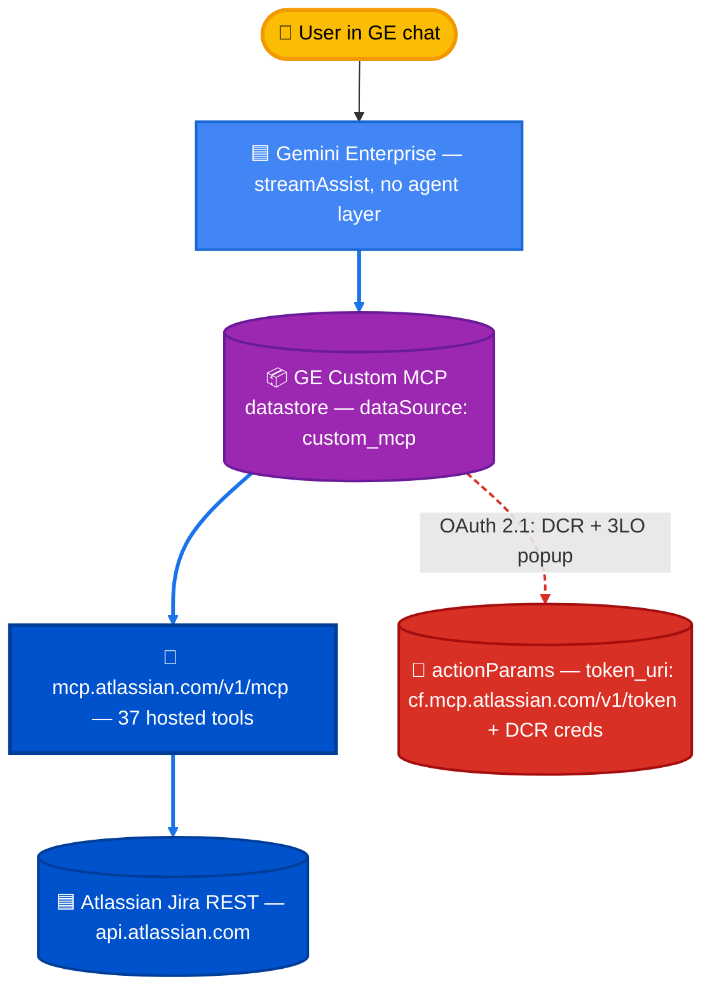

# Option B — Atlassian Remote MCP (hosted)

*Numbers as of 2026-05-27, judge_v6 (gemini-3-flash-preview + Haiku 4.5 escalation), n=172 v2 corpus.*

Connects Atlassian's hosted Remote MCP server (`https://mcp.atlassian.com/v1/mcp`) directly to Gemini Enterprise as a custom MCP datastore. **Zero infrastructure**, 37 pre-built tools, ~15 min to set up.

**v6 eval (172 v2 questions):** **94.5 % accuracy (v6 headline)** — narrowly second behind Option A (94.7 %), and the top option that requires no Cloud Run or Agent Engine. Latency p50 **35.3 s** overall, but with a sharp tail on count-aggregate queries (113–156 s on a 906-issue count) due to GE's sub-planner pagination loop — see [REFERENCE.md §2](../docs/REFERENCE.md#2-latency-breakdown-by-question-category). v1 historical hallucination rate of 68.9 % was an artifact of the legacy single judge; current hallucinated verdict count is 0.

**Good fits:** evaluation baseline, quick prototypes, understanding Atlassian's MCP surface, GE-native deployments where the agent picker is undesirable.

---

## Architecture



**Why the `cf.` subdomain?** The token endpoint must be `https://cf.mcp.atlassian.com/v1/token`. Pointing at the apex `mcp.atlassian.com/v1/token` returns `invalid_client` even with correctly-minted DCR credentials. The `cf.` host is Cloudflare-fronted and is the only endpoint Atlassian's MCP backend actually validates against.

## Two Setup Paths

**Path 1: Console UI (Recommended for most users)**

→ See [`enable_actions_checklist.md`](enable_actions_checklist.md)

Pure console clicks - no scripts, no Docker, no service accounts. Just:
1. Run one curl command for OAuth registration
2. Follow console UI steps to create connector
3. Enable tools in Actions tab

**Path 2: Automation Scripts (For developers)**

Python scripts for API-driven setup. Useful for:
- Automated deployment pipelines
- Creating multiple connectors programmatically
- Infrastructure-as-code workflows

Prerequisites for automation path:
- Python with `google-auth` and `requests`
- Service account with Owner role
- `.env` file configured

## Step 1 — Mint the DCR client

```
python dcr_register.py
```

Posts to `https://cf.mcp.atlassian.com/v1/register` (RFC 7591) with
`redirect_uris=["https://vertexaisearch.cloud.google.com/oauth-redirect"]`.
The response is written to `~/.secrets/atlassian-rovo-dcr-ge.json` (chmod
`0600`). Idempotent: on a second run it prints the existing creds and exits.
Pass `--force` to remint.

> Why DCR and not developer.atlassian.com? The Remote MCP server runs its own
> OAuth 2.1 server with its own client registry. Credentials minted at
> developer.atlassian.com return `invalid_client` against
> `mcp.atlassian.com`. See `~/.claude/projects/.../atlassian_mcp_gemini_enterprise.md`.

## Step 2 — Create the custom MCP datastore

```
python register_datastore.py
# or with a custom collection id:
DATASTORE_ID=jiramcp-rovo-2026-05-07 python register_datastore.py
```

This calls `POST .../locations/global:setUpDataConnector`, which:

1. Creates a fresh **Collection** named `<DATASTORE_ID>` to hold the
   per-MCP singleton DataConnector.
2. Initializes the DataConnector with `dataSource=custom_mcp`,
   `connectorModes=[ACTIONS, FEDERATED]`, full
   `actionConfig.actionParams` (auth_uri, token_uri, scopes, DCR
   client_id/secret, BYO_MCP, agent instructions).
3. Auto-creates an entity datastore named `<DATASTORE_ID>_mcp_data` in
   `default_collection` (because we send `entities: [{entityName:
   "mcp_data"}]`).
4. PATCHes the engine to add the new entity datastore to its
   `dataStoreIds`. **NOTE:** the engine `YOUR_GE_ENGINE_ID` is in
   single-datastore mode and the public DE API refuses both add and swap
   on it (`FAILED_PRECONDITION`). The script reports this clearly; the
   datastore is fully wired regardless. To swap, use the console (Step 3).

The script is idempotent: if the entity datastore already exists, it
prints its info and re-attempts the engine attach.

### Environment variables

| Var | Default | Purpose |
|---|---|---|
| `GE_PROJECT_ID` | `YOUR_PROJECT_ID` | x-goog-user-project header |
| `GE_PROJECT_NUMBER` | `YOUR_PROJECT_NUMBER` | resource path |
| `GE_ENGINE_ID` | `YOUR_GE_ENGINE_ID` | engine to attach to |
| `DATASTORE_ID` | `jiramcp-rovo-<unix-ts>` | per-MCP collection id |
| `COLLECTION_DISPLAY_NAME` | `Jira MCP (Atlassian Rovo)` | console label |
| `SWAP_EXISTING` | unset | if `1`, attempt PATCH that replaces existing dataStoreIds (still subject to single-DS lock) |
| `DCR_FILE` | `~/.secrets/atlassian-rovo-dcr-ge.json` | source of credentials |

### Why the validator rejects `params.instance_uri`

The public DE validator for `dataSource=custom_mcp` accepts only
`params.oauth_access_token`. The actual MCP-aware backend ignores
`params.oauth_access_token` and re-derives `instance_uri` from
`actionParams.instance_uri`. We therefore send a placeholder
`oauth_access_token` and put the real values in `actionConfig.actionParams`.
The post-create connector ends up with `params: {instance_uri: ...}` —
matching the ground-truth shape from the prior session.

## Step 3 — Console-only: enable actions and re-authenticate

Follow [`enable_actions_checklist.md`](./enable_actions_checklist.md). In
short:

1. Console → AI Applications → Engine `your-ge-engine` → Data stores → click the new `mcp_data`.
2. **Actions** tab → **Reload custom actions** → wait → check the tools you want.
3. Click **Enable actions**.
4. **Re-authenticate** dialog → run `python reauth_helper.py` to print the DCR pair → paste into the dialog → Connect.
5. Approve the Atlassian consent popup → pick `yourcompany.atlassian.net` → done.

If the engine is locked to its existing single datastore, also use the
console's **Edit data stores** button on the engine's Data stores tab to
swap the new datastore in. (The console's admin path is more permissive
than the public DE API.)

## Step 4 — Verify

In the GE web console, open the chat surface for engine `your-ge-engine` (no
agent picked) and ask:

```
How many open SOCKCOP issues?
```

Expect a `searchJiraIssuesUsingJql` tool call and a numbered answer list.

You can also smoke-test the datastore from a script via the
`streamAssist` endpoint with `toolsSpec.vertexAiSearchSpec.dataStoreSpecs`
pointing at `<OPTION_B_DATASTORE_ID>_mcp_data`. The
`semiautonomous-agents/atlassian-on-gemini-enterprise/eval/runners/run_option_b.py`
runner (Phase 3 of the comparative eval plan) is built for exactly this.

## Troubleshooting

| Symptom | Cause | Fix |
|---|---|---|
| `invalid_client` in popup | DCR was minted at `auth.atlassian.com` instead of `cf.mcp.atlassian.com` | `python dcr_register.py --force` |
| `widgetListTools` empty after enable | Console not refreshed, or **Reload custom actions** missed | Click **Reload custom actions**, wait 30 s, **Enable actions** again |
| `Jira connector tool is currently unavailable` | Connector still WAITING_FOR_AUTH | Re-open Re-authenticate dialog from Actions tab; complete 3LO popup |
| 403 on Confluence tools | Scopes missing | Verify connector `actionParams.scopes` includes `read:confluence-content.all` and `read:confluence-space.summary`; remint DCR if not |
| `Engines linked to a single data store cannot change their linked data store` | Engine was provisioned single-DS | Swap via console UI (more permissive than public API) or create a fresh multi-DS engine |
| `Data Connector parameters must be one of: oauth_access_token but got: instance_uri` | You removed the placeholder `oauth_access_token` from `params` | Restore it; `params` is for the validator, real config is in `actionParams` |
| LRO returns 404 mid-poll | Some MCP setup ops disappear from the LRO surface | The script auto-tolerates 5x 404 then verifies via GET on the entity datastore |

## Cleanup

Delete the per-MCP collection (which removes its DataConnector and the
auto-created entity datastore in default_collection):

```
TOKEN=$(GOOGLE_APPLICATION_CREDENTIALS=~/.secrets/YOUR_PROJECT_ID-sa.json gcloud auth application-default print-access-token)
curl -X DELETE \
  -H "Authorization: Bearer $TOKEN" \
  -H "x-goog-user-project: YOUR_PROJECT_ID" \
  "https://discoveryengine.googleapis.com/v1alpha/projects/YOUR_PROJECT_NUMBER/locations/global/collections/<OPTION_B_DATASTORE_ID>"
```

Delete the DCR client (Atlassian doesn't expose a deletion endpoint as of
this writing — they expire after disuse). Remove the local file:

```
rm ~/.secrets/atlassian-rovo-dcr-ge.json
```

## Evaluation results — Option B specifically

### v6 headline (172 v2 questions, judge_v6, 2026-05-27)

| Dimension | Score | vs Option A | vs Option C |
|---|---:|---:|---:|
| **Accuracy (v6 headline)** | **94.5 %** | −0.2 pp | +6.6 pp |
| **Hallucinations** *(verdict count)* | 0 / 172 | 0 | 0 |
| Latency p50 / p90 | **35.3 s / 68.6 s** | +10.6 / −3.7 | +6.4 / −22.5 |
| Cost / 1K queries | $0 (hosted) | −$10.20 | −$0.23 |

Under judge_v6 B ties Option A for the top spot — Rovo's 37-tool catalog
plus Claude's citation discipline produces the same answer quality as a
hand-tuned ADK pipeline, with no Cloud Run or Agent Engine to operate.

### Latency caveat — count-aggregate is slow on B

On the 906-issue SMP count question, individual B runs measured
**113–156 s** in the latency investigation (vs ~14 s for Custom MCP / C on
the same question). Root cause is **structural to GE's planner**, not the
Rovo MCP itself: Atlassian's MCP returns ≤100 issues per `searchJiraIssuesUsingJql`
page, and GE's `custom_mcp_agent` sub-planner does **one paginated call per
LLM turn** with a "should I continue?" decision between each — totaling
~10 sequential turns and ~140 s for the 906-issue corpus. Per-category
breakdown and Atlassian-side mitigation (server-side aggregation tool) in
[`../docs/REFERENCE.md §2`](../docs/REFERENCE.md#2-latency-breakdown-by-question-category)
and [`../docs/ATLASSIAN_CALL_2026-05-12.md`](../docs/ATLASSIAN_CALL_2026-05-12.md).

For workloads dominated by **point lookups** (B p50 **10.4 s**),
**refusals** (B p50 **7.9 s** on `prompt-injection`), or **typo
robustness** (B p50 **10.7 s**), B is plenty fast. The pathology is
specific to count-aggregate / multi-project / cross-issue-analysis.

### Mitigations to make Option B production-viable
- Add `mcp_agent_instructions` to the connector telling the model: *"Cite only issue keys explicitly returned by the tool. Never invent keys. If a tool result is empty, say so."*
- Reload custom actions when the tool registry cache expires (every few hours).
- For high-stakes queries, ask twice and compare answers — if the keys differ, both are suspect.
- For count-heavy workloads, route those questions to Option C (custom MCP with `summarizeJiraIssues` server-side aggregation) rather than B.

Full per-question side-by-side comparison vs A/C/D/E/F (plus AL/AG/EG/CG/DG variants): [`../eval/comparison-site/index.html`](../eval/comparison-site/index.html). See also [`../F_vs_B_comparison.md`](../F_vs_B_comparison.md) for the head-to-head against Option F.

---

## Files

| File | Purpose |
|---|---|
| `dcr_register.py` | RFC 7591 DCR mint at `cf.mcp.atlassian.com/v1/register` |
| `register_datastore.py` | DE setUpDataConnector + engine PATCH |
| `reauth_helper.py` | Print DCR pair for the **Re-authenticate** dialog |
| `enable_actions_checklist.md` | Console-only steps |
| `.env.example` | Env template (real `.env` is gitignored) |
| `README.md` | This file |
