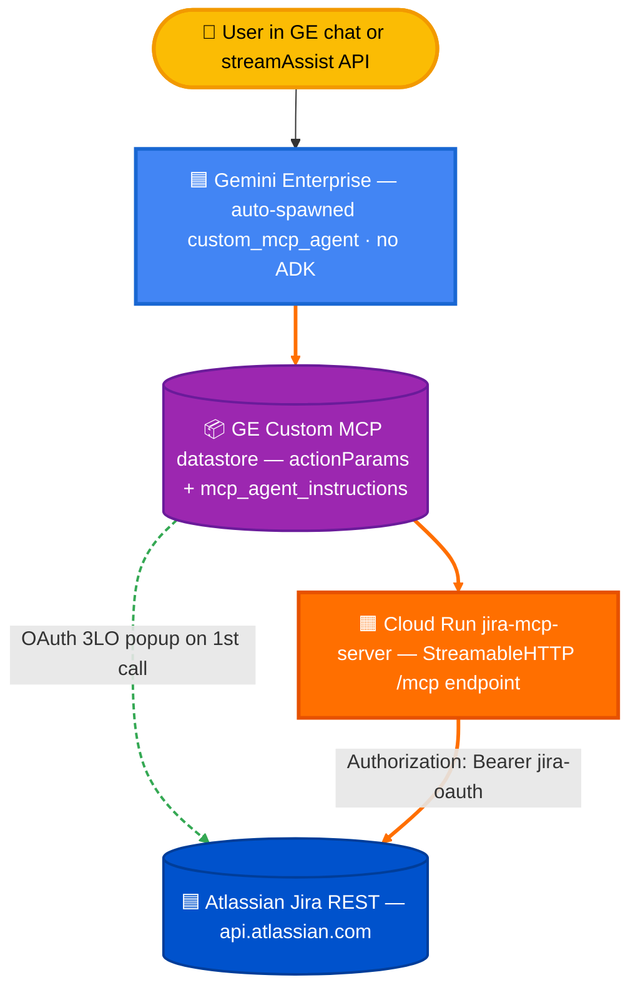

# Option C — Custom MCP Server + GE direct (no ADK, no Agent Engine)

Same Cloud Run MCP server as Option A. No Agent Engine, no ADK agent in front. GE's chat surface (and the `streamAssist` API) calls the MCP directly via the **BYO\_MCP** custom-data-store path. Tools execute silently (no per-call confirmation popup) and answers come back grounded with clickable issue links.

This works **only when the MCP server follows the five-part recipe** in §3. Without it, every tool call triggers a JQL ✓/✗ confirmation dialog and the chat surface becomes unusable.

**Verified end-to-end on 2026-05-19:**
- Chat UI: silent retrieval, clickable `[SMP-XXX](URL)` links, grounded tables
- StreamAssist API: 19-chunk streaming response, zero `actionInvocation`, clean markdown
- 500-question eval: see `eval/runs/<latest>-option-g-full/` and `eval/README.md`

---

## Architecture



Two consumption surfaces, both work:
- **Chat UI**: `console.cloud.google.com/gemini-enterprise/...`
- **API**: `POST .../assistants/default_assistant:streamAssist` — same request shape the chat sends, copyable from browser DevTools. See `eval/runners/run_option_g.py`.

> **The five-part recipe** in §3 is mandatory. Without it every tool call triggers a JQL ✓/✗ confirmation dialog and the chat surface becomes unusable. See the section below for the exact tool annotations, protocol version, and outputSchema requirements.

---

## When to choose Option C vs A or B

| | Option A | **Option C** | Option B |
|---|---|---|---|
| MCP server | Custom (your code) | **Custom (your code)** | Atlassian Rovo (hosted) |
| Front layer | ADK on Agent Engine | **None — direct GE** | None — direct GE |
| Confirmation popup | n/a (agent owns dispatch) | **No (after recipe)** | No |
| Hallucination rate (500-Q eval) | ~1% | 31.2% | 68.9% |
| Pagination depth | 1000+ rows (`before_model_callback`) | ~200 rows (server auto-pages, then LLM compresses) | Single page |
| Cost per 1K queries | ~$0.17 | **~$0.05** | ~$0.03 |
| Custom prompts/formatting | Full | Limited (mcp_agent_instructions only) | None |
| Best for | Production ticketing, complex analysis | **Search/lookup with cost discipline** | Quick prototypes |

Headline trade-off: Option C is **cheap and silent** but the chat assistant LLM (not your code) renders the final answer, so cross-page synthesis and very-long-list rendering are weaker than Option A.

---

## Prerequisites

- Same Cloud Run MCP server from Option A deployed (`option-a-custom-mcp-portal/jira_server/`).
- Atlassian OAuth app at `developer.atlassian.com/console/myapps` — get Client ID and Client Secret.
- A Gemini Enterprise app + engine in the same project.

---

## Step 1 — Deploy the MCP server (reuse Option A's)

```bash
cd ~/vertex-ai-samples/semiautonomous-agents/atlassian-jira-integration/option-a-custom-mcp-portal/jira_server

gcloud run deploy jira-mcp-server \
  --source . \
  --region us-central1 \
  --project YOUR_PROJECT_ID \
  --allow-unauthenticated
```

Note the Service URL (e.g., `https://jira-mcp-server-<project_number>.us-central1.run.app`). **The `/mcp` path is what GE will call.**

`--allow-unauthenticated` is safe because the server validates the per-request `Authorization: Bearer <jira-oauth>` header internally — the GE backend supplies it.

---

## Step 2 — Create the Custom MCP data store in GE

Console → **Gemini Enterprise** → **Apps** → (your app) → **Data stores** → **New data store** → **Custom MCP Server**.

| Field | Value |
|---|---|
| MCP Server URL | `https://jira-mcp-server-<NUM>.us-central1.run.app/mcp` |
| Authorization URL | `https://auth.atlassian.com/authorize` |
| Authorization URL Parameters | `&audience=api.atlassian.com&prompt=consent` |
| Token URL | `https://auth.atlassian.com/oauth/token` |
| Client ID / Client Secret | From your Atlassian developer.atlassian.com app |
| Scopes | `read:jira-work write:jira-work read:jira-user offline_access` |

Click **Continue** → **Login** → approve Atlassian consent → pick your Jira site → popup closes.

**Note:** For *custom* MCP servers, use the standard `auth.atlassian.com` endpoints — NOT the `cf.mcp.atlassian.com` endpoints (those are only valid for Atlassian's hosted Remote MCP, used in Option B).

---

## Step 3 — Enable tools

1. Open the new data store → **Actions** tab.
2. Click **Reload custom actions** (waits ~5s, calls `tools/list`).
3. Check the read tools:
   - `searchJiraIssuesUsingJql`
   - `getJiraIssue`
   - `getVisibleJiraProjects`
   - `summarizeJiraIssues`
   - `getJiraIssuesReport`
   - `getIssueComments`, `getIssueWorklogs`, `getIssueLinks`
   - `search`, `fetch` (canonical retrieval primitives — see §3)
4. Click **Enable actions**.

You will need to come back here and click **Reload custom actions** any time the server's `tools/list` shape changes (new tool, new parameter, changed annotations).

---

## 3. The five-part recipe — what makes GE treat tools as silent search

The popup is suppressed and tools dispatch silently **only when ALL of these are true on the MCP server**. Any one missing and GE falls back to per-call confirmation:

### 1. Serialize the FULL `Tool` object in your StreamableHTTP `/mcp` handler

GE keys its silent-path heuristic on `annotations` + `outputSchema`. A hand-built `{name, description, inputSchema}` dict drops these and produces the popup.

```python
@app.post("/mcp")
async def handle_mcp_jsonrpc(request: Request):
    body = await request.json()
    if body["method"] == "tools/list":
        tools_list = await list_tools()
        return {
            "jsonrpc": "2.0",
            "id": body["id"],
            "result": {
                "tools": [t.model_dump(by_alias=True, exclude_none=True)
                          for t in tools_list]   # ← FULL Tool, not a hand-built dict
            },
        }
```

See `option-a-custom-mcp-portal/jira_server/server.py:489-560`.

### 2. `initialize` returns `protocolVersion: "2025-06-18"`

The MCP spec version that introduced `ToolAnnotations`. Older protocol versions cause GE to ignore them.

```python
if body["method"] == "initialize":
    return {"jsonrpc": "2.0", "id": body["id"], "result": {
        "protocolVersion": "2025-06-18",          # ← critical
        "serverInfo": {"name": "...", "version": "1.0.0"},
        "capabilities": {"tools": {}},
    }}
```

### 3. Each read tool declares `ToolAnnotations`

```python
from mcp.types import Tool, ToolAnnotations

READ_ONLY = ToolAnnotations(
    readOnlyHint=True,
    destructiveHint=False,
    idempotentHint=True,
    openWorldHint=True,   # tool reaches a live external API
)

Tool(name="searchJiraIssuesUsingJql",
     description="...",
     inputSchema={...},
     annotations=READ_ONLY)
```

For **write** tools (`createJiraIssue`, `editJiraIssue`, `transitionJiraIssue`), use a separate annotations object with `readOnlyHint=False, destructiveHint=True` so GE *keeps* the confirmation prompt (which is what you want for writes).

### 4. Each read tool has an `outputSchema`

Signals to the auto-agent that the tool returns structured data, not a side-effect message.

```python
Tool(name="search",
     description="Search by free-text query. Returns SearchResultPage.",
     inputSchema={
         "type": "object",
         "properties": {"query": {"type": "string"}},
         "required": ["query"],
     },
     outputSchema={
         "type": "object",
         "properties": {
             "results": {"type": "array", "items": {
                 "type": "object",
                 "properties": {
                     "id": {"type": "string"},
                     "title": {"type": "string"},
                     "text": {"type": "string"},
                 },
                 "required": ["id", "title", "text"],
             }},
         },
         "required": ["results"],
     },
     annotations=READ_ONLY)
```

### 5. Expose canonical `search(query)` + `fetch(id)` primitives

Even if the chat never directly calls them, their presence flags the whole connector as "retrieval-shaped" to GE's auto-agent — which then dispatches your domain-specific read tools (`searchJiraIssuesUsingJql`, etc.) through the silent path too.

This is the OpenAI / Anthropic deep-research convention. Atlassian's hosted MCP also exposes a generic `search` tool. See `option-a-custom-mcp-portal/jira_server/server.py:181-232`.

### What does NOT work (already tested)

- `additionalProperties.ok_to_display_for_confirmation: false` in `inputSchema` — GE overwrites it.
- Removing the connector from `assistant.enabledActions` / `enabledTools` — popup still fires (the data store attachment drives it, not assistant config).
- `connectorModes: ["FEDERATED"]` only / `bapConfig.enabledActions: []` / `isActionConfigured: false` — kills the popup but ALSO kills tool invocation entirely. Chat returns hallucinated text with no grounding.
- Adding ONLY `ToolAnnotations` without fixing the lossy `/mcp` handler — annotations never leave your box.

---

## 4. Format levers — clickable links, no italic-math glitches

The chat assistant LLM renders the final answer from your tool's text output. Two things to get right:

### 4a. Tool returns pre-formatted markdown link per row

In `tools/call` for `searchJiraIssuesUsingJql`, emit a `KeyLink` field already in markdown form:

```python
res.append(
    f"ISSUE: KeyLink=[{i['key']}](https://yoursite.atlassian.net/browse/{i['key']}) | "
    f"Key={i['key']} | Model={model_val} | Title={title_val} | "
    f"Status={status} | Desc={desc_trunc}"
)
```

Split bracketed Jira summaries (`[Ducati Diavel 1260] Load Cam Rattle`) into separate `Model` and `Title` fields — bare `[...]` in the answer text trips the markdown renderer into italic-math styling.

### 4b. Connector `mcp_agent_instructions` tells the LLM how to render

PATCH the connector's `actionConfig.actionParams.mcp_agent_instructions` with explicit copy-through rules:

```text
The tool response includes pre-formatted 'KeyLink=[SMP-XXX](URL)' fields —
COPY THAT VALUE VERBATIM as the issue identifier. Never strip the markdown
link syntax. Format results as a markdown table with columns: Issue
(KeyLink verbatim), Model, Title, Status, Description. Example row:
| [SMP-875](https://sockcop.atlassian.net/browse/SMP-875) | Ducati Diavel 1260 | Load Cam Rattle | Done | Cam chain rattle reported under load |
```

API to update:

```bash
curl -X PATCH \
  -H "Authorization: Bearer $(gcloud auth print-access-token)" \
  -H "X-Goog-User-Project: YOUR_PROJECT_ID" \
  -H "Content-Type: application/json" \
  -d @instructions.json \
  "https://discoveryengine.googleapis.com/v1alpha/projects/YOUR_PROJECT_NUMBER/locations/global/collections/YOUR_CONNECTOR_COLLECTION/dataConnector?updateMask=actionConfig"
```

No reload needed for instruction-only changes.

---

## 5. Pagination

GE's auto-MCP-agent will NOT loop through `nextPageToken` reliably — even with explicit instructions, the chat assistant LLM caps tool-call iterations. **Move the loop server-side** instead of trying to fix the LLM.

In `tools/call` for `searchJiraIssuesUsingJql`, auto-page internally:

```python
max_results = min(arguments.get("maxResults", 200), 2000)
BATCH = 100
issues = []
cur_token = arguments.get("nextPageToken")
while len(issues) < max_results:
    kwargs = {"limit": min(BATCH, max_results - len(issues)), "fields": "..."}
    if cur_token:
        kwargs["nextPageToken"] = cur_token
    data = jira.enhanced_jql(jql, **kwargs)
    page = data.get("issues", [])
    if not page:
        break
    issues.extend(page)
    cur_token = data.get("nextPageToken")
    if not cur_token:
        break
```

One tool call → up to 2000 issues → one combined response. The chat LLM then renders whatever fits its output budget.

Trade-off: for >200-row tables, the LLM compresses ("here are the top 20 + status counts"). For full row-by-row listing of very large sets, **use Option A** — its `before_model_callback` keeps the prompt linear and the answer complete.

See `option-a-custom-mcp-portal/PAGINATION.md` for the deep dive on why GE BYO_MCP can't replicate Option A's multi-turn pagination loop.

---

## 6. Calling the API directly (`streamAssist`)

Same path as the chat UI, no UI involved. Useful for evals, batch processing, embedded apps.

```python
import httpx, google.auth, google.auth.transport.requests

PROJECT_NUMBER = "254356041555"
ENGINE_ID = "jira-testing_1778158449701"
DATASTORE_ID = "custom-mcp-jira_1779142849168_mcp_data"

creds, _ = google.auth.default(scopes=["https://www.googleapis.com/auth/cloud-platform"])
creds.refresh(google.auth.transport.requests.Request())

url = (
    f"https://discoveryengine.googleapis.com/v1alpha/"
    f"projects/{PROJECT_NUMBER}/locations/global/collections/default_collection/"
    f"engines/{ENGINE_ID}/assistants/default_assistant:streamAssist"
)

body = {
    "query": {"parts": [{"text": "list 5 ducati issues"}]},
    "answerGenerationMode": "NORMAL",
    "toolsSpec": {
        "vertexAiSearchSpec": {
            "dataStoreSpecs": [{
                "dataStore": f"projects/{PROJECT_NUMBER}/locations/global/collections/default_collection/dataStores/{DATASTORE_ID}",
            }],
        },
        "toolRegistry": "default_tool_registry",
        "imageGenerationSpec": {},
        "videoGenerationSpec": {},
    },
    "assistSkippingMode": "REQUEST_ASSIST",
    "languageCode": "en-US",
    "userMetadata": {"timeZone": "America/New_York"},
}

headers = {
    "Authorization": f"Bearer {creds.token}",
    "Content-Type": "application/json",
    "x-goog-user-project": "YOUR_PROJECT_ID",
}

resp = httpx.post(url, headers=headers, json=body, timeout=180)
chunks = resp.json()  # list of streaming chunks
for c in chunks:
    for reply in c.get("answer", {}).get("replies", []):
        text = reply.get("groundedContent", {}).get("content", {}).get("text")
        if text:
            print(text, end="")
```

**Auth gotcha**: the calling identity must be the one that completed the OAuth 3LO in Step 2 (otherwise GE has no Jira refresh token bound to it and the MCP returns auth errors). On GCE the default ADC is the compute SA — set `GCLOUD_ACCOUNT=admin@yourcompany.com` and use `gcloud auth print-access-token --account "$GCLOUD_ACCOUNT"` instead of `google.auth.default()`. See `eval/runners/_common.py:46-66`.

Full request shape is non-negotiable — copy it from the GE Console's browser DevTools network tab. Don't trust the v1alpha schema docs; field names diverge.

---

## 7. Evaluation results — Option C specifically

500-question Claude-Opus-judged eval, 2026-05-19. Full writeup in [FINDINGS.md](./FINDINGS.md).

| Dimension | Score | vs Option A | vs Option B |
|---|---:|---:|---:|
| Composite accuracy | **47.7 %** *(56.9 % refusal-credited)* | −47 pp | −39 pp |
| **Hallucination rate** *(lower is better)* | **31.2 %** | +30 pp (worse than expected) | −38 pp (better) |
| Citation accuracy | high *(KeyLink in 318/500 answers)* | ≈ A | ≫ B |
| Refusal correctness | **96 %** *(refusal-test 92 %, prompt-injection 92 %)* | ≈ A | ≫ B |
| JQL correctness | not directly measured *(GE planner abstracts JQL)* | — | — |
| Pagination | 92 % on `pagination-required` *(server auto-pages, GE LLM compresses)* | weaker than A | better than B |
| Latency p50 | **29 s** | +5 s | +20 s |
| **Cost / 1K requests** | **$0.05** ⭐ | −$0.12 (70 % savings) | — |

**Where Option C wins (≥92 %):** `lookup`, `count-aggregate`, `pagination-required`, `typo-robustness`, `golden-anti-regression`, `refusal-test`, `prompt-injection`. Anything single-tool or safety-related — strong.

**Where Option C loses (≤32 %):** `multi-step` (0 %), `comments-worklogs` (0 %), `cross-issue-analysis` (8 %), `pii-sensitive` (8 %), `root-cause-synthesis` (12 %), `tool-efficiency` (32 %), `ambiguous` (36 %). Anything requiring multi-tool chaining or cross-page synthesis — weak. **This is the architectural ceiling** — GE's auto-MCP-agent owns the tool loop and doesn't have ADK's `before_model_callback` to stay coherent across long sequences.

**Why hallucination didn't land at A's ~1 %:** the hallucinations aren't web-search fallbacks (disabled). They're the LLM inventing plausible-looking issue keys when the tool returns ambiguous/empty data on multi-step questions where the planner gave up. The system prompt added in `assistant.generationConfig.systemInstruction` (see §4.3) reduces this but doesn't eliminate it. Bringing hallucination down to A's ~1 % needs the ADK agent owning the tool loop, not better prompts.

### How the eval runner works (eval Option G)

`eval/runners/run_option_g.py` runs the same 500 questions through this path:
- streamAssist endpoint (not Agent Engine)
- `toolsSpec.vertexAiSearchSpec.dataStoreSpecs` → `custom-mcp-jira_<ID>_mcp_data`
- `GCLOUD_ACCOUNT` env var binds the request to an OAuth'd user identity
- Resumable JSONL append, judged by Claude Opus on the same 10 dimensions as A and B

```bash
cd eval
GCLOUD_ACCOUNT=admin@yourcompany.com \
  ./.venv/bin/python -m runners.orchestrator \
    --questions questions/main.json \
    --only g \
    --out runs/$(date +%Y%m%d-%H%M%S)-option-g-full \
    --concurrency 6
```

Methodology + judging + report rendering: [`../eval/README.md`](../eval/README.md). Interactive 5-option side-by-side report: [`../eval/comparison-site/index.html`](../eval/comparison-site/index.html).

---

## 8. Cost comparison

| | Option A | **Option C** |
|---|---|---|
| Agent Engine | ~$0.10/1K | $0 |
| ADK API calls | ~$0.02/1K | $0 |
| Cloud Run | ~$0.05/1K | ~$0.05/1K |
| GE streamAssist | included | included |
| **Total** | **~$0.17/1K** | **~$0.05/1K** |

~70% cost reduction by dropping the Agent Engine layer.

---

## 9. Cleanup

Delete the custom MCP data store from the GE Console (Data stores → click → Delete). The Cloud Run service stays — shared with Option A.

If you want to wipe everything:
```bash
gcloud run services delete jira-mcp-server --region us-central1 --project YOUR_PROJECT_ID
```

---

## Files

| Path | Purpose |
|---|---|
| `option-a-custom-mcp-portal/jira_server/server.py` | MCP server (shared with Option A; Option C is server-config + no-ADK consumption) |
| `option-a-custom-mcp-portal/jira_server/Dockerfile` | Cloud Run container |
| `eval/runners/run_option_g.py` | streamAssist + custom MCP eval runner |
| `eval/.env` | `OPTION_G_DATASTORE_ID=custom-mcp-jira_<ID>_mcp_data` |

## Related

- **Option A** (`../option-a-custom-mcp-portal/`) — same server + ADK on Agent Engine, full prompt control, deep pagination
- **Option B** (`../option-b-direct-remote-mcp/`) — Atlassian hosted Remote MCP via BYO_MCP path (no custom server, but high hallucination rate)
- `../docs/REFERENCE.md` — schema dumps, planner diagnostics, what's stored where
- Memory: `~/.claude/projects/.../memory/ge_custom_mcp_confirmation_fix.md` — the five-part recipe + what does NOT work
