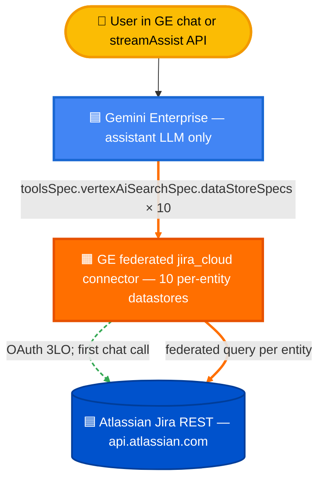

# Option D — Federated Jira Cloud connector (GE-managed, no MCP)

Use Gemini Enterprise's built-in `jira_cloud` *federated* connector (data source: `jira`). No Cloud Run, no Agent Engine, no custom MCP — GE handles auth, indexing-free federation against Jira's REST API, citation extraction, and answer synthesis. Setup is a 5-minute wizard in the GE console.

**Verified end-to-end on 2026-05-19:**
- Chat UI: clickable `[SMP-XXX](URL)` links, grounded answers, `groundingChunks` cite the right per-entity datastore
- StreamAssist API: same payload shape as B/C but `dataStoreSpecs` points at the 10 per-entity federated datastores
- 500-question eval: see [`FINDINGS.md`](./FINDINGS.md) and `eval/runs/<latest>-option-h-full/`

---

## Architecture



Two consumption surfaces, both work:
- **Chat UI**: `console.cloud.google.com/gemini-enterprise/...`
- **API**: `POST .../assistants/default_assistant:streamAssist` — copy the body shape from the GE Console DevTools network tab. See `eval/runners/run_option_h.py`.

No Cloud Run, no ADK, no Agent Engine. The whole connector is GE-managed; you only configure OAuth and pick the engine.

---

## When to choose Option D vs the others

| | Option A | Option C | **Option D** | Option B |
|---|---|---|---|---|
| Connector | Custom Cloud Run MCP | Custom Cloud Run MCP | **GE federated `jira_cloud`** | Atlassian Remote MCP |
| Front layer | ADK on Agent Engine | None — direct GE | **None — direct GE** | None — direct GE |
| Infrastructure you run | Cloud Run + Agent Engine | Cloud Run | **None** | None |
| Setup time | ~45 min | ~30 min | **~5 min** | ~15 min |
| Cost / 1K queries | $0.17 | $0.05 | **$0** (GE included) | $0 (hosted MCP) |
| Best for | Production ticketing, complex analysis | Cost-disciplined search/lookup | **Fast time-to-demo · GE-native users** | Quick prototypes |

Headline trade-off: Option D is the **cheapest and fastest to set up**, but federation has architectural ceilings that hosted MCP and custom MCP don't: count-aggregate is capped by the sample size GE pulls per federated query (50 by default), and entity types that Jira doesn't expose as first-class indexed documents (comments, worklogs) return empty or hallucinated answers.

Detailed comparison: [`FINDINGS.md`](./FINDINGS.md).

---

## Prerequisites

- A GCP project with Gemini Enterprise enabled and an engine created (e.g. `jira-testing_<TS>`).
- An Atlassian Cloud site (e.g. `sockcop.atlassian.net`) with **admin** access to install the connector and approve OAuth scopes.
- An Atlassian developer-console app (`developer.atlassian.com/console/myapps`) — Client ID + Client Secret — if you want to BYO the OAuth client. Otherwise the connector wizard creates one for you.

---

## Step 1 — Add the granular OAuth scopes

> **The single biggest gotcha**. Without these, the federated connector returns **zero hits** on every query with no helpful error — just "I found no matching issues" for issues that demonstrably exist.

The federated `jira_cloud` connector uses Atlassian's **granular** OAuth scopes (not the classic `read:jira-work` / `read:jira-user` aggregate scopes Option A/B/C use). They look the same in the consent screen but are checked differently by Atlassian's API gateway.

In your Atlassian app (`developer.atlassian.com/console/myapps/<app-id>/permissions` → **Jira API** → **Add**), add these granular scopes:

| Scope | Why |
|---|---|
| `read:user:jira` | Resolve assignee / reporter accountIds to display names |
| `read:issue:jira` | Read Issue, IssueType, Resolution |
| `read:issue-meta:jira` | Field metadata |
| `read:issue-link:jira` | Issue links (blocks, depends-on) |
| `read:issue-link-type:jira` | Issue link type names |
| `read:issue-details:jira` | Custom fields, watchers, votes |
| `read:project:jira` | Project list + per-project metadata |
| `read:project-category:jira` | Project category names |
| `read:project-version:jira` | fixVersions / affectsVersions |
| `read:project.component:jira` | Components list |
| `read:comment:jira` | Issue comments |
| `read:worklog:jira` | Issue worklogs |
| `read:attachment:jira` | Attachment metadata |
| `read:board-scope:jira-software` | Boards |

After saving, **re-authenticate the connector** (see Step 4) — Atlassian does NOT auto-refresh scopes on an existing refresh token.

**Symptoms when scopes are missing**: connector returns `200 OK` on `jira.googleapis.com` discovery, the assistant says `"I found no matching issues for SMP-912"` for issues that 100% exist. No 403, no helpful retry hint. Took ~3 hours to diagnose the first time.

---

## Step 2 — Open the GE federated-search wizard

GE Console → **Apps** → (your app) → **Data stores** → **+ New data store** → **Federated search** → **Jira Cloud**.

The wizard panels:

1. **Connector name** — auto-generated like `jira-fed-connector_<unix-ms>`. Note this — you'll need the **prefix** later.
2. **Atlassian site URL** — `https://yoursite.atlassian.net`.
3. **OAuth client** — paste Client ID / Client Secret from your Atlassian app (or let GE create one).
4. **Scopes** — pre-filled by Google; verify your app exposes all the granular scopes from Step 1.
5. **Continue** → consent screen pops up → **Allow** all scopes → wizard closes.

GE creates **10 per-entity data stores** under the hood, all sharing the same connector instance:

| Datastore ID suffix | Entity |
|---|---|
| `_issue` | Issue (generic) |
| `_bug`, `_story`, `_task`, `_epic` | Per-issue-type indexes |
| `_project` | Project metadata |
| `_comment` | Comments |
| `_worklog` | Worklogs |
| `_attachment` | Attachment metadata |
| `_board` | Boards (Jira Software only) |

You'll see them all in **Data stores** list with the same base prefix (`jira-fed-connector_<TS>_*`).

---

## Step 3 — Attach the connector to your engine

Console → **Apps** → (your app) → **Data stores** tab → **Attach data store** → check ALL 10 federated datastores → **Attach**.

> **Critical gotcha #2 — you must attach ALL 10, not just `_issue`**. If you only attach `_issue`, the assistant cannot answer questions about projects, comments, worklogs, or boards — and silently returns "no matching issues" instead of admitting it didn't search those entities.

---

## Step 4 — Re-authenticate after any scope change

Atlassian's OAuth refresh tokens **do not pick up new scopes** added after the original consent. After Step 1, you MUST re-consent:

1. GE Console → **Data stores** → click any of the `jira-fed-connector_*` datastores
2. **Authentication** tab → **Re-authenticate**
3. Consent screen pops up → verify the NEW granular scopes are listed → **Allow**

If you skip this, the connector keeps using the old token (with the old scopes) — and federated queries against entities the old token couldn't reach return empty. The chat UI gives no warning.

---

## Step 5 — Validate with a smoke test

Three queries to run in the GE chat UI:

| Query | Expected | If wrong |
|---|---|---|
| `What is SMP-912?` | Issue title + status + clickable link | Scopes missing or attach incomplete (Step 1, Step 3) |
| `list 5 ducati issues` | 5 rows with `[KEY](URL)` | OK |
| `how many issues in SMP?` | A count (note: federated caps at ~50 sample size — see Findings §3) | OK if it returns *some* number, even if wrong |

---

## Step 6 — Call the API directly (`streamAssist`)

Same wire shape as Options B/C, but `dataStoreSpecs` must list **all 10 federated datastores**:

```python
import httpx, google.auth, google.auth.transport.requests

PROJECT_NUMBER = "254356041555"
ENGINE_ID      = "jira-testing_1778158449701"
FED_PREFIX     = "jira-fed-connector_1779221270798"  # ← your connector's base
ENTITIES = ["issue", "project", "comment", "bug", "epic", "story",
            "task", "worklog", "board", "attachment"]

creds, _ = google.auth.default(scopes=["https://www.googleapis.com/auth/cloud-platform"])
creds.refresh(google.auth.transport.requests.Request())

url = (f"https://discoveryengine.googleapis.com/v1alpha/"
       f"projects/{PROJECT_NUMBER}/locations/global/"
       f"collections/default_collection/engines/{ENGINE_ID}/"
       f"assistants/default_assistant:streamAssist")

specs = [
    {"dataStore": f"projects/{PROJECT_NUMBER}/locations/global/collections/"
                  f"default_collection/dataStores/{FED_PREFIX}_{e}"}
    for e in ENTITIES
]

body = {
    "query": {"parts": [{"text": "list 5 ducati issues"}]},
    "answerGenerationMode": "NORMAL",
    "toolsSpec": {
        "vertexAiSearchSpec": {"dataStoreSpecs": specs},   # ← all 10 entities
        "toolRegistry": "default_tool_registry",
        "imageGenerationSpec": {},
        "videoGenerationSpec": {},
    },
    "assistSkippingMode": "REQUEST_ASSIST",
    "languageCode": "en-US",
    "userMetadata": {"timeZone": "America/New_York"},
}

headers = {
    "Authorization":     f"Bearer {creds.token}",
    "Content-Type":      "application/json",
    "x-goog-user-project": "YOUR_PROJECT_ID",
}

resp = httpx.post(url, headers=headers, json=body, timeout=180)
chunks = resp.json()
for c in chunks:
    for reply in c.get("answer", {}).get("replies", []):
        text = reply.get("groundedContent", {}).get("content", {}).get("text")
        if text:
            print(text, end="")
```

> **Critical gotcha #3 — pointing `dataStoreSpecs` at only `_issue` returns zero hits for many questions** because Jira data is split across entity types. A "what comments does BUGS-97 have?" question needs `_comment`; "what board is OPS in?" needs `_board`. Skip an entity → silent zero results.

**Auth gotcha**: the calling identity must match the OAuth user who completed the wizard in Step 2 (otherwise the connector has no Jira refresh token bound to it). On GCE the default ADC is the compute SA — set `GCLOUD_ACCOUNT=admin@yourcompany.com` and use `gcloud auth print-access-token --account "$GCLOUD_ACCOUNT"`. See `eval/runners/_common.py:46-66`.

---

## Step 7 — (Optional) Add a system instruction

Federated `jira_cloud` has no `mcp_agent_instructions` field — but you CAN tighten the assistant's behavior globally via `assistant.generationConfig.systemInstruction`. Useful for: refusal rules on destructive actions (the federated connector doesn't have an auto-MCP-agent layer enforcing safety), citation discipline, output format.

```bash
curl -X PATCH \
  -H "Authorization: Bearer $(gcloud auth print-access-token)" \
  -H "X-Goog-User-Project: YOUR_PROJECT_ID" \
  -H "Content-Type: application/json" \
  -d '{"generationConfig":{"systemInstruction":{"parts":[{"text":"You are a read-only Jira assistant. Never claim to take destructive actions; refuse politely. Always cite [KEY](URL). Refuse PII requests."}]}}}' \
  "https://discoveryengine.googleapis.com/v1alpha/projects/YOUR_PROJECT_NUMBER/locations/global/collections/default_collection/engines/YOUR_ENGINE_ID/assistants/default_assistant?updateMask=generationConfig"
```

Without this, the **only safety guardrail is the model's default behavior** — see `FINDINGS.md` for refusal-test scores.

---

## What does NOT work (already tested)

| Lever tried | Result |
|---|---|
| Classic aggregate scopes (`read:jira-work`, `read:jira-user`) | Federated returns 0 hits silently — must use granular scopes (Step 1) |
| Attach only `_issue` datastore | Loses comments/worklogs/board/component questions; chat says "no matches" |
| Skip the re-consent step after adding scopes | Refresh token stays at old scope set; federation still returns 0 |
| `connectorModes: ["FEDERATED"]` only without scopes | Symptomatically identical to no connector at all |
| Setting `dataStoreSpecs[].filter` to narrow results | Filters are entity-specific; `key = SMP-912` works on `_issue` but errors on `_comment` |

---

## Files

| Path | Purpose |
|---|---|
| `eval/runners/run_option_h.py` | streamAssist + federated `jira_cloud` eval runner; constructs the 10 `dataStoreSpecs` from `OPTION_H_DATASTORE_ID` (comma-separated) |
| `eval/.env` | `OPTION_H_DATASTORE_ID=jira-fed-connector_<TS>_issue,..._project,..._comment,...` (all 10) |
| `FINDINGS.md` | 500-question eval results, per-bucket + per-category, vs Options A/B/C/E |

---

## Related

- **Option A** (`../option-a-custom-mcp-portal/`) — custom MCP + ADK; highest accuracy, highest setup cost.
- **Option B** (`../option-b-direct-remote-mcp/`) — Atlassian's hosted Remote MCP; same idea as D but uses MCP not federation.
- **Option C** (`../option-c-custom-mcp-direct/`) — custom MCP via BYO_MCP; you own the tool surface but skip the agent.
- **Option E** (`../option-e-adk-wrapped-in-mcp/`) — ADK exposed as an MCP server.
- Memory: `~/.claude/projects/.../memory/streamassist_request_shape.md` — the shared streamAssist body shape.
