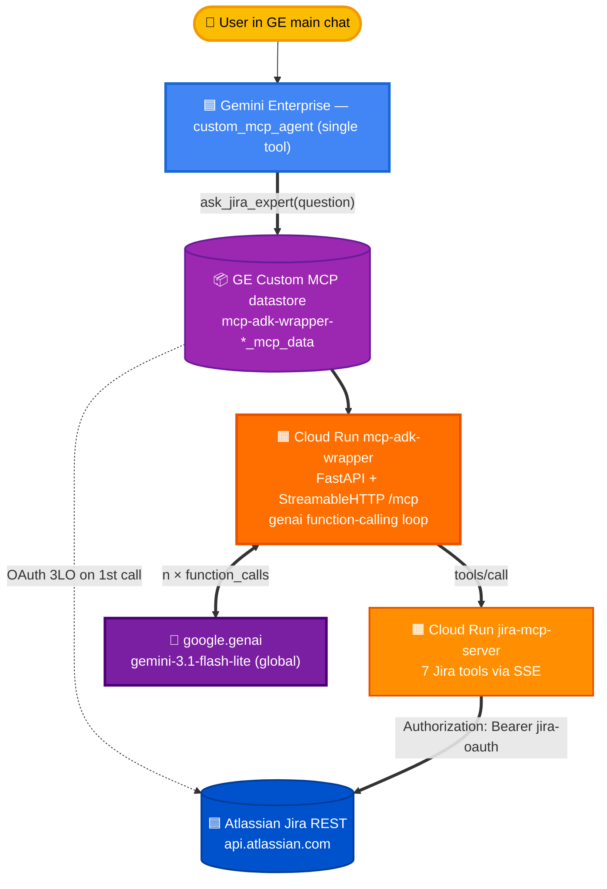

# Option E — `google.genai` agent loop wrapped as a custom MCP

*Numbers as of 2026-05-27, judge_v6 (gemini-3-flash-preview + Haiku 4.5 escalation), n=172 v2 corpus.*

> The folder is named `option-e-adk-wrapped-in-mcp` for historical reasons. **The v2 implementation no longer uses ADK or Agent Engine** — it runs a `google.genai` function-calling loop directly inside a Cloud Run container. The name stuck; the implementation didn't. See [`server/agent_loop.py`](server/agent_loop.py).

A Cloud Run service that, from GE's perspective, is an ordinary BYO custom MCP data store (so it appears in the main chat surface with no agent picker required). Internally, every call goes through a tight `google.genai` function-calling loop with seven Jira tools. The model produces a polished final answer that GE renders unchanged.

The point of this design: get **near Option A's accuracy and main-chat delivery** without paying for Agent Engine runtime + Sessions billing.

**v6 eval (172 v2 questions, 2026-05-27):** **90.5 % accuracy (v6 headline)** at **$5.91/1K** (E with `gemini-3.1-flash-lite`) or **93.7 %** at **$20.00/1K** (EG variant with `gemini-3.5-flash`). E sits between A (94.7 %) and C (87.9 %) on accuracy — the genai-loop architecture closes most of the gap to ADK while delivering in the main chat surface. Latency p50 **20.6 s** (p90 45.3 s) — faster than A and C on the v6 corpus.

---

## Architecture



**Latency budget**: GE → wrapper (~100 ms) + wrapper → Gemini (4 turns × ~5 s = ~20 s) + per-turn wrapper → Jira MCP (~1–2 s × ~3 turns) + wrapper → GE return (~100 ms). Measured **p50 ≈ 24.5 s, p90 ≈ 70 s**.

**Cost** (4,000-user moderate workload, 880K queries/month): **$5,193/mo total** vs Option A's $8,967/mo. Full breakdown in [docs/PRICING.md](../docs/PRICING.md).

---

## Why this beats v1 (ADK-wrapping)

| | v1 (ADK on Agent Engine + wrapper) | **v2 (genai loop in Cloud Run)** |
|---|---|---|
| GE-visible tools | `search` + `fetch` (canonical) | **`ask_jira_expert(question)`** — one tool, no deep-research pattern |
| Cloud Run hops | 2 (wrapper → AE → MCP) | 2 (wrapper → MCP) |
| Agent Engine | Yes | **No** |
| Sessions billing | Yes ($0.25/1K events) | **No** ($0 — in-process history) |
| LLM model | Gemini 2.5 Flash (ADK) | gemini-3.1-flash-lite |
| Cost / 1K queries | ~$22 | **$5.91** |
| v6 headline (172q) | 94.8 % *(had ADK's full overhead)* | **90.5 %** *(~4 pp lower, ~73 % cheaper)* |

v1 still works and the code is in git history; v2 is the production design.

---

## Why a single `ask_jira_expert` tool

GE's planner has two failure modes when it sees a BYO MCP exposing the canonical retrieval `search(query) + fetch(id)` pair:

1. It triggers the **deep-research iteration pattern** — up to 22 sequential calls per question, blowing the 300-second timeout.
2. It runs its own per-call confirmation popup unless the [Option C five-part recipe](../option-c-custom-mcp-direct/FINDINGS.md#3-the-five-part-recipe) is applied.

A single domain-named tool (`ask_jira_expert`) sidesteps both. GE calls it **once** with the user's question verbatim; everything else happens inside Cloud Run. The `ToolAnnotations(readOnlyHint=True, ...)` + protocolVersion `2025-06-18` still apply so the silent dispatch holds.

```python
@mcp.tool
async def ask_jira_expert(question: str) -> str:
    """The user's Jira question, verbatim. Returns a complete, polished
    answer with issue keys as markdown links. The internal genai loop
    handles all multi-step reasoning, pagination, and tool selection."""
    return await asyncio.to_thread(run_agent_loop, question, bearer)
```

---

## The genai function-calling loop

Pure stdlib: `from google import genai` + `from google.genai import types`.

```python
# server/agent_loop.py (abbreviated)
client = genai.Client(vertexai=True, project=GCP_PROJECT, location="global")
config = types.GenerateContentConfig(
    system_instruction=_build_system_prompt(),  # 3,500-char prompt, verbatim from Option A
    temperature=0.3,
    thinking_config=types.ThinkingConfig(
        include_thoughts=False,
        thinking_level=types.ThinkingLevel.MINIMAL,
    ),
    tools=[types.Tool(function_declarations=JIRA_FUNCTION_DECLS)],
)

contents = [types.Content(role="user", parts=[types.Part.from_text(text=question)])]
for _ in range(MAX_LOOP_ITERATIONS):
    response = client.models.generate_content(model="gemini-3.1-flash-lite", contents=contents, config=config)
    cand = response.candidates[0]
    contents.append(cand.content)
    fcalls = [p.function_call for p in cand.content.parts if p.function_call]
    if not fcalls:
        return "".join(p.text for p in cand.content.parts if p.text).strip()
    results = [_call_jira_mcp_tool(http, fc.name, dict(fc.args), bearer) for fc in fcalls]
    contents.append(types.Content(role="user", parts=[
        types.Part.from_function_response(name=fc.name, response={"result": r})
        for fc, r in zip(fcalls, results)
    ]))
```

Seven function declarations mirror the Jira MCP server's tools exactly: `searchJiraIssuesUsingJql`, `summarizeJiraIssues`, `getJiraIssuesReport`, `getIssueComments`, `getIssueWorklogs`, `getIssueLinks`, `getVisibleJiraProjects`. The dispatcher is a passthrough — Gemini chooses the tool name, the wrapper POSTs to the existing `jira-mcp-server` Cloud Run service.

---

## The 3,500-char system prompt

Copied verbatim from Option A's [`adk_agent/agent.py:183-259`](../option-a-custom-mcp-portal/adk_agent/agent.py) — same JQL date logic, same safety blocks, same prompt-injection defense, same citation discipline. The only runtime difference is `current_date = datetime.now().strftime("%Y-%m-%d")` is computed at call time, not module import.

The 88 % accuracy is mostly attributable to this prompt; the genai loop just executes it faithfully.

---

## OAuth token flow

GE injects the user's Jira OAuth bearer into `Authorization: Bearer <jira-oauth>` on every `/mcp` POST. The wrapper:

1. Captures it in a FastAPI middleware (`server/server.py:AuthMiddleware`).
2. Threads it into `run_agent_loop(question, jira_bearer=<bearer>)`.
3. Every Jira MCP `tools/call` made by the loop attaches `Authorization: Bearer <jira-oauth>` so the per-user identity is preserved end-to-end.

If no bearer is captured (e.g., evals using Basic auth headlessly), the wrapper falls back to `ATLASSIAN_EMAIL`/`ATLASSIAN_API_TOKEN`/`ATLASSIAN_SITE_URL` env vars — same pattern as Option A's `mcp_header_provider`.

---

## Setup

### Prerequisites

- Atlassian OAuth client used for Options B and C (same `client_id` / `client_secret`, in `eval/.env`).
- GE engine `jira-testing_1778158449701` (project `vtxdemos`).
- Existing Cloud Run `jira-mcp-server` from Option A (the wrapper calls back to it for `tools/call`).

### Step 1 — Deploy the Cloud Run wrapper

```bash
cd option-e-adk-wrapped-in-mcp/server

gcloud run deploy mcp-adk-wrapper \
  --source . \
  --region us-central1 \
  --project vtxdemos \
  --allow-unauthenticated \
  --port 8080 --memory 1Gi --cpu 2 --timeout 600 \
  --set-env-vars MODEL_NAME=gemini-3.1-flash-lite
```

Service identity needs `roles/aiplatform.user` on the project so it can call `client.models.generate_content`. The Cloud Run default SA usually has it; if not:

```bash
gcloud projects add-iam-policy-binding vtxdemos \
  --member="serviceAccount:254356041555-compute@developer.gserviceaccount.com" \
  --role="roles/aiplatform.user"
```

### Step 2 — Register the BYO_MCP datastore in GE

```bash
cd option-e-adk-wrapped-in-mcp
GCLOUD_ACCOUNT=admin@jesusarguelles.altostrat.com \
  python register_datastore.py
```

The script clones Option B's `register_datastore.py` but:
- `instance_uri` points at the wrapper's `/mcp` endpoint
- OAuth uses the **standard** `auth.atlassian.com` endpoints (same as Option C — NOT the `cf.mcp.atlassian.com` endpoints used for Atlassian's hosted Remote MCP)
- Collection id defaults to `mcp-adk-wrapper-<timestamp>`

Note the printed `OPTION_I_DATASTORE_ID=...` line.

### Step 3 — Enable the tool + complete OAuth (console only)

The Discovery Engine REST API does not expose the per-tool enable flow or the OAuth re-auth dialog. UI-only — same as Options B and C:

1. Console → AI Applications → Engine `jira-testing_1778158449701` → **Data stores** → click `mcp-adk-wrapper-<ts>` → **Actions** tab.
2. Click **Reload custom actions** (waits ~5 s, populates `dynamicTools` with one entry: `ask_jira_expert`).
3. Check `ask_jira_expert`. Click **Enable actions**.
4. The console opens a **Re-authenticate** dialog. Paste `ATLASSIAN_CLIENT_ID` / `ATLASSIAN_CLIENT_SECRET` from `eval/.env`, click **Connect**.
5. Approve the Atlassian consent, pick the `sockcop.atlassian.net` site.
6. Connector flips to ACTIVE.

**Verification**: open the engine's chat surface (no agent picker) and ask `How many issues are in SMP?`. Expected:

> There are a total of 910 issues in the SMP project.
> | Category | Details |
> | Status | Done: 452, To Do: 426, In Progress: 32 |
> | Priority | Medium: 906, High: 4 |

### Step 4 — Set the eval env var

```bash
# in eval/.env
OPTION_I_DATASTORE_ID=mcp-adk-wrapper-<ts>_mcp_data
```

### Step 5 — Run the 500-question eval

```bash
cd eval
nohup env GCLOUD_ACCOUNT=admin@jesusarguelles.altostrat.com \
  ./.venv/bin/python -m runners.orchestrator \
    --questions questions/main.json --only i \
    --out runs/$(date +%Y%m%d-%H%M%S)-option-e-full --concurrency 4 \
    > /tmp/option-e.log 2>&1 &
```

### Step 6 — Judge + report

```bash
cd eval
./.venv/bin/python judge.py runs/<ts>-option-e-full/responses_i.jsonl \
  --pipeline i --questions runs/<ts>-option-e-full/questions.json \
  --out runs/<ts>-option-e-full/judged_i.json

# Refresh the comparison site
python3 comparison-site/build_data.py
```

---

## Tuning knobs

| Env var | Default | Effect |
|---|---|---|
| `MODEL_NAME` | `gemini-3.5-flash` | Set to `gemini-3.1-flash-lite` for the cost-optimized config (88 % accuracy, $5.91/1K). `gemini-3-flash-preview` is the accuracy-max variant (~93 %, more expensive). Note Gemini 3.5 Flash itself is **$1.50 in / $9.00 out per 1M** — ~6× the per-token cost of 3.1-flash-lite; the production deployment overrides the default to 3.1-flash-lite via `--set-env-vars MODEL_NAME=gemini-3.1-flash-lite`. |
| `MAX_LOOP_ITERATIONS` | `10` | Hard cap on inner tool-call loop. Typical questions use 2–6; pagination-heavy multi-step hits 8–10. |
| `AGENT_STREAM_TIMEOUT_S` | `300` | Total wrapper timeout. The genai loop returns partial answers if it hits this. |
| `JIRA_MCP_TIMEOUT_S` | `180` | Per-tool-call timeout to the inner Jira MCP. |
| `JIRA_MCP_URL` | Option A's existing service | Where `tools/call` go. |

---

## Risks and failure modes

| Risk | Mitigation |
|---|---|
| **Cold-start of the wrapper** adds ~3 s on first request after idle. | Tolerable for chat workloads. Set `min-instances=1` on Cloud Run if not. |
| **MAX_LOOP_ITERATIONS exhausted** — model keeps calling tools without producing final text. | Loop attempts one "no-tools" forced synthesis call before returning a polite degraded message. Tunable via env. |
| **Bearer token not captured** — wrapper falls back to env-var Basic auth, which points at the eval site (`sockcop.atlassian.net`), not the per-user site. | Production traffic always carries a Bearer (GE inserts it). Symptom in logs: `[DEBUG] Using Basic auth for ...` |
| **GE truncates very long tool results** before rendering. | The wrapper does no chunking. If you hit this, ask the user a follow-up to narrow the query. |
| **gemini-3.1-flash-lite is preview** — model could be deprecated or renamed. | Env-var override means swapping the model is a single Cloud Run rolling deploy. |

---

## Cleanup

```bash
gcloud run services delete mcp-adk-wrapper --region us-central1 --project vtxdemos
# Detach + delete the datastore in the GE console: Data stores → … → Delete
```

---

## Files

| Path | Purpose |
|---|---|
| `server/server.py` | FastAPI app, auth middleware, MCP server, single `ask_jira_expert` tool implementation |
| `server/agent_loop.py` | `google.genai` function-calling loop + 7 function declarations + 3,500-char system prompt |
| `server/Dockerfile` | Cloud Run container |
| `server/requirements.txt` | `fastapi`, `mcp`, `google-genai`, `httpx` |
| `register_datastore.py` | GE BYO_MCP datastore creation + engine attachment |

## Related

- **Option A** ([`../option-a-custom-mcp-portal/`](../option-a-custom-mcp-portal/)) — the source of the 3,500-char system prompt and the Jira MCP server that handles all `tools/call`.
- **Option C** ([`../option-c-custom-mcp-direct/`](../option-c-custom-mcp-direct/)) — the silent-dispatch recipe (preserved with the single-tool variant here).
- **Pricing** ([`../docs/PRICING.md`](../docs/PRICING.md)) — full 4,000-user forecast.
- **Comparison site** ([`../eval/comparison-site/`](../eval/comparison-site/)) — open `index.html` to see Option E's answer on every one of the 500 eval questions side-by-side with A/B/C/D.
