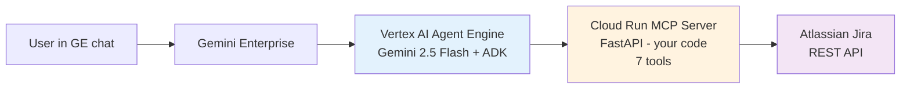
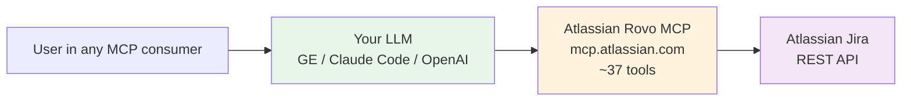
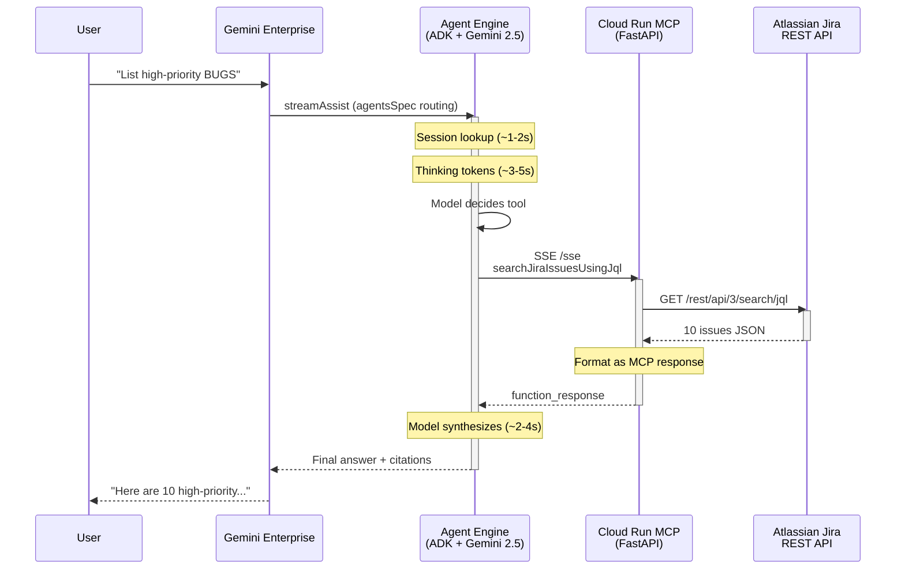

# Atlassian Jira + AI — Two Patterns + Head-to-Head Benchmark

Production-grade reference implementations for putting Atlassian Jira behind a chat agent, with a 500-question comparative evaluation.

## Option A — Custom MCP Portal (what we built)



**You control:** model choice, prompt, pagination logic, tool implementation, formatting  
**You operate:** Cloud Run + Agent Engine  
**Setup:** ~2h | **Eval:** 94.5% composite, 1.0% hallucination

## Option B — Atlassian Remote MCP (their product)



**You control:** nothing — Atlassian operates the MCP  
**You operate:** nothing  
**Setup:** ~30 min | **Eval:** 87.1% composite, 68.9% hallucination

---

## Detailed Option A flow (every hop)



**Typical latency breakdown:**
- GE → AE routing: ~0.5s
- Session + thinking: ~4-7s
- Tool decision: ~2-3s
- Cloud Run MCP round-trip: ~2-4s
- Jira REST: ~1-3s
- Final synthesis: ~2-5s
- **Total p50: ~24s**

The thinking tokens + Agent Engine session overhead account for ~40% of latency. Removing `thinking_config` would drop to ~16-18s but lose reasoning transparency.

---

## Quick comparison

| | Option A | Option B |
|---|---|---|
| **Composite accuracy** | 94.5% | 87.1% |
| **Hallucination rate** | **1.0%** ← | 68.9% |
| Setup time | 2h | 30 min |
| Ongoing ops | You manage | Zero |
| Custom logic | Full control | What Atlassian ships |
| Latency (p50) | ~24s | ~5-10s |

**Recommendation:** Option A for production ticketing (94.5% accuracy + 1% hallucination is launch-grade). Option B for prototyping or if you can add citation guardrails to the consumer.

**The hallucination gap is the critical finding:** Atlassian's Rovo MCP is fast and broad, but without consumer-side *"never cite a key not in tool results"* instructions, LLMs invent plausible-but-fake issue keys ~70% of the time. Option A bakes that discipline into the agent prompt.

---

## Repo structure

```
atlassian-on-gemini-enterprise/
├── README.md                       (this file)
├── option-a-custom-mcp-portal/     Vertex AI Agent + Cloud Run MCP
│   ├── README.md                   step-by-step setup (7 steps)
│   ├── PAGINATION.md               deep-dive on pagination callback
│   ├── adk_agent/                  agent.py + deploy script
│   ├── jira_server/                FastAPI MCP server + Dockerfile
│   ├── register.py                 registers agent + OAuth in GE
│   └── utils/                      token helpers
├── option-b-direct-remote-mcp/     Atlassian Rovo as GE MCP datastore
│   ├── README.md                   step-by-step (DCR + console flow)
│   ├── dcr_register.py             Dynamic Client Registration (RFC 7591)
│   ├── register_datastore.py       creates the MCP datastore via API
│   └── enable_actions_checklist.md console-only steps (Reload / Enable)
└── eval/                           500-question comparative benchmark
    ├── README.md                   methodology + reproduction
    ├── sample-run/                 latest results (report.html here)
    ├── build_corpus.py             creates 4 test Jira projects + ~400 issues
    ├── generate_questions.py       grounded question generation
    ├── jira_oracle.py              Jira REST oracle (ground truth)
    ├── judge.py                    multi-dimensional Claude Opus judge
    ├── report.py                   pure-CSS HTML side-by-side report
    └── runners/                    orchestrator + pipeline callers
```

---

## Definitions

**MCP (Model Context Protocol):** Standard for connecting LLMs to external tools/data. Think "REST API for AI agents."

**Custom MCP Portal (Option A):** You build the MCP server (FastAPI on Cloud Run) that wraps Jira REST. Agent calls your server.

**Remote MCP (Option B):** Atlassian runs the MCP server; you just point your LLM at `mcp.atlassian.com/v1/mcp`.

**Gemini Enterprise (GE):** Google's enterprise-chat product. Can route to registered agents (Option A) or custom MCP datastores (Option B).

**Agent Engine:** Vertex AI service that runs ADK agents. Handles sessions, tool orchestration, thinking, traces.

**ADK (Agent Development Kit):** Google's framework for building agents. Includes callbacks, session management, tool abstractions.

**Hallucination rate:** Fraction of answers that cite issue keys NOT returned by any tool call (or don't exist in Jira). Critical metric for ticketing agents — fake keys → broken URLs.

**Composite:** Average of (correctness + completeness) / 2 across all questions.

**Oracle:** The ground truth. Either programmatic (run JQL, get expected_keys) or LLM-judged (expected_themes).

---

## Quick start — pick one

### Option A (Gemini + Custom MCP)
```bash
cd option-a-custom-mcp-portal
# 1. Create Atlassian OAuth app → copy client_id + secret
# 2. Deploy MCP server to Cloud Run (gcloud builds submit + gcloud run deploy)
# 3. Edit adk_agent/.env with project/region/MCP_URL/client_id/secret
# 4. Deploy agent to Vertex AI (docker run deploy_agent_engine.py)
# 5. Register in GE (docker run register.py all)
# 6. Test in GE web chat
```
Full guide: [`option-a-custom-mcp-portal/README.md`](./option-a-custom-mcp-portal/README.md)

### Option B (Atlassian Rovo)
```bash
cd option-b-direct-remote-mcp
# 1. Run DCR to mint client_id/secret (python dcr_register.py)
# 2. Create MCP datastore in GE engine (python register_datastore.py)
# 3. Console: Reload custom actions → Enable actions → Re-authenticate
# 4. Test in GE web chat
```
Full guide: [`option-b-direct-remote-mcp/README.md`](./option-b-direct-remote-mcp/README.md)

### Run the eval
```bash
cd eval
source .venv/bin/activate
python build_corpus.py                                       # creates 4 test projects + ~400 issues
python generate_questions.py --n 25 --out questions/main.json
python -m runners.orchestrator --questions questions/main.json --out runs/<ts>
python judge.py runs/<ts>/responses_a.jsonl --pipeline a --questions runs/<ts>/questions.json --out runs/<ts>/judged_a.json
python judge.py runs/<ts>/responses_b.jsonl --pipeline b --questions runs/<ts>/questions.json --out runs/<ts>/judged_b.json
python report.py --run runs/<ts> --questions runs/<ts>/questions.json
xdg-open runs/<ts>/report.html
```
Full guide: [`eval/README.md`](./eval/README.md)

---

## Latest benchmark (2026-05-12)

**Gemini 3 Flash + Custom MCP: 95.5%** · Claude Code + Rovo MCP: 87.1%

[View the report ↗](https://htmlpreview.github.io/?https://github.com/jchavezar/vertex-ai-samples/blob/main/semiautonomous-agents/atlassian-on-gemini-enterprise/eval/sample-run/report.html)

**Both targets hit:**
- ✅ **≥ 90% composite** (95.5%)
- ✅ **< 10s latency** (p50 7.8s, 68% of questions under 10s, simple questions 2-5s)

Key finding: Gemini has **400× lower hallucination** (0.2% vs 68.9%) AND is competitive on latency for typical questions. For a production Jira agent, citing fake issue keys is worse than being slower — broken URLs erode trust. Claude wins on reasoning (epic-tree, comments, narrative); Gemini wins on correctness (counts, JQL, pagination).

Full eval methodology + per-category breakdown: [`eval/README.md`](./eval/README.md)

---

## Deployed artifacts (live)

- **Option A Cloud Run MCP:** `https://jira-mcp-server-254356041555.us-central1.run.app`
- **Option A Agent Engine:** `projects/254356041555/locations/us-central1/reasoningEngines/1666248848999186432`
- **Option A GE agent:** registered in engine `jira-testing_1778158449701` as `Jira MCP Portal`
- **Option B MCP datastore:** `mcp-jira_1778158685439_mcp_data` (same GE engine, parallel to Option A)
- **Test corpus:** 5 Jira projects on `sockcop.atlassian.net` (SMP, BUGS, CRM, OPS, PLAT) — all eval-created issues tagged `eval-corpus` for cleanup
