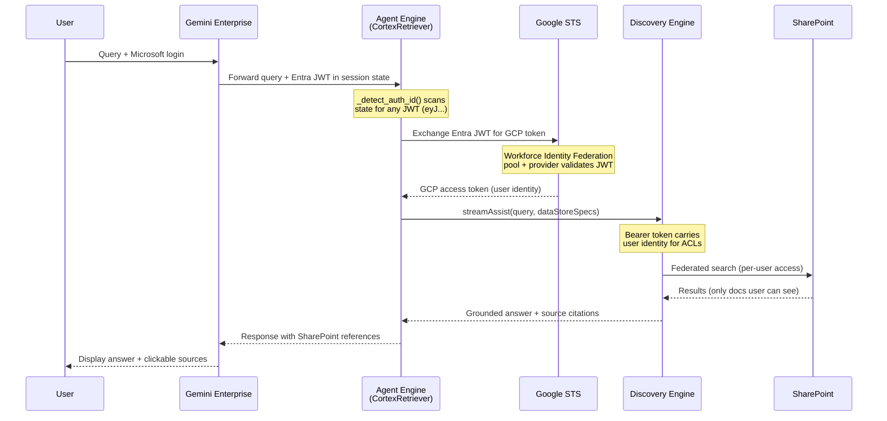

# Cortex Retriever

> Agent-only ADK project — no UI, no backend. Deploys to Agent Engine, registers to Gemini Enterprise.


Cortex Retriever is a minimal Google ADK agent that searches **internal SharePoint documents** via Discovery Engine and the **public web** via Google Search. It runs inside Gemini Enterprise where users interact with it through the standard chat interface — no custom UI required.

---

## Architecture

```
┌─────────────────────────────────────────────────────────────────┐
│                      Gemini Enterprise                          │
│                   (User interacts here)                         │
└──────────────────────────┬──────────────────────────────────────┘
                           │
                           ▼
┌─────────────────────────────────────────────────────────────────┐
│                      Agent Engine                               │
│              (Vertex AI Reasoning Engine)                        │
│                                                                 │
│  ┌───────────────────────────────────────────────────────────┐  │
│  │              CortexRetriever (ADK Agent)                  │  │
│  │                  gemini-2.5-flash                         │  │
│  │                                                           │  │
│  │   ┌─────────────────┐    ┌──────────────────────────┐    │  │
│  │   │ search_sharepoint│    │    google_search         │    │  │
│  │   │   (custom tool)  │    │  (ADK built-in tool)     │    │  │
│  │   └────────┬─────────┘    └────────────┬─────────────┘    │  │
│  └────────────┼───────────────────────────┼──────────────────┘  │
│               │                           │                     │
└───────────────┼───────────────────────────┼─────────────────────┘
                │                           │
                ▼                           ▼
┌──────────────────────────┐  ┌──────────────────────────┐
│   Discovery Engine       │  │      Google Search       │
│   StreamAssist API       │  │     (Public Web)         │
│                          │  └──────────────────────────┘
│   ┌──────────────────┐   │
│   │ SharePoint        │   │
│   │ Federated         │   │
│   │ Connector         │   │
│   └────────┬─────────┘   │
└────────────┼─────────────┘
             │
             ▼
┌──────────────────────────┐
│   SharePoint Online      │
│   (User ACLs enforced)   │
└──────────────────────────┘
```

---

## Auth Flow

How a user query in Gemini Enterprise reaches SharePoint with per-user ACLs:



---

## Step-by-Step Code Walkthrough

### 1. JWT Auto-Detection from Agentspace Session State

When Gemini Enterprise calls the agent, it injects the user's Microsoft JWT into `tool_context.state` using the authorization ID as the key. The agent doesn't need to know the key name — it scans all values for JWT signatures:

```python
# agent/agent.py — _detect_auth_id()

def _detect_auth_id(tool_context: ToolContext) -> tuple[str | None, str | None]:
    state_dict = tool_context.state.to_dict()

    for key, val in state_dict.items():
        if not isinstance(val, str) or len(val) < 100:
            continue
        if val.startswith("eyJ") and "." in val:          # JWT signature
            auth_id = key.removeprefix("temp:")            # strip prefix if present
            return auth_id, val

    return None, None
```

> [!IMPORTANT]
> Agentspace injects tokens with **no consistent prefix** — sometimes `temp:auth_id`, sometimes bare `auth_id`. The `eyJ` + dot + length check catches JWTs regardless of key naming convention. This means you can change the authorization ID freely without touching agent code.

### 2. WIF Token Exchange (Entra JWT → GCP Token) — must use a **V1-issuer provider**

The Microsoft JWT injected by Agentspace is a **V1 Azure AD token** (issuer `https://sts.windows.net/{tenant}/`, audience `api://{client_id}`). This is different from the V2 tokens that MSAL.js frontends issue (`https://login.microsoftonline.com/{tenant}/v2.0`, raw GUID audience). Using a V2-only WIF provider here will fail every request with `invalid_grant`. Provision a sibling provider for V1:

```bash
gcloud iam workforce-pools providers create-oidc ge-login-provider-v1 \
  --workforce-pool=<pool> --location=global \
  --issuer-uri="https://sts.windows.net/<TENANT_ID>/" \
  --client-id="api://<PORTAL_APP_CLIENT_ID>" \
  --attribute-mapping="google.subject=assertion.sub" \
  --web-sso-response-type=id-token \
  --web-sso-assertion-claims-behavior=only-id-token-claims
```

Then in the agent, the exchange is identical to the standard WIF pattern:

```python
# agent/discovery_engine.py — exchange_wif_token()
payload = {
    "audience": f"//iam.googleapis.com/locations/global/workforcePools/{POOL}/providers/{PROVIDER_V1}",
    "grantType": "urn:ietf:params:oauth:grant-type:token-exchange",
    "requestedTokenType": "urn:ietf:params:oauth:token-type:access_token",
    "scope": "https://www.googleapis.com/auth/cloud-platform",
    "subjectToken": microsoft_jwt,
    "subjectTokenType": "urn:ietf:params:oauth:token-type:jwt",
}
resp = requests.post("https://sts.googleapis.com/v1/token", json=payload)
```

> [!IMPORTANT]
> **V1 vs V2 is the most common silent failure.** STS rejects with `invalid_grant: issuer does not match` (wrong issuer) or `invalid_grant: audience does not match` (wrong client_id format). The error never surfaces to the GE chat UI — the agent quietly falls back to its SA token and returns "no results found".

### 3. StreamAssist Search — exact payload shape that survives the skip heuristic

```python
# agent/discovery_engine.py — search()

# 1. Wrap bare keywords/short questions into a full sentence. The agent's LLM
#    tends to extract single words ("jennifer") for the search; streamAssist's
#    heuristic classifies those as NON_ASSIST_SEEKING_QUERY_IGNORED and returns
#    state=SKIPPED with zero documents.
wrapped_query = f"Find information about {query} in SharePoint documents"

payload = {
    # 2. MUST use query.parts (NOT query.text). The simple text shape also
    #    triggers the skip heuristic. The parts envelope bypasses it.
    "query": {"parts": [{"text": wrapped_query}]},
    "assistSkippingMode": "REQUEST_ASSIST",
    "toolsSpec": {"vertexAiSearchSpec": {"dataStoreSpecs": datastore_specs}},
}

response = requests.post(
    f"https://discoveryengine.googleapis.com/v1alpha/"
    f"projects/{p}/locations/{l}/collections/default_collection/"
    f"engines/{e}/assistants/default_assistant:streamAssist",
    headers={"Authorization": f"Bearer {access_token}", ...},
    json=payload,
)
```

> [!IMPORTANT]
> All three pieces matter independently:
> 1. **`query.parts`** — `{text}` shape gets skipped, `{parts: [{text}]}` doesn't.
> 2. **Wrapped sentence** — bare words get skipped even with `parts`. Wrap into "Find information about X in SharePoint documents".
> 3. **`assistSkippingMode: REQUEST_ASSIST`** — required field; `ASSIST_SKIPPING_MODE_UNSPECIFIED` does NOT disable the skip (counter-intuitive but verified against live API).
>
> Without all three, you'll get `{"answer": {"state": "SKIPPED", "assistSkippedReasons": ["NON_ASSIST_SEEKING_QUERY_IGNORED"]}}` and zero source citations. The agent's LLM will then fabricate "I couldn't find anything in SharePoint" — but no actual search happened.

### 4. Hardcoded Datastores — what makes this **toggle-independent**

The previous version of this code fetched datastores dynamically from the engine's `widget_config`. **That endpoint reflects whatever the user has toggled in the GE chat UI.** When the user disabled the SharePoint toggle, the datastore vanished from `dataStoreSpecs` and the search silently returned nothing — even though WIF auth and the connector bridge were both intact.

The fix is to ignore `widget_config` entirely and hardcode the connector's entity datastores in the agent:

```python
# agent/discovery_engine.py — _get_dynamic_datastores()

_SHAREPOINT_ENTITIES = ["file", "page", "comment", "event", "attachment"]
_SHAREPOINT_CONNECTOR_PREFIX = "sharepoint-data-def-connector"

def _get_dynamic_datastores(self) -> List[Dict[str, str]]:
    return [
        {"dataStore": (
            f"projects/{self.project_number}/locations/{self.location}/"
            f"collections/default_collection/dataStores/"
            f"{self._SHAREPOINT_CONNECTOR_PREFIX}_{entity}"
        )}
        for entity in self._SHAREPOINT_ENTITIES
    ]
```

> [!IMPORTANT]
> **The GE chat-UI data-source toggle is purely a *client-side filter* on `dataStoreSpecs`.** It does NOT control authorization, JWT injection, or the underlying connector bridge. By hardcoding the SharePoint datastores in the agent's tool, the toggle becomes a UX illusion — SharePoint is always queried, ACL enforcement still works server-side via the WIF user identity. This is the single change that makes the agent toggle-independent.

<details>
<summary><b>Alternative: Dynamic connector discovery (works across any attached connector)</b></summary>

If you have multiple connectors (SharePoint + ServiceNow + Outlook) or the connector ID changes between environments, hardcoding the full datastore paths is brittle. Here's a toggle-independent pattern that auto-discovers all attached connectors by listing collections and reading each connector's entities:

```python
def _get_all_connector_datastores(self):
    """Dynamically discover all federated connector datastores (toggle-independent)."""
    admin_token = self._get_service_credentials()  # SA token for config reads
    headers = {
        "Authorization": f"Bearer {admin_token}",
        "Content-Type": "application/json",
        "X-Goog-User-Project": self.project_number,
    }
    
    datastores = []
    
    # 1. List all collections (each connector creates its own collection)
    collections_url = (
        f"https://discoveryengine.googleapis.com/v1alpha/"
        f"projects/{self.project_number}/locations/{self.location}/collections"
    )
    collections_resp = requests.get(collections_url, headers=headers, timeout=10)
    
    for coll in collections_resp.json().get('collections', []):
        # Skip non-connector collections (e.g., default_collection)
        if 'dataConnector' not in coll:
            continue
        
        coll_name = coll['name'].split('/')[-1]
        
        # 2. Get the connector's entities (each entity = one datastore)
        connector_url = (
            f"https://discoveryengine.googleapis.com/v1alpha/"
            f"projects/{self.project_number}/locations/{self.location}/"
            f"collections/{coll_name}"
        )
        connector_resp = requests.get(connector_url, headers=headers, timeout=10)
        
        dc = connector_resp.json().get('dataConnector', {})
        for entity in dc.get('entities', []):
            datastores.append({"dataStore": entity['dataStore']})
    
    return datastores
```

**Trade-off:** This adds ~200ms latency per query (two extra GET calls) but works across any connector type. For a single-connector deployment, the hardcoded list is faster and simpler. For multi-connector or env-agnostic agents, the dynamic pattern is worth it.

**Why this is also toggle-independent:** The connector's `entities` list is server-side config, never modified by the GE chat toggle. Only `widget_config` (which we're avoiding) reflects toggle state.

</details>

### 5. Google Search (Built-in ADK Tool)

For public web queries, the agent uses ADK's built-in `GoogleSearchTool` — no custom code needed:

```python
# agent/agent.py

from google.adk.tools.google_search_tool import GoogleSearchTool

google_search_tool = GoogleSearchTool(bypass_multi_tools_limit=True)

root_agent = Agent(
    name="CortexRetriever",
    model="gemini-2.5-flash",
    tools=[search_sharepoint, google_search_tool],
)
```

> [!NOTE]
> `bypass_multi_tools_limit=True` is required because ADK doesn't natively support mixing custom tools with built-in tools. This flag makes ADK auto-wrap `google_search` in a sub-agent so both tools work together.

### 6. Agent Registration to Gemini Enterprise

A single script handles OAuth authorization, agent registration, and sharing:

```python
# register.py — register_auth()

payload = {
    "serverSideOauth2": {
        "clientId": OAUTH_CLIENT_ID,
        "clientSecret": OAUTH_CLIENT_SECRET,
        "authorizationUri": auth_uri,   # Microsoft login URL with scopes
        "tokenUri": token_uri,          # Microsoft token endpoint
    },
}
requests.post(
    f"{base_url}/authorizations?authorizationId={AUTH_ID}",
    headers=headers, json=payload,
)

# register.py — register_agent()

payload = {
    "displayName": AGENT_DISPLAY_NAME,
    "adk_agent_definition": {
        "provisioned_reasoning_engine": {
            "reasoning_engine": REASONING_ENGINE_RES
        },
    },
    "authorization_config": {
        "tool_authorizations": [
            f"projects/{PROJECT_NUMBER}/locations/global/authorizations/{AUTH_ID}"
        ]
    },
}
requests.post(
    f"{base_url}/.../assistants/default_assistant/agents",
    headers=headers, json=payload,
)
```

---

## Quick Start

```bash
# 1. Clone and configure
cd cortex-retriever
cp .env.example .env
# Edit .env with your values

# 2. Install dependencies
uv sync

# 3. Test locally (uses service account — no WIF)
uv run python test_local.py

# 4. Deploy to Agent Engine
uv run python deploy.py
# Copy the REASONING_ENGINE_RES output to .env

# 5. Register to Gemini Enterprise + share with everyone
uv run python register.py all
```

After step 5, the agent appears in your Gemini Enterprise instance. Users click the agent, authorize SharePoint access once, then chat.

---

## File Reference

```
cortex-retriever/
├── agent/
│   ├── __init__.py              # Exports root_agent
│   ├── agent.py                 # ADK agent: JWT detection + search_sharepoint tool
│   └── discovery_engine.py      # WIF/STS exchange + StreamAssist API client
├── deploy.py                    # Deploy/update on Vertex AI Agent Engine
├── register.py                  # Register OAuth + agent + share to Agentspace
├── test_local.py                # Local connectivity + agent conversation test
├── .env.example                 # Configuration template
├── pyproject.toml               # Python project (uv)
└── README.md
```

---

## Environment Variables

| Variable | Required | Description |
|----------|----------|-------------|
| `PROJECT_ID` | Yes | GCP project hosting Agent Engine |
| `PROJECT_NUMBER` | Yes | Numeric project number |
| `STAGING_BUCKET` | Yes | GCS bucket for Agent Engine artifacts |
| `ENGINE_ID` | Yes | Discovery Engine app ID |
| `DATA_STORE_ID` | Yes | SharePoint federated connector datastore |
| `WIF_POOL_ID` | Yes | Workforce Identity Federation pool |
| `WIF_PROVIDER_ID` | Yes | WIF OIDC provider (must use `api://` audience) |
| `TENANT_ID` | Yes | Microsoft Entra tenant ID |
| `OAUTH_CLIENT_ID` | Yes | Entra app registration client ID |
| `OAUTH_CLIENT_SECRET` | Yes | Entra app client secret |
| `GE_PROJECT_ID` | Yes | Project hosting Gemini Enterprise (can differ from `PROJECT_ID`) |
| `GE_PROJECT_NUMBER` | Yes | Numeric project number for GE project |
| `AS_APP` | Yes | Agentspace app (engine) ID |
| `AUTH_ID` | Yes | Authorization ID for OAuth registration |
| `REASONING_ENGINE_RES` | After deploy | Agent Engine resource name (output of `deploy.py`) |

---

## Key Design Decisions

| Decision | Choice | Why |
|----------|--------|-----|
| No UI | Agent-only, runs inside Gemini Enterprise | Customers already have GE — no need for a separate portal |
| Google Search | ADK built-in `GoogleSearchTool` | Replaces 50+ lines of manual Gemini API + grounding code |
| Tool mixing | `bypass_multi_tools_limit=True` | ADK auto-wraps google_search in a sub-agent |
| JWT detection | Scan all state values for `eyJ` prefix | Zero hardcoded auth IDs — works with any authorization name |
| Dynamic datastores | Fetch from widget config, fallback to env var | Less hardcoding, adapts to connector changes |
| Single registration script | `register.py all` | Consolidates 3 API calls (auth + agent + sharing) into one command |

---

## Prerequisites

<details>
<summary><strong>1. Entra ID App Registration</strong></summary>

The same app registration used for WIF login. Required manifest settings:

```json
{
  "oauth2AllowIdTokenImplicitFlow": true,
  "groupMembershipClaims": "SecurityGroup"
}
```

**Expose an API** with scope `api://{client-id}/user_impersonation`.

**Redirect URIs** must include:
- `https://vertexaisearch.cloud.google.com/oauth-redirect`

</details>

<details>
<summary><strong>2. Workforce Identity Federation (WIF)</strong></summary>

A workforce pool with an OIDC provider pointing to your Entra tenant:

```bash
gcloud iam workforce-pools providers create-oidc YOUR_PROVIDER_ID \
  --workforce-pool=YOUR_POOL_ID \
  --location=global \
  --issuer-uri="https://sts.windows.net/${TENANT_ID}/" \
  --client-id="api://${CLIENT_ID}" \
  --attribute-mapping="google.subject=assertion.sub,google.groups=assertion.groups"
```

> [!IMPORTANT]
> The `--client-id` must use the `api://` prefix. Without it, the STS exchange fails with `invalid_grant: audience does not match`.

**IAM roles** on the WIF pool principal:
- `roles/discoveryengine.viewer` — list datastore IDs
- `roles/discoveryengine.editor` — call StreamAssist
- `roles/serviceusage.serviceUsageConsumer` — API quota

</details>

<details>
<summary><strong>3. Discovery Engine + SharePoint Connector</strong></summary>

- Create a Search App in Discovery Engine
- Add a SharePoint federated connector as a data source
- The connector requires its own Entra app with SharePoint delegated permissions:
  - `Sites.Read.All`, `Sites.Search.All`, `AllSites.Read`, `offline_access`
  - All with admin consent granted

See [`sharepoint_wif_portal/docs/`](../sharepoint_wif_portal/docs/) for detailed setup.

</details>

<details>
<summary><strong>4. Agent Engine IAM</strong></summary>

The Agent Engine service account needs:

```bash
# At project level
gcloud projects add-iam-policy-binding ${PROJECT_ID} \
  --member="serviceAccount:${PROJECT_NUMBER}-compute@developer.gserviceaccount.com" \
  --role="roles/aiplatform.user"

# At resource level (for the Reasoning Engine)
curl -X POST "https://us-central1-aiplatform.googleapis.com/v1/${REASONING_ENGINE_RES}:setIamPolicy" \
  -H "Authorization: Bearer $(gcloud auth print-access-token)" \
  -d '{"policy":{"bindings":[{"role":"roles/aiplatform.user","members":["serviceAccount:...-compute@..."]}]}}'
```

</details>

---

## Gotchas

| # | Issue | Fix |
|---|-------|-----|
| 1 | Agent returns generic answers with no sources | Missing `dataStoreSpecs` — check `DATA_STORE_ID` is set and the widget config API is accessible |
| 2 | `auth_id=None, token_present=False` in logs | User hasn't authorized SharePoint in GE, or the authorization registration failed |
| 3 | STS returns `invalid_grant` | WIF provider `--client-id` missing `api://` prefix |
| 4 | `FAILED_PRECONDITION` on STS exchange | Entra manifest needs `oauth2AllowIdTokenImplicitFlow: true` |
| 5 | Authorization button in GE stays stuck | Wrong `OAUTH_CLIENT_ID` in `register.py` — must match the Entra app, not the connector app |
| 6 | Agent works locally but not in GE | Agent Engine env vars missing — check `deploy.py` passes all required vars |
| 7 | `sharepointauth2 is used by another agent` | Each agent needs its own `AUTH_ID` — two agents can't share one authorization |

---

## Related Projects

| Project | Relationship |
|---------|-------------|
| [`sharepoint_wif_portal`](../sharepoint_wif_portal/) | Full-stack version with custom React UI + FastAPI backend |
| [`streamassist-oauth-flow`](../streamassist-oauth-flow/) | Custom UI with its own OAuth consent flow (no GE login needed) |
| [`ge-sharepoint-cloudid`](../ge-sharepoint-cloudid/) | Cloud Identity approach (no WIF, uses Google-managed identities) |

---

*Version 1.1.0 — April 2026*
