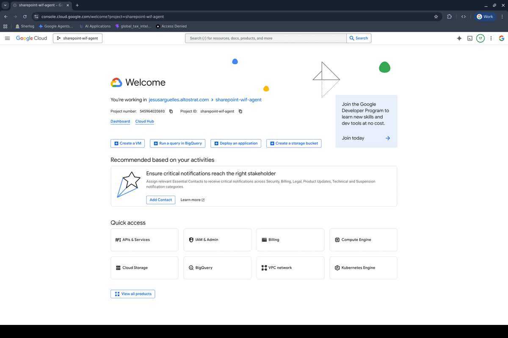

# Cross-Project ADK Agent

> Deploy an ADK agent in one GCP project, register it in another project's Gemini Enterprise.

**Python 3.12** | **Google ADK** | **Agent Engine** | **Gemini Enterprise**



## The Pattern

```
┌──────────────────────────────────┐      ┌──────────────────────────────────┐
│  sharepoint-wif-agent            │      │  vtxdemos                        │
│  (Project A - REDACTED_PROJECT_NUMBER)      │      │  (Project B - REDACTED_PROJECT_NUMBER)      │
│                                  │      │                                  │
│  ┌────────────────────────┐      │      │  ┌────────────────────────┐      │
│  │   Agent Engine         │◄─────┼──────┼──│   Gemini Enterprise    │      │
│  │   (Reasoning Engine)   │      │      │  │   (Agentspace)         │      │
│  │                        │      │      │  │                        │      │
│  │   cross_project_       │      │      │  │   Registered agent     │      │
│  │   assistant            │      │      │  │   points to Project A  │      │
│  └────────────────────────┘      │      │  └────────────────────────┘      │
│                                  │      │                                  │
└──────────────────────────────────┘      └──────────────────────────────────┘

deploy.py ─────────────────────────────►  Agent Engine created in Project A
register_agent.py ─────────────────────►  Agent registered in Project B's Agentspace
```

## Quick Start

```bash
cd semiautonomous-agents/cross-project-adk-agent

# 1. Setup
cp .env.example .env
# Edit .env with your project values

# 2. Install
uv sync

# 3. Test locally
uv run python test_local.py

# 4. Deploy to sharepoint-wif-agent
uv run python deploy.py

# 5. Test the deployed agent
uv run python test_remote.py

# 6. IAM cross-project binding
gcloud projects add-iam-policy-binding sharepoint-wif-agent \
  --member="serviceAccount:service-REDACTED_PROJECT_NUMBER@gcp-sa-discoveryengine.iam.gserviceaccount.com" \
  --role="roles/aiplatform.user"

# 7. Register in vtxdemos Gemini Enterprise (auto-shares with all users)
uv run python register_agent.py
```

## Deployed Resources

| Resource | Value |
|----------|-------|
| Agent Engine | `projects/REDACTED_PROJECT_NUMBER/locations/us-central1/reasoningEngines/7011410278222921728` |
| Agentspace Agent | `projects/REDACTED_PROJECT_NUMBER/.../agents/410068398271859395` |
| Agentspace App | `agentspace-testing_1748446185255` |

## Prerequisites

| Requirement | Details |
|---|---|
| GCP Project A | `sharepoint-wif-agent` (REDACTED_PROJECT_NUMBER) - hosts the Agent Engine |
| GCP Project B | `vtxdemos` (REDACTED_PROJECT_NUMBER) - hosts Gemini Enterprise / Agentspace |
| Staging Bucket | `gs://sharepoint-wif-agent-staging` in Project A |
| Agentspace App | Created in vtxdemos (set `AS_APP` in `.env`) |
| IAM | vtxdemos DE SA needs `roles/aiplatform.user` on sharepoint-wif-agent |

## IAM Cross-Project Setup

For Gemini Enterprise in `vtxdemos` to call the Agent Engine in `sharepoint-wif-agent`:

```bash
gcloud projects add-iam-policy-binding sharepoint-wif-agent \
  --member="serviceAccount:service-REDACTED_PROJECT_NUMBER@gcp-sa-discoveryengine.iam.gserviceaccount.com" \
  --role="roles/aiplatform.user"
```

## Project Structure

```
cross-project-adk-agent/
├── agent/
│   ├── __init__.py
│   └── agent.py              # ADK agent definition (gemini-2.5-flash)
├── deploy.py                 # Deploy to sharepoint-wif-agent Agent Engine
├── register_agent.py         # Register in vtxdemos Gemini Enterprise
├── test_local.py             # Test agent locally (InMemoryRunner)
├── test_remote.py            # Test deployed agent (Agent Engine SDK)
├── docs/
│   ├── 01-OVERVIEW.md        # Architecture and cross-project flow
│   ├── 02-PREREQUISITES.md   # GCP projects, APIs, buckets, IAM
│   ├── 03-DEPLOY-AGENT-ENGINE.md  # Deploy to sharepoint-wif-agent
│   ├── 04-REGISTER-GEMINI-ENTERPRISE.md  # Register + share in vtxdemos
│   ├── 05-TESTING.md         # Local, remote, and GE testing
│   └── 06-TROUBLESHOOTING.md # Common issues + useful commands
├── assets/
│   ├── cross-project-demo.gif          # Animated walkthrough
│   ├── 01_console_landing.png          # sharepoint-wif-agent console
│   ├── 01_agent_engine_list.png        # Agent Engine with cross-project-assistant
│   ├── 02_iam_crossproject.png         # IAM cross-project bindings
│   ├── 03_gemini_enterprise_landing.png # Gemini Enterprise in vtxdemos
│   ├── 04_agent_engine_traces.png      # Agent Engine details with traces/spans
│   └── 05_gemini_enterprise_chat.png   # cross_project_agent responding in GE
├── .env.example              # Configuration template
├── .python-version           # 3.12
├── pyproject.toml            # Dependencies (uv)
└── README.md
```

## Workflow

### Step 1: Deploy to Project A

`deploy.py` creates an Agent Engine (Reasoning Engine) in `sharepoint-wif-agent`:

```python
vertexai.init(project="sharepoint-wif-agent", ...)
remote_app = agent_engines.create(agent_engine=app, ...)
# Returns: projects/REDACTED_PROJECT_NUMBER/locations/us-central1/reasoningEngines/7011410278222921728
```

### Step 2: Register in Project B

`register_agent.py` registers that Agent Engine resource in `vtxdemos` Agentspace via the Discovery Engine API:

```python
# Points Gemini Enterprise in vtxdemos to the Agent Engine in sharepoint-wif-agent
payload = {
    "adk_agent_definition": {
        "provisioned_reasoning_engine": {
            "reasoning_engine": "projects/REDACTED_PROJECT_NUMBER/.../reasoningEngines/7011410278222921728"
        }
    }
}
# POST to discoveryengine.googleapis.com in Project B (vtxdemos)
```

### Step 3: Use in Gemini Enterprise

Users in `vtxdemos` Gemini Enterprise can now interact with the agent. Agentspace handles the cross-project call transparently.

## Documentation

| # | Document | What It Covers |
|---|----------|---------------|
| 1 | [Overview](docs/01-OVERVIEW.md) | Architecture, cross-project flow |
| 2 | [Prerequisites](docs/02-PREREQUISITES.md) | Projects, APIs, buckets, IAM roles |
| 3 | [Deploy Agent Engine](docs/03-DEPLOY-AGENT-ENGINE.md) | Deploy to sharepoint-wif-agent |
| 4 | [Register in GE](docs/04-REGISTER-GEMINI-ENTERPRISE.md) | IAM binding + Agentspace registration |
| 5 | [Testing](docs/05-TESTING.md) | Local, remote, and GE testing |
| 6 | [Troubleshooting](docs/06-TROUBLESHOOTING.md) | Common issues, service accounts, useful commands |

## Troubleshooting

| Issue | Solution |
|---|---|
| `PERMISSION_DENIED` on deploy | Ensure `gcloud` is authed with access to `sharepoint-wif-agent` |
| `PERMISSION_DENIED` on register | Ensure `gcloud` has Discovery Engine access in `vtxdemos` |
| Agent not responding in GE | Check IAM: vtxdemos DE SA needs `aiplatform.user` on sharepoint-wif-agent |
| Staging bucket not found | Create: `gcloud storage buckets create gs://sharepoint-wif-agent-staging --project=sharepoint-wif-agent` |
