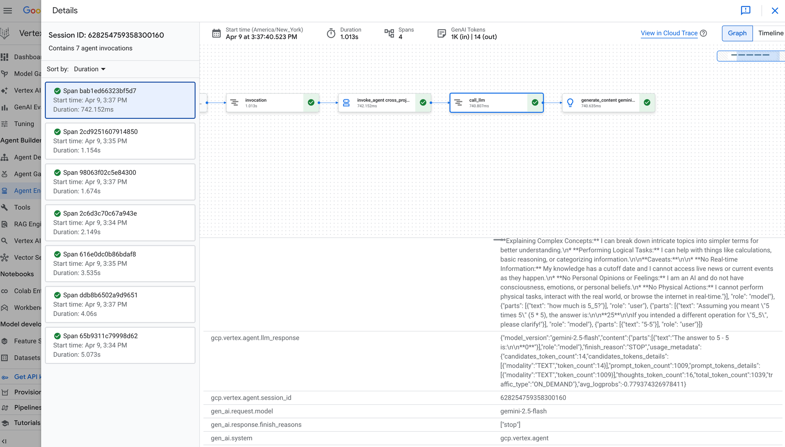
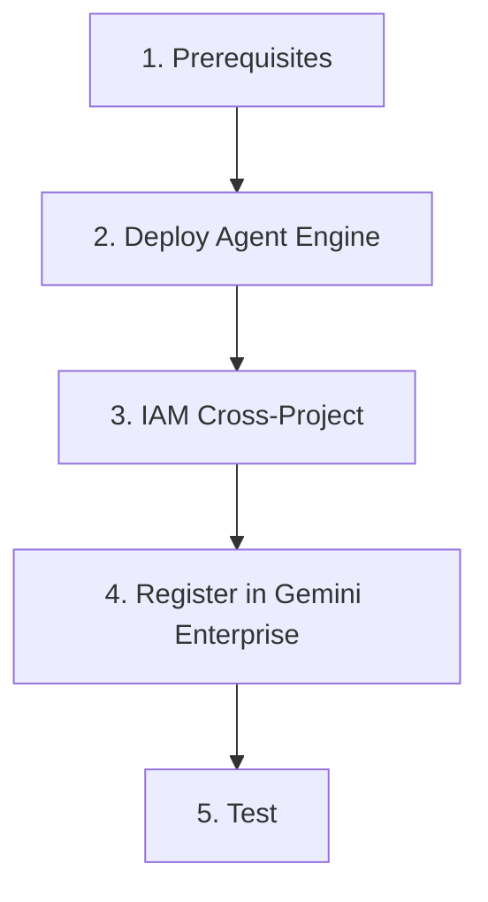

# Overview

> **Navigation**: [README](../README.md) | **Overview** | [Prerequisites](02-PREREQUISITES.md) | [Deploy](03-DEPLOY-AGENT-ENGINE.md) | [Register](04-REGISTER-GEMINI-ENTERPRISE.md) | [Testing](05-TESTING.md) | [Troubleshooting](06-TROUBLESHOOTING.md)

---


### Agent Engine Traces (Project A)



### Gemini Enterprise Chat (Project B)


## What This Project Does

Demonstrates **cross-project ADK agent deployment**: an agent runs in one GCP project but is accessible from Gemini Enterprise in a different project.

| Concept | Details |
|---------|---------|
| **Pattern** | Cross-project Agent Engine + Gemini Enterprise |
| **Project A** | `sharepoint-wif-agent` (REDACTED_PROJECT_NUMBER) - hosts Agent Engine |
| **Project B** | `vtxdemos` (REDACTED_PROJECT_NUMBER) - hosts Gemini Enterprise / Agentspace |
| **Agent** | Simple `gemini-2.5-flash` assistant |

---

## Architecture

```
┌──────────────────────────────────┐      ┌──────────────────────────────────┐
│  sharepoint-wif-agent            │      │  vtxdemos                        │
│  (Project A)                     │      │  (Project B)                     │
│                                  │      │                                  │
│  ┌────────────────────────┐      │      │  ┌────────────────────────┐      │
│  │   Agent Engine         │◄─────┼──────┼──│   Gemini Enterprise    │      │
│  │   (Reasoning Engine)   │      │      │  │   (Agentspace)         │      │
│  │                        │      │      │  │                        │      │
│  │   Resource:            │      │      │  │   Registered agent     │      │
│  │   projects/545964.../  │      │      │  │   points to Project A  │      │
│  │   reasoningEngines/    │      │      │  │   via resource name    │      │
│  │   7011410278222921728  │      │      │  │                        │      │
│  └────────────────────────┘      │      │  └────────────────────────┘      │
│                                  │      │                                  │
└──────────────────────────────────┘      └──────────────────────────────────┘
```

---

## How Cross-Project Works

The key insight: Gemini Enterprise's `adk_agent_definition.provisioned_reasoning_engine` accepts a **full resource name** from any project, not just the local one.

```
Step 1: deploy.py
  → Creates Agent Engine in sharepoint-wif-agent
  → Returns: projects/REDACTED_PROJECT_NUMBER/locations/us-central1/reasoningEngines/7011410278222921728

Step 2: register_agent.py
  → Calls Discovery Engine API in vtxdemos
  → Payload includes: "reasoning_engine": "projects/REDACTED_PROJECT_NUMBER/..."
  → Agentspace in vtxdemos now proxies to Agent Engine in sharepoint-wif-agent

Step 3: IAM binding
  → vtxdemos Discovery Engine SA gets aiplatform.user on sharepoint-wif-agent
  → This allows the cross-project API call at runtime
```

---

## Setup Flow



| Step | Document | What It Does |
|------|----------|--------------|
| 1 | [02-PREREQUISITES.md](02-PREREQUISITES.md) | GCP projects, APIs, buckets |
| 2 | [03-DEPLOY-AGENT-ENGINE.md](03-DEPLOY-AGENT-ENGINE.md) | Deploy agent to sharepoint-wif-agent |
| 3-4 | [04-REGISTER-GEMINI-ENTERPRISE.md](04-REGISTER-GEMINI-ENTERPRISE.md) | IAM + register in vtxdemos |
| 5 | [05-TESTING.md](05-TESTING.md) | Local, remote, and GE testing |

---

**Next**: [Prerequisites →](02-PREREQUISITES.md)
