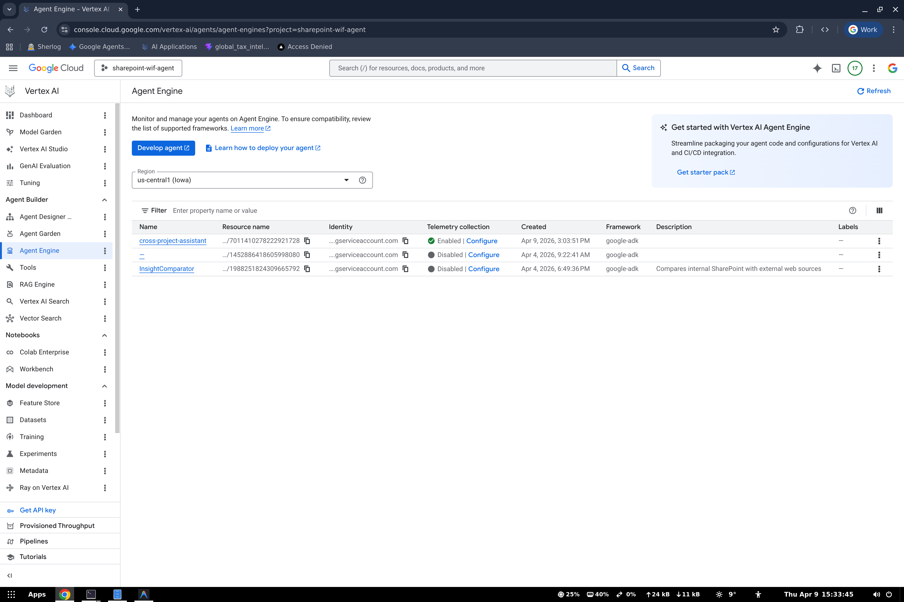

# Deploy to Agent Engine

> **Navigation**: [README](../README.md) | [Overview](01-OVERVIEW.md) | [Prerequisites](02-PREREQUISITES.md) | **Deploy** | [Register](04-REGISTER-GEMINI-ENTERPRISE.md) | [Testing](05-TESTING.md) | [Troubleshooting](06-TROUBLESHOOTING.md)

This deploys the ADK agent to Agent Engine in `sharepoint-wif-agent`.



---

## The Agent

The agent is a simple `gemini-2.5-flash` assistant defined in `agent/agent.py`:

```python
from google.adk.agents import Agent

root_agent = Agent(
    name="cross_project_assistant",
    model="gemini-2.5-flash",
    description="A helpful assistant that answers questions using its knowledge",
    instruction="You are a helpful assistant deployed across GCP projects...",
)
```

No tools or external services -- this is intentionally minimal to demonstrate the cross-project pattern cleanly.

---

## Step 1: Test Locally

Before deploying, verify the agent works locally:

```bash
uv run python test_local.py
```

Expected output:
```
==================================================
Query: What is Vertex AI Agent Engine?
==================================================

Response: Vertex AI Agent Engine is a managed platform...
```

---

## Step 2: Deploy

```bash
uv run python deploy.py
```

Output:
```
=====================================
Deploying ADK Agent to Agent Engine
=====================================
Project:  sharepoint-wif-agent
Location: us-central1
Staging:  gs://sharepoint-wif-agent-staging
=====================================

AgentEngine created. Resource name: projects/REDACTED_PROJECT_NUMBER/locations/us-central1/reasoningEngines/7011410278222921728

=====================================
Deployment Complete!
=====================================
Resource Name: projects/REDACTED_PROJECT_NUMBER/locations/us-central1/reasoningEngines/7011410278222921728
=====================================
```

---

## Step 3: Save Resource Name

Add the resource name to `.env`:

```env
REASONING_ENGINE_RES=projects/REDACTED_PROJECT_NUMBER/locations/us-central1/reasoningEngines/7011410278222921728
```

---

## Step 4: Test Deployed Agent

```bash
uv run python test_remote.py
```

This connects to the Agent Engine in `sharepoint-wif-agent` and runs test queries.

---

## Updating the Agent

After code changes, update the existing deployment:

```bash
# Auto-detects REASONING_ENGINE_RES from .env
uv run python deploy.py update

# Or specify explicitly
uv run python deploy.py update projects/REDACTED_PROJECT_NUMBER/locations/us-central1/reasoningEngines/7011410278222921728
```

---

## How deploy.py Works

```python
# 1. Initialize Vertex AI SDK pointing to Project A
vertexai.init(
    project="sharepoint-wif-agent",
    location="us-central1",
    staging_bucket="gs://sharepoint-wif-agent-staging",
)

# 2. Wrap ADK agent in AdkApp
app = reasoning_engines.AdkApp(
    agent=root_agent,
    enable_tracing=True,
)

# 3. Create Agent Engine
remote_app = agent_engines.create(
    agent_engine=app,
    display_name="cross-project-assistant",
    requirements=["google-cloud-aiplatform[adk,agent_engines]"],
    extra_packages=["agent"],  # Include the agent/ package
)
```

Key points:
- `vertexai.init(project=...)` determines **which project** hosts the Agent Engine
- `extra_packages=["agent"]` uploads the `agent/` directory as a Python package
- `requirements` specifies pip dependencies installed in the runtime environment

---

## Viewing Logs

```bash
gcloud logging read \
  'resource.type="aiplatform.googleapis.com/ReasoningEngine" resource.labels.reasoning_engine_id="7011410278222921728"' \
  --project=sharepoint-wif-agent \
  --limit=20 \
  --format='value(textPayload)'
```

---

## Cleanup

To delete the Agent Engine:

```bash
# Via Python
python -c "
import vertexai
from vertexai import agent_engines
vertexai.init(project='sharepoint-wif-agent', location='us-central1')
agent_engines.delete('projects/REDACTED_PROJECT_NUMBER/locations/us-central1/reasoningEngines/7011410278222921728')
"

# Via gcloud
gcloud ai reasoning-engines delete 7011410278222921728 \
  --project=sharepoint-wif-agent \
  --region=us-central1
```

---

**Next**: [Register in Gemini Enterprise →](04-REGISTER-GEMINI-ENTERPRISE.md)
