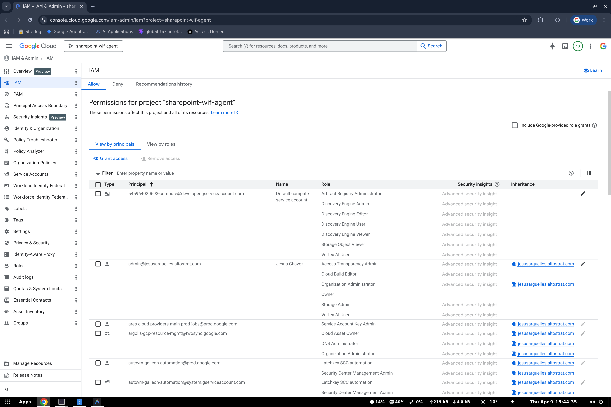
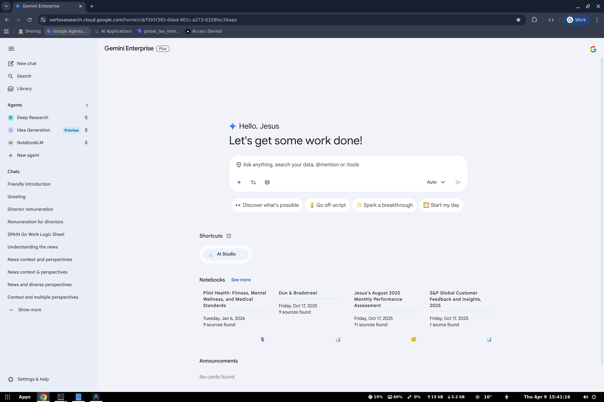

# Register in Gemini Enterprise

> **Navigation**: [README](../README.md) | [Overview](01-OVERVIEW.md) | [Prerequisites](02-PREREQUISITES.md) | [Deploy](03-DEPLOY-AGENT-ENGINE.md) | **Register** | [Testing](05-TESTING.md) | [Troubleshooting](06-TROUBLESHOOTING.md)

This is where the cross-project magic happens: we register the Agent Engine from `sharepoint-wif-agent` into the Agentspace in `vtxdemos`.





---

## Step 1: IAM Cross-Project Binding

The Discovery Engine service account in `vtxdemos` needs permission to call the Agent Engine in `sharepoint-wif-agent`:

```bash
gcloud projects add-iam-policy-binding sharepoint-wif-agent \
  --member="serviceAccount:service-REDACTED_PROJECT_NUMBER@gcp-sa-discoveryengine.iam.gserviceaccount.com" \
  --role="roles/aiplatform.user"
```

| Field | Value |
|-------|-------|
| **Target project** | `sharepoint-wif-agent` (where Agent Engine lives) |
| **Service account** | `service-REDACTED_PROJECT_NUMBER@gcp-sa-discoveryengine.iam.gserviceaccount.com` (vtxdemos DE SA) |
| **Role** | `roles/aiplatform.user` (allows Agent Engine queries) |

**Why this works**: When a user queries the agent in Gemini Enterprise (vtxdemos), the Discovery Engine service account makes the cross-project call to the Agent Engine in sharepoint-wif-agent. Without this IAM binding, the call gets `PERMISSION_DENIED`.

---

## Step 2: Register Agent

```bash
uv run python register_agent.py
```

Output:
```
=====================================
Registering Agent in Gemini Enterprise
=====================================
Agent Engine:    projects/REDACTED_PROJECT_NUMBER/locations/us-central1/reasoningEngines/7011410278222921728
Agentspace App:  agentspace-testing_1748446185255
GE Project:      vtxdemos
Display Name:    Cross-Project Assistant
=====================================

=====================================
Registration Complete!
=====================================
Agent Name: projects/REDACTED_PROJECT_NUMBER/locations/global/.../agents/410068398271859395
Display:    Cross-Project Assistant
=====================================

Shared with ALL_USERS.

The agent is now available in Gemini Enterprise at:
  Project: vtxdemos
  Agentspace: agentspace-testing_1748446185255
```

> **Note**: `register_agent.py` automatically shares the agent with `ALL_USERS` after registration. No manual sharing step needed.

---

## How register_agent.py Works

```python
# The payload links the Agentspace (Project B) to the Agent Engine (Project A)
payload = {
    "displayName": "Cross-Project Assistant",
    "description": "...",
    "adk_agent_definition": {
        "tool_settings": {
            "tool_description": "Use this agent to answer questions."
        },
        "provisioned_reasoning_engine": {
            # This is the cross-project reference:
            # Agent Engine lives in sharepoint-wif-agent (REDACTED_PROJECT_NUMBER)
            # but we're registering it in vtxdemos (REDACTED_PROJECT_NUMBER)
            "reasoning_engine": "projects/REDACTED_PROJECT_NUMBER/locations/us-central1/reasoningEngines/7011410278222921728"
        },
    },
}

# POST to Discovery Engine API in vtxdemos
api_url = "https://discoveryengine.googleapis.com/v1alpha/projects/REDACTED_PROJECT_NUMBER/locations/global/.../agents"
```

---

## Step 3: Share Agent with Users (automatic)

`register_agent.py` automatically shares the agent with all users after registration. If you need to do it manually:

```bash
export AGENT_ID="410068398271859395"

curl -X PATCH \
  -H "Authorization: Bearer $(gcloud auth print-access-token)" \
  -H "Content-Type: application/json" \
  -H "X-Goog-User-Project: vtxdemos" \
  "https://discoveryengine.googleapis.com/v1alpha/projects/REDACTED_PROJECT_NUMBER/locations/global/collections/default_collection/engines/agentspace-testing_1748446185255/assistants/default_assistant/agents/${AGENT_ID}?updateMask=sharingConfig" \
  -d '{
    "sharingConfig": {
      "scope": "ALL_USERS"
    }
  }'
```

---

## Verification

### List Registered Agents

```bash
curl -s -X GET \
  -H "Authorization: Bearer $(gcloud auth print-access-token)" \
  -H "X-Goog-User-Project: vtxdemos" \
  "https://discoveryengine.googleapis.com/v1alpha/projects/REDACTED_PROJECT_NUMBER/locations/global/collections/default_collection/engines/agentspace-testing_1748446185255/assistants/default_assistant/agents" \
  | jq '.agents[] | {name, displayName, description}'
```

### Get Specific Agent

```bash
curl -s -X GET \
  -H "Authorization: Bearer $(gcloud auth print-access-token)" \
  -H "X-Goog-User-Project: vtxdemos" \
  "https://discoveryengine.googleapis.com/v1alpha/projects/REDACTED_PROJECT_NUMBER/locations/global/collections/default_collection/engines/agentspace-testing_1748446185255/assistants/default_assistant/agents/410068398271859395" \
  | jq .
```

---

## Update Agent

To update the agent's display name, description, or tool settings:

```bash
export AGENT_ID="410068398271859395"

curl -X PATCH \
  -H "Authorization: Bearer $(gcloud auth print-access-token)" \
  -H "Content-Type: application/json" \
  -H "X-Goog-User-Project: vtxdemos" \
  "https://discoveryengine.googleapis.com/v1alpha/projects/REDACTED_PROJECT_NUMBER/locations/global/collections/default_collection/engines/agentspace-testing_1748446185255/assistants/default_assistant/agents/${AGENT_ID}?updateMask=displayName,description" \
  -d '{
    "displayName": "Cross-Project Assistant v2",
    "description": "Updated description"
  }'
```

---

## Delete Agent

```bash
export AGENT_ID="410068398271859395"

curl -X DELETE \
  -H "Authorization: Bearer $(gcloud auth print-access-token)" \
  -H "X-Goog-User-Project: vtxdemos" \
  "https://discoveryengine.googleapis.com/v1alpha/projects/REDACTED_PROJECT_NUMBER/locations/global/collections/default_collection/engines/agentspace-testing_1748446185255/assistants/default_assistant/agents/${AGENT_ID}"
```

---

**Next**: [Testing →](05-TESTING.md)
