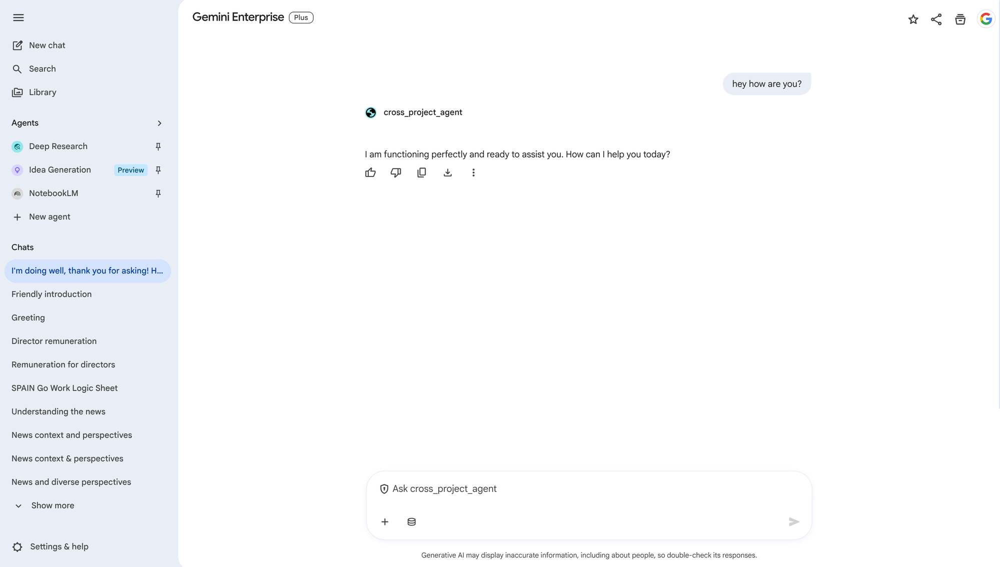

# Testing

> **Navigation**: [README](../README.md) | [Overview](01-OVERVIEW.md) | [Prerequisites](02-PREREQUISITES.md) | [Deploy](03-DEPLOY-AGENT-ENGINE.md) | [Register](04-REGISTER-GEMINI-ENTERPRISE.md) | **Testing** | [Troubleshooting](06-TROUBLESHOOTING.md)

---

## Testing Stages

```
Local (InMemoryRunner)  →  Remote (Agent Engine SDK)  →  Gemini Enterprise (UI)
      test_local.py           test_remote.py              Browser
```

---

## 1. Local Testing

Tests the agent in-memory without deploying:

```bash
uv run python test_local.py
```

```
==================================================
Query: What is Vertex AI Agent Engine?
==================================================

Response: Vertex AI Agent Engine is a fully managed platform...

==================================================
Query: Explain the difference between Gemini Pro and Flash
==================================================

Response: Gemini Pro is designed for complex reasoning tasks...
```

**When to use**: During agent development, before deploying.

---

## 2. Remote Testing (Agent Engine)

Tests the deployed agent in `sharepoint-wif-agent`:

```bash
uv run python test_remote.py
```

**Requires**: `REASONING_ENGINE_RES` set in `.env`.

```
Connecting to: projects/REDACTED_PROJECT_NUMBER/locations/us-central1/reasoningEngines/7011410278222921728

==================================================
Query: What is Vertex AI?
==================================================
Vertex AI is Google Cloud's unified machine learning platform...
```

### Raw API Testing

```bash
export REASONING_ENGINE_RES="projects/REDACTED_PROJECT_NUMBER/locations/us-central1/reasoningEngines/7011410278222921728"

# Create session
curl -X POST \
  "https://us-central1-aiplatform.googleapis.com/v1/${REASONING_ENGINE_RES}:createSession" \
  -H "Authorization: Bearer $(gcloud auth print-access-token)" \
  -H "Content-Type: application/json" \
  -d '{"input": {"user_id": "test-user"}}'

# Query (replace SESSION_ID)
curl -X POST \
  "https://us-central1-aiplatform.googleapis.com/v1/${REASONING_ENGINE_RES}:streamQuery" \
  -H "Authorization: Bearer $(gcloud auth print-access-token)" \
  -H "Content-Type: application/json" \
  -d '{
    "input": {
      "message": "What is Vertex AI?",
      "user_id": "test-user",
      "session_id": "SESSION_ID"
    }
  }'
```

---

## 3. Gemini Enterprise Testing

After registration, test directly in the Agentspace UI:



1. Navigate to your Gemini Enterprise instance
2. Find `cross_project_agent` in the agent list
3. Ask: "hey how are you?"
4. Verify the response comes from the agent in `sharepoint-wif-agent`

---

## Verify Cross-Project Call

Check Agent Engine logs to confirm queries are hitting `sharepoint-wif-agent`:

```bash
gcloud logging read \
  'resource.type="aiplatform.googleapis.com/ReasoningEngine" resource.labels.reasoning_engine_id="7011410278222921728"' \
  --project=sharepoint-wif-agent \
  --limit=10 \
  --format='table(timestamp, textPayload)'
```

---

**Next**: [Troubleshooting →](06-TROUBLESHOOTING.md)
