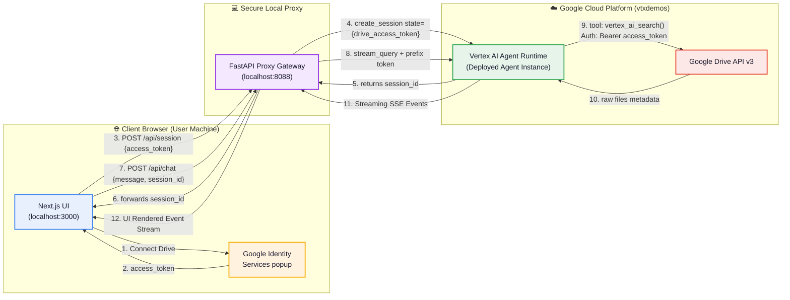
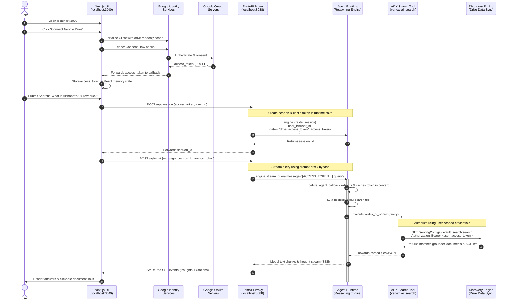

<h1 align="center">adk-drive-ae</h1>

<p align="center">
  <strong>An ADK Google Drive agent deployed to Vertex AI Agent Runtime, featuring a custom Next.js OAuth UI that securely passes user-scoped access tokens into the agent's session.</strong>
</p>

<p align="center">
  
  
  
  
  
  
</p>

---

## 📖 Project Purpose & Summary

A standard agent integration (like `adk-drive-via-appint`) uses local development UI popups for OAuth. While perfect for sandbox prototyping, production enterprise applications require a clear separation between **where the user signs in** and **where the agent runs**. 

This repository demonstrates how to build a decoupled, secure, production-grade architecture:
* 🌐 **The Browser (Next.js UI)** hosts the OAuth flow via Google Identity Services (GIS).
* 🔒 **FastAPI Proxy** manages connections, sessions, and streams tokens safely to Vertex AI.
* 🤖 **Agent (Google ADK)** runs inside Google's serverless **Agent Runtime** (Reasoning Engine), executing grounded queries using the user's secure credentials.

---

## 📐 Architecture & Data Flow

### Systems Topology


---

## 🔒 Secure Token-Passing Sequence

To pass a user's short-lived OAuth token securely to a deployed serverless agent without exposing parameters or triggering schema validation errors, this project uses a three-phase handshake pattern. 

### Sequence Diagram


---

## 💻 Code walkthrough: Dynamic Token Injection

Here are the key snippets showing exactly how the GSuite / Google Drive access token is securely propagated from client connection to API invocation.

### Step 1: Frontend Authenticates & Requests Session (Next.js)
When the user connects their Google Drive, the React app sends the access token to the FastAPI proxy to establish a session with the Agent Runtime:
```typescript
// frontend/lib/api.ts
export async function createSession(accessToken: string, userId: string): Promise<string> {
  const res = await fetch(`${BACKEND_URL}/api/session`, {
    method: 'POST',
    headers: { 'Content-Type': 'application/json' },
    body: JSON.stringify({ access_token: accessToken, user_id: userId, message: "" })
  });
  const data = await res.json();
  return data.session_id; // Deployed Agent Runtime session identifier
}
```

### Step 2: Session Setup & Token Persistence (FastAPI)
The FastAPI backend creates a session in the deployed Reasoning Engine and caches the token in the session's active dictionary state:
```python
# backend/main.py
@app.post("/api/session")
def create_session(body: ChatRequest):
    engine = _engine() # Retrieves reference to deployed Reasoning Engine
    
    # Store access token in session state for Drive datastore auth
    state = {
        "temp:drive_access_token": body.access_token, 
        "drive_access_token": body.access_token
    }
    
    # Creates session on Vertex AI with cached credentials
    session = engine.create_session(user_id=body.user_id, state=state)
    return {"session_id": session.get("id")}
```

### Step 3: Prompt-Prefix Token Refresh (FastAPI)
For every chat message, the FastAPI server prepends the access token to the prompt before starting the stream. This ensures the credentials are always fresh:
```python
# backend/main.py
async def _sse_stream(user_id, session_id, message, access_token):
    # Prefix the message so the pre-agent callback can intercept it
    msg_to_send = f"[ACCESS_TOKEN:{access_token}] {message}"
    
    for event in engine.stream_query(
        user_id=user_id,
        session_id=session_id,
        message=msg_to_send,
    ):
        yield serialize(event)
```

### Step 4: Callback Interception & Strip (ADK Agent)
On Google Cloud, the pre-agent callback intercepts the incoming message, extracts the token, cache-synchronizes it in the session state, and strips the prefix so the LLM never sees it:
```python
# agent/agent.py
async def extract_token_callback(callback_context: CallbackContext) -> None:
    text = ""
    for part in callback_context.user_content.parts:
        if part.text:
            text += part.text
            
    # Extract access token prefix if present
    m_token = re.match(r"^\[ACCESS_TOKEN:(.*?)\]\s*(.*)$", text, re.DOTALL)
    if m_token:
        token = m_token.group(1)
        text = m_token.group(2) # Strip the prefix
        
        # Save token directly to active context session state
        callback_context.state["drive_access_token"] = token
        callback_context.state["temp:drive_access_token"] = token
        
    # Overwrite the user's prompt in-place to keep it clean for the LLM
    for part in callback_context.user_content.parts:
        if part.text:
            part.text = text
```

### Step 5: Authorized Tool Execution (ADK Tool)
When the LLM decides to search Google Drive/GCS, the tool retrieves the user's access token directly from `ToolContext` and queries Discovery Engine:
```python
# agent/agent.py
@tool
def vertex_ai_search(query: str, tool_context: ToolContext) -> dict:
    # 1. Grab user OAuth token from session state (fallback to temp:)
    token = tool_context.state.get("drive_access_token") or tool_context.state.get("temp:drive_access_token")
    
    # 2. Add as Bearer header
    headers = {
        "Authorization": f"Bearer {token}",
        "Content-Type": "application/json",
        "X-Goog-User-Project": GCP_PROJECT_NUMBER,
    }
    
    # 3. Securely query Discovery Engine (with document-level ACL checks)
    response = requests.post(api_url, headers=headers, json=request_body)
    return response.json()
```

---

## 🚀 Quickstart

### 1. Requirements & Enabling APIs
Enable target services in your GCP project and create a staging storage bucket for deployment:
```bash
# Enable Vertex AI, Discovery Engine, and Drive APIs
gcloud services enable aiplatform.googleapis.com discoveryengine.googleapis.com drive.googleapis.com --project=YOUR_PROJECT_ID

# Create GCS staging bucket (used to package python code)
gcloud storage buckets create gs://YOUR_PROJECT_ID-agent-engine --location=us-central1 --project=YOUR_PROJECT_ID
```

### 2. Configure Environment Files
Copy example configuration templates and populate your credentials:
```bash
# 1. Core project & deployed engine config
cp .env.example .env
# Edit inside .env:
#   GOOGLE_CLOUD_PROJECT=your-project-id
#   DEPLOY_STAGING_BUCKET=gs://your-project-id-agent-engine
#   AGENT_ENGINE_RESOURCE=  (this will be filled after deployment)

# 2. Frontend OAuth client config
cp frontend/.env.local.example frontend/.env.local
# Edit inside frontend/.env.local:
#   NEXT_PUBLIC_GOOGLE_CLIENT_ID=your-google-oauth-web-client-id.apps.googleusercontent.com
```
> [!NOTE]
> To create an OAuth Web Client ID, go to Google Cloud Console ➔ **APIs & Services** ➔ **Credentials** ➔ **Create Credentials** ➔ **OAuth client ID** (Application type: **Web application**). Add `http://localhost:3000` to the **Authorized JavaScript origins**.

### 3. Deploy the Agent to Agent Runtime (Reasoning Engine)
Run the deploy script inside `dev_testing/` to deploy the agent package to Vertex AI:
```bash
# Install local dependencies
uv sync && (cd frontend && npm install)

# Package and deploy agent code to Google Cloud (takes ~3 minutes)
uv run python dev_testing/deploy.py new
```
At the end of the deployment run, copy the printed resource name:
```
[deploy] resource_name = projects/123456789/locations/us-central1/reasoningEngines/5924444078119845888
```
Paste this into your `.env` as:
```env
AGENT_ENGINE_RESOURCE="projects/123456789/locations/us-central1/reasoningEngines/5924444078119845888"
```

---

## 🏃 Running the Servers

To test the application locally, you need the **FastAPI proxy** and the **Next.js frontend** running simultaneously:

| Terminal Pane | Action | Command |
| :--- | :--- | :--- |
| **Terminal 1: Backend** | Start FastAPI gateway on port `8088` | `.venv/bin/uvicorn backend.main:app --port 8088 --reload` |
| **Terminal 2: Frontend** | Start Next.js on port `3000` | `cd frontend && npm run dev` |

Once both are active, open **`http://localhost:3000`** in your browser, connect Google Drive, and ask questions!

---

## 💻 Local Sandbox Testing (No Servers Needed)

If you or your customers want to quickly test the agent logic entirely in-memory without running any servers, use the root-level local smoke-test runner:

```bash
# 1. Set your Drive Access Token
export DRIVE_ACCESS_TOKEN="ya29.your_gsuite_oauth_access_token..."

# 2. Run query
python test_local.py "show 5 of my files"
```

---

## 📂 Simplified Project Layout

This repository has been strictly clean-refactored to ensure maximum ease of understanding for clients and developers:

```
custom_ui_adk_vais_gcs_gdrive/
├── agent/                ← Deployed ADK Agent codebase
│   └── agent.py          ← Core agent definitions, tool schema, and callbacks
│
├── backend/              ← FastAPI Serving Gateway Proxy
│   └── main.py           ← API streaming endpoints, session caching, and prompt prefixing
│
├── frontend/             ← Next.js 15 UI Web Panel
│   ├── app/              ← Page views and styles loading GIS popup
│   ├── components/       ← Chat panels, stream consumers, and Drive buttons
│   └── lib/              ← Client-side API fetchers
│
├── test_local.py         ← Single-file, in-memory local runner for easy terminal testing
├── pyproject.toml        ← Project dependencies
├── README.md             ← This documentation
│
└── dev_testing/          ← [Developer Box] Houses staging tests, deployment scripts, & backups
```

---

<p align="center">
  <em>Built by Jesús Chávez · Part of the <a href="https://github.com/jchavezar/vertex-ai-samples">vertex-ai-samples</a> family.</em>
</p>
