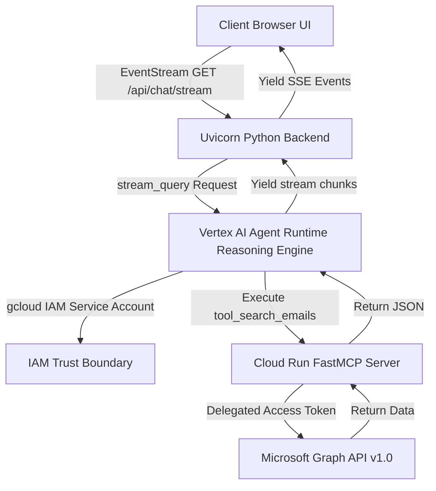
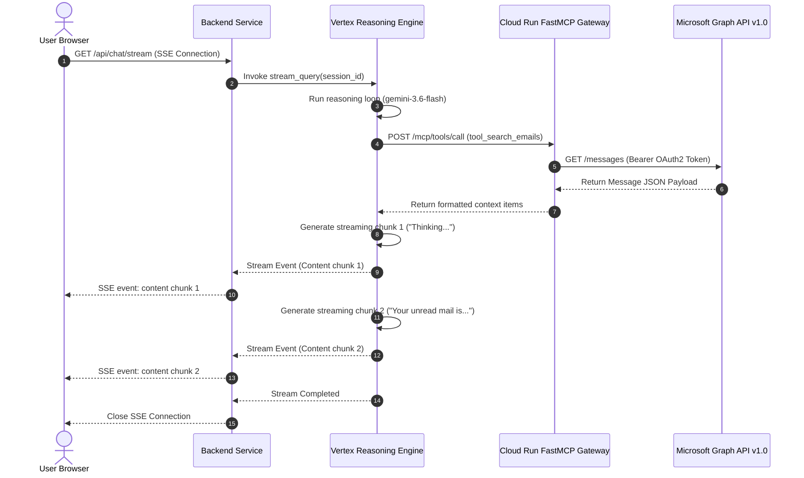

# Low-Level Design (LLD) — Production Agent Platform (`cloud-agent-platform`)

This document describes the production architecture, communication routing, Vertex AI deployment layouts, and schema validations of the **Production M365 Outlook Agent Platform**.

---

## 1. Production Component Topology

The production setup utilizes a containerized MCP server deployed to Cloud Run, a Vertex AI Reasoning Engine managing the LLM runtime, and a dedicated backend server for SSE (Server-Sent Events) streaming.



### Core Architecture Artifacts
1. **`mcp-server/mcp_server.py`**: FastMCP application defining the tools (`tool_search_emails`, `tool_get_email_full_body`, etc.). Deployed as a containerized endpoint in GCP Cloud Run.
2. **`adk-agent/agent.py`**: The ADK agent initialization code that dynamically loads `system_instructions.txt`, bundles tools, and establishes the Vertex Reasoning Engine connection.
3. **`custom-ui-production/backend/main.py`**: Serves the UI and pipes user session requests to the remote Reasoning Engine endpoint.

---

## 2. ADK Agent & Model Context Protocol (MCP) Sequence Flow

The following sequence describes how streaming answers are generated when tool execution is requested:



---

## 3. Vertex AI Reasoning Engine Packaging & Deployment

To deploy the ADK Agent package to Vertex AI, the Python deployer (`deploy.py`) compiles the agent context using a staging Google Cloud Storage (GCS) bucket:

```mermaid
graph TD
    A[deploy.py Executed] --> B[Read system_instructions.txt]
    B --> C[Create extra_packages tar file containing system_instructions.txt]
    C --> D[Pickle adk-agent/agent.py LlmAgent configuration]
    D --> E[Upload dependencies.tar.gz and requirements.txt to gs://vtxdemos_staging]
    E --> F[Call Vertex Reasoning Engine SDK engine.update()]
    F --> G[Vertex compiles Reasoning Engine endpoint 3073250998110650368]
```

---

## 4. Prompt Engineering & Freshness Boundaries

The Reasoning Engine runtime enforces a strict separation between dialogue history and real-time state fetches by utilizing prompt guardrails defined in `system_instructions.txt`:

```text
7. REAL-TIME FRESHNESS: If the user asks a real-time state query (e.g., "what is my latest unread message?", "current calendar events", "show my latest email"), you MUST execute a fresh tool call to retrieve the current state, even if a similar query was already answered in the conversation history. Do NOT recycle or assume the state from previous turns.
```
