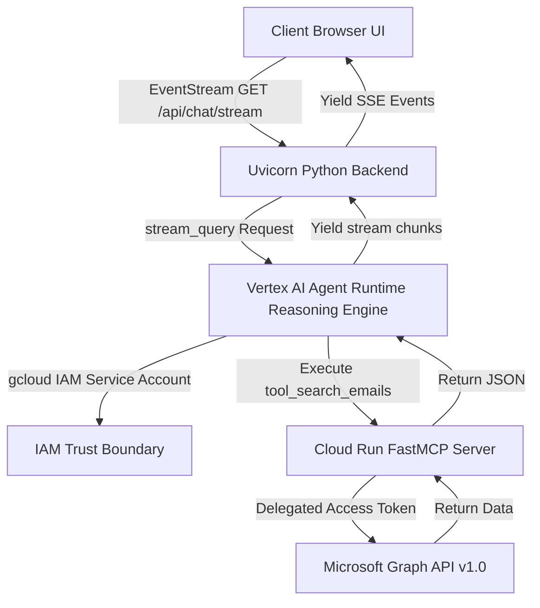
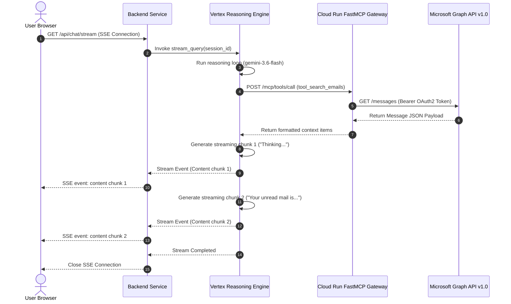

# Low-Level Design (LLD) — Production Agent Platform (`cloud-agent-platform`)

This document describes the production architecture, communication routing, Vertex AI deployment layouts, and schema validations of the **Production M365 Outlook Agent Platform**.

---

## 1. Production Component Topology

The production setup utilizes a containerized MCP server deployed to Cloud Run, a Vertex AI Reasoning Engine managing the LLM runtime, and a dedicated backend server for SSE (Server-Sent Events) streaming.



### Core Architecture Artifacts
1. **`mcp-server/mcp_server.py`**: FastMCP application defining the tools (`tool_search_emails`, `tool_get_email_full_body`, etc.). Deployed as a containerized endpoint in GCP Cloud Run.
2. **`adk-agent/agent.py`**: The ADK agent initialization code that dynamically loads `system_instructions.txt`, bundles tools, and establishes the Vertex Reasoning Engine connection.
3. **`custom-ui-production/backend/main.py`**: Serves the UI and pipes user session requests to the remote Reasoning Engine endpoint.

---

## 2. ADK Agent & Model Context Protocol (MCP) Sequence Flow

The following sequence describes how streaming answers are generated when tool execution is requested:



---

## 3. Vertex AI Reasoning Engine Packaging & Deployment

To deploy the ADK Agent package to Vertex AI, the Python deployer (`deploy.py`) compiles the agent context using a staging Google Cloud Storage (GCS) bucket:

```mermaid
graph TD
    A[deploy.py Executed] --> B[Read system_instructions.txt]
    B --> C[Create extra_packages tar file containing system_instructions.txt]
    C --> D[Pickle adk-agent/agent.py LlmAgent configuration]
    D --> E[Upload dependencies.tar.gz and requirements.txt to gs://vtxdemos_staging]
    E --> F[Call Vertex Reasoning Engine SDK engine.update()]
    F --> G[Vertex compiles Reasoning Engine endpoint 3073250998110650368]
```

---

## 4. Prompt Engineering & Freshness Boundaries

The Reasoning Engine runtime enforces a strict separation between dialogue history and real-time state fetches by utilizing prompt guardrails defined in `system_instructions.txt`:

```text
7. REAL-TIME FRESHNESS: If the user asks a real-time state query (e.g., "what is my latest unread message?", "current calendar events", "show my latest email"), you MUST execute a fresh tool call to retrieve the current state, even if a similar query was already answered in the conversation history. Do NOT recycle or assume the state from previous turns.

---

## 5. Model Context Protocol (MCP) Tool Specifications

The Cloud Run FastMCP gateway exposes the following tools to the Vertex AI Reasoning Engine:

### A. `search_emails` (Read-Only)
* **Description**: Search mailbox emails with keyword query expansion and date filtering.
* **Input Schema**:
  ```json
  {
    "type": "object",
    "properties": {
      "query": { "type": "string", "description": "Free-text keyword" },
      "sender": { "type": "string", "description": "Sender email address" },
      "hours_back": { "type": "string", "default": "24h", "description": "Lookback window e.g. 24h, 7d" },
      "unread_only": { "type": "boolean", "default": false, "description": "Filter unread only" },
      "limit": { "type": "integer", "default": 25 }
    }
  }
  ```

### B. `get_email_full_body` (Read-Only)
* **Description**: Fetch the complete body/payload for a specific email message ID.
* **Input Schema**:
  ```json
  {
    "type": "object",
    "properties": {
      "message_id": { "type": "string", "description": "The email message ID" }
    },
    "required": ["message_id"]
  }
  ```

### C. `list_meetings` (Read-Only)
* **Description**: List calendar meetings and schedule details within a time window.
* **Input Schema**:
  ```json
  {
    "type": "object",
    "properties": {
      "lookback": { "type": "string", "default": "24h" },
      "lookahead": { "type": "string", "default": "48h" },
      "limit": { "type": "integer", "default": 25 }
    }
  }
  ```

### D. `send_email` (Mutation)
* **Description**: Send an outgoing email message, optionally with attachment or priority.
* **Input Schema**:
  ```json
  {
    "type": "object",
    "properties": {
      "subject": { "type": "string" },
      "body": { "type": "string" },
      "to_recipients": {
        "type": "array",
        "items": { "type": "string" },
        "description": "List of recipient email addresses"
      },
      "importance": { "type": "string", "default": "normal", "description": "high, normal, low" },
      "attachment_filename": { "type": "string", "description": "Optional name of file to attach" }
    },
    "required": ["subject", "body", "to_recipients"]
  }
  ```

### E. `reply_email` (Mutation)
* **Description**: Reply to an existing email thread using the message ID and comments.
* **Input Schema**:
  ```json
  {
    "type": "object",
    "properties": {
      "message_id": { "type": "string" },
      "comment": { "type": "string" }
    },
    "required": ["message_id", "comment"]
  }
  ```

### F. `create_meeting` (Mutation)
* **Description**: Create/schedule a new calendar meeting.
* **Input Schema**:
  ```json
  {
    "type": "object",
    "properties": {
      "subject": { "type": "string" },
      "start_time": { "type": "string", "description": "ISO 8601 UTC format e.g. 2026-07-25T14:00:00Z" },
      "end_time": { "type": "string", "description": "ISO 8601 UTC format" },
      "attendees": {
        "type": "array",
        "items": { "type": "string" },
        "description": "List of invitee emails"
      }
    },
    "required": ["subject", "start_time", "end_time"]
  }
  ```

```
