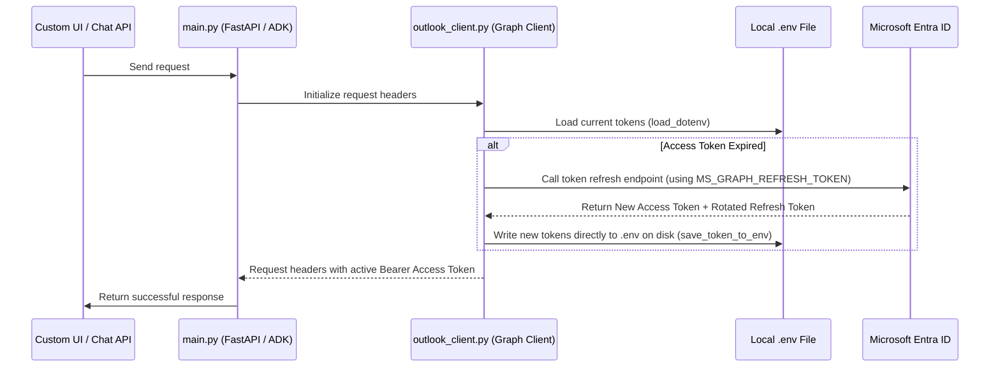
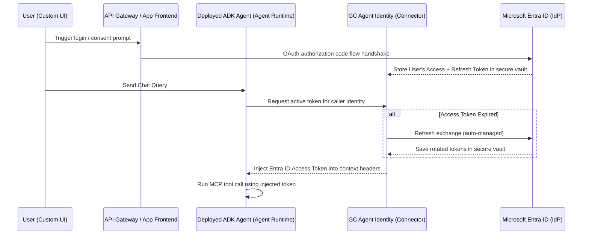

# Microsoft 365 / Entra ID Authentication Architecture

This document describes the authentication flow, token persistence logic, and best practices for transitioning this Google ADK + MCP server application from a local demo environment to a production Google Cloud Agent Runtime.

---

## 1. Local Development Architecture (.env Store)

In the local environment, user secrets are stored on disk in a `.env` file. To handle Microsoft Entra ID's token rotation policy, we have implemented an active disk-writing cache.

### Local Handshake Flow



### Key Implementation Details:
* **Token Rotation Persistence**: When Entra ID rotates the `refresh_token`, our helper `save_token_to_env` parses the `.env` file on disk and overwrites `MS_GRAPH_TOKEN` and `MS_GRAPH_REFRESH_TOKEN` immediately.
* **In-Memory Caching**: We check `os.getenv("MS_GRAPH_TOKEN")` before attempting a refresh, preventing redundant network requests.

---

## 2. Production Architecture (Agent Runtime & Google Cloud Agent Identity)

For production deployment with multiple users, writing tokens to a local `.env` file is a security risk and is not architecturally viable (since serverless runtimes like Cloud Run are stateless and ephemeral). 

We transition to **Google Cloud Agent Identity** (`GcpAuthProvider`), which manages the token lifecycle centrally in a secure vault.

### Production Delegated Auth Flow



### Production Best Practices:
1. **Stateless MCP Server**: The MCP server itself remains completely auth-agnostic. It does not load `.env` files or execute refresh logic. It simply accepts the `access_token` passed as an argument from the ADK agent.
2. **Platform-Managed Rotation**: Google Cloud Agent Identity handles the rotation and persistence of the Entra ID `refresh_token` in an encrypted token store, removing this burden from the application code.
3. **Audit Trails**: All access to Entra ID credentials is fully audited via Google Cloud IAM.

---

## 3. How to Transition from Local to Production

Our codebase is future-proofed and ready to transition without a rewrite:
1. **Environment Config**: In production, replace `load_dotenv` with a secrets manager fetch for the client secret and client ID.
2. **Deactivate Local Caching**: Remove the `save_token_to_env` call and register the ADK framework `GcpAuthProvider` once at startup:
   ```python
   from google.adk.auth.credential_manager import CredentialManager
   from google.adk.integrations.agent_identity import GcpAuthProvider
   
   CredentialManager.register_auth_provider(GcpAuthProvider())
   ```
3. **Bind Connectors**: Initialize the MCP tools using the GCP provider scheme pointing to your GCP Entra ID connector:
   ```python
   auth_scheme = GcpAuthProviderScheme(
       name="projects/PROJECT_ID/locations/LOCATION/connectors/ENTRA_ID_CONNECTOR"
   )
   ```
