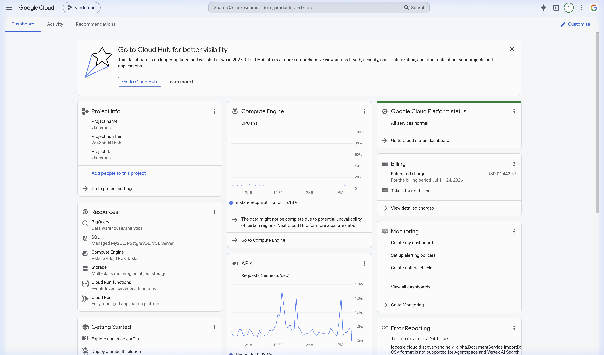

# Unified Security & Identity Configuration Guide (Entra ID, GCP WIF, & Agent Identity)

This document provides a single, comprehensive blueprint for configuring security, authentication, and delegated identity federation for the M365 Outlook AI Assistant. This setup is shared globally by both the **Local ADK Development** environment and the **Remote Reasoning Engine / Agent Runtime** environment.

---

## 1. Microsoft Entra ID Application Registration

To allow the assistant (both frontend and backend) to interact with Microsoft Graph API, you must register a Multi-Tenant Application in the Microsoft Entra ID Portal.

### App Manifest Implicit Flow Configuration
Some frontend SDKs (like MSAL.js) require Implicit Grant flow enabled to retrieve tokens directly in the user browser.

1. Navigate to the **Microsoft Entra admin center** > **App registrations** > Select your registered App.
2. In the left panel, click on **Manifest**.
3. Locate the following keys in the JSON configuration and set them to `true`:
   ```json
   "oauth2AllowImplicitFlow": true,
   "oauth2AllowIdTokenImplicitFlow": true
   ```
4. Click **Save**.

### Redirect URIs Configuration
For both local development and production, your Entra ID App Registration must permit redirect requests from your web applications.

* **Single-Page Application (SPA) Redirects**:
  * Local Dev: `http://localhost:5173/` (or your frontend Vite dev server)
  * Production: `https://<YOUR_STITCH_SUBDOMAIN>.web.app/`
* **Web / Confidential Client Redirects** (Required for GCP Search Connector / OAuth loops):
  * GCP Discovery Engine Callback: `https://vertexaisearch.cloud.google.com/oauth-redirect`
  * Local Server API Callback: `http://localhost:8001/api/oauth/callback`


### Delegated API Scopes & Permissions
Under **API permissions**, configure the following delegated scopes:
* `User.Read` (Sign in and read user profile)
* `Mail.ReadWrite` (Read and write user mail)
* `Mail.Send` (Send mail on behalf of user)
* `Calendars.ReadWrite` (Create and read meetings)
* `offline_access` (Required to get refresh tokens for long-term production use)

---

## 2. Google Cloud Workload Identity Federation (WIF)

Workload Identity Federation allows GCP services (such as the Vertex AI Reasoning Engine) to trust tokens issued by Microsoft Entra ID. This avoids hardcoding GCP service account keys in the application.

### OIDC Provider Setup
Configure a WIF Pool and Provider in Google Cloud to trust Entra ID as the OpenID Connect (OIDC) identity provider.

1. **Create WIF Pool**:
   ```bash
   gcloud iam workload-identity-pools create "m365-outlook-pool" \
       --location="global" \
       --display-name="M365 Outlook Identity Pool"
   ```
2. **Create OIDC Provider**:
   Register Microsoft Entra ID as the provider:
   ```bash
   gcloud iam workload-identity-pools providers create-oidc "entra-id-provider" \
       --workload-identity-pool="m365-outlook-pool" \
       --location="global" \
       --issuer-uri="https://login.microsoftonline.com/de46a3fd-0d68-4b25-8343-6eb5d71afce9/v2.0" \
       --attribute-mapping="google.subject=assertion.sub,attribute.email=assertion.email,attribute.tid=assertion.tid" \
       --allowed-audiences="OAUTH_CLIENT_ID"
   ```
   *Replace `OAUTH_CLIENT_ID` with your Entra ID Application Client ID.*



---

## 3. GCP Service Account Trust & Token Creator Bindings

To map federated Entra ID identities to GCP permissions, you must bind the OIDC subject to a target Google Cloud Service Account.

### IAM Trust Policy
The Google Cloud Service Account must be configured to accept credentials from the WIF provider by granting the `roles/iam.workloadIdentityUser` and `roles/iam.serviceAccountTokenCreator` roles.

1. **Grant Workload Identity User**:
   Allow the Entra ID tenant to impersonate the GCP Service Account:
   ```bash
   gcloud iam service-accounts add-iam-policy-binding "outlook-agent-sa@YOUR_PROJECT_ID.iam.gserviceaccount.com" \
       --role="roles/iam.workloadIdentityUser" \
       --member="principalSet://iam.googleapis.com/projects/YOUR_PROJECT_NUMBER/locations/global/workloadIdentityPools/m365-outlook-pool/attribute.tid/de46a3fd-0d68-4b25-8343-6eb5d71afce9"
   ```
2. **Grant Token Creator Role**:
   This enables exchange of the federated token for short-lived GCP access tokens:
   ```bash
   gcloud iam service-accounts add-iam-policy-binding "outlook-agent-sa@YOUR_PROJECT_ID.iam.gserviceaccount.com" \
       --role="roles/iam.serviceAccountTokenCreator" \
       --member="serviceAccount:outlook-agent-sa@YOUR_PROJECT_ID.iam.gserviceaccount.com"
   ```

---

## 4. Microsoft Graph Consent Loop Troubleshooting (AADSTS65001)

The most common error encountered during initial setup or token rotation is **`AADSTS65001`**:
> *"The user or administrator has not consented to use the application with ID 'xxxx'. Send an interactive authorization request for this user and resource."*

### Why this happens
This occurs because Microsoft Entra ID requires explicit user or admin consent before granting access to sensitive scopes (`Mail.ReadWrite`, `Mail.Send`, `Calendars.ReadWrite`) for a given tenant.

### Step-by-Step Resolution
1. **Force Admin Consent (Recommended for enterprise setup)**:
   * Go to **API permissions** in your Entra ID App registration.
   * Click **Grant admin consent for <your-tenant-name>**.
   * Click **Yes** to confirm.
2. **Trigger Interactive Consent Prompt**:
   If user-level consent is required:
   * Direct the user to the following authentication URL template in their browser:
     ```text
     https://accounts.google.com/o/oauth2/v2/auth?client_id=<client_id>&scope=https%3A%2F%2Fwww.googleapis.com%2Fauth%2Fchat.messages.create+https%3A%2F%2Fwww.googleapis.com%2Fauth%2Fgmail.send&include_granted_scopes=true&response_type=code&access_type=offline&prompt=consent
     ```
   * Let the user complete the sign-in and click **Accept** on the permissions screen.


---

## 5. Security Summary Checklist

| Component | Target Action | Verification Metric |
| :--- | :--- | :--- |
| **Entra ID App** | Manifest Edit | `oauth2AllowImplicitFlow: true` |
| **Entra ID App** | Redirect URI | SPA Redirect configured to SPA url |
| **GCP WIF** | Pool Created | `m365-outlook-pool` state is Active |
| **GCP WIF** | Provider Mapping | Issuer URI matches Entra tenant URL |
| **GCP IAM** | Service Account Binding | `roles/iam.workloadIdentityUser` bound to provider |
| **GCP IAM** | Token impersonation | `roles/iam.serviceAccountTokenCreator` bound to SA self |
| **MS Graph API** | Admin Consent | "Status" col shows green checkmarks |
