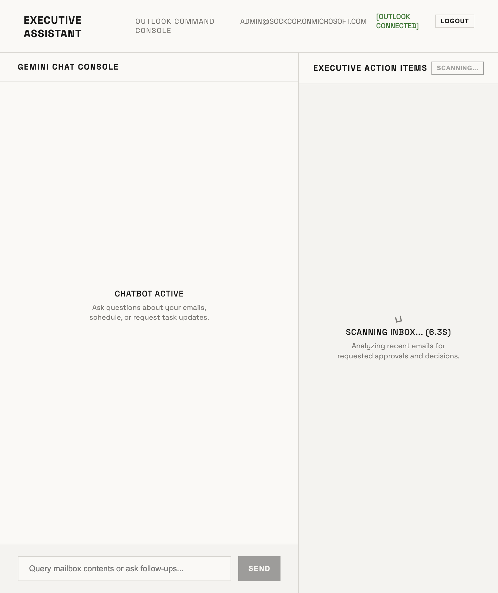

# Getting Started — StreamAssist Approval Chatbot (`ge-streamassist`)

This guide walks you through registering the Portal and Connector apps in Microsoft Entra, configuring Google Cloud Workforce Identity Federation (WIF), setting up your environment, and starting the split-pane executive workspace.

---

## 1. Microsoft Entra ID Registrations

To enable authentication and secure Graph API operations, you must register two apps:

### A. Connector App (Outlook Datastore Link)
1. Go to **Entra ID Portal** > **App registrations** > **New registration**.
2. **Name**: `Outlook StreamAssist Connector App`.
3. **Redirect URI (Web)**: `https://vertexaisearch.cloud.google.com/oauth-redirect`.
4. **Certificates & Secrets**: Generate a Client Secret and copy its value.
5. **API Permissions**: Add delegated permissions:
   - `User.Read`
   - `Mail.Read`
   - `Calendars.Read`

### B. Portal App (User Authentication & MSAL Login)
1. Register a second App named `Outlook Executive Workspace Portal`.
2. **Redirect URI (SPA)**: `http://localhost:5173` (React frontend).
3. **Expose an API**: Set Application ID URI to `api://<your_portal_client_id>`. Add scope `user_impersonation`.
4. **Manifest**: Ensure `"oauth2AllowIdTokenImplicitFlow": true` is set to enable ID Token exchanges.
5. **API Permissions**: Add delegated permissions:
   - `User.Read`
   - `openid`, `profile`, `email`, `offline_access`

---

## 2. Google Cloud WIF & Search App Setup

1. **Workforce Identity Pool**: Create a Workforce Pool named `sp-wif-pool-v2` in location `global`.
2. **Workforce Provider**: Add an OpenID Connect (OIDC) provider pointing to Azure Entra ID Issuer URI, mapping Entra assertions to Google credentials.
3. **GCP Data Connector**: Create a federated connector using your **Connector App** credentials (Client ID + Client Secret) to sync the M365 Outlook Mailbox.
4. **Grant Roles**: Ensure your Google workforce members are granted the `roles/discoveryengine.editor` role.

---

## 3. Configuration Setup (`.env`)

Set up `.env` files in both the `backend` and `frontend` subfolders.

### Backend Configurations (`backend/.env`)
```env
PROJECT_NUMBER=<your_gcp_project_number>
ENGINE_ID=gemini-enterprise
CONNECTOR_ID=<your_outlook_connector_id>
WIF_POOL_ID=sp-wif-pool-v2
WIF_PROVIDER_ID=entra-provider
CONNECTOR_CLIENT_ID=<your_connector_app_client_id>
TENANT_ID=<your_azure_entra_tenant_id>
REDIRECT_URI=https://vertexaisearch.cloud.google.com/oauth-redirect
```

### Frontend Configurations (`frontend/.env`)
```env
VITE_CLIENT_ID=<your_portal_app_client_id>
VITE_TENANT_ID=<your_azure_entra_tenant_id>
```

---

## 4. Run the Backend & Frontend

Start both servers locally to run the app:

### Start Backend
```bash
cd ge-streamassist/backend
python3 -m venv .venv
source .venv/bin/activate
pip install -r requirements.txt
python main.py
```
*Note: Backend server runs on port `8005`.*

### Start Frontend
```bash
cd ../frontend
npm install
npm run dev
```
*Note: Frontend dev server runs on port `5173` and proxies API requests to `8005`.*

---

## 5. Visual Configurations & Screenshots

### Azure Consent Prompts
When a user connects Outlook for the first time, Microsoft Entra will show a delegated consent screen matching the configured permissions:


### Real-Time Stopwatch Verification
Click **Scan Inbox** in the split-pane UI. The system will start a stopwatch to measure latency during the multi-connector broadcast search, displaying elapsed time dynamically:


