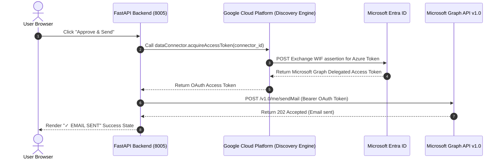

# Low-Level Design (LLD) — StreamAssist Approval Chatbot (`ge-streamassist`)

This document describes the low-level design, API definitions, data schemas, and authentication handshake sequences for the **Gemini Enterprise StreamAssist Approval Chatbot**.

---

## 1. Split-Pane Architecture & Component Layout

The system implements a split-pane executive cockpit with a Chat Console (powered by StreamAssist Search Engine) on the left, and an Action Items Inbox (powered by Microsoft Graph API reply endpoints) on the right.

```mermaid
graph TD
    A[React Client Port 5173] -->|Scan Inbox GET /api/scan| B[FastAPI Backend Port 8005]
    B -->|StreamAssist API| C[GCP Discovery Engine Search Engine]
    C -->|Microsoft Graph Connector| D[Microsoft 365 Exchange Online]
    A -->|Direct Approval POST /api/reply| B
    B -->|Acquire Access Token| E[GCP Discovery Engine Connector Client]
    E -->|Delegated Token Exchange| D
    B -->|POST /v1.0/me/messages/{id}/reply| D
```

### Technical Component Breakdown
1. **Left-Pane Chat Handler**: Proxies chat messages to the Discovery Engine `streamAssist` method, resolving answers with grounding sources indexed from the Outlook data connector.
2. **Right-Pane Scanner**: Requests inbox task analysis using a structured LLM system prompt. Renders task items requiring manual sign-off as high-visibility card nodes.
3. **Microsoft Graph Token Broker**: Uses Workforce Identity Federation (WIF) and the `acquireAccessToken` endpoint of the Discovery Engine connector schema to execute Graph API calls securely.

---

## 2. Workforce Identity & Token Exchange Handshake

To execute direct approval actions (e.g. replying to an email thread or sending a draft), the backend exchanges WIF credentials for a Microsoft Graph access token:



---

## 3. Data Schemas & Tool Definitions

### Inbox Scan Result Payload (`GET /api/scan`)
```json
{
  "action_items": [
    {
      "id": "AAMkADZi...",
      "subject": "Go/no-go tonight's v2.3 deployment status",
      "sender": "Aleksandra Kiszkiel",
      "summary": "Tonight's deployment is pending your review and sign-off.",
      "receivedDateTime": "2026-07-26T14:22:00Z"
    }
  ]
}
```

### Outbound Reply Request (`POST /api/reply`)
```json
{
  "message_id": "AAMkADZi...",
  "action": "approve",
  "comment": "Approved. Team has go-ahead for deployment."
}
```
