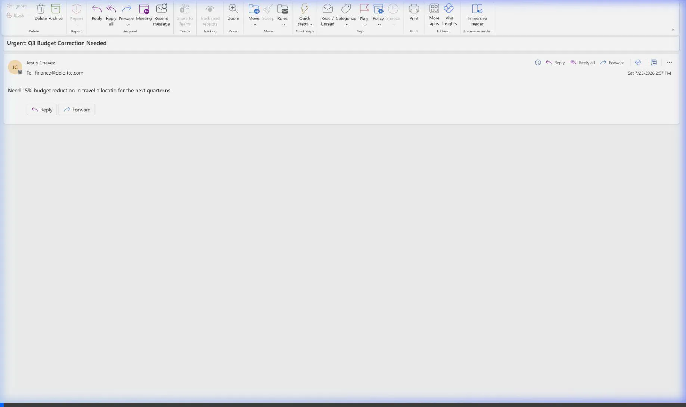

# M365 Outlook Assistant — Local ADK + MSAL Implementation (`local-adk-mcp`)

This directory contains the **100% direct local development environment** for the Microsoft 365 Outlook Executive Assistant. It uses Microsoft Authentication Library (MSAL) for delegated user authentication and direct parallel Microsoft Graph API queries.

---

## 🏗️ Architecture

```
[Local Browser UI] ──(HTTP/SSE)──> [FastAPI Backend (port 8001)] ──(MSAL / Graph API)──> [Microsoft 365 Outlook]
                                            │
                                  [Google GenAI SDK] (gemini-3.6-flash)
```

---

## 🚀 Key Features

* **Ultra-Fast Parallel Federated Search**: Executes parallel Microsoft Graph API requests (Profile + Mailbox + Calendar) in `~1.2 seconds`.
* **Direct Gemini 3.6 Flash Grounding**: Generates concise, executive-ready answers in `~3.3 seconds` (Total latency: `~4.5s`).
* **Interactive UI**: Includes the Yazdani star spinner animation (`✳ ✻ ❋ ✽ ※ ✷ ✸`), animated sweep text, live execution timer (`⏱️ X.Xs`), and 100-case evaluation dashboard (`/eval`).

## 📖 Documentation Index

* 🛠️ **[Getting Started Guide](docs/getting_started.md)**: App registration, dotenv setup, and startup commands.
* 📐 **[Low-Level Design (LLD)](docs/low_level_design.md)**: Components topology, authentication sequence, and database schemas.

---

## ⚡ Interactive Chat & Yazdani Auto-Scroll UI


---

## 🛠️ Quick Start

1. **Configure Environment**:
   Ensure `.env` in the root project folder contains the Client ID, Client Secret, Tenant ID, and GCP project identifier.
2. **Start Backend**:
   ```bash
   cd local-adk-mcp
   PYTHONPATH=. .venv/bin/python3 backend/main.py
   ```
3. **Inspect Evaluation**:
   Open `http://localhost:8005/eval` in your browser.
   * 📊 **[Live HTML Evaluation Preview (No-Download Static)](https://htmlpreview.github.io/?https://github.com/jesusarguelles/vertex-ai-samples/blob/main/semiautonomous-agents/custom_ui_mcp_outlook/eval_dashboard_static.html)**
