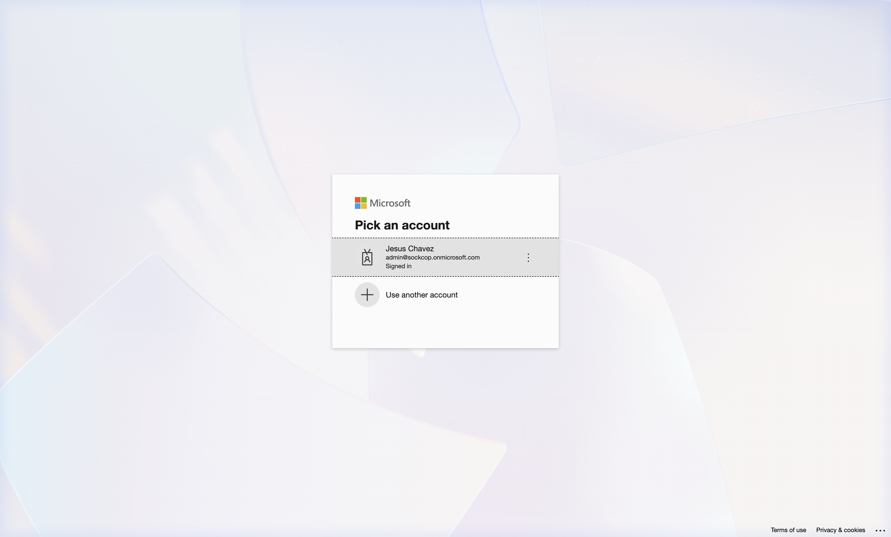

# Getting Started — Local ADK Assistant (`local-adk-mcp`)

This guide walks you through registering the Entra application, configuring your local environment, and starting the local FastAPI server and evaluation console.

---

## 1. Prerequisites & Dependencies

First, ensure you have Python 3.10+ installed. Install the package dependencies using virtual environments:

```bash
cd local-adk-mcp
python3 -m venv .venv
source .venv/bin/activate
pip install -r requirements.txt
```

---

## 2. Microsoft Entra ID Application Registration

To query your Outlook mailbox via Graph API, register an application in the [Microsoft Entra admin center](https://entra.microsoft.com/):

1. Navigate to **App registrations** > **New registration**.
2. **Name**: `Outlook Executive Assistant (Local Dev)`.
3. **Supported account types**: Accounts in any organizational directory (Any Microsoft Entra ID tenant - Multitenant).
4. **Redirect URI (Web)**: Configure redirect to `http://localhost:8001/api/oauth/callback`.
5. **Certificates & Secrets**: Generate a new Client Secret and record the value.
6. **API Permissions**: Add the following **Delegated** permissions and grant admin consent:
   - `User.Read`
   - `Mail.Read`
   - `Mail.Send`
   - `Calendars.Read`
   - `Calendars.ReadWrite`

---

## 3. Configuration Setup (`.env`)

Create a `.env` file in the root folder of the project (`/custom_ui_mcp_outlook/.env`) with your credentials:

```env
# Entra App Registration Credentials
CLIENT_ID=<your_azure_entra_client_id>
CLIENT_SECRET=<your_azure_entra_client_secret>
TENANT_ID=<your_azure_entra_tenant_id>

# GCP project for Gemini API
GOOGLE_CLOUD_PROJECT=<your_gcp_project_id>

# Microsoft Graph OAuth refresh token (exchanged upon initial login)
MS_GRAPH_REFRESH_TOKEN=<your_ms_graph_oauth_refresh_token>
```

---

## 4. Starting the Server

To launch the FastAPI server, start uvicorn inside the `local-adk-mcp` folder with the `PYTHONPATH` set to the folder root:

```bash
cd local-adk-mcp
PYTHONPATH=. .venv/bin/python3 backend/main.py
```

Expected Startup Logs:
```text
INFO:     Started server process [90443]
INFO:     Waiting for application startup.
INFO:     Application startup complete.
INFO:     Uvicorn running on http://0.0.0.0:8005 (Press CTRL+C to quit)
```

---

## 5. Verifying & Troubleshooting

* **Chat Interface**: Open `http://localhost:8005/` in your browser. Type a search query, like `"what is my latest unread message?"`.
* **Visual Evaluation**: Open `http://localhost:8005/eval` to inspect the 100-case comparative visual report.

---

### Local Authentication & Handshake Troubleshooting

#### 1. MSAL Loop & High Latency Diagnostic
If the local server takes longer than **10 seconds** to respond to simple Graph search queries, check the backend console log:
* **Symptom**: You see consecutive log statements showing:
  `[MSAL] Requesting fresh access token from Entra...`
  on every single search query.
* **Root Cause**: The client is bypassing the local environment token and querying MSAL on every execution.
* **Fix**: Verify your `.env` contains `MS_GRAPH_TOKEN` or that the environment has captured the token. The `outlook_client.py` will reuse the token in-memory and bypass the MSAL exchange block:
  ```python
  if os.getenv("MS_GRAPH_TOKEN"):
      return {"Authorization": f"Bearer {os.getenv('MS_GRAPH_TOKEN')}"}
  ```

#### 2. Entra Consent Error (AADSTS65001)
If the console logs throw a `Microsoft Graph API returned 403 / 400 (Consent Required)`:
* **Symptom**: User actions fail and terminal shows the AADSTS exception.
* **Fix**: The user account must consent to the newly added permissions. Direct the user's browser to the authentication trigger route:
  `http://localhost:8005/api/auth/login`
  This will redirect to Microsoft's secure login screen where the user must check the **"Consent on behalf of your organization"** box and complete the MFA login flow.
* **Screenshots**:
  

#### 3. Health & Auth Status Check
You can verify the connection status and access token validity directly by calling the API status route in your browser:
* **Endpoint**: `http://localhost:8005/api/auth/status`
* **Expected Output**:
  ```json
  {
    "authenticated": true,
    "user_email": "admin@sockcop.onmicrosoft.com",
    "token_expires_in": 3599
  }
  ```

