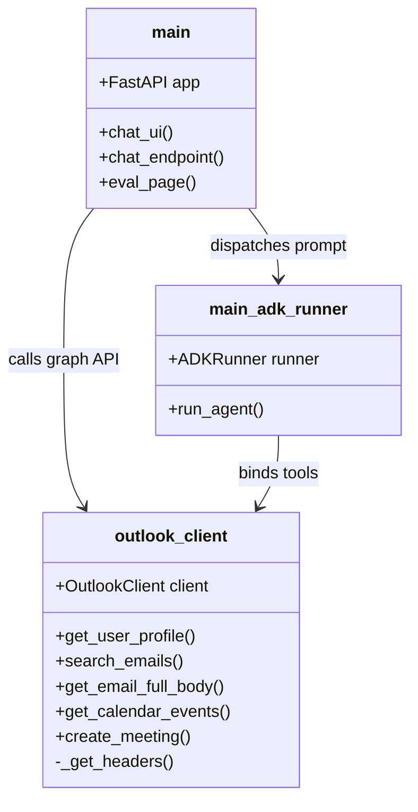
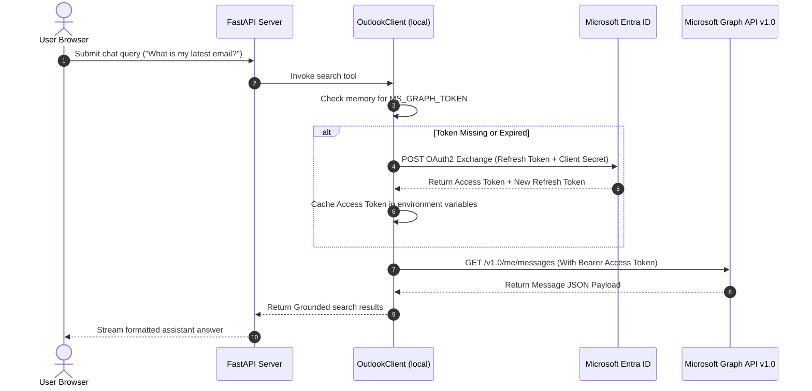
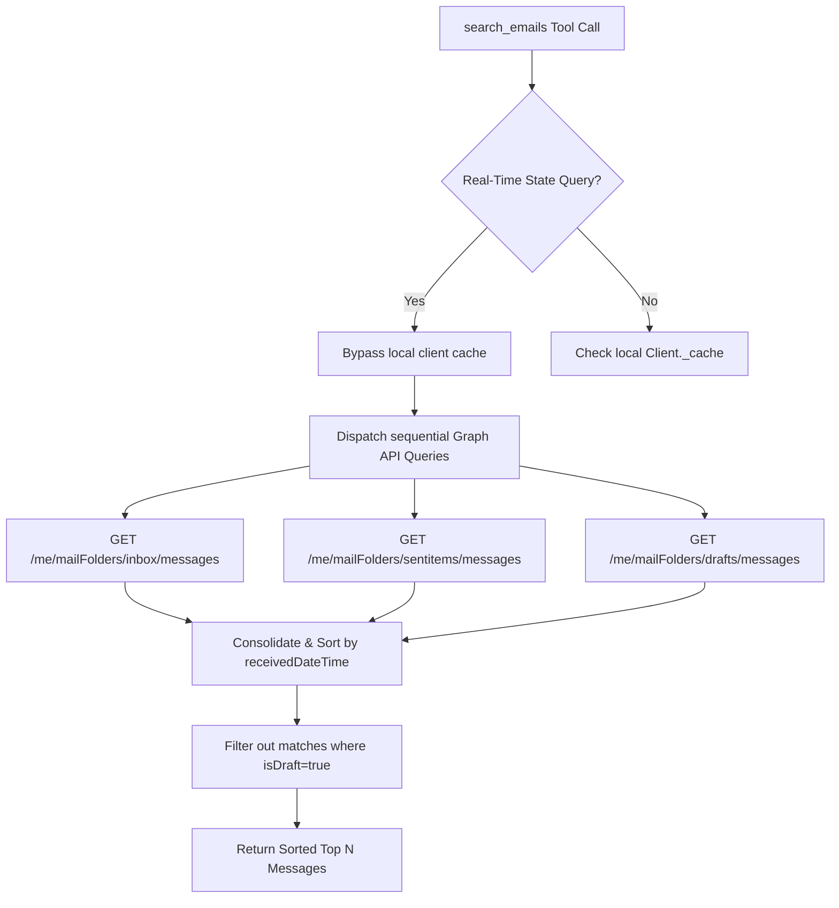

# Low-Level Design (LLD) — Local ADK Assistant (`local-adk-mcp`)

This document describes the low-level architecture, module details, data flow sequences, and integration schemas of the **Local ADK M365 Outlook Assistant**.

---

## 1. Component Architecture & Class Structure

The local environment is built as a single-process service serving a FastAPI REST API and a static chat front-end. The component topology is described below:



### Module Descriptions
1. **`backend/main.py`**: Serves as the FastAPI application server, exposing endpoints for the Chat UI (`/api/chat`), static front-end assets, and the evaluation visualizer (`/eval`).
2. **`backend/outlook_client.py`**: Wrapper for Microsoft Graph API queries. Handles batching, endpoint querying, in-memory caching of search outputs, and token validation.
3. **`backend/outlook_client._get_headers()`**: Helper function that initializes the MSAL application and exchanges the refresh token for a fresh Graph Access Token, caching it in memory.

---

## 2. Authentication & Authorization Sequence

Delegated OAuth2 authorization is handled locally via a MSAL refresh-token exchange. The authentication sequence is modeled below:



---

## 3. Data Schemas & API Formats

### Chat Endpoint Request Payload (`POST /api/chat`)
```json
{
  "query": "what is my latest unread message?",
  "history": [
    { "role": "user", "content": "hi" },
    { "role": "model", "content": "Hello! How can I help you today?" }
  ],
  "session_id": "projects/254356041555/locations/us-central1/reasoningEngines/123/sessions/abc",
  "timezone": "America/New_York"
}
```

### Chat Endpoint Success Response
```json
{
  "response": "Your latest unread message is from **Microsoft Outlook** regarding **'Undeliverable: Project Falcon Status Update'**.",
  "tool_calls": [
    {
      "name": "search_emails",
      "args": { "query": "unread", "unread_only": true }
    }
  ],
  "latency_s": 4.52,
  "search_latency_s": 0.82,
  "raw_grounding_data": {
    "sources": [
      {
        "title": "Undeliverable: Project Falcon Status Update",
        "url": "https://outlook.office365.com/...",
        "description": "Delivery has failed to these recipients...",
        "domain": "outlook.office365.com"
      }
    ]
  }
}
```

---

## 4. Cache Bypass & Multi-Folder Search Patterns

To ensure unread emails or meetings are retrieved with zero-latency state caching, the search implementation dispatches queries across multiple folders:



---

## 5. Bound Python Tool Specifications

In the local ADK environment, Python function tools are bound directly to the Gemini agent instance:

### A. `search_emails` (Read-Only)
* **Function Signature**: `search_emails(query: str = None, sender: str = None, hours_back: str = "24h", unread_only: bool = False, limit: int = 25) -> list[dict]`
* **Description**: Queries Microsoft Graph API `/me/messages` filter parameters to identify matching messages. Automatically executes folder-union scans (Inbox + Sent + Drafts) if real-time unread state is requested.

### B. `get_email_full_body` (Read-Only)
* **Function Signature**: `get_email_full_body(message_id: str) -> dict`
* **Description**: Fetches the complete body content or attachments structure of a specific message node.

### C. `list_meetings` (Read-Only)
* **Function Signature**: `list_meetings(lookback: str = "24h", lookahead: str = "48h", limit: int = 25) -> list[dict]`
* **Description**: Dispatches a GET request to the Graph API `/me/calendarview` endpoint with dynamic ISO 8601 timestamps to fetch agenda details.

### D. `send_email_v2` (Mutation)
* **Function Signature**: `send_email_v2(subject: str, body: str, to_recipients: list[str], importance: str = "normal", attachment_filename: str = None) -> dict`
* **Description**: Packages message headers and payload, and calls `/me/sendMail` to deliver an outbound email.

