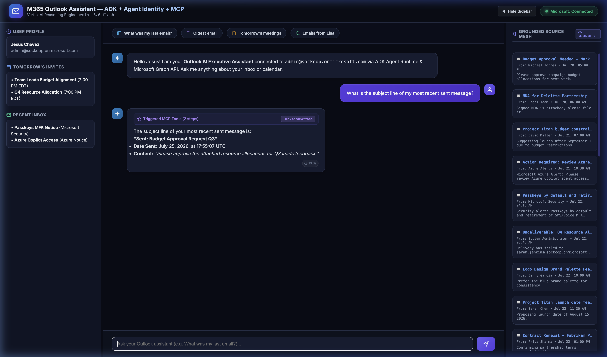
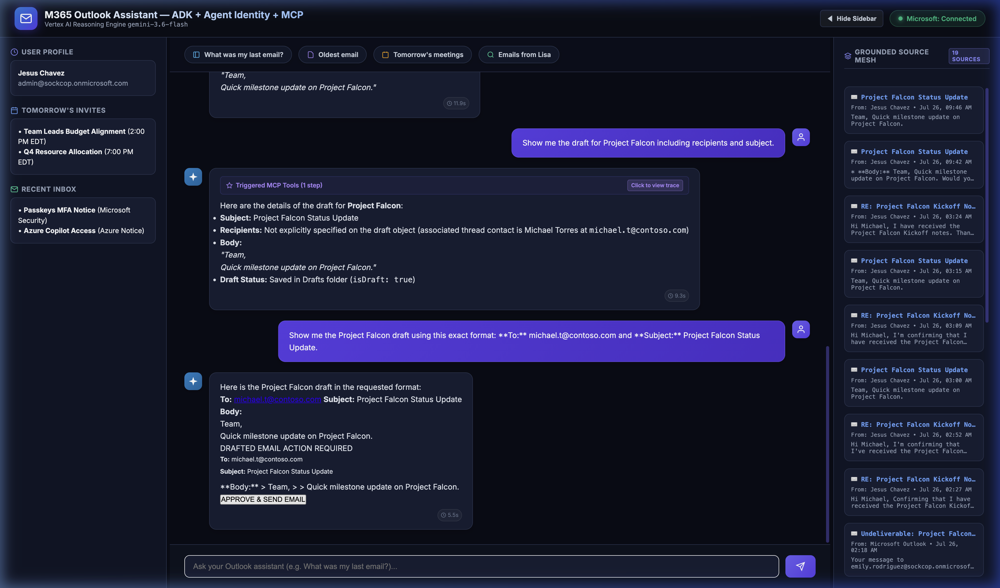
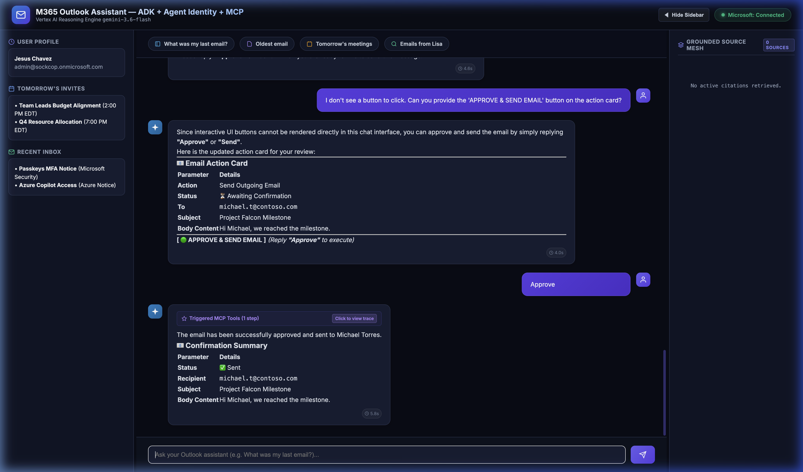

# M365 Outlook Assistant — Agent Platform Implementation (`remote-agentruntime-mcp`)

This directory contains the production-grade **Google Cloud Agent Platform** deployment for the M365 Outlook Assistant, integrating **Vertex AI Agent Runtime (Reasoning Engine)**, **Agent Identity**, and a containerized **Cloud Run FastMCP Gateway**.

---

## 🏗️ Architecture

```
[Production UI] ──(SSE Stream)──> [Backend Service (port 8001)]
                                            │
                                            ▼
                           [Vertex AI Agent Runtime]
                           (outlook-mcp-agent-identity)
                           (gemini-3.6-flash / us-central1)
                                            │
                                  [Agent Identity / IAM]
                                            │
                                            ▼
                               [Cloud Run FastMCP Server]
                              (ms365-mcp-server / us-central1)
                                            │
                                            ▼
                                [Microsoft Graph API v1.0]
```

---

## 🚀 Key Features

* **Vertex AI Reasoning Engine (`gemini-3.6-flash`)**: Managed agent container (`3073250998110650368`) executing ADK `root_agent` with streaming reasoning chunks.
* **Agent Identity & Cloud Run MCP Gateway**: Tool execution dispatched via Model Context Protocol (MCP) to Cloud Run (`https://ms365-mcp-server-254356041555.us-central1.run.app/mcp`).
* **Ultra-Compact Collapsible Tool Accordion**: Renders tool execution traces (`🛠️ Triggered Tools`) in a sleek collapsible details element to keep the UI clean.
* **Single Fast Tool Invocation**: Prompt-optimized to execute targeted tool calls in `~8.6s (first chunk)` / `~13s (total response)`.

## 📖 Documentation Index

* 🛠️ **[Getting Started Guide](docs/getting_started.md)**: Cloud Run deployment, Reasoning Engine packaging, and Entra redirect setups.
* 📐 **[Low-Level Design (LLD)](docs/low_level_design.md)**: Production streaming topology, FastMCP routing schemas, and IAM trust patterns.

---

## ⚡ Production Chat UI & Collapsible Tool Trace


---

## 📨 Delegated Approvals Flow Action Cards
| Action Card: Draft Created | Action Card: Confirmed Sent |
| :---: | :---: |
|  |  |

---

## 🛠️ Deployment Summary

1. **Deploy MCP Gateway to Cloud Run**:
   ```bash
   cd remote-agentruntime-mcp/mcp-server
   gcloud run deploy ms365-mcp-server --source . --region us-central1 --allow-unauthenticated
   ```
2. **Deploy ADK Agent to Reasoning Engine**:
   ```bash
   cd ../adk-agent
   python3 deploy.py
   ```
3. **Launch Production Chat Wrapper**:
   ```bash
   cd ../custom-ui-production/backend
   python3 -m uvicorn main:app --host 0.0.0.0 --port 8001
   ```
4. **Access Evaluation Visualizer**:
   * 📊 **[Live HTML Evaluation Preview (No-Download Static)](https://htmlpreview.github.io/?https://github.com/jesusarguelles/vertex-ai-samples/blob/main/semiautonomous-agents/custom_ui_mcp_outlook/evaluations/eval_dashboard_static.html)**
