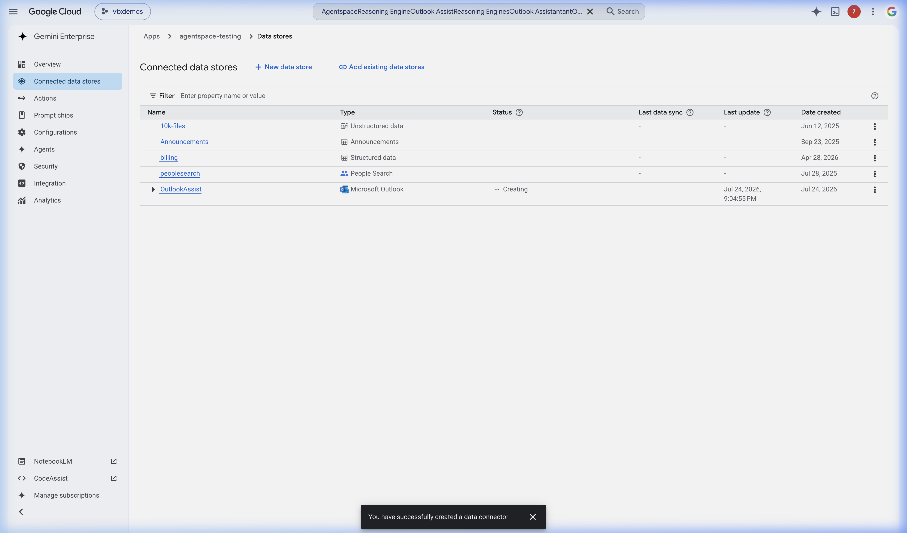
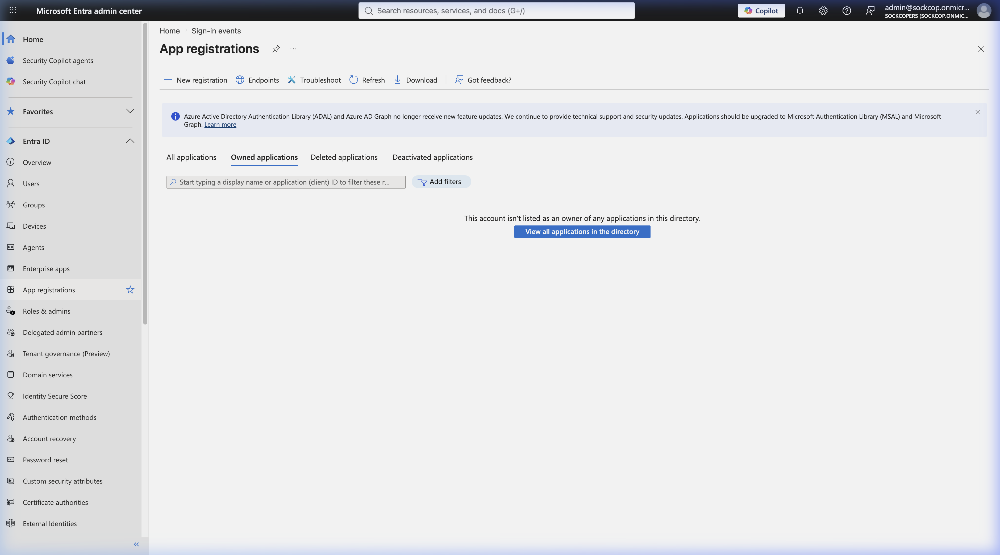

# Getting Started — Production Agent Platform (`remote-agentruntime-mcp`)

This guide walks you through deploying the Model Context Protocol (MCP) server to Cloud Run, packaging and deploying the ADK Reasoning Engine Agent to Vertex AI, and starting the streaming custom UI.

---

## 1. Prerequisites & GCP Setup

Ensure you have installed the Google Cloud SDK and authenticated:

```bash
gcloud auth login
gcloud auth configure-docker
gcloud config set project vtxdemos
```

### GCP Data Store & Outlook Connector Setup
To ground Gemini Enterprise answers with Outlook calendar and mailbox datasets, you must create a Search App linking a Microsoft Outlook Data Source in location `global`. Ensure your connector status in the GCP Console matches the following configuration:



---

## 2. Step 1: Deploy FastMCP Gateway to Cloud Run

The Cloud Run service serves as the secure tool executor boundary between Vertex AI and Microsoft Graph.

1. Navigate to the `mcp-server` subdirectory:
   ```bash
   cd remote-agentruntime-mcp/mcp-server
   ```
2. Build and deploy the container source to Cloud Run:
   ```bash
   gcloud run deploy ms365-mcp-server \
     --source . \
     --region us-central1 \
     --allow-unauthenticated \
     --service-account=254356041555-compute@developer.gserviceaccount.com
   ```
3. Record the deployed service URL (e.g. `https://ms365-mcp-server-254356041555.us-central1.run.app`).

---

## 3. Step 2: Deploy ADK Agent to Vertex AI Reasoning Engine

The deployer packages your agent logic, links the Cloud Run MCP server URL, and uploads it to Vertex AI.

1. Navigate to the `adk-agent` subdirectory:
   ```bash
   cd ../adk-agent
   ```
2. Set up your `.env` variables or confirm the settings in `deploy.py`.
3. Execute the deployment script:
   ```bash
   python3 deploy.py
   ```
4. Verify the console output displays successful update:
   ```text
   Update complete: projects/254356041555/locations/us-central1/reasoningEngines/3073250998110650368
   Resource ID:   3073250998110650368
   ```

---

## 4. Step 3: Register Agent Identity Redirect URI

Because the Reasoning Engine agent acts on behalf of the user, Entra ID requires registering its redirect URI for OAuth:

1. Copy the Reasoning Engine Resource ID (e.g., `3073250998110650368`).
2. Construct the Redirect URI:
   `https://us-central1-aiplatform.googleapis.com/v1beta1/projects/254356041555/locations/us-central1/reasoningEngines/3073250998110650368:authenticate`
3. Add this URI to the Redirect URIs list of your Microsoft App Registration in Microsoft Entra Admin Center.

#### Entra ID Portal App Registrations Settings:


---

## 5. Step 4: Run the Production Frontend UI

Start the wrapper node server to host the custom React/HTML interface locally.

1. Navigate to the frontend backend directory:
   ```bash
   cd ../custom-ui-production/backend
   ```
2. Run the FastAPI dev server:
   ```bash
   python3 -m uvicorn main:app --host 0.0.0.0 --port 8001
   ```
3. Open `http://localhost:8001/` in your browser.
4. Interact with the chat UI. You should see streaming answers, with collapsible tools trace details showing exactly which MCP tools were triggered.

---

## 6. Enterprise Security & Identity Setup

Enterprise setups integrating Microsoft Entra ID and Google Cloud WIF are susceptible to token delegation failures. 

> [!IMPORTANT]
> Detailed instructions for Entra ID app manifests, Workload Identity Federation (WIF) provider setups, service account trust bindings, and Microsoft Graph admin consent steps are documented in the global [Unified Security & Identity Configuration Guide](../../docs/security_and_identity.md).

### Quick Verification Steps
1. **Runner Service Account Permissions**: Ensure the runner service account (e.g. `agent-runner-sa`) has `roles/aiplatform.user` and `roles/logging.logWriter`.
2. **Service Agent Impersonation Binding**: Grant the Vertex AI platform service agent token creator permissions on the runner service account:
   ```bash
   gcloud iam service-accounts add-iam-policy-binding \
     agent-runner-sa@vtxdemos.iam.gserviceaccount.com \
     --role="roles/iam.serviceAccountTokenCreator" \
     --member="serviceAccount:service-254356041555@gcp-sa-aiplatform.iam.gserviceaccount.com"
   ```

---

### D. Vertex AI Reasoning Engine Trace Logs
To verify that the agent is executing tool calls correctly, query the Vertex Reasoning Engine logs in Google Cloud Console **Log Explorer**:

1. Open the GCP Logs Explorer.
2. Run the following query filter to view execution traces:
   ```text
   resource.type="aiplatform.googleapis.com/ReasoningEngine"
   severity>=INFO
   ```
3. Expand the JSON payload to trace individual Model Context Protocol (MCP) dispatches (e.g., tracking `tool_search_emails` execution times and returned email arrays).

