# Docparse Firestore RAG & MCP Server for Gemini Enterprise

A state-of-the-art solution to ingest PDF-derived Markdowns into **Cloud Firestore** and expose them as a secure **Model Context Protocol (MCP) server** on Cloud Run.

This architecture enables **Gemini Enterprise** to ground answers using clean page-by-page Markdown while retaining high-fidelity links and exact citations back to the original PDF documents.

---

## 🗺️ Architectural Workflow

```mermaid
flowchart LR
    PDF[1. Source PDFs] -->|docparse pipeline| MD[2. Markdown Chunks]
    MD -->|index_to_firestore.py| EMB[3. text-embedding-005]
    EMB -->|Vector + Grounding links| FS[(4. Cloud Firestore)]
    FS <-->|find_nearest vector search| CR[5. Cloud Run MCP Server]
    CR <-->|OIDC Bearer Auth| GE([6. Gemini Enterprise app])

    classDef step fill:#e8f0fe,stroke:#1a73e8,stroke-width:2px,color:#000
    classDef store fill:#fef7e0,stroke:#f9ab00,stroke-width:2px,color:#000
    classDef target fill:#e6f4ea,stroke:#137333,stroke-width:2px,color:#000
    class PDF,MD,EMB step
    class FS store
    class CR,GE target
```



---

## 🚀 Step-by-Step Implementation Guide

Follow these **four simple steps** to deploy and configure this system in any Google Cloud / Gemini Enterprise environment.

### 📍 Step 1: Ingest Markdown & Metadata to Firestore

The ingestion pipeline segments docparse-extracted Markdown files by page and creates 768-dimensional embeddings using Vertex AI.

1. **Configure Environment:** Ensure you have `.env` or set project parameters.
2. **Execute Ingestion Script:**
   ```bash
   uv run pipeline/index_to_firestore.py \
       --project <your-gcp-project-id> \
       --collection docparse_chunks \
       --markdown-bucket gs://<your-project-id>-docparse-out \
       --pdf-bucket gs://<your-project-id>-docparse-in
   ```

> [!TIP]
> **Grounding Magic:** This script automatically builds GCS URIs (`gs://.../file.pdf`) and secure HTTPS grounding URLs (`https://storage.googleapis.com/.../file.pdf#page=N`) on every page chunk, mapping the raw visual layout directly back to original PDF pages inside Gemini Enterprise.

---

### 📍 Step 2: Build & Deploy the MCP Server to Cloud Run

The Cloud Run server runs our custom, secure FastMCP application.

1. **Build Container:**
   ```bash
   gcloud builds submit --tag gcr.io/<your-gcp-project-id>/docparse-firestore-mcp:latest ./mcp_server
   ```
2. **Deploy to Cloud Run:**
   ```bash
   gcloud run deploy docparse-firestore-mcp \
       --image gcr.io/<your-gcp-project-id>/docparse-firestore-mcp:latest \
       --region us-central1 \
       --set-env-vars "FIRESTORE_PROJECT=<your-gcp-project-id>,FIRESTORE_COLLECTION=docparse_chunks" \
       --no-allow-unauthenticated
   ```

---

### 📍 Step 3: Register as an MCP Datastore in Gemini Enterprise

Configure Gemini Enterprise's main chat console to leverage this MCP server as an active grounding datastore using Google's Discovery Engine v1alpha custom data connectors API.

1. **Run Automated Datastore Registration:**
   ```bash
   export GE_PROJECT_ID="vtxdemos"
   export GE_PROJECT_NUMBER="254356041555"
   export GE_ENGINE_ID="docparse_1780161524773"
   export MCP_SERVICE_URL="https://docparse-firestore-mcp-254356041555.us-central1.run.app"
   
   python3 register_datastore.py
   ```

---

### 📍 Step 4: Register Agent in Gemini Enterprise Panel (Optional)

Ensure the Firestore RAG agent is active inside the chat sidebar/agent picker panel of Gemini Enterprise if utilizing a custom ADK Reasoning Engine orchestrator.

1. **Deploy ADK Reasoning Engine & Set Variable:**
   Ensure `REASONING_ENGINE_RES` is set in your env.
2. **Run Agent Registration Script:**
   ```bash
   export AS_APP="docparse_1780161524773"
   
   python3 register_agent.py
   ```

---

## 🛠️ Customer Environment Variables Guide

To deploy this solution to your own customer target environment, create a local `.env` file in the root of the project and customize the parameters listed below:

### 1️⃣ Cloud Infrastructure Config
| Environment Variable | Description | Example / Recommended Value |
| :--- | :--- | :--- |
| `GE_PROJECT_ID` | Your target GCP Project ID | `your-customer-project-id` |
| `GE_PROJECT_NUMBER` | Your target GCP Project Number (numeric ID) | `123456789012` |
| `GE_ENGINE_ID` | Your Gemini Enterprise application/engine ID | `docparse_1780161524773` |
| `GE_LOCATION` | Discovery Engine location | `global` |

### 2️⃣ Firestore Database Configuration
| Environment Variable | Description | Example / Recommended Value |
| :--- | :--- | :--- |
| `FIRESTORE_PROJECT` | The GCP Project containing the Firestore database | `your-customer-project-id` |
| `FIRESTORE_COLLECTION` | Firestore Collection where page chunks are stored | `docparse_chunks` |

### 3️⃣ Security & OAuth 2.0 Settings
For Gemini Enterprise to securely invoke your Cloud Run MCP instance, you must configure a Google OAuth Client for Web Applications:
1. Go to **APIs & Services** > **Credentials** in the GCP Console.
2. Click **Create Credentials** > **OAuth client ID** > **Web application**.
3. Add your Gemini Enterprise redirect URIs to the Authorized Redirect URIs list.
4. Set the following environment variables:

| Environment Variable | Description | Example / Recommended Value |
| :--- | :--- | :--- |
| `GOOGLE_CLIENT_ID` | OAuth 2.0 Web Client ID | `123456-abcdef.apps.googleusercontent.com` |
| `GOOGLE_CLIENT_SECRET` | OAuth 2.0 Web Client Secret | `GOCSPX-dummysecretabcdef123456` |
| `ALLOWED_DOMAIN` | Optional email domain restriction for incoming calls | `yourcustomercompany.com` |

> [!IMPORTANT]
> **Zero-Leak Protection:** Under no circumstances should you commit your finalized `.env` file to source control. The `.gitignore` file is fully pre-configured to block any `.env` commits automatically.

---

## 📂 Folder Layout

* **`pipeline/index_to_firestore.py`**: Splits Markdowns into pages and indexes them in Firestore with `text-embedding-005` embeddings.
* **`mcp_server/`**: Contains the Starlette app (`server.py`), native vector search module (`firestore_search.py`), and Google OIDC verification middleware (`auth.py`).
* **`register_datastore.py`**: Connects the MCP server as a `custom_mcp` Datastore in Gemini Enterprise.
* **`register_agent.py`**: Adds your agent to the Gemini Enterprise Chat agent picker panel.
* **`RESEARCH_MCP_TOOLBOX.md`**: Comparison and template setups for Google's `mcp-toolbox` (formerly Gen AI Toolbox for Databases) vs. FastMCP.

