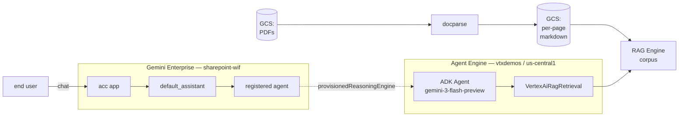
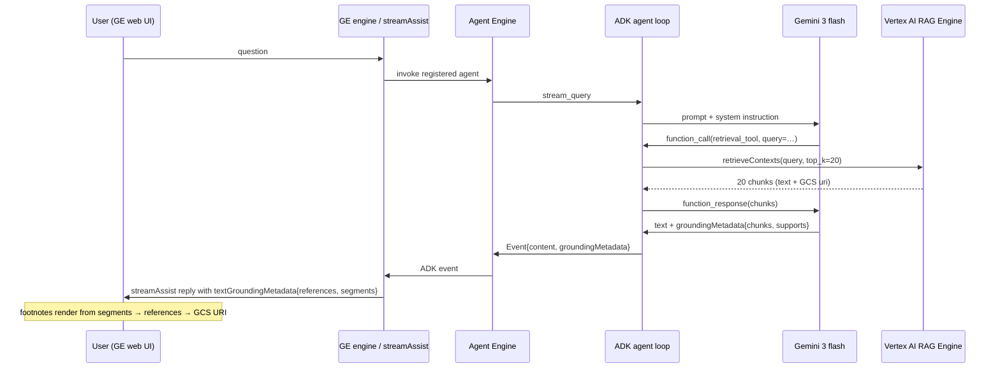

<div align="center">

# docparse-rag-agent

**ADK + Vertex AI RAG Engine + Gemini 3 → Gemini Enterprise**

A 100-line ADK agent that wraps a Vertex AI RAG Engine corpus and exposes itself as a first-class agent inside Gemini Enterprise. Validated against the [`docparse`](../docparse/) eval suite — **92.9% composite on 216 questions**, vs 87.4% for vanilla RAG and 81% for Discovery Engine `streamAssist` over the same markdown.

</div>

---

## What this is

The companion to [`docparse`](../docparse/). `docparse` turns PDFs into Markdown; this project takes that Markdown, indexes it in **Vertex AI RAG Engine**, wraps it in an **ADK agent**, deploys to **Vertex AI Agent Engine**, and registers it inside a **Gemini Enterprise** app so end users can chat with the documents.



The Gemini Enterprise app is a **thin proxy** — it does no retrieval, no reasoning, no model call. It forwards the user's question to the registered agent (cross-project), streams the agent's response back, and renders the agent's grounding citations as the little globe-icon footnotes in the chat UI.

---

## Why this beats raw Discovery Engine

Discovery Engine's `streamAssist` over the same markdown ceiling'd at **81%**. Most of that gap was the agentic planner refusing to use chunks that demonstrably contained the answer. By going **direct** through ADK + RAG Engine + Gemini, we bypass the planner and get:

| Question type | DE streamAssist | rag_md_v2 (this agent) | Δ |
|---|---|---|---|
| math / aggregation (42q) | 77% | **98%** | **+21** |
| chart-cell lookup (18q) | 77% | **95%** | **+18** |
| page-anchored (90q) | 89% | **92%** | +3 |
| text lookup (61q) | 85% | 90% | +5 |
| **overall** | **81%** | **92.9%** | **+12** |

Two ingredients matter:

1. **Per-page chunking**, with the page number prepended to chunk text:
   ```
   # Accenture-Metaverse-Evolution-Before-Revolution — Page 5
   ...
   | Category | Total mentions |
   | 2020Q1 | 585 |
   ```
   "Page 5" is now in the embedding. `"on page 5..."` retrieves the right chunk.
2. **Exhaustive answering prompt** that explicitly forbids "I cannot find" when search results contain the value, and refuses to reformat verbatim chart text.

Full eval write-up in the parent [`docparse/README.md`](../docparse/README.md).

---

## Code layout

```
docparse-rag-agent/
├── agent/
│   ├── __init__.py        # exports root_agent
│   └── agent.py           # ADK Agent + VertexAiRagRetrieval tool + system instruction
├── deploy.py              # agent_engines.create / update with env_vars + tracing
├── register_agent.py      # cross-project register in Gemini Enterprise + share ALL_USERS
├── pyproject.toml
├── .env.example           # copy to .env and fill in
└── README.md
```

The agent itself is **~30 lines** ([`agent/agent.py`](./agent/agent.py)):

```python
from google.adk.agents import Agent
from google.adk.tools.retrieval.vertex_ai_rag_retrieval import VertexAiRagRetrieval
from vertexai.preview import rag

retrieval_tool = VertexAiRagRetrieval(
    name="docparse_corpus_retrieval",
    description="Retrieves page-level chunks from the docparse markdown corpus.",
    rag_resources=[rag.RagResource(rag_corpus=os.environ["RAG_CORPUS_NAME"])],
    similarity_top_k=20,
    vector_distance_threshold=0.5,
)

root_agent = Agent(
    model="gemini-3-flash-preview",
    name="docparse_rag_agent",
    instruction=SYSTEM_INSTRUCTION,
    tools=[retrieval_tool],
)
```

That's the entire agent. ADK handles the loop (call model → maybe call tool → call model again with tool results → emit response).

---

## How ADK propagates grounding all the way to the chat UI

This is the part that surprised me when I traced it end-to-end. There's no special "grounding API" — ADK just wires the retrieval tool's output into the model context, the model emits citations as part of its normal grounded response, and the entire chain (Agent Engine → Gemini Enterprise → web UI) preserves them as a structured field on the response envelope.

### Step 1 — Tool call returns chunks with metadata

When `VertexAiRagRetrieval` runs, it calls Vertex AI's RAG retrieval API. The response is a list of `Chunk` objects — text + `source_metadata` that includes the GCS URI of the file each chunk came from, plus an internal chunk identifier. ADK packages those into the standard tool-result format that the Gemini API understands.

### Step 2 — Gemini emits a grounded response

Gemini sees the user's question, the system instruction, and the tool output. When it answers, it emits **two parallel things** in its response candidate:

- the answer text (e.g. `"...total mentions in 2020 Q1 was 585."`)
- a `groundingMetadata` block: `groundingChunks` (one per retrieved doc the model actually used), and `groundingSupports` (per-segment maps of `text → chunk_indices`).

This is a first-class field on the Gemini response — no parsing needed. The model is trained to emit it whenever it answered from a tool that returned source-attributed chunks.

### Step 3 — ADK serializes events

ADK turns each model+tool turn into an `Event` object: role, content parts, plus optional `groundingMetadata`. Agent Engine's `stream_query` yields these events to the caller as JSON-friendly dicts. The grounding data rides on the same event that carries the final text.

### Step 4 — Gemini Enterprise re-wraps it

When you register an ADK agent with GE, GE's `streamAssist` becomes the public surface. Internally, GE invokes the agent (via its `provisionedReasoningEngine` resource link), receives ADK events, and rewrites them into the GE response shape:

```jsonc
{
  "answer": {
    "state": "SUCCEEDED",
    "replies": [
      { "groundedContent": { "content": { "text": "...585..." }}},
      {
        "groundedContent": {
          "textGroundingMetadata": {
            "references": [
              {
                "content": "# Accenture-Metaverse... Page 5\n...| 2020Q1 | 585 |...",
                "documentMetadata": {
                  "uri": "gs://vtxdemos-acc/per_page/Accenture-..._p005.txt",
                  "title": "Accenture-Metaverse..._p005.txt"
                }
              },
              ...
            ],
            "segments": [
              { "endIndex": "146", "referenceIndices": [0],
                "text": "...total mentions of metaverse-related keywords in 2020 Q1 was 585." }
            ]
          }
        }
      }
    ],
    "adkAuthor": "docparse_rag_agent"
  }
}
```

Two key fields:

- `references[]` — one per chunk surfaced to the model. Carries the original chunk text and its GCS URI.
- `segments[]` — maps spans of the answer text to the chunk indices that supported them.

The presence of `adkAuthor: "docparse_rag_agent"` is the receipt that this came from our agent, not from a datastore the GE engine was directly querying.

### Step 5 — Chat UI renders citations

The Gemini Enterprise web UI walks `replies[*].groundedContent.textGroundingMetadata`, intersperses footnote markers at the segment offsets, and on hover renders each `reference.documentMetadata` as a chip with the GCS URL and a content preview. Click → opens the source in a new tab.



The thing to internalize: **at no point does anyone "manually pass the citations through" each layer**. Each layer (RAG → Gemini → ADK → Agent Engine → GE) understands grounding as a first-class concept. They just preserve and re-shape the structured field.

---

## Deploy in 5 minutes

### 0. Prerequisites

You need:
- A RAG Engine corpus already populated with content (see [`docparse`](../docparse/) for the upstream pipeline that produces the per-page markdown).
- A Gemini Enterprise app (the AS_APP id from the GE console).
- gcloud auth + Application Default Credentials.

### 1. Cross-project IAM (one-time)

The GE service agent in your GE project needs `roles/aiplatform.user` on the Agent Engine project so it can invoke the agent:

```bash
GE_PROJECT_NUMBER=...
DEPLOY_PROJECT_ID=...

gcloud projects add-iam-policy-binding "$DEPLOY_PROJECT_ID" \
  --member="serviceAccount:service-${GE_PROJECT_NUMBER}@gcp-sa-discoveryengine.iam.gserviceaccount.com" \
  --role="roles/aiplatform.user"
```

### 2. Configure

```bash
cp .env.example .env
$EDITOR .env   # fill in DEPLOY_PROJECT_ID, RAG_CORPUS_NAME, GE_PROJECT_ID, GE_PROJECT_NUMBER, AS_APP
```

### 3. Deploy the agent

```bash
uv run python deploy.py
```

Output ends with the resource name. Save it back into `.env`:

```bash
echo 'REASONING_ENGINE_RES=projects/.../reasoningEngines/...' >> .env
```

Subsequent `deploy.py` calls auto-update that resource (env vars must be re-supplied, which is what `RUNTIME_ENV_VARS` in `deploy.py` does).

### 4. Register in Gemini Enterprise

```bash
uv run python register_agent.py
```

This both creates the agent inside the assistant **and** patches `sharingConfig.scope = ALL_USERS` in the same script.

### 5. Try it

Open the Gemini Enterprise app in the GE console. The agent shows up in the agent picker. Ask a question — answers come back with footnote-style citations, each linking to the GCS URI of the source page.

---

## Critical gotcha: Gemini 3 preview models live ONLY in `global`

Agent Engine deploys to a regional endpoint (e.g. `us-central1`). If you set `model="gemini-3-flash-preview"` and don't override the runtime location, the genai client builds the API URL from `us-central1` and 404s.

Fix is in `deploy.py`:

```python
RUNTIME_ENV_VARS = {
    "GOOGLE_CLOUD_LOCATION": "global",
    "GOOGLE_GENAI_USE_VERTEXAI": "true",
    ...
}
```

These env vars are **not** persisted by `agent_engines.update()` — they must be re-supplied on every update call. Verify with:

```bash
gcloud ai reasoning-engines describe <id> --region=<region>
```

Look for `deploymentSpec.env`. Both env vars must be present.

---

## Observability

`enable_tracing=True` on `AdkApp` emits OpenTelemetry spans to Cloud Trace:

```
https://console.cloud.google.com/traces/list?project=<DEPLOY_PROJECT_ID>
```

Filter by service name containing `reasoning` or `agent`, time range last 15 min. You'll see a span waterfall: agent root → tool call to RAG retrieval → Gemini generate. Each model call shows tokens, latency, and the prompt/response.

If traces don't show up there, fall back to Cloud Logging:

```
resource.type="aiplatform.googleapis.com/ReasoningEngine"
jsonPayload.trace_id!=""
```

---

## File reference

- [`agent/agent.py`](./agent/agent.py) — the ADK agent (model + retrieval tool + instruction)
- [`deploy.py`](./deploy.py) — Agent Engine create/update with the global-region env vars
- [`register_agent.py`](./register_agent.py) — cross-project GE registration + auto-share
- [`.env.example`](./.env.example) — every env var the scripts read

## Related projects

- [`../docparse/`](../docparse/) — the upstream pipeline that produces the markdown this agent answers over
- [`../cross-project-adk-agent/`](../cross-project-adk-agent/) — minimal cross-project ADK + GE registration template (this project is built on the same pattern)
