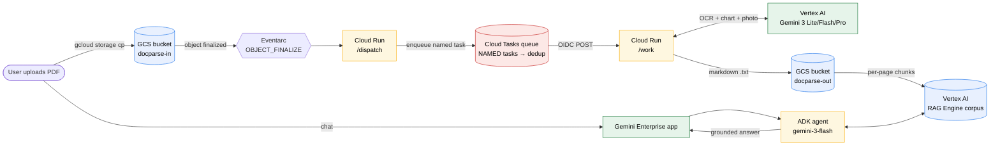
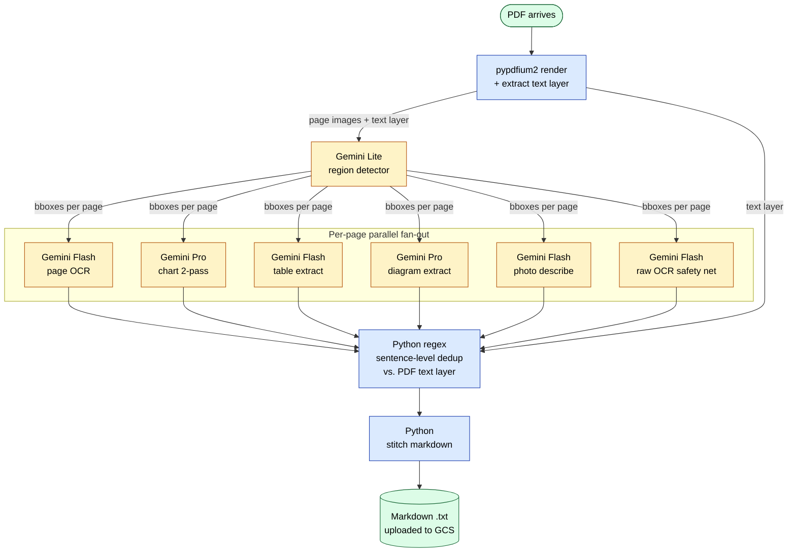

<div align="center">

# docparse

**Chart-aware PDF → Markdown → RAG agent inside Gemini Enterprise.**

A storm-proof Cloud Run pipeline that turns PDFs into a Gemini Enterprise agent.
Upload a PDF → get an answer. No code required after deploy.

[](./eval/RESULTS.md)
[](./extractor/PRODUCTION_READINESS.md)
[](./deploy.sh)

</div>

---

## Quick start

```bash
# 1. Set your project
export PROJECT=your-gcp-project

# 2. Run the deploy script (provisions everything: buckets, Cloud Run, Cloud Tasks, Eventarc, IAM)
./deploy.sh

# 3. Upload a PDF
gcloud storage cp my-report.pdf gs://${PROJECT}-docparse-in/

# 4. Wait ~3-7 minutes per PDF, then check the markdown
gcloud storage ls gs://${PROJECT}-docparse-out/
```

After step 4 the **ADK agent is already deployed** to Vertex AI Agent Engine and can be called via API directly. To make it appear inside your **Gemini Enterprise app** (so users can chat with it from the GE UI), do one more step:

```bash
# 5. (only if you have a GE app) — register the agent and grant cross-project IAM
$EDITOR .env                         # add GE_PROJECT_ID, GE_PROJECT_NUMBER, AS_APP
./deploy.sh register
```

Full GE-registration walkthrough (4 fields + cross-project IAM grant): [`agent/REGISTER_IN_GE.md`](./agent/REGISTER_IN_GE.md). Skip if you only need the standalone agent.

---

## How it works (visual)

### Stage 1 — Cloud architecture: PDF in, markdown out



**Storm-proof.** `(bucket, object, generation) → sha256 → task name`. Pub/Sub redelivers the same OBJECT_FINALIZE event 100×, only 1 task is created, 99 hit `ALREADY_EXISTS`. Verified — see [`extractor/PRODUCTION_READINESS.md`](./extractor/PRODUCTION_READINESS.md).

### Stage 2 — Inside `/work`: how a single PDF gets extracted



**Blue boxes = pure Python.** `pypdfium2` rasterizes pages and pulls the embedded text layer for free; the dedup and stitch are deterministic regex/string ops.

**Yellow boxes = Vertex AI Gemini calls.** Each page is detected once, then each detected region (chart, table, diagram, photo) gets routed to the right Gemini model. Page OCR + raw-OCR safety net run in parallel.

**Why both Python and LLM?** The PDF text layer captures what the document already encodes (cheap, exact, deterministic). The LLM captures what the document only shows visually (chart values, photo descriptions, diagram structure). Sentence-level dedup means we never pay to OCR something the text layer already gave us, and the LLM's reflowed prose stays clean instead of being padded with duplicates.

---

## What goes into each region type

| Region detected | Sent to | Why this model | Output shape |
|---|---|---|---|
| **body / heading / quote** | Gemini Flash (page OCR) | Reflows multi-column text, picks heading levels from layout cues | clean markdown paragraphs |
| **table** | Gemini Flash + bbox crop | Schema-constrained `headers` + `rows`, JSON-validated | markdown table |
| **chart** | Gemini Flash (schema) → **Gemini Pro** (values) | Two-pass: first commits to legend/categories, second reads values | structured `### Title` + value table + low-confidence flags |
| **diagram** | Gemini Pro full page | Mermaid where graph-like, prose where spatial | mermaid block or structured prose |
| **photo** | Gemini Flash + bbox crop | Detailed description (subjects, AR vs holographic vs tablet, overlay text verbatim) | `> **Image:** ...` block + overlay text |
| *(any sentence the LLM dropped)* | **Python** sentence-dedup against text layer | `text_in_bbox` from pypdfium2 captures it for free | appended to page markdown |

---

## Folder layout

```
docparse/
├── README.md                ← this file
├── COSTS.md                 ← end-to-end cost model + storm-prevention impact
├── deploy.sh                ← orchestrator (extractor + RAG corpus + agent + GE registration)
├── .gitignore               ← excludes .venv/, __pycache__/ (keeps _archive/ in git)
│
├── extractor/               ← Stage 1: PDF → Markdown (Cloud Run + Cloud Tasks)
│   ├── deploy.sh                ← provisions Cloud Run + Cloud Tasks queue + Eventarc trigger
│   ├── Dockerfile
│   ├── pyproject.toml
│   ├── PRODUCTION_READINESS.md  ← storm-test + e2e verification (proof v6 can ship)
│   └── src/docparse/
│       ├── service.py           ← /dispatch + /work FastAPI endpoints
│       ├── tasks.py             ← Cloud Tasks named-task dedup
│       ├── pipeline.py          ← orchestrates per-page fan-out + sentence-dedup stitch
│       ├── extract.py           ← per-region structured extractors (chart/table/photo/diagram)
│       ├── detect.py            ← region detector (Gemini Lite)
│       ├── prompts.py           ← all Gemini prompts in one file
│       ├── schemas.py           ← Pydantic schemas for chart/table/diagram/photo
│       ├── render.py            ← pypdfium2 rasterize + text-layer extract
│       ├── hybrid.py            ← text_layer_usable predicate + TEXT_TYPES set
│       ├── storage.py           ← GCS helpers + idempotency check
│       ├── validators.py        ← chart-extraction sanity validators
│       ├── gemini.py            ← Vertex AI client + retry logic
│       ├── discovery.py         ← optional: streaming push to Gemini Enterprise datastore
│       └── cli.py               ← `docparse` CLI for local extraction
│
├── agent/                   ← Stage 2: Markdown → answers (ADK + Agent Engine + GE)
│   ├── deploy.py                ← deploys agent to Vertex AI Agent Engine
│   ├── register_agent.py        ← registers agent in your Gemini Enterprise app
│   └── docparse_agent/
│       └── agent.py             ← ADK Agent wired to VertexAiRagRetrieval (~30 lines)
│
├── eval/                    ← evaluation harness (the leaderboard that justifies this stack)
│   ├── RESULTS.md               ← 8 strategies × 216 questions, sample answers
│   ├── dashboard.html           ← interactive leaderboard — double-click to open, no server needed
│   ├── questions.json           ← 216 ground-truth Q&A
│   ├── run_rag_engine.py        ← strategy runner
│   ├── judge.py                 ← LLM grader (default: Claude Sonnet 4.6 — see COSTS.md)
│   ├── build_per_page.py        ← markdown → per-page chunks
│   └── build_results_md.py      ← regenerates RESULTS.md from judged/ JSONs
│
└── _archive/                ← preserved-but-off-prod-path research code (committed to git)
    ├── advanced_dev_iterations/ ← Set-of-Mark, multi-vote chart, Vega-Lite self-judge prototypes
    └── storm_test.py            ← reproducible storm-prevention test
```

---

## What the customer pays per PDF

(Full math in [`COSTS.md`](./COSTS.md). Headline numbers below.)

| Component | Per single PDF | Notes |
|---|---:|---|
| Vertex AI Gemini calls | $1.50 (text-heavy) – $2.20 (chart-heavy 48p) | dominated by Gemini Pro chart pass-2 |
| Cloud Run compute | <$0.02 | gen2, 2 vCPU, request-billed |
| Cloud Tasks | $0 | first 1M tasks/month free |
| Eventarc + Pub/Sub + GCS | <$0.01 | rounding error |
| **Total per PDF** | **~$1.50–$2.20** | one-time per upload |

A **1,000-document corpus** costs ~$2k one-time to extract, then ~$2/month to store, plus ~$50/month for the always-on agent. Serving cost is ~$0.016/query (Gemini Flash + RAG retrieval).

---

## Prerequisites

- A GCP project with billing enabled.
- `gcloud auth login && gcloud auth application-default login`
- `uv` installed: `curl -LsSf https://astral.sh/uv/install.sh | sh`
- (Optional) A Gemini Enterprise app to register the agent in. See [`agent/REGISTER_IN_GE.md`](./agent/REGISTER_IN_GE.md) — 4 steps, ~5 min.

---

## Re-evaluating the pipeline

If you change any extraction prompt or schema, re-run the eval to make sure you haven't regressed:

```bash
cd eval
./run_eval.sh <new_corpus_id> <label>     # runs 216-q + judge
open dashboard.html                         # compare side-by-side, no server needed
```

The judge defaults to **Claude Sonnet 4.6** (~$1.50-2.50 per 216-q run, ~5× cheaper than Opus with ~95% the verdict accuracy). See `eval/judge.py` to swap.

---

## Operations

```bash
# Tail extractor logs
gcloud beta run services logs tail docparse --region=us-central1 --project=$PROJECT

# Inspect Cloud Tasks queue
gcloud tasks list --queue=docparse-extract --location=us-central1 --project=$PROJECT

# Pause processing (e.g., during incident)
gcloud tasks queues pause docparse-extract --location=us-central1 --project=$PROJECT

# Force re-extract a PDF (re-uploading bumps the GCS object generation)
gcloud storage cp my-report.pdf gs://${PROJECT}-docparse-in/

# Replace the agent corpus
cd eval && python build_per_page.py && ./reindex.sh
```
