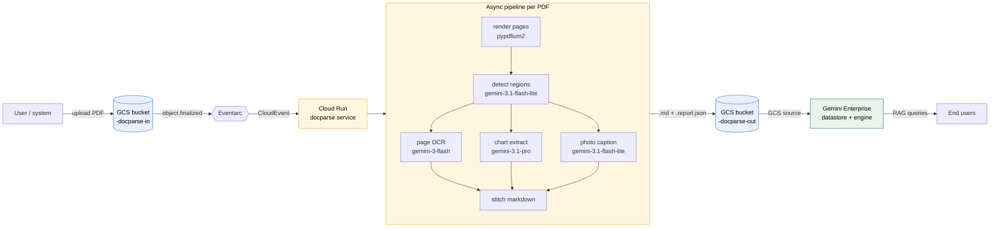

<div align="center">

# docparse

**Chart-aware PDF → Markdown for Gemini Enterprise / Vertex AI Search**

GCS upload triggers a Cloud Run service that parses any PDF into LLM-ready Markdown — preserving headings, body, photos, and **structured chart data** that the default GCS-connector pipeline (Document AI Layout Parser) loses.

<a href="./docs/EXTRACTION-DETAILS.md"></a>

</div>

---

## Why

The first-party **GCS connector** in Gemini Enterprise / Vertex AI Search routes unstructured PDFs through **Document AI Layout Parser**. As of April 2026, image annotation is still in Preview and produces only "a descriptive block of text" for charts — no axes, no series, no values. A 100-cell stacked bar chart becomes useless prose.

`docparse` replaces that step: each PDF is decomposed page-by-page using the Gemini 3 model family, and every chart is reconstructed as a **structured Markdown table** that downstream RAG can actually reason over.

---

## Architecture



| Stage | Model | Why this tier |
|---|---|---|
| Region detection | `gemini-3.1-flash-lite-preview` | bbox finding, layout perception |
| Page OCR (text → markdown) | `gemini-3-flash-preview` | text reflow, no reasoning needed |
| Chart / diagram extraction | `gemini-3.1-pro-preview` | series mapping, value precision, validators |
| Photo captioning | `gemini-3.1-flash-lite-preview` | alt-text only |

---

## Performance (24-page mixed PDF, 3 charts, 12 photos)

| Metric | Result |
|---|---|
| **End-to-end (upload → markdown in output bucket)** | **~3 min 23 s** |
| Local `parse_pdf_async` only | ~3 min |
| Page 11 stacked bar (100 cells, 20 industries × 5 categories) | All 100 correct, every stack sums to 100 |
| Page 5 simple bar (10 cells) | All 10 correct |
| Page 15 grouped bar (40 cells) | All 40 correct |
| Total LLM calls | ~64 (1 warm-up · 24 detect · 24 page-OCR · 3 chart · 12 photo) |

For the why-and-how behind these numbers, see [the deep dive](./docs/EXTRACTION-DETAILS.md).

---

## Quick start (use the deployed service)

```bash
# Drop a PDF in the input bucket
gcloud storage cp ./my-doc.pdf gs://<your-project>-docparse-in/

# Tail logs
gcloud beta run services logs tail docparse \
  --region=us-central1 --project=<your-project>

# Fetch the markdown when it lands (~2-3 min). NOTE the .txt extension —
# Discovery Engine ingests by file extension and rejects .md, so we write
# markdown content to a .txt file. The body is still markdown.
gcloud storage cp gs://<your-project>-docparse-out/my-doc.txt ./
```

---

## Reproduce in your own GCP project

### 1. Prerequisites

| Requirement | Notes |
|---|---|
| **GCP project with billing enabled** | replaces `<your-project>` below |
| **Vertex AI access in `global` region** | preview Gemini 3 models live there |
| **Permissions to enable APIs + create IAM bindings** | Owner or equivalent |
| `gcloud` CLI ≥ 481 with `application-default login` | |
| `uv` (Astral) for local development | optional |

### 2. APIs the service needs

```text
run.googleapis.com
eventarc.googleapis.com
cloudbuild.googleapis.com
artifactregistry.googleapis.com
aiplatform.googleapis.com
storage.googleapis.com
discoveryengine.googleapis.com   # only for the Gemini Enterprise step
```

`deploy/setup.sh` enables these for you.

### 3. Clone, configure, deploy

```bash
git clone <this-repo>
cd vertex-ai-samples/semiautonomous-agents/docparse

# Override defaults if you want different bucket/region/project:
PROJECT=my-project \
REGION=us-central1 \
INPUT_BUCKET=my-docparse-in \
OUTPUT_BUCKET=my-docparse-out \
  ./deploy/setup.sh
```

The script is **idempotent** — re-run after edits. It creates:

- 2 GCS buckets (input + output)
- 1 Artifact Registry repo
- 1 service account (`docparse-runner`) with the minimal roles below
- 1 Cloud Run service (`docparse`) — 2 vCPU / 2 GiB / concurrency 1 / max 10 instances
- 1 Eventarc trigger on `object.finalized` of the input bucket

### 4. IAM bindings the script applies

| Member | Role | Scope | Why |
|---|---|---|---|
| `docparse-runner@<project>` | `roles/storage.objectViewer` | input bucket | download PDFs |
| `docparse-runner@<project>` | `roles/storage.objectAdmin` | output bucket | write markdowns |
| `docparse-runner@<project>` | `roles/aiplatform.user` | project | call Gemini |
| `docparse-runner@<project>` | `roles/run.invoker` | project | Eventarc invokes Cloud Run as this SA |
| `docparse-runner@<project>` | `roles/eventarc.eventReceiver` | project | Eventarc dispatches to it |
| GCS service agent (`service-<N>@gs-project-accounts`) | `roles/pubsub.publisher` | project | GCS object events flow via Pub/Sub |
| Eventarc service agent (`service-<N>@gcp-sa-eventarc`) | `roles/storage.legacyBucketReader` | input bucket | Eventarc validates the bucket on trigger create |
| Default compute SA (`<N>-compute@developer`) | `roles/cloudbuild.builds.builder` | project | `gcloud builds submit` source upload |
| Discovery Engine SA (`service-<N>@gcp-sa-discoveryengine`) | `roles/storage.admin` | output bucket | only required for **Streaming** datastores — they create a Pub/Sub notification on the bucket which needs `storage.buckets.update` |

> **First-time-in-project gotcha:** the GCS, Eventarc, and Discovery Engine service agents may not exist until you call `gcloud beta services identity create --service=<api>`. `setup.sh` does this for you; if you run the gcloud commands by hand, do those first or the IAM bindings fail with `Service account ... does not exist`.

### 5. Wire the output bucket into Gemini Enterprise

```bash
# Grant the GE service agent in your GE project read on the output bucket
GE_PROJECT_NUM=$(gcloud projects describe <ge-project> --format='value(projectNumber)')
gcloud storage buckets add-iam-policy-binding gs://my-docparse-out \
  --member="serviceAccount:service-${GE_PROJECT_NUM}@gcp-sa-discoveryengine.iam.gserviceaccount.com" \
  --role="roles/storage.objectViewer" \
  --project=<docparse-project>

# Create a datastore in your GE project pointing at the output bucket
DATASTORE_ID=docparse_md_$(date +%s)
curl -X POST -H "Authorization: Bearer $(gcloud auth print-access-token)" \
  -H "X-Goog-User-Project: <ge-project>" -H "Content-Type: application/json" \
  "https://discoveryengine.googleapis.com/v1/projects/<ge-project>/locations/global/collections/default_collection/dataStores?dataStoreId=${DATASTORE_ID}" \
  -d '{
    "displayName": "docparse markdowns",
    "industryVertical": "GENERIC",
    "solutionTypes": ["SOLUTION_TYPE_SEARCH"],
    "contentConfig": "CONTENT_REQUIRED"
  }'

# Import the markdowns
curl -X POST -H "Authorization: Bearer $(gcloud auth print-access-token)" \
  -H "X-Goog-User-Project: <ge-project>" -H "Content-Type: application/json" \
  "https://discoveryengine.googleapis.com/v1/projects/<ge-project>/locations/global/collections/default_collection/dataStores/${DATASTORE_ID}/branches/0/documents:import" \
  -d '{
    "gcsSource": {"inputUris": ["gs://my-docparse-out/*.txt"], "dataSchema": "content"},
    "reconciliationMode": "INCREMENTAL"
  }'
```

> **Attaching to an existing engine:** the cleanest path is the Gemini Enterprise console — open the engine, go to **Connected data stores → Add**, and pick the datastore you just created. The v1 REST `engines.patch` endpoint will refuse this on engines created with a single datastore (`FAILED_PRECONDITION`); the console handles it correctly.

### 6. Test it

```bash
gcloud storage cp ./any.pdf gs://my-docparse-in/
# Wait ~2-3 min, then:
gcloud storage ls gs://my-docparse-out/
```

---

## Local development

```bash
cd docparse
uv sync

# Run the parser as a CLI (no GCS, no Cloud Run)
uv run docparse ./any.pdf -o ./out

# Run the FastAPI service locally
OUTPUT_BUCKET=my-docparse-out \
  uv run uvicorn docparse.service:app --port 8080
```

---

## Repository layout

```
docparse/
├── src/docparse/
│   ├── pipeline.py        # async fan-out orchestration
│   ├── render.py          # pypdfium2 page rendering + bbox utilities
│   ├── detect.py          # per-page region detection (lite + flash fallback)
│   ├── extract.py         # page OCR + chart/table/diagram/photo extractors
│   ├── prompts.py         # all Gemini prompts
│   ├── gemini.py          # async client, warm-up, thinking config, retries
│   ├── schemas.py         # Pydantic schemas for structured outputs
│   ├── storage.py         # GCS download/upload helpers
│   ├── service.py         # FastAPI handler for Eventarc CloudEvents
│   └── cli.py             # `docparse` command
├── Dockerfile
├── deploy/setup.sh
├── docs/
│   └── EXTRACTION-DETAILS.md   # the full design rationale
├── pyproject.toml
└── README.md (this file)
```

<div align="center">

<a href="./docs/EXTRACTION-DETAILS.md"></a>

</div>
