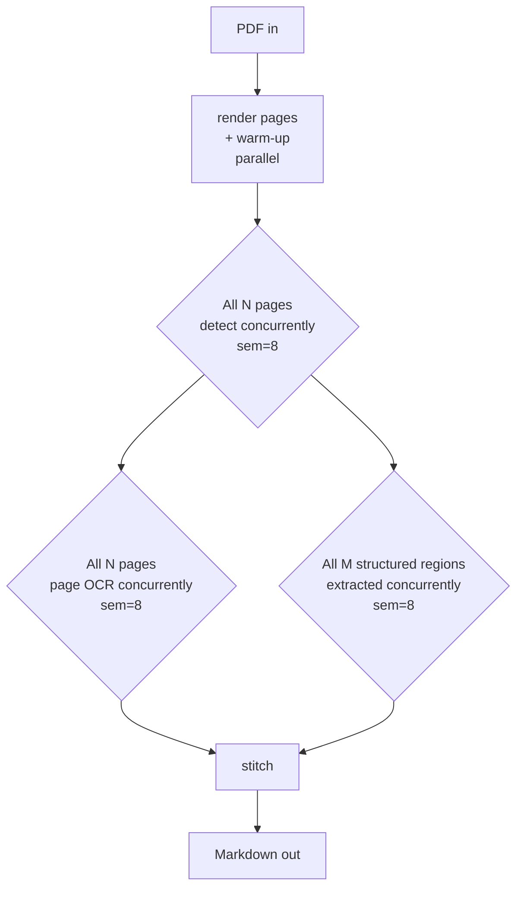

<div align="center">

# docparse — Extraction Deep Dive

**The design decisions, model routing, and benchmarks behind the pipeline.**

<a href="../README.md"></a>

</div>

---

## Table of contents

1. [Why we don't use the GCS connector](#1-why-we-dont-use-the-gcs-connector-directly)
2. [Architecture decisions](#2-architecture-decisions)
3. [Model routing strategy](#3-model-routing-strategy)
4. [Parallelism strategy](#4-parallelism-strategy)
5. [Precision techniques](#5-precision-techniques)
6. [Performance journey (5 iterations)](#6-performance-journey-5-iterations)
7. [Best practices we validated](#7-best-practices-we-validated)
8. [What we deliberately did not build](#8-what-we-deliberately-did-not-build)
9. [Open issues and future work](#9-open-issues-and-future-work)

---

## 1. Why we don't use the GCS connector directly

The Vertex AI Search / Gemini Enterprise / Vertex AI RAG Engine GCS connector is **tightly coupled to Document AI** for parsing. We verified this against the official docs:

| Pipeline | Parser back end | Citation |
|---|---|---|
| Vertex AI Agent Builder GCS connector | Default / OCR / **Document AI Layout Parser** | [Parse and chunk documents](https://cloud.google.com/generative-ai-app-builder/docs/parse-chunk-documents) |
| Vertex AI RAG Engine `LayoutParserConfig` | Requires enabling Document AI API + a `LAYOUT_PARSER_PROCESSOR` resource | [RAG Engine layout parser](https://cloud.google.com/vertex-ai/generative-ai/docs/use-layout-parser-rag) |
| Document AI Layout Parser image annotation | **Preview** since October 2025; output is _"a descriptive block of text"_ | [Layout Parser docs](https://cloud.google.com/document-ai/docs/layout-parse-chunk) |

**The gap:** Document AI extracts tables with explicit row/column structure but treats charts as opaque images. Image annotation produces prose like _"a stacked bar chart showing percentages across industries"_ — no axes, no series mapping, no values. For RAG over decks like the Accenture _Metaverse Continuum_ report, this loses the entire data layer.

**What that costs you concretely:** the page-11 stacked bar in our reference deck contains 100 cells (20 industries × 5 categories) where every percentage is painted inside its own segment. Document AI returns ~15 stray numbers in unknown order. `docparse` returns a 20-row Markdown table where every cell sums to 100 across its row.

> **Counter-evidence we considered:** Agent Builder's "Gemini Layout Parser" went Preview in November 2025 and is the closest first-party answer. It's still Preview, still produces text descriptions, and still doesn't emit structured chart data. We expect it to converge on what `docparse` already does, but it's not there yet.

---

## 2. Architecture decisions

### 2a. Plain `asyncio` instead of Google ADK

ADK is the right tool for **agentic** workflows (tool-use, hand-offs, reasoning loops). For a pure fan-out pipeline like this, ADK pays a documented overhead:

| Past finding (logged in our knowledge base) | Source |
|---|---|
| ADK's default `Gemini` class creates a new `genai.Client()` per agent → triggers Google auth discovery + Compute Engine metadata-server retries → **~18-20s cold start** | session 2302cb55 |
| Fix is the `FastGemini` pattern: subclass `Gemini`, override `api_client` to return one **shared, pre-warmed** client | session 2302cb55 |
| ADK Runner with tools = **2 extra LLM roundtrips per step** (decide → execute → format), ~1s each | session 4e745488 |
| Simple RAG: ADK Runner ~27s vs direct API ~4s | session 2302cb55 |

`docparse` adopts the lessons but skips ADK entirely: one shared `genai.Client()` (singleton), explicit warm-up call at startup, no tool-use roundtrips, no agent reasoning we don't need.

### 2b. Page-level OCR + structured-region extracts

Earlier iterations called the LLM **once per detected region** (210 calls for a 24-page doc). The right shape is **one call per page** that emits markdown text with `<!-- REGION:N -->` placeholders for each chart/table/diagram/photo, and **one call per structured region** that emits the JSON for that region.

```
detect (1 call/page, lite)
   ├── page OCR (1 call/page, flash, no thinking)  →  markdown with placeholders
   └── for each chart/table/diagram/photo (1 call/region, model varies)
        →  structured JSON  →  markdown table

stitch:  substitute placeholder with structured markdown, in reading order
```

This collapsed the 24-page Accenture doc from ~210 calls to ~64 calls.

### 2c. Markdown is the universal output

The pipeline outputs **one `.md` file per PDF** (plus a `.report.json` with timings + raw chart JSON for debugging). That feeds anything: Gemini Enterprise, Vertex AI RAG Engine, Document AI default parser (since the input is now plain text + tables, not images), or pure-text RAG without an indexer at all.

---

## 3. Model routing strategy

We use **three tiers** of the Gemini 3 family, routed by what the call actually needs:

| Call | Model | Thinking | Why |
|---|---|---|---|
| Region detect | `gemini-3.1-flash-lite-preview` | ON | Layout perception. Disabling thinking gave us sloppy bboxes that cropped charts in half. |
| Page OCR (text → markdown) | `gemini-3-flash-preview` | OFF (`thinking_budget=0`) | Pure transcription + reflow. Thinking added latency without quality. |
| Table extraction | `gemini-3-flash-preview` | OFF | Same as page OCR. |
| Photo captioning | `gemini-3.1-flash-lite-preview` | OFF | Alt-text generation. |
| Chart extraction | `gemini-3.1-pro-preview` | ON (default) | Series → color mapping, axis reasoning, value precision. |
| Diagram extraction | `gemini-3.1-pro-preview` | ON (default) | Mermaid generation requires structural reasoning. |
| Detect fallback (when lite returns degenerate bbox) | `gemini-3-flash-preview` | ON | Retry on the more capable model. |
| Warm-up | `gemini-3.1-flash-lite-preview` | OFF | Cheapest possible call to pay auth/discovery cost up front. |

### Why we measured this carefully

Disabling thinking on _detect_ specifically **broke a chart**. Page 5's bar chart sits in the right half of the page; with `thinking_budget=0`, lite returned a bbox of `[0.254, 0.566, 0.764, 0.901]` that cropped the right edge where the bars live, and the pro extractor saw a half-empty image. Re-enabling thinking on detect restored the bbox and the 10-cell bar chart.

The lesson: **thinking matters for spatial reasoning even on perception-heavy tasks**. We disabled it everywhere it was demonstrably safe (transcription, captioning) and kept it on for spatial / structural reasoning (detect, charts, diagrams).

---

## 4. Parallelism strategy

Concurrency is exploited at four levels:



| Level | Implementation |
|---|---|
| **Render + warm-up** | `asyncio.gather(asyncio.to_thread(render_pdf), warm_up())` — CPU and network in parallel |
| **All pages detect** | concurrent, `asyncio.Semaphore(detect_concurrency=8)` |
| **All pages page-OCR** | concurrent, `asyncio.Semaphore(text_concurrency=8)` |
| **All structured regions** | concurrent, `asyncio.Semaphore(struct_concurrency=8)` |
| **Within a page** | text OCR and structured extracts launched as parallel tasks via `asyncio.gather` |

`concurrency=8` was chosen empirically to avoid rate-limit / queue buildup against the preview models. Bumping to 12-16 may help on accounts with higher quota.

---

## 5. Precision techniques

### 5a. Constrained JSON output

Every structured extractor passes its Pydantic schema as `responseSchema` to Gemini. The model **cannot** return malformed JSON or skip required fields. Combined with `thinking_budget` ON for charts, the model reasons about the schema before emitting values.

### 5b. Per-call timeout + retry with `asyncio.wait_for`

Preview models on Vertex AI have high per-call variance (3-60s on lite/flash). We bound each call by a per-type timeout (detect 60s, page-OCR 75s, chart 90s) and retry on a fresh connection on `TimeoutError`. No backoff on timeout — the time was already spent.

### 5c. Bbox normalization for model robustness

`gemini-3.1-flash-lite-preview` occasionally returns degenerate bboxes (`[1, 1, 1, 1]`, inverted coordinates, wrong arity). `render.normalize_bbox` clamps to `[0, 1]`, swaps inverted coordinates, pads to 4 elements, and `crop_region` enforces a 1-pixel minimum. Without this, ~5 of 24 pages crashed the pipeline.

### 5d. Lite → flash detect fallback

When lite returns a bbox with area < 0.001 for any non-decorative region, we retry the whole detect call on `gemini-3-flash-preview`. This catches the ~20% rate at which lite collapses right-column regions to the bottom-right corner. Adds latency on those pages but protects downstream chart/photo extractors from getting empty crops.

### 5e. Bbox-aware page-OCR template

The page-OCR prompt receives the bboxes of all detected structured regions and is instructed:

- For **chart / table / diagram** bboxes: do NOT transcribe any text inside (prevents duplicating chart cell values into the body markdown).
- For **photo** bboxes: transcribe article text painted on the photo normally; only suppress decorative overlays (large stat numbers, taglines, watermarks). The photo extractor handles the decorative overlays.

This separation eliminated duplication on full-bleed photo pages (1 and 3 of the Accenture deck).

### 5f. Detect-failure resilience

If both the lite call and the flash fallback for detect fail, we emit a **whole-page body region** so the page-OCR call still runs. The page may lose fine structure (no chart extraction), but its text content still lands in the markdown.

---

## 6. Performance journey (5 iterations)

| Iteration | Total | Detect | Extract | Notes |
|---|---|---|---|---|
| 1. Per-region OCR (every text region called separately) | **623 s** | — | 308 s | Original architecture |
| 2. Page-level OCR refactor | **285 s** | 143 s | 139 s | One call/page for text, structured per region |
| 3. Tighter timeouts + bbox fixes (`gemini-3-flash-preview` for detect) | **308 s** | 249 s | 55 s | Detect timeouts were too tight; fallback added latency |
| 4. Lite for detect + photo | **102 s** | ~21 s | 81 s | Massive win — but page 5 chart broke from lite's degenerate bbox |
| 5. Smart routing (lite-with-thinking detect, flash fallback, `thinking_budget=0` on OCR/table/photo) + warm-up | **185 s** | 133 s | 49 s | Final config — full chart precision restored |

End-to-end through Cloud Run + Eventarc adds ~15-25 s on top of the local 185 s, mostly container start.

### Aggressive vs precise trade-off

| Configuration | Total | Page 5 chart | Page 11 chart | Page 15 chart |
|---|---|---|---|---|
| Aggressive (`thinking_budget=0` everywhere except pro) | **65 s** | only 6/10 cells | 100/100 | 40/40 |
| Smart (default) | **185 s** | 10/10 | 100/100 | 40/40 |

The 65 s configuration is fine for "first-look" or non-RAG use cases. For ingestion into a search index, the 185 s configuration is the floor for "every value correct."

---

## 7. Best practices we validated

| Practice | Why | How `docparse` does it |
|---|---|---|
| **Single shared `genai.Client()`** | ADK's per-agent client triggers ~18-20 s cold start | `gemini.client()` singleton via lazy global |
| **Explicit warm-up call** | Converts hidden first-call auth tax into a deterministic ~1-2 s startup | `await warm_up()` inside `parse_pdf_async`, parallelized with PDF render |
| **`thinking_budget=0` for transcription / captioning** | Halves call latency without precision loss | Set on page OCR, table, photo |
| **Keep thinking ON for spatial / structural reasoning** | Sloppy bboxes break downstream extractors | Detect, chart, diagram all use default thinking |
| **Constrained JSON via `responseSchema`** | Eliminates malformed output, enforces schema | Every structured call passes its Pydantic schema |
| **`asyncio.wait_for` per-call timeouts** | Caps long-tail latency from preview-model variance | All `call_vision` calls bounded |
| **Bbox normalization** | Models occasionally emit garbage bboxes | `normalize_bbox` + tolerant `crop_region` |
| **Tiered model routing** | 5x cost difference between lite and pro; use the right one | Route in code, not in prompt |
| **Page-level OCR with placeholders** | Avoids per-region call explosion (210 → 64 calls) | `PAGE_OCR_TEMPLATE` + placeholder substitution in `stitch` |
| **Cloud Run concurrency=1 per instance** | Each PDF saturates the event loop with ~64 concurrent Gemini calls | `--concurrency=1 --max-instances=10` in deploy script |

---

## 8. What we deliberately did not build

- **A vector index of charts.** The output is plain Markdown — your existing GE / RAG layer indexes it. No multi-vector retrieval, no chart-image embeddings.
- **Chart-render verification loop.** We sketched `extracted JSON → vega-lite render → Gemini judge` but didn't implement; the schema validators (sum-to-100 for stacked, etc.) catch most precision errors more cheaply.
- **Set-of-Mark prompting.** Overlay numbered marks on chart bars before sending to pro for "extract value at mark N". Useful for unfamiliar chart types; the Accenture deck didn't need it.
- **Self-consistency voting.** Run chart extract 3× in parallel, take median for numerics. Adds ~3× cost; revisit if a customer's deck shows variance on first-pass extracts.
- **Visual hash cache.** Same chart appearing in multiple decks = parse once. Trivial to add when corpus repetition justifies it.
- **Dead-letter handling.** Failed PDFs currently surface as Cloud Run error logs. A real production setup would route them to a dedicated `gs://docparse-failed/` bucket with the error report.

---

## 9. Open issues and future work

| Issue | Severity | Mitigation |
|---|---|---|
| `gemini-3.1-flash-lite-preview` returns degenerate bboxes ~20% of the time | Medium | Lite → flash fallback; will resolve when lite goes GA |
| Preview models have 3-60 s per-call variance | Medium | Per-call timeouts + retries cap impact; will improve at GA |
| GE engine PATCH refuses to add datastores via v1 REST API | Low | Use the Gemini Enterprise console (Connected data stores → Add) — works fine there |
| Discovery Engine rejects `.md` files (infers MIME from file extension, ignores GCS Content-Type) | Low | Write markdown content to `.txt` files. Body is still markdown; the LLM sees the structure at retrieval time. |
| Streaming-mode datastore fails with `service-<N>@gcp-sa-discoveryengine ... does not have storage.buckets.update access` | Medium | Streaming datastores create a Pub/Sub notification on the GCS bucket, which requires `storage.buckets.update`, not just `objectViewer`. Grant `roles/storage.admin` on the output bucket to the Discovery Engine service agent. `setup.sh` does this automatically. |
| Sync-mode (one-time / periodic / streaming) cannot be changed after datastore creation | Medium | Decide up front. To switch, delete and recreate. The streaming-mode setup `setup.sh` provisions handles permissions, but datastore creation itself is currently best done in the GE Console (UI hides the connector + Secret Manager wiring; the equivalent REST flow is fiddly and uses preview-only `DataConnector` fields). |
| Mermaid diagrams from `gemini-3.1-pro-preview` can drift on complex flows | Low | Falls back to structured prose in `DiagramData.prose` |
| No streaming output | Low-medium | Markdown is written atomically at the end. Could stream per-page chunks if interactive UX matters. |
| No batch mode | Medium | Cloud Run autoscales but each instance handles one PDF; for bulk ingestion of 10k+ docs, switch to Vertex AI Batch + GCS event-driven Cloud Run Jobs |

---

<div align="center">

<a href="../README.md"></a>

</div>
