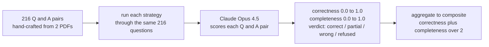

<div align="center">

# 🏆 docparse — Full Evaluation Results

**216 questions · 8 strategies · judged by Claude Opus 4.5**


<sub>Last run: 2026-04-26  ·  Eval corpus: 2 enterprise reports (industry analysis + competitive-intelligence pricing)</sub>

</div>

## TL;DR

| | |
|---|---|
| 🥇 **Winner** | `rag_md_v2` — docparse markdown · per-page chunks · RAG Engine · Gemini 3 flash · top_k=20 · exhaustive system prompt |
| 🎯 **Composite score** | **92.9%** (correctness 92.9%, completeness 93.0%) |
| 🔍 **Eval set** | 216 hand-crafted Q&A pairs across 2 enterprise PDFs (metaverse/industry trends analysis + competitive-intelligence pricing report, customer names redacted) |
| ⚖️ **Judge** | `claude-opus-4-5@20251101` via AnthropicVertex (different model family — avoids self-preference bias) |
| 📐 **Composite** | (correctness + completeness) / 2, both 0.0–1.0 |
| 🏗️ **Production stack lives in** | [`docparse-rag-agent/`](./README.md) |

---

## 1 · Leaderboard

Composite score across all 216 questions, with the verdict mix that produced it.

| Rank | Strategy | Composite | Visual | ✓ correct | × wrong | ? refused | ~ partial |
|---:|---|---:|---|---:|---:|---:|---:|
| 🥇 | **`rag_md_v2`** | **92.9%** | `███████████████████░` | 196 | 10 | 3 | 7 |
| 🥈 | **`rag_md`** | **87.4%** | `█████████████████░░░` | 182 | 11 | 12 | 11 |
| 🥉 | **`digital_v2`** | **81.2%** | `████████████████░░░░` | 168 | 16 | 23 | 9 |
| 4 | **`digital`** | **81.0%** | `████████████████░░░░` | 170 | 17 | 21 | 7 |
| 5 | **`ocr`** | **80.8%** | `████████████████░░░░` | 168 | 15 | 24 | 8 |
| 6 | **`layout`** | **75.2%** | `███████████████░░░░░` | 153 | 11 | 35 | 15 |
| 7 | **`digital_200`** | **69.4%** | `██████████████░░░░░░` | 143 | 15 | 46 | 10 |
| 8 | **`rag_pdf`** | **63.8%** | `█████████████░░░░░░░` | 121 | 61 | 13 | 19 |

**Read this as:** the gap between the top three (~81–93%) is the engine + retrieval matters; the gap between top and bottom (63.8% for `rag_pdf`) is the extraction matters. Both axes stack.

---

## 1a · Detailed metrics

Composite is the headline, but correctness + completeness + latency matter for production.

| Strategy | Composite | Correctness | Completeness | Avg latency | ✓ | × | ? | ~ | ! |
|---|---:|---:|---:|---:|---:|---:|---:|---:|---:|
| `rag_md_v2` | **92.9%** | 92.9% | 93.0% | 7.1s | 196 | 10 | 3 | 7 | 0 |
| `rag_md` | **87.4%** | 88.4% | 86.5% | 6.2s | 182 | 11 | 12 | 11 | 0 |
| `digital_v2` | **81.2%** | 81.3% | 81.1% | 23.1s | 168 | 16 | 23 | 9 | 0 |
| `digital` | **81.0%** | 80.9% | 81.1% | 24.0s | 170 | 17 | 21 | 7 | 1 |
| `ocr` | **80.8%** | 81.0% | 80.6% | 20.8s | 168 | 15 | 24 | 8 | 1 |
| `layout` | **75.2%** | 75.3% | 75.1% | 22.0s | 153 | 11 | 35 | 15 | 2 |
| `digital_200` | **69.4%** | 69.6% | 69.3% | 21.4s | 143 | 15 | 46 | 10 | 2 |
| `rag_pdf` | **63.8%** | 63.5% | 64.2% | 11.4s | 121 | 61 | 13 | 19 | 2 |

**Notable:** `rag_md_v2` is **4× faster** than DE streamAssist (6s vs 23s) because RAG Engine retrieval is synchronous and Gemini doesn't wait for an agentic planner. The refusal rate drop (12 → 3) is where the +5.5pt gain comes from.

---

## 2 · The two-axis ablation

| Comparison | Δ composite | What it isolates |
|---|---:|---|
| `rag_md_v2` vs `rag_md` (same engine, swap chunking strategy) | **+5.5 pts** | per-page chunks + exhaustive prompt vs vanilla RAG |
| `rag_md` vs `digital_v2` (same markdown, swap engine) | **+6.2 pts** | RAG Engine + Gemini beats DE streamAssist |
| `rag_md_v2` vs `rag_pdf` (same engine, swap input) | **+29.1 pts** | docparse extraction beats raw-PDF ingestion |
| `digital_v2` vs `rag_pdf` (better extraction, worse engine) | **+17.4 pts** | extraction > engine when you can't have both |

---

## 3 · Per-question-category breakdown

Question distribution (216 total):

- 📄 **page-anchored** — 90 questions (41.7%)  `█████████████░░░░░░░░░░░░░░░░░`
- 📝 **text-lookup** — 61 questions (28.2%)  `████████░░░░░░░░░░░░░░░░░░░░░░`
- 🧮 **math/aggregation** — 42 questions (19.4%)  `██████░░░░░░░░░░░░░░░░░░░░░░░░`
- 📊 **chart-cell** — 18 questions (8.3%)  `██░░░░░░░░░░░░░░░░░░░░░░░░░░░░`
- 🖼️ **photo/vision** — 4 questions (1.9%)  `█░░░░░░░░░░░░░░░░░░░░░░░░░░░░░`
- 🔀 **diagram** — 1 questions (0.5%)  `░░░░░░░░░░░░░░░░░░░░░░░░░░░░░░`

Composite per category × strategy:

| Strategy | 📄 page-anchored<br><sub>(n=90)</sub> | 📝 text-lookup<br><sub>(n=61)</sub> | 🧮 math<br><sub>(n=42)</sub> | 📊 chart-cell<br><sub>(n=18)</sub> | 🖼️ photo<br><sub>(n=4)</sub> | 🔀 diagram<br><sub>(n=1)</sub> | **total** |
|---|---|---|---|---|---|---|---|
| `rag_md_v2` | 92.0% | 90.3% | 98.2% | 95.0% | 88.1% | 100.0% | **92.9%** |
| `rag_md` | 88.9% | 80.6% | 95.6% | 93.1% | 45.0% | 100.0% | **87.4%** |
| `digital_v2` | 88.6% | 79.2% | 74.6% | 76.4% | 32.5% | 100.0% | **81.2%** |
| `digital` | 85.5% | 85.0% | 71.8% | 72.5% | 48.1% | 100.0% | **81.0%** |
| `ocr` | 84.5% | 84.3% | 77.3% | 76.7% | 8.8% | 40.0% | **80.8%** |
| `layout` | 82.1% | 75.6% | 71.4% | 60.6% | 26.2% | 45.0% | **75.2%** |
| `digital_200` | 77.2% | 72.1% | 46.4% | 73.9% | 86.2% | 25.0% | **69.4%** |
| `rag_pdf` | 71.9% | 68.9% | 55.2% | 41.5% | 0.0% | 45.0% | **63.8%** |

**The win is concentrated.** `rag_md_v2` adds **+18 pts on math/aggregation** and **+16 pts on chart-cell** vs the best non-RAG-Engine config. Chunking the markdown per-page also rescues photo/vision (+43 pts vs `rag_md`) because the alt-text descriptions land on the right page chunk instead of being diluted by neighboring sections.

---

## 4 · How we tested



**Composite formula:** `composite = mean( (correctness + completeness) / 2 )` across all answered questions.

**Verdict labels:**
- `correct` — answer matches ground truth in substance.
- `partial` — some right, some missing or wrong.
- `wrong` — confidently incorrect fact.
- `refused` — assistant said it couldn't find / answer.

**Why Claude as judge?** Different model family from the systems-under-test (Gemini), so no self-preference bias. Prompt forces strict JSON output; retries on rate-limits with exponential backoff.

**Question categorisation** (heuristic from question text):
- `page-anchored` — references a specific page (`"on page 11"`)
- `chart-cell` — read one cell from a chart (`"What was Q1 2020 mentions?"`)
- `math/aggregation` — sum / average / count across cells
- `text-lookup` — body-text fact lookup
- `photo/vision` — image description
- `diagram` — flowchart / process diagram

---

## 5 · Strategy details

Click any strategy to expand its stack description, score breakdown, and a sample of its wins / losses.

<details>
<summary><b>🥇 winner — <code>rag_md_v2</code> — 92.9%</b></summary>

**Stack:** docparse markdown → Vertex AI RAG Engine (72 per-page files) → gemini-3-flash-preview + retrieval tool (top_k=20, exhaustive prompt)

**Scores:** correctness 92.9% · completeness 93.0% · composite **92.9%**

**Verdicts:** ✓ 196 correct · × 10 wrong · ? 3 refused · ~ 7 partial · ! 0 error

**Per category:**

| category | score | bar |
|---|---:|---|
| 📄 page-anchored | 92.0% | `██████████████████░░` |
| 📝 text-lookup | 90.3% | `██████████████████░░` |
| 🧮 math/aggregation | 98.2% | `████████████████████` |
| 📊 chart-cell | 95.0% | `███████████████████░` |
| 🖼️ photo/vision | 88.1% | `██████████████████░░` |
| 🔀 diagram | 100.0% | `████████████████████` |

**Sample failures (random 3):**

- **Q25**: _Who is quoted on page 9 representing Carrefour Group, and what is their title?_  
  GT: `Nicolas Safis, Innovation Director at Carrefour Group`  
  Got: `Based on the provided sources, there is no information regarding a quote from a representative of **Carrefour Group** on page 9.   The content provided for **page 9** (Source [6]) is from the report "`  → **refused**
- **Q65**: _Which two organizations partnered on a Value Partnership for hospital radiology operations?_  
  GT: `Mater Private Hospital and Siemens Healthineers`  
  Got: `The provided sources do not contain information regarding the two organizations that partnered on a Value Partnership for hospital radiology operations.`  → **refused**
- **Q66**: _What did the Mater Private Hospital and Siemens Healthineers digital twin help shorten?_  
  GT: `MRI wait times for patients`  
  Got: `Based on the provided sources, there is no mention of Mater Private Hospital or Siemens Healthineers. The documents describe digital twin applications for **Mars** to reduce over-filling packages in m`  → **refused**

</details>

<details>
<summary><b>🥈 RAG Engine, vanilla chunks — <code>rag_md</code> — 87.4%</b></summary>

**Stack:** docparse markdown → Vertex AI RAG Engine (2 whole-doc files, auto-chunked) → gemini-3-flash-preview + retrieval tool

**Scores:** correctness 88.4% · completeness 86.5% · composite **87.4%**

**Verdicts:** ✓ 182 correct · × 11 wrong · ? 12 refused · ~ 11 partial · ! 0 error

**Per category:**

| category | score | bar |
|---|---:|---|
| 📄 page-anchored | 88.9% | `██████████████████░░` |
| 📝 text-lookup | 80.6% | `████████████████░░░░` |
| 🧮 math/aggregation | 95.6% | `███████████████████░` |
| 📊 chart-cell | 93.1% | `███████████████████░` |
| 🖼️ photo/vision | 45.0% | `█████████░░░░░░░░░░░` |
| 🔀 diagram | 100.0% | `████████████████████` |

**Sample failures (random 3):**

- **Q22**: _Which three industries does the report say have already begun their metaverse journeys?_  
  GT: `Automotive, retail, and banking`  
  Got: `According to the report, the three key areas of the metaverse are **consumer**, **enterprise**, and **industrial**.`  → **wrong**
- **Q23**: _What are 'phygital' launches according to the report?_  
  GT: `Launches of new vehicle models that combine physical and digital, with augmented reality and digital twins for manufacturing/QA`  
  Got: `According to the report, "phygital" launches (referred to as **blended physical and digital assets**) involve reimagining products and services to combine physical and digital elements. Examples inclu`  → **wrong**
- **Q25**: _Who is quoted on page 9 representing Carrefour Group, and what is their title?_  
  GT: `Nicolas Safis, Innovation Director at Carrefour Group`  
  Got: `The provided sources do not contain information regarding Carrefour Group or any content from page 9.`  → **refused**

</details>

<details>
<summary><b>🥉 best DE config — <code>digital_v2</code> — 81.2%</b></summary>

**Stack:** docparse markdown → Vertex AI Search (digitalParsingConfig, chunk 500) → Gemini Enterprise streamAssist + maximal config (system instruction, web off, agents deleted)

**Scores:** correctness 81.3% · completeness 81.1% · composite **81.2%**

**Verdicts:** ✓ 168 correct · × 16 wrong · ? 23 refused · ~ 9 partial · ! 0 error

**Per category:**

| category | score | bar |
|---|---:|---|
| 📄 page-anchored | 88.6% | `██████████████████░░` |
| 📝 text-lookup | 79.2% | `████████████████░░░░` |
| 🧮 math/aggregation | 74.6% | `███████████████░░░░░` |
| 📊 chart-cell | 76.4% | `███████████████░░░░░` |
| 🖼️ photo/vision | 32.5% | `██████░░░░░░░░░░░░░░` |
| 🔀 diagram | 100.0% | `████████████████████` |

**Sample failures (random 3):**

- **Q2**: _What is the subtitle / tagline of the A██████re metaverse report?_  
  GT: `Gradually, then suddenly: The metaverse is changing the way we experience the internet`  
  Got: `The subtitle of the A██████re metaverse report is "evolution, then revolution".`  → **wrong**
- **Q4**: _What is the user-led cultural force behind the Internet of Ownership called?_  
  GT: `Web3`  
  Got: ``  → **refused**
- **Q7**: _What was the total mentions of metaverse-related keywords in 2020 Q1?_  
  GT: `585`  
  Got: `I am sorry, but I could not find any information about the total mentions of metaverse-related keywords in 2020 Q1. I have searched through the available enterprise data sources and was unable to find`  → **refused**

</details>

<details>
<summary><b>DE baseline — <code>digital</code> — 81.0%</b></summary>

**Stack:** docparse markdown → Vertex AI Search (digitalParsingConfig, chunk 500) → Gemini Enterprise streamAssist (default)

**Scores:** correctness 80.9% · completeness 81.1% · composite **81.0%**

**Verdicts:** ✓ 170 correct · × 17 wrong · ? 21 refused · ~ 7 partial · ! 1 error

**Per category:**

| category | score | bar |
|---|---:|---|
| 📄 page-anchored | 85.5% | `█████████████████░░░` |
| 📝 text-lookup | 85.0% | `█████████████████░░░` |
| 🧮 math/aggregation | 71.8% | `██████████████░░░░░░` |
| 📊 chart-cell | 72.5% | `███████████████░░░░░` |
| 🖼️ photo/vision | 48.1% | `██████████░░░░░░░░░░` |
| 🔀 diagram | 100.0% | `████████████████████` |

**Sample failures (random 3):**

- **Q2**: _What is the subtitle / tagline of the A██████re metaverse report?_  
  GT: `Gradually, then suddenly: The metaverse is changing the way we experience the internet`  
  Got: `The subtitle of the A██████re metaverse report is "Metaverse: evolution, then revolution".`  → **wrong**
- **Q7**: _What was the total mentions of metaverse-related keywords in 2020 Q1?_  
  GT: `585`  
  Got: `I am sorry, but I was unable to find an answer to your question. Would you like me to search for a different set of keywords or provide more context?`  → **refused**
- **Q8**: _What was the total metaverse mentions in 2020 Q2?_  
  GT: `1117`  
  Got: `I am sorry, but I was unable to find any results for "metaverse" mentions in 2020 Q2. Is there anything else I can help you with?`  → **refused**

</details>

<details>
<summary><b>DE alt parser — <code>ocr</code> — 80.8%</b></summary>

**Stack:** docparse markdown → Vertex AI Search (ocrParsingConfig, chunk 500) → Gemini Enterprise streamAssist

**Scores:** correctness 81.0% · completeness 80.6% · composite **80.8%**

**Verdicts:** ✓ 168 correct · × 15 wrong · ? 24 refused · ~ 8 partial · ! 1 error

**Per category:**

| category | score | bar |
|---|---:|---|
| 📄 page-anchored | 84.5% | `█████████████████░░░` |
| 📝 text-lookup | 84.3% | `█████████████████░░░` |
| 🧮 math/aggregation | 77.3% | `███████████████░░░░░` |
| 📊 chart-cell | 76.7% | `███████████████░░░░░` |
| 🖼️ photo/vision | 8.8% | `██░░░░░░░░░░░░░░░░░░` |
| 🔀 diagram | 40.0% | `████████░░░░░░░░░░░░` |

**Sample failures (random 3):**

- **Q7**: _What was the total mentions of metaverse-related keywords in 2020 Q1?_  
  GT: `585`  
  Got: `I was unable to find any information regarding the total mentions of metaverse-related keywords in the first quarter of 2020. I have searched through all the available internal data sources and could `  → **refused**
- **Q8**: _What was the total metaverse mentions in 2020 Q2?_  
  GT: `1117`  
  Got: `I am sorry, but I was unable to find any information about the total number of "metaverse" mentions in the second quarter of 2020. My search did not return any data for that specific time period.  I f`  → **refused**
- **Q9**: _What was the total metaverse mentions in 2020 Q3?_  
  GT: `1104`  
  Got: `I am sorry, but I was unable to find any information about metaverse mentions in 2020 Q3. Would you like me to search for mentions in a different time period?`  → **refused**

</details>

<details>
<summary><b>DE alt parser — <code>layout</code> — 75.2%</b></summary>

**Stack:** docparse markdown → Vertex AI Search (layoutParsingConfig + image annotation, chunk 500) → Gemini Enterprise streamAssist

**Scores:** correctness 75.3% · completeness 75.1% · composite **75.2%**

**Verdicts:** ✓ 153 correct · × 11 wrong · ? 35 refused · ~ 15 partial · ! 2 error

**Per category:**

| category | score | bar |
|---|---:|---|
| 📄 page-anchored | 82.1% | `████████████████░░░░` |
| 📝 text-lookup | 75.6% | `███████████████░░░░░` |
| 🧮 math/aggregation | 71.4% | `██████████████░░░░░░` |
| 📊 chart-cell | 60.6% | `████████████░░░░░░░░` |
| 🖼️ photo/vision | 26.2% | `█████░░░░░░░░░░░░░░░` |
| 🔀 diagram | 45.0% | `█████████░░░░░░░░░░░` |

**Sample failures (random 3):**

- **Q2**: _What is the subtitle / tagline of the A██████re metaverse report?_  
  GT: `Gradually, then suddenly: The metaverse is changing the way we experience the internet`  
  Got: `The subtitle of the A██████re metaverse report is "Metaverse: evolution, then revolution".`  → **wrong**
- **Q7**: _What was the total mentions of metaverse-related keywords in 2020 Q1?_  
  GT: `585`  
  Got: ``  → **refused**
- **Q8**: _What was the total metaverse mentions in 2020 Q2?_  
  GT: `1117`  
  Got: `I was unable to find any mentions of "metaverse" in Q2 2020 in my available data sources. Therefore, the total number of mentions is zero.  If you believe this information should be available, you cou`  → **refused**

</details>

<details>
<summary><b>smaller chunks — <code>digital_200</code> — 69.4%</b></summary>

**Stack:** docparse markdown → Vertex AI Search (digitalParsingConfig, chunk 200) → Gemini Enterprise streamAssist

**Scores:** correctness 69.6% · completeness 69.3% · composite **69.4%**

**Verdicts:** ✓ 143 correct · × 15 wrong · ? 46 refused · ~ 10 partial · ! 2 error

**Per category:**

| category | score | bar |
|---|---:|---|
| 📄 page-anchored | 77.2% | `███████████████░░░░░` |
| 📝 text-lookup | 72.1% | `██████████████░░░░░░` |
| 🧮 math/aggregation | 46.4% | `█████████░░░░░░░░░░░` |
| 📊 chart-cell | 73.9% | `███████████████░░░░░` |
| 🖼️ photo/vision | 86.2% | `█████████████████░░░` |
| 🔀 diagram | 25.0% | `█████░░░░░░░░░░░░░░░` |

**Sample failures (random 3):**

- **Q1**: _What is the title of the A██████re report?_  
  GT: `Metaverse: evolution, then revolution`  
  Got: `I was unable to retrieve the title of the A██████re report from internal sources due to an internal system error. I will now try to find this information using a public search.I apologize for the prev`  → **refused**
- **Q4**: _What is the user-led cultural force behind the Internet of Ownership called?_  
  GT: `Web3`  
  Got: `I am sorry, but I was unable to find any information about the user-led cultural force behind the Internet of Ownership. You may be able to find the answer by searching on the web.`  → **refused**
- **Q7**: _What was the total mentions of metaverse-related keywords in 2020 Q1?_  
  GT: `585`  
  Got: `I was unable to find any data regarding the total mentions of metaverse-related keywords in Q1 2020.  It's possible that this information is not tracked in the systems I have access to. You might have`  → **refused**

</details>

<details>
<summary><b>ablation: no extraction — <code>rag_pdf</code> — 63.8%</b></summary>

**Stack:** raw PDFs (NO extraction) → Vertex AI RAG Engine (built-in PDF chunker) → gemini-3-flash-preview + retrieval tool

**Scores:** correctness 63.5% · completeness 64.2% · composite **63.8%**

**Verdicts:** ✓ 121 correct · × 61 wrong · ? 13 refused · ~ 19 partial · ! 2 error

**Per category:**

| category | score | bar |
|---|---:|---|
| 📄 page-anchored | 71.9% | `██████████████░░░░░░` |
| 📝 text-lookup | 68.9% | `██████████████░░░░░░` |
| 🧮 math/aggregation | 55.2% | `███████████░░░░░░░░░` |
| 📊 chart-cell | 41.5% | `████████░░░░░░░░░░░░` |
| 🖼️ photo/vision | 0.0% | `░░░░░░░░░░░░░░░░░░░░` |
| 🔀 diagram | 45.0% | `█████████░░░░░░░░░░░` |

**Sample failures (random 3):**

- **Q2**: _What is the subtitle / tagline of the A██████re metaverse report?_  
  GT: `Gradually, then suddenly: The metaverse is changing the way we experience the internet`  
  Got: `The subtitle is "evolution, then revolution."`  → **wrong**
- **Q6**: _According to A██████re, what is created when virtual places are linked to the real world via digital twins?_  
  GT: `A 'Mirror World'`  
  Got: `According to A██████re, linking virtual places to the real world via digital twins creates the **Metaverse Continuum**, a spectrum of digitally enhanced worlds, realities, and business models that spa`  → **wrong**
- **Q7**: _What was the total mentions of metaverse-related keywords in 2020 Q1?_  
  GT: `585`  
  Got: `The provided sources do not specify the total number of metaverse-related keyword mentions in 2020 Q1. They only note that an analysis of more than 100 metaverse-related keywords was conducted on earn`  → **refused**

</details>

---

## 6 · Sample showcase — where strategies diverge

Six questions hand-picked to show how the same query produces wildly different outcomes depending on the stack. These are the questions that made the case for `rag_md_v2`.

### 🧮 Q7 · `math/aggregation`

> **What was the total mentions of metaverse-related keywords in 2020 Q1?**
> 
> **Ground truth:** 585

| Strategy | Verdict | Answer |
|---|---|---|
| `rag_md_v2` | ✅ correct | Based on A██████re's analysis of earning call transcripts, there were a total of 585 mentions of metaverse-related keywords in 2020 Q1. |
| `rag_md` | ✅ correct | The total mentions of metaverse-related keywords in earning call transcripts for 2020 Q1 was 585. |
| `digital_v2` | 🤷 refused | I am sorry, but I could not find any information about the total mentions of metaverse-related keywords in 2020 Q1. I have searched through the available enterprise data sources and was unable to f… |
| `digital` | 🤷 refused | I am sorry, but I was unable to find an answer to your question. Would you like me to search for a different set of keywords or provide more context? |
| `ocr` | 🤷 refused | I was unable to find any information regarding the total mentions of metaverse-related keywords in the first quarter of 2020. I have searched through all the available internal data sources and cou… |
| `layout` | 🤷 refused |  |
| `digital_200` | 🤷 refused | I was unable to find any data regarding the total mentions of metaverse-related keywords in Q1 2020.  It's possible that this information is not tracked in the systems I have access to. You might h… |
| `rag_pdf` | 🤷 refused | The provided sources do not specify the total number of metaverse-related keyword mentions in 2020 Q1. They only note that an analysis of more than 100 metaverse-related keywords was conducted on e… |

### 🧮 Q20 · `math/aggregation`

> **What is the sum of total metaverse mentions across all four quarters of 2021?**
> 
> **Ground truth:** 7275 (1553 + 1871 + 1508 + 2343)

| Strategy | Verdict | Answer |
|---|---|---|
| `rag_md_v2` | ✅ correct | The total mentions of metaverse-related keywords in earning call transcripts across the four quarters of 2021 are:  *   **2021Q1:** 1553 *   **2021Q2:** 1871 *   **2021Q3:** 1508 *   **2021Q4:** 23… |
| `rag_md` | ✅ correct | The sum of total metaverse mentions across all four quarters of 2021 is 7,275. |
| `digital_v2` | 🤷 refused | I was unable to find any data on the number of metaverse mentions in 2021. Would you like me to search for another term or a different year? |
| `digital` | 🤷 refused | I could not find a specific number for the total metaverse mentions in 2021.  However, I did find a document that describes the metaverse as the next evolution of our digital world, which is changi… |
| `ocr` | 🤷 refused | I was unable to find any information about metaverse mentions in 2021. Would you like me to search for a different term or year? |
| `layout` | 🤷 refused | I am sorry, but I cannot answer your question. The provided information does not contain any data regarding metaverse mentions in 2021. Would you like me to search for this information online? |
| `digital_200` | 🤷 refused | I am sorry, but I was unable to find any information about the total number of metaverse mentions in 2021. You may be able to find this information by searching on the web or in specialized market … |
| `rag_pdf` | ❌ wrong | The sum of total metaverse mentions across all four quarters of 2021 is **4,920**.  This is calculated from the following quarterly figures: *   **2021 Q1:** 1,117 *   **2021 Q2:** 1,104 *   **2021… |

### 📝 Q22 · `text-lookup`

> **Which three industries does the report say have already begun their metaverse journeys?**
> 
> **Ground truth:** Automotive, retail, and banking

| Strategy | Verdict | Answer |
|---|---|---|
| `rag_md_v2` | ✅ correct | The report states that the following three industries have already begun their metaverse journeys:  *   **Automotive:** Companies are creating "phygital" launches for new vehicle models and utilizi… |
| `rag_md` | ❌ wrong | According to the report, the three key areas of the metaverse are **consumer**, **enterprise**, and **industrial**. |
| `digital_v2` | ✅ correct | Based on the report, the three industries that have already begun their metaverse journeys are automotive, retail, and banking.  --- ### Industry Examples 🏨  \| Industry \| Metaverse Implementation… |
| `digital` | ✅ correct | According to the report, the three industries that have already begun their metaverse journeys are automotive, retail, and banking.  The report highlights the following activities in each of these … |
| `ocr` | ✅ correct | According to a report by A██████re, the three industries that have already begun their metaverse journeys are automotive, retail, and banking.  --- ### Industry Applications  \| Industry \| Metaver… |
| `layout` | ✅ correct | According to the report "A██████re-Metaverse-Evolution-Before-Revolution," the three industries that have already begun their metaverse journeys are automotive, retail, and banking.  ### Industries… |
| `digital_200` | ✅ correct | According to the "A██████re-Metaverse-Evolution-Before-Revolution" report, the three industries that have already begun their metaverse journeys are automotive, retail, and banking. |
| `rag_pdf` | ❌ wrong | The report identifies the following three key areas that have already begun their metaverse journeys:  *   **Consumer** *   **Enterprise** *   **Industrial** |

### 📝 Q100 · `text-lookup`

> **What is the title of the Sales Excellence report and what month/year is it published?**
> 
> **Ground truth:** Sales Excellence Market Observations & Pricing Trends, Competitive & Market Intelligence, June 2025

| Strategy | Verdict | Answer |
|---|---|---|
| `rag_md_v2` | ✅ correct | The title of the report is **Sales Excellence Market Observations & Pricing Trends** and it was published in **June 2025**. |
| `rag_md` | 🟡 partial | The title of the report is **Sales Excellence Market Observations & Pricing Trends**, published in **June 2025**. |
| `digital_v2` | 🟡 partial | The title of the Sales Excellence report is "Sales Excellence Market Observations & Pricing Trends" and it was published in June 2025. |
| `digital` | 🟡 partial | The Sales Excellence report is titled "[Report-B] Intelligence-Market Observations & Pricing Trends" and was published in June 2025. |
| `ocr` | 🟡 partial | The title of the report is "Sales Excellence Market Observations & Pricing Trends" and it was published in June 2025. |
| `layout` | 🟡 partial | The title of the Sales Excellence report is "Sales Excellence Market Observations & Pricing Trends". It was published in June 2025. |
| `digital_200` | 🟡 partial | The title of the Sales Excellence report is "Sales Excellence Market Observations & Pricing Trends" and it was published in June 2025. |
| `rag_pdf` | 🟡 partial | The title of the report is **Sales Excellence Market Observations & Pricing Trends**, and it was published in **June 2025**. |

### 📊 Q144 · `chart-cell`

> **What was the 2024 price movement for India per the page 16 map?**
> 
> **Ground truth:** (1.0)-1.1%

| Strategy | Verdict | Answer |
|---|---|---|
| `rag_md_v2` | ✅ correct | Per the chart on page 16, the 2024 price movement for India was (1.0)-1.1%. |
| `rag_md` | 🟡 partial | The 2024 price movement for India was (1.0)% to 1.1%. |
| `digital_v2` | ❌ wrong | According to the "[Report-B] Intelligence-Market Observations & Pricing Trends" document, the 2024 price movement for India was between -1.0% and 1.1%.  This information is from a table in the "Pri… |
| `digital` | 🟡 partial | Based on the "[Report-B] Intelligence-Market Observations & Pricing Trends_Jun 2025_vf (1)" document, the pricing trends in 2024 for India showed a movement between -1.0% and 1.1%.  Here is a break… |
| `ocr` | 🤷 refused | I am sorry, I cannot answer your question. I was unable to find a document referencing the "2024 price movement for India". If you have the document, you can upload it and I can answer your question. |
| `layout` | 🤷 refused | I am sorry, but I was unable to find any document containing a "page 16 map" with information about the "2024 price movement for India."  To help me find the right information for you, could you pl… |
| `digital_200` | 🤷 refused | I am sorry, but I could not find any information regarding "2024 price movement for India per the page 16 map". |
| `rag_pdf` | 🟡 partial | In 2024, the price movements for India (categorized as offshore) by function were:  *   **Consulting:** 0.5% to 1.5% *   **SI:** -0.2% to 0.9% *   **ADM:** -1.0% to 1.1% *   **IMS:** -1.3% to 0.5% … |

### 📄 Q158 · `page-anchored`

> **How many SDLC AI Pods does Globant offer per page 21?**
> 
> **Ground truth:** 9 (Build E2E, AMS E2E, Product Definition, SW Architecture, UX Design, Web Development, Test Automation, AI-Driven Quality Control, plus implicit grouping — they are all in the SDLC group)

| Strategy | Verdict | Answer |
|---|---|---|
| `rag_md_v2` | 🟡 partial | Globant offers **8** SDLC AI Pods. As listed on page 21, these pods include:  *   **Build E2E:** Creates digital solutions from scratch (Application Development End To End). *   **AMS E2E:** Modern… |
| `rag_md` | 🟡 partial | Globant offers 8 SDLC AI Pods: Build E2E, AMS E2E, Product Definition, SW Architecture, UX Design, Web Development, Test Automation, and AI-Driven Quality Control. |
| `digital_v2` | 🟡 partial | Based on the document "[Report-B] Intelligence-Market Observations & Pricing Trends_Jun 2025_vf (1)", Globant offers eight SDLC AI Pods.  The SDLC AI Pods listed are: *   Build E2E *   AMS E2E *   … |
| `digital` | 🟡 partial | Based on the document "[Report-B] Intelligence-Market Observations & Pricing Trends_Jun 2025_vf (1)", Globant offers 8 SDLC AI Pods.  Here is a list of the SDLC AI Pods offered: - Build E2E - AMS E… |
| `ocr` | 🟡 partial | Based on the document "[Report-B] Intelligence-Market Observations & Pricing Trends_Jun 2025_vf (1)," Globant offers 8 SDLC AI Pods.  ### Globant's SDLC AI Pods  \| AI Pod Name \| Description \| \|… |
| `layout` | 🟡 partial | Based on the document "[Report-B] Intelligence-Market Observations & Pricing Trends_Jun 2025_vf", Globant offers eight SDLC AI Pods.  --- ### Globant's SDLC AI Pods  \| AI Pod Name \| Description \… |
| `digital_200` | ❌ wrong | Based on the document I found, Globant offers 6 SDLC AI Pods.  Here is a breakdown of the SDLC AI Pods offered:  \| AI Pod Name \| Description \| \|---\|---\| \| Build E2E \| Creates digital soluti… |
| `rag_pdf` | ❌ wrong | Globant offers 8 SDLC AI Pods. |

---

## 6a · All 8 configurations tested

Every extraction × indexing × parser combination we benchmarked.

| # | Strategy | Extraction | Indexing product | Parser / chunking | Answering | Composite |
|---:|---|---|---|---|---|---:|
| 1 | `rag_md_v2` | docparse markdown | Vertex AI RAG Engine | 72 per-page files, chunk 1000/overlap 100 | gemini-3-flash + retrieval tool, top_k=20 | **92.9%** |
| 2 | `rag_md` | docparse markdown | Vertex AI RAG Engine | 2 full files, auto-chunked 500/overlap 100 | gemini-3-flash + retrieval tool, top_k=5 | **87.4%** |
| 3 | `digital_v2` | docparse markdown | Vertex AI Search (GCS connector) | digitalParsingConfig, chunk 500, + system instr + web off + agents deleted | Gemini Enterprise streamAssist | **81.2%** |
| 4 | `digital` | docparse markdown | Vertex AI Search (GCS connector) | digitalParsingConfig, chunk 500, default config | Gemini Enterprise streamAssist | **81.0%** |
| 5 | `ocr` | docparse markdown | Vertex AI Search (GCS connector) | **ocrParsingConfig**, chunk 500 | Gemini Enterprise streamAssist | **80.8%** |
| 6 | `layout` | docparse markdown | Vertex AI Search (GCS connector) | **layoutParsingConfig** + image annotation, chunk 500 | Gemini Enterprise streamAssist | **75.2%** |
| 7 | `digital_200` | docparse markdown | Vertex AI Search (GCS connector) | digitalParsingConfig, **chunk 200** | Gemini Enterprise streamAssist | **69.4%** |
| 8 | `rag_pdf` | **raw PDFs (no extraction)** | Vertex AI RAG Engine | PDFs direct-import, RAG's built-in PDF chunker | gemini-3-flash + retrieval tool | **63.8%** |

**The 1P baseline = rows 3-7** (Vertex AI Search → Gemini Enterprise). Rows 1-2 and 8 use Vertex AI RAG Engine instead (bypassing Vertex AI Search).

---

## 7 · Full question bank

All 216 questions, grouped by category. Each row shows the verdict from the four most representative stacks. See [Strategy details](#5--strategy-details) for full config.

**Stack descriptions (what each column tests):**

<table>
<tr><th>Column</th><th>Extraction</th><th>Indexing product</th><th>Parser / chunking</th><th>Answering</th></tr>
<tr><td>¹ <b>per-page</b></td><td>docparse markdown</td><td>Vertex AI RAG Engine</td><td>72 per-page files<br>chunk 1000/overlap 100</td><td>gemini-3-flash + retrieval tool, top_k=20</td></tr>
<tr><td>² <b>whole-doc</b></td><td>docparse markdown</td><td>Vertex AI RAG Engine</td><td>2 full files, auto-chunked<br>chunk 500/overlap 100</td><td>gemini-3-flash + retrieval tool, top_k=5</td></tr>
<tr><td>³ <b>GCS→GE (1P)</b></td><td>docparse markdown</td><td><b>Vertex AI Search</b><br>GCS connector → datastore</td><td>digitalParsingConfig<br>chunk 500<br>+ system instruction tweaks</td><td><b>Gemini Enterprise</b> streamAssist<br><i>(the out-of-the-box experience)</i></td></tr>
<tr><td>⁴ <b>raw PDF</b></td><td><b>NO extraction</b><br>(ablation)</td><td>Vertex AI RAG Engine</td><td>PDFs direct-imported<br>RAG's built-in PDF chunker</td><td>gemini-3-flash + retrieval tool<br><i>(NOT Vertex AI Search — isolates extraction quality)</i></td></tr>
</table>

**The 1P baseline is column ③:** upload markdown to GCS → Vertex AI Search indexes it with its GCS connector → Gemini Enterprise streamAssist answers. Columns ①②④ bypass Vertex AI Search and use Vertex AI RAG Engine directly. We also tested 4 other Vertex AI Search parser configs (ocr, layout, digital_200) — see [Strategy details](#5--strategy-details) for those.

**Verdict legend:** ✅ correct · 🟡 partial · ❌ wrong · 🤷 refused · ⚠️ error

<details>
<summary><b>📄 page-anchored — 90 questions</b></summary>

| #  | Question | Ground truth | 🥇 docparse md<br>RAG Engine<br>per-page¹ | 🥈 docparse md<br>RAG Engine<br>whole-doc² | docparse md<br>GCS connector (1P)<br>Gemini Enterprise³ | raw PDF<br>RAG Engine<br>ablation⁴ |
|---:|---|---|:---:|:---:|:---:|:---:|
| 21 | How does A██████re's metaverse vision describe the metaverse on page 6? | As a continuum that spans the spectrum of digitally enhanced worlds, realities and business model… | ✅ | ✅ | ✅ | ✅ |
| 25 | Who is quoted on page 9 representing Carrefour Group, and what is their title? | Nicolas Safis, Innovation Director at Carrefour Group | 🤷 | 🤷 | 🤷 | 🤷 |
| 50 | Who at Ready Player Me is quoted on page 13 calling avatars 'the new face of digital identity'? | Sercan Altundaş, SDK & Integrations Team Leader, Ready Player Me | ✅ | ✅ | ✅ | ✅ |
| 51 | Who is David Treat at A██████re, per page 14? | Senior Managing Director, co-lead of A██████re's Metaverse Continuum Business Group | ✅ | ✅ | 🤷 | ✅ |
| 69 | Who at Microsoft is quoted on page 17 about education being a perfect metaverse use case? | Jeff Sanders, Chief Architect, Microsoft | ✅ | ✅ | ✅ | ✅ |
| 106 | What single phrase does ISG's quadrant on page 5 use to describe its outlook? | Cautious Outlook | ✅ | ✅ | ✅ | ✅ |
| 107 | What phrase characterizes Everest Group's quadrant on page 5? | Muted Pricing | ✅ | ✅ | ✅ | ❌ |
| 108 | What phrase characterizes Source Global Research's quadrant on page 5? | Modest Growth | ✅ | ✅ | ✅ | 🟡 |
| 109 | What phrase characterizes Avasant's quadrant on page 5? | Competitive Pressure | ✅ | ✅ | ✅ | ❌ |
| 110 | According to ISG (page 5), what is happening to award sizes as AI impacts deal sizes? | Award sizes continue to decrease | ✅ | ✅ | ✅ | ✅ |
| 111 | According to Everest Group (page 5), what is the focus of pricing in 2025 even though prices may not rise d… | Optimizing deals and a continued shift towards more agile and flexible service models | ✅ | ✅ | ✅ | ✅ |
| 112 | Which four MNC competitors are featured on page 6 (Competitor Views - MNCs)? | IBM, EPAM, Capgemini, DXC | ✅ | ✅ | ✅ | 🟡 |
| 113 | According to page 6, what specifically has impacted EPAM's gross margins? | Clients' price sensitivity, particularly in Q1 2025 | ✅ | ✅ | ✅ | ✅ |
| 114 | What does DXC's recent earnings reflect according to page 6? | A cautious yet optimistic outlook with focus on execution, cost management, and a stable pricing … | ✅ | ✅ | ✅ | ✅ |
| 115 | Which four IPP competitors are featured on page 7 (Competitor Views - IPPs)? | TCS, Infosys, Wipro, Cognizant | ✅ | ✅ | ❌ | ✅ |
| 116 | What is the name of Infosys's margin improvement program mentioned on page 7? | Project Maximus | ✅ | ✅ | ✅ | 🟡 |
| 117 | Which sectors does Infosys say have stable pricing per page 7, and which are under pressure? | Stable: manufacturing and healthcare. Under pressure: BFSI and communication sectors. | ✅ | ✅ | ✅ | ✅ |
| 118 | What pricing model shift is Cognizant making per page 7? | From traditional time-and-material (T&M) pricing to fixed bid and outcome-based pricing models | ✅ | ✅ | ✅ | ✅ |
| 124 | What is the Managed Services impact under transitory tariffs vs prolonged tariffs per page 9? | Transitory tariffs: +1.3%; Prolonged tariffs: -2.4% | ✅ | ✅ | ✅ | ⚠️ |
| 128 | On page 11 (Enterprise IT spend), what is the short-shallow scenario impact for Services and what is the ba… | Short-shallow: +1.4%; Baseline: $749 (billions USD) | ❌ | ❌ | ❌ | 🤷 |
| 129 | On page 11, what is the long-deep scenario impact for Devices in Enterprise IT spend? | -11.2% | ❌ | ❌ | ❌ | ❌ |
| 130 | On page 11, what is the baseline Enterprise IT spend for Communications services? | $100 (billions USD) | ❌ | 🤷 | 🤷 | ⚠️ |
| 131 | On page 11 (Federal Govt IT spend), what is the long-deep scenario impact for Communications services? | -7.4% | ✅ | ✅ | ✅ | ❌ |
| 132 | On page 11, what is the baseline US Federal Govt IT spend for Services? | $81 (billions USD) | ❌ | ❌ | 🤷 | ❌ |
| 137 | What are the six pricing themes called out on page 14 (Navigating 2025)? | (1) Consulting Pricing Shift, (2) Agentic AI: Evolving Pricing, (3) Mid-Market Focus, (4) Measura… | ✅ | ✅ | ✅ | ✅ |
| 138 | Per page 14, what is DOGE's likely impact on consulting pricing? | DOGE's impact on government spending and clients' cost sensitivity is likely to drive consulting … | ✅ | ✅ | ✅ | ✅ |
| 139 | Per the page 15 matrix, what is the expected 2025E offshore price movement for SI? | Higher than 2024 levels (green) | ✅ | ✅ | ✅ | ❌ |
| 140 | Per the page 15 matrix, what is the expected 2025E offshore price movement for BPMS? | Below 2024 levels (red) | ✅ | ✅ | ✅ | ✅ |
| 141 | Per the page 15 matrix, what is the expected 2025E onshore price movement for Consulting? | Similar to 2024 levels (grey) | ✅ | ✅ | ✅ | ❌ |
| 142 | Per the page 15 matrix, which functions are expected to see Higher than 2024 levels in nearshore pricing? | SI, ADM, IMS | ✅ | ✅ | ✅ | 🟡 |
| 149 | What are the five emerging pricing models for Agentic AI listed on page 19? | Labor Replacement Pricing, Outcome based Pricing, Usage based Pricing, Agentic Seat Pricing, Hybr… | ✅ | ✅ | ✅ | ✅ |
| 150 | How does page 19 define 'Agentic Seat Pricing'? | Offer agents at a SaaS seat subscription model to users that do unlimited work attached to a seat | ✅ | ✅ | ✅ | ✅ |
| 151 | How does page 19 define 'Usage based Pricing'? | Price Agentic AI solution based on volume of Agentic AI interactions or tasks processed | ✅ | ✅ | ✅ | ✅ |
| 152 | Per the HFS Research quote on page 19, what kinds of architectures are 'substantially more complex to price… | Agentic architectures | ✅ | ✅ | ✅ | ✅ |
| 153 | What is the price of IBM Watsonx Orchestrate Essentials Plan per page 20? | $500 USD per Essentials Instance (1 instance includes 4000 MAUs) | ✅ | ✅ | ✅ | ✅ |
| 154 | What is the price of IBM Watsonx Orchestrate Standard Plan per page 20? | $6,000 USD per Standard Instance (1 instance includes 40,000 MAUs) | ✅ | ✅ | ✅ | ✅ |
| 155 | What is the price of IBM Watsonx Orchestrate Essentials As-a-Service on AWS Marketplace per page 20? | $6,000 USD/12 months — 1K Resource Units | ✅ | ✅ | ✅ | ✅ |
| 156 | What is the price of IBM Watsonx Orchestrate Standard As-a-Service on AWS Marketplace per page 20? | $72,000 USD/12 months — 8.5K Resource Units | ✅ | ✅ | ✅ | ✅ |
| 158 | How many SDLC AI Pods does Globant offer per page 21? | 9 (Build E2E, AMS E2E, Product Definition, SW Architecture, UX Design, Web Development, Test Auto… | 🟡 | 🟡 | 🟡 | ❌ |
| 159 | Per Globant CEO Martin Migoya's quote on page 21, what does Globant offer that 'no one else in our industry… | Services as software—continuous, intelligent, and aligned to outcomes, not effort | ✅ | ✅ | ✅ | ✅ |
| 160 | In the page 22 pyramid, what is the current L1 percentage in data center services? | 25-33% | ✅ | ✅ | ✅ | ✅ |
| 161 | In the page 22 pyramid, what is the future L1 percentage in data center services? | 20-25% (down arrow indicating decline) | ✅ | ✅ | ✅ | ✅ |
| 162 | In the page 22 pyramid, what is the future L2 percentage in data center services? | 45-51% (up arrow indicating growth) | ✅ | ✅ | ✅ | ❌ |
| 163 | What years of experience define each level (L1-L4) on the page 22 pyramid? | L1: 1-3 years; L2: 3-5 years; L3: 5-7 years; L4: 7-10 years | ✅ | ✅ | ✅ | ✅ |
| 164 | Why does Gen AI have higher impact at lower levels of the pyramid per page 22? | Gen AI automates routine and repetitive tasks (monitoring, maintenance, basic troubleshooting), r… | ✅ | ✅ | ✅ | ✅ |
| 165 | What six categories of providers are profiled on page 23 (GCC Peer Positioning)? | MBBs, Big4, MNCs, IPPs, Tier2 IPPs, Niche Providers | 🟡 | ❌ | 🟡 | ✅ |
| 166 | Which three companies are shown as MBBs on page 23? | McKinsey & Company, BCG, Bain & Company | ❌ | 🤷 | 🤷 | 🤷 |
| 167 | Which four companies are shown as Big4 on page 23? | PwC, EY, KPMG, Deloitte | ✅ | ✅ | ✅ | 🤷 |
| 168 | Which three companies are shown as MNCs on page 23? | Capgemini, IBM, EPAM | ✅ | ✅ | ✅ | 🟡 |
| 169 | On page 24, what is the indexed pricing for Global Capability Centers invoicing in USD/EUR? | 80-85 | ✅ | ✅ | ✅ | ✅ |
| 170 | On page 24, what is the indexed pricing for Global Capability Centers invoicing in INR? | 75-80 | ✅ | ✅ | ✅ | ✅ |
| 171 | On page 24, what is the indexed pricing for IDB (Indian Domestic Business)? | 55-65 | ✅ | ✅ | ✅ | ✅ |
| 174 | Per page 26, how many $10M+ TCV deals do Americas enterprises typically sign before a mega deal? | 6 | ✅ | ✅ | ✅ | ❌ |
| 175 | Per page 26, how many $10M+ TCV deals do Global enterprises typically sign before a mega deal? | 8 | ✅ | ✅ | ✅ | ✅ |
| 176 | Per page 26, how many $10M+ TCV deals do EMEA enterprises typically sign before a mega deal? | 9 | ✅ | ✅ | ✅ | ❌ |
| 177 | Per page 26, what are the Mega Award renewal numbers and ACV for 2025 vs 2026? | 2025: $3.3B ACV / 16 awards. 2026: $3.1B ACV / 23 awards. Total 39 mega awards coming up for rene… | ✅ | ✅ | ✅ | ❌ |
| 178 | Per page 27, how do Tier-1 providers establish foothold in mid-market deals? | Tier 1 providers often avoid smaller deals with low ticket volumes that have lower revenue potential | ✅ | ❌ | ✅ | ❌ |
| 179 | Per page 27, how do Mid-Tier providers approach governance & communication? | Mid-tier providers adopt a hands-on, customer-centric approach with active leadership (CXO level)… | ✅ | ✅ | ✅ | ✅ |
| 183 | Per page 29, what is the 2024 and 2025E percentage range for Offshore delivery in Enterprises? | 35-40% | ✅ | ✅ | ✅ | ❌ |
| 184 | Per page 29, what is the percentage range for Offshore delivery for Providers in 2025E? | 48-53% (with green up arrow indicating growth) | ✅ | ✅ | ✅ | ❌ |
| 185 | Per page 29, what is the percentage range for Onshore delivery for Providers in 2025E? | 30-35% (with red down arrow indicating decline) | ✅ | ✅ | ✅ | ❌ |
| 191 | Per page 31, what is the 2025E indexed Enterprise applications per-ticket price (vs 2020=100)? | 89-91 | ✅ | ✅ | ✅ | ✅ |
| 193 | What five deal-level incentive types are listed on page 32? | Relationship-driven incentive, Upfront Investments, Service Credit, Offshore Discount, Early Paym… | ✅ | ✅ | ✅ | ✅ |
| 194 | Per page 32, when is an Offshore Discount typically offered? | Usually offered for offshoring greater than 85% for IT services deals | ✅ | ✅ | ✅ | ✅ |
| 195 | Which company's executive said 'Cost take-out in isolation does not exist' per page 34? | HCL | ✅ | ✅ | ✅ | ✅ |
| 196 | Per page 34, what does TCS say about Gen AI engagements in their pipeline? | Their pipeline of AI/GenAI engagements is higher than the last few quarters, with significant inc… | ✅ | ✅ | ✅ | ✅ |
| 197 | Per page 34, how does Capgemini describe AI's role in deals? | AI and GenAI are now integral components of almost every deal; enterprises are expected to accele… | ❌ | 🟡 | ❌ | ❌ |
| 198 | Per page 35, what percentage of Capgemini's Q1 bookings did generative and agentic AI represent? | More than 6% | ✅ | 🟡 | ✅ | ✅ |
| 199 | Who is Capgemini's CEO per page 35? | Aiman Ezzat | ✅ | ✅ | ✅ | ✅ |
| 200 | Per page 35, what was the Capgemini Q1 revenue change year-over-year? | Up 0.5% year on year | ✅ | ✅ | ✅ | ✅ |
| 201 | Per page 36, what is IBM's full-year revenue guidance at constant currency? | 5% constant-currency revenue growth | ✅ | ✅ | ✅ | ✅ |
| 202 | Per page 36, what is IBM's book of business in generative AI inception-to-date? | More than $6 billion (up more than $1 billion in the quarter) | ✅ | ✅ | ✅ | ✅ |
| 203 | Per page 36, who is IBM's CEO? | Arvind Krishna (Chairman, President and CEO) | ✅ | ✅ | ✅ | ✅ |
| 205 | Per page 37, what was DXC's adjusted EBIT margin? | 7.3% (down 110 basis points year-to-year) | ✅ | ✅ | ✅ | ✅ |
| 207 | Per page 38, what was Infosys's Q4 operating margin? | 21% (a decline of 30 basis points sequentially) | ✅ | ✅ | 🟡 | ✅ |
| 208 | Per page 38, what AI-pricing benefit does Salil Satish Parekh (Infosys CEO) say clients see? | Benefits to clients of 20% to 40% | ✅ | ✅ | ✅ | ✅ |
| 209 | Per page 39, what was TCS's FY '25 operating margin and how did it change? | 24.3%, a decline of 30 bps over the prior year | ✅ | ✅ | ✅ | ✅ |
| 210 | Per page 39, what was TCS's overall deal TCV change QQ and YY? | Up 20% QQ but down 8% YY | ✅ | ✅ | ✅ | ✅ |
| 211 | Per page 40, what was Cognizant's adjusted operating margin year-over-year change in Q1? | Expanded by 40 basis points year-over-year | ✅ | ✅ | ✅ | ✅ |
| 212 | Per page 40, who is Cognizant's CEO? | Ravi Kumar S | ✅ | ✅ | ✅ | ✅ |
| 213 | Per page 41, what was Wipro's FY25 IT services revenue trajectory? | A 2.3% decline in constant currency terms (second consecutive year of negative growth) | ✅ | ✅ | ✅ | ✅ |
| 214 | Per page 41, what was Wipro's FY25 mega deal performance? | Two mega deal wins; large deal wins in 4Q at $1.8bn (up 48% YoY); FY25 large deals up 17% YoY | ✅ | 🟡 | ✅ | ✅ |
| 215 | Per page 41, who is Wipro's CEO and Managing Director? | Srini Pallia | ✅ | ✅ | ✅ | ✅ |
| 216 | Per page 42, what was HCL's FY25 revenue growth and EBIT margin? | Revenue growth 4.7% in constant currency; EBIT margin 18.3% | ✅ | ✅ | ✅ | ✅ |
| 217 | Per page 42, what was HCL's new bookings in the quarter and what drove them? | $3 billion in new bookings catalyzed by AI propositions and integrated GTM organization | ✅ | ✅ | ✅ | ✅ |
| 218 | Per page 42, what is HCL's lowered FY26 guidance? | 2-5% (lowered citing an uncertain demand environment) | ✅ | ✅ | ✅ | ✅ |
| 219 | Per page 44, which advisor's webinar covers '2025 Midsize Enterprise Cybersecurity Trends'? | Gartner | ✅ | ✅ | ✅ | ❌ |
| 220 | Per page 44, which advisor's webinar covers 'Sourcing Leaders: Key Locations Trends to Know for Outsourcing… | Everest | ✅ | ✅ | ✅ | ✅ |
| 222 | Per page 14, what pricing model are larger service providers adopting for the mid-market segment? | Tiered pricing models and volume commitments to cater to the mid-market while maintaining profita… | ✅ | ✅ | ✅ | ✅ |
| 225 | In the page 22 pyramid, what is the future L4 percentage? | 5-9% (up from current 5-7%) | ✅ | ✅ | ✅ | ✅ |

</details>

<details>
<summary><b>📝 text-lookup — 61 questions</b></summary>

| #  | Question | Ground truth | 🥇 docparse md<br>RAG Engine<br>per-page¹ | 🥈 docparse md<br>RAG Engine<br>whole-doc² | docparse md<br>GCS connector (1P)<br>Gemini Enterprise³ | raw PDF<br>RAG Engine<br>ablation⁴ |
|---:|---|---|:---:|:---:|:---:|:---:|
| 1 | What is the title of the A██████re report? | Metaverse: evolution, then revolution | ✅ | ✅ | ✅ | ✅ |
| 2 | What is the subtitle / tagline of the A██████re metaverse report? | Gradually, then suddenly: The metaverse is changing the way we experience the internet | ✅ | ✅ | ❌ | ❌ |
| 3 | What does A██████re call the layer of the metaverse that adds a sense of space to the digital world? | Internet of Place | ✅ | ✅ | ✅ | ✅ |
| 4 | What is the user-led cultural force behind the Internet of Ownership called? | Web3 | ✅ | ✅ | 🤷 | ✅ |
| 5 | Name three real-time 3D creation tools mentioned in the report. | Unreal Engine and Unity (the report mentions only these two by name in this context) | 🟡 | 🟡 | 🟡 | 🟡 |
| 6 | According to A██████re, what is created when virtual places are linked to the real world via digital twins? | A 'Mirror World' | ✅ | ✅ | ✅ | ❌ |
| 22 | Which three industries does the report say have already begun their metaverse journeys? | Automotive, retail, and banking | ✅ | ❌ | ✅ | ❌ |
| 23 | What are 'phygital' launches according to the report? | Launches of new vehicle models that combine physical and digital, with augmented reality and digi… | ✅ | ❌ | 🟡 | ❌ |
| 24 | What does CBDC stand for in the metaverse report? | Central Bank Digital Currencies | ✅ | ✅ | ✅ | ✅ |
| 26 | According to the A██████re Business Trends Survey (April-May 2022), what share of revenues do executives be… | 4.2% | ✅ | ✅ | ✅ | ✅ |
| 27 | What dollar value does the 4.2% revenue share from metaverse represent? | $1 trillion | ✅ | ✅ | ✅ | ✅ |
| 28 | What percentage of 3,200 executives in the A██████re CxO survey agree the metaverse will have an important … | 89% | ✅ | ✅ | ✅ | ✅ |
| 35 | In Figure 2, what is the percentage of Capital Markets - Pvt. Equity executives interested in Digital twin? | 13% | ✅ | ✅ | ✅ | ❌ |
| 40 | Which industries have Consumer metaverse services experiences interest above 35%? | Capital Markets - Pvt. Equity (38%), Communications/Media/Tech (38%), Energy (36%), Health (41%),… | ✅ | ✅ | ✅ | ❌ |
| 41 | Which industries have Digital twin interest of 10% or more? | Capital Markets - Pvt. Equity (13%), Chemicals (24%), High-Tech (16%), Industrial (12%), Public S… | ✅ | ✅ | ✅ | ❌ |
| 43 | What is the sample size (n) for the A██████re CxO Survey shown in Figure 2? | n=3200 | ✅ | ✅ | ✅ | ✅ |
| 44 | What percentage of 325 respondents in A██████re's focus group expect the metaverse to provide real-world sh… | 71% | ✅ | ✅ | ✅ | ✅ |
| 45 | What Chinese tech company unveiled the autonomous Robo-01 car on its metaverse app Xirang? | Baidu | ✅ | ✅ | ✅ | ✅ |
| 46 | How many views did the Robo-01 hashtag gain on Weibo, per the report? | Almost 40 million views | ✅ | ✅ | 🤷 | ✅ |
| 47 | How many visits had Pet Simulator's 'Adopt Me' game on Roblox accumulated as of June 2022? | Over 28 billion visits | ✅ | ✅ | 🤷 | ✅ |
| 48 | What is the name of Starbucks' Web3 loyalty program mentioned in the report? | Starbucks Odyssey | ✅ | ✅ | ✅ | ✅ |
| 49 | Which avatar app did Dior partner with in 2021 to create digital makeup looks? | Zepeto | ✅ | ✅ | ✅ | ✅ |
| 53 | What revenue did the sportswear company generate from secondary-market transactions of its metaverse collec… | In excess of US$175 million | ✅ | ✅ | ✅ | ✅ |
| 54 | What percentage of Gen Z is interested in 'Working with co-workers in a virtual or AR worlds'? | 60% | ✅ | ✅ | ✅ | ✅ |
| 55 | What percentage of Millennials is interested in 'Working with co-workers in a virtual or AR worlds'? | 63% | ✅ | ✅ | ✅ | ✅ |
| 56 | What percentage of Gen X is interested in 'Working with co-workers in a virtual or AR worlds'? | 53% | ✅ | ✅ | ✅ | ✅ |
| 57 | What percentage of Boomers is interested in 'Working with co-workers in a virtual or AR worlds'? | 37% | ✅ | ✅ | ✅ | ✅ |
| 58 | What percentage of Gen X is interested in 'In-game currency'? | 38% | ✅ | ✅ | ✅ | ❌ |
| 59 | What percentage of Boomers is interested in 'In-game currency'? | 18% | ✅ | ✅ | ✅ | ❌ |
| 61 | In which categories does Gen X interest exceed 50%? | Two categories: 'Working with co-workers in a virtual or AR worlds' (53%) and 'Shopping for real-… | ✅ | ✅ | ✅ | ❌ |
| 64 | What is the source and sample size of Figure 3? | A██████re Consumer Pulse Survey, Feb 2022; 11,000+ consumers over 16 countries | ✅ | 🤷 | ✅ | 🟡 |
| 65 | Which two organizations partnered on a Value Partnership for hospital radiology operations? | Mater Private Hospital and Siemens Healthineers | 🤷 | ✅ | 🤷 | ❌ |
| 66 | What did the Mater Private Hospital and Siemens Healthineers digital twin help shorten? | MRI wait times for patients | 🤷 | 🤷 | 🤷 | ✅ |
| 67 | What is A██████re's enterprise metaverse called? | The Nth floor | ✅ | ✅ | ✅ | ✅ |
| 68 | What is the name of the virtual campus inside A██████re's Nth floor? | One A██████re Park | ✅ | ✅ | ✅ | ✅ |
| 70 | Which company is A██████re working with on digital twins for manufacturing operations in confectionary, foo… | Mars | ✅ | ✅ | ✅ | ✅ |
| 71 | What food-industry problem did Mars test using a digital twin? | Over-filling of packages | ✅ | ✅ | ✅ | ✅ |
| 72 | Roughly how many gallons of SAF does the Shell/A██████re/Amex GBT pilot offer at launch? | Around 1 million gallons of sustainable aviation fuel (SAF) | ✅ | ✅ | ✅ | 🤷 |
| 73 | How many London-to-New-York flights would the SAF in the Shell/A██████re pilot power? | Almost 15,000 individual business traveler flights | ✅ | 🤷 | ✅ | ✅ |
| 74 | What is GF (Gerando Falcões) and what is its mission? | A non-profit (NPO) committed to eliminating poverty in Brazilian favelas, transforming communitie… | ✅ | ✅ | ✅ | ✅ |
| 75 | What is the name of Gerando Falcões' favela-transformation initiative on Roblox launched with A██████re? | Mission FavelaX (also referred to as 'Favela 3D' platform with the favela 'Favela Mars') | 🟡 | 🟡 | 🟡 | 🟡 |
| 76 | What three rules does A██████re's conclusion offer for reaping value from the metaverse? | Be creative and keep it simple; Start small and focused; Engage with early building blocks | ✅ | ❌ | ✅ | ❌ |
| 77 | How many in-depth video interviews with metaverse subject matter experts did A██████re conduct? | 20 in-depth video interviews | ✅ | ✅ | ✅ | ✅ |
| 78 | How many C-suite executives did A██████re talk to between April and September 2022? | Nearly 50 C-suite executives | ✅ | ✅ | 🤷 | ✅ |
| 79 | How many earnings call transcripts of how many companies did A██████re analyze for metaverse keywords? | More than 100,000 earnings call transcripts of 11,407 companies on the S&P Global Index | ✅ | ✅ | ✅ | ✅ |
| 80 | What sample size did the A██████re CxO survey reach in April-May 2022? | 3,200 C-level executives across 15 countries | ✅ | ✅ | ✅ | 🟡 |
| 81 | What sample size did the A██████re Business Trends Survey reach in May-June 2022? | 3,450 C-level executives across 22 countries (companies $500M+ in global revenue, 26 industries) | ✅ | 🟡 | 🟡 | 🟡 |
| 82 | What sample size did the A██████re Consumer Pulse Survey reach in February 2022? | 11,311 consumers from 16 countries | ✅ | ✅ | ✅ | ✅ |
| 83 | Who are the four authors of the A██████re metaverse report? | Mark Curtis, David Treat, Katie Burke, Raghav Narsalay | ✅ | ✅ | ✅ | ✅ |
| 84 | What is Mark Curtis's title at A██████re? | Managing Director, Metaverse Continuum Business Group | ✅ | ✅ | ✅ | ✅ |
| 85 | What is Raghav Narsalay's title at A██████re? | Managing Director, A██████re Research | ✅ | ✅ | ✅ | ✅ |
| 90 | How does the report describe what blockchain-enabled traceability gives customers in supply chains? | A better understanding of where their products come from | ✅ | ❌ | ✅ | ❌ |
| 100 | What is the title of the Sales Excellence report and what month/year is it published? | Sales Excellence Market Observations & Pricing Trends, Competitive & Market Intelligence, June 2025 | ✅ | 🟡 | 🟡 | 🟡 |
| 102 | How many sections are in the SE report agenda? | 7 (Executive Summary, Market Dynamics, Pricing Trends and Outlook, Pricing Models Realignment, Co… | ✅ | 🟡 | ✅ | 🤷 |
| 103 | What four themes does the SE Executive Summary highlight? | (1) 2025 marked by economic uncertainty and uneven growth, (2) Pricing Outlook (mixed picture), (… | ✅ | ❌ | ❌ | ❌ |
| 104 | Which segments and skills does the SE report anticipate modest pricing uptick for? | In-demand skills (Gen AI, Agentic, Cyber) and segments in Consulting Services | 🟡 | ✅ | ✅ | ✅ |
| 134 | How many CIO respondents in the 1H25 Barclays survey indicated they'd consider IBM for new contracts? | 13 | ❌ | 🤷 | 🤷 | ❌ |
| 135 | How many CIO respondents in the 1H25 Barclays survey indicated they'd consider Cognizant for new contracts? | 17 | ❌ | 🤷 | ❌ | 🤷 |
| 136 | How many CIO respondents in the 1H25 Barclays survey indicated they'd consider Wipro for new contracts? | 11 | ❌ | 🤷 | ❌ | ❌ |
| 157 | Which AI Pod from Globant 'modernizes legacy systems using AI to transform code into modern architectures r… | AMS E2E | ✅ | ✅ | ✅ | 🟡 |
| 221 | Per the SE Executive Summary, how have GCCs transitioned per the report? | From being cost arbitrage centers to innovation hubs, with enterprises accelerating Hybrid GCC mo… | ✅ | ✅ | ❌ | ✅ |

</details>

<details>
<summary><b>🧮 math/aggregation — 42 questions</b></summary>

| #  | Question | Ground truth | 🥇 docparse md<br>RAG Engine<br>per-page¹ | 🥈 docparse md<br>RAG Engine<br>whole-doc² | docparse md<br>GCS connector (1P)<br>Gemini Enterprise³ | raw PDF<br>RAG Engine<br>ablation⁴ |
|---:|---|---|:---:|:---:|:---:|:---:|
| 7 | What was the total mentions of metaverse-related keywords in 2020 Q1? | 585 | ✅ | ✅ | 🤷 | 🤷 |
| 8 | What was the total metaverse mentions in 2020 Q2? | 1117 | ✅ | ✅ | 🤷 | ❌ |
| 9 | What was the total metaverse mentions in 2020 Q3? | 1104 | ✅ | ✅ | 🤷 | ❌ |
| 10 | What was the total metaverse mentions in 2020 Q4? | 1146 | ✅ | ✅ | 🤷 | 🤷 |
| 11 | What was the total metaverse mentions in 2021 Q1? | 1553 | ✅ | ✅ | ✅ | ✅ |
| 12 | What was the total metaverse mentions in 2021 Q2? | 1871 | ✅ | ✅ | ✅ | ✅ |
| 13 | What was the total metaverse mentions in 2021 Q3? | 1508 | ✅ | ✅ | 🤷 | ✅ |
| 14 | What was the total metaverse mentions in 2021 Q4? | 2343 | ✅ | ✅ | ✅ | ✅ |
| 15 | What was the total metaverse mentions in 2022 Q1? | 1938 | ✅ | ✅ | ✅ | ✅ |
| 16 | What was the total metaverse mentions in 2022 Q2? | 1828 | ✅ | ✅ | ✅ | ✅ |
| 17 | In which quarter did metaverse mentions peak according to Figure 1? | 2021 Q4 (with 2343 mentions) | ✅ | ✅ | ✅ | ✅ |
| 19 | What is the sum of total metaverse mentions across all four quarters of 2020? | 3952 (585 + 1117 + 1104 + 1146) | ✅ | ✅ | 🤷 | ✅ |
| 20 | What is the sum of total metaverse mentions across all four quarters of 2021? | 7275 (1553 + 1871 + 1508 + 2343) | ✅ | ✅ | 🤷 | ❌ |
| 29 | In Figure 2, what percentage of Aerospace and Defense executives are most interested in Consumer metaverse … | 28% | ✅ | ✅ | ✅ | ❌ |
| 30 | In Figure 2, what percentage of Aerospace and Defense executives are most interested in Enterprise metaverse? | 42% | ✅ | ✅ | ✅ | ❌ |
| 31 | In Figure 2, what percentage of Software & Platforms executives are most interested in Consumer metaverse s… | 48% | ✅ | ✅ | ✅ | ❌ |
| 32 | In Figure 2, what percentage of Public Services executives are most interested in Digital assets economies? | 31% | ✅ | ✅ | ✅ | ❌ |
| 33 | In Figure 2, what percentage of Chemicals executives are most interested in Digital twin? | 24% | ✅ | ✅ | ✅ | ❌ |
| 34 | In Figure 2, what percentage of Health executives are most interested in Consumer metaverse services experi… | 41% | ✅ | ✅ | ✅ | ❌ |
| 36 | Which industry has the highest interest in Consumer metaverse services experiences? | Software & Platforms (48%) | ✅ | ✅ | ✅ | ❌ |
| 37 | Which industry has the highest interest in Enterprise metaverse (extended reality, virtual workplaces)? | Aerospace and Defense (42%) | ✅ | ✅ | ✅ | ❌ |
| 38 | Which industry has the highest interest in Digital assets economies (e.g. NFTs)? | Public Services (31%) | ✅ | ✅ | ✅ | ❌ |
| 39 | Which industry has the highest interest in Digital twin? | Chemicals (24%) | ✅ | ✅ | ✅ | ❌ |
| 42 | Do the metaverse interest categories for Aerospace and Defense sum to 100%? | Yes: 28+10+42+14+6 = 100% | ✅ | ✅ | ✅ | ✅ |
| 52 | How many transactions did the largest sportswear company's metaverse collection generate on the secondary m… | More than 50,000 transactions | ✅ | ✅ | ✅ | ✅ |
| 60 | Which generation has the highest interest across all categories in Figure 3? | Millennials (consistently highest in every category) | ✅ | ✅ | ✅ | 🟡 |
| 62 | Which category has the lowest Boomer interest? | In-game currency (18%) | ✅ | ✅ | 🤷 | ❌ |
| 63 | What is the average Millennial interest across all 10 categories in Figure 3? | Approximately 57.6% (mean of 63, 61, 59, 59, 58, 55, 54, 54, 56, 56) | ✅ | ✅ | ✅ | ❌ |
| 89 | What does A██████re call the combined era of immersive technologies and new ownership in Tech Vision 2022? | The Metaverse Continuum | ✅ | ✅ | ✅ | ✅ |
| 120 | What was the peak global IT services growth shown on page 9 and in which year? | 11.4% in CY 2022 | ✅ | ✅ | ✅ | ❌ |
| 125 | According to the Barclays CIO Survey 1H25 Avg, what is the expected total IT spending growth for 2025E? | 3.3% | ✅ | ✅ | ✅ | ❌ |
| 126 | According to the Barclays CIO Survey 2H24 Avg, what was the expected total IT spending growth for 2025E? | 3.8% | ✅ | ✅ | ✅ | ❌ |
| 133 | Per the Barclays CIO Survey on page 12, which IT services provider was most considered by CIOs for new cont… | A██████re (with 30 respondents in 1H25) | ✅ | ✅ | ✅ | ✅ |
| 172 | On page 24, in what order does GCC pricing differential go from highest to lowest? | ODC (100) > GCC USD/EUR (80-85) > GCC INR (75-80) > IDB (55-65) | ✅ | ✅ | ✅ | ✅ |
| 173 | On average, how many $10M+ TCV deals do enterprises sign in the five years prior to a Mega Deal per page 26? | 8 deals | ✅ | ✅ | ✅ | ✅ |
| 180 | Per page 28, what was the 2024 indexed deal TCV for Application Development & Maintenance compared to 2021=… | 77-82 (a 18-23% reduction) | ✅ | ✅ | ✅ | ✅ |
| 181 | Per page 28, what was the 2024 indexed deal TCV for Cloud, Infra and Digital Workplace compared to 2021=100? | 80-85 (a 15-20% reduction) | ✅ | ✅ | 🤷 | ✅ |
| 182 | Per page 28, what is the offshoring leverage 'thumb rule' in most standard deals? | 90-95% offshore leverage is the new thumb rule, with expanded leverage of tier-2/tier-3 cities in… | 🟡 | 🤷 | ❌ | 🟡 |
| 192 | Per page 31, what offshoring ratio range is reported, and what's the expected effort improvement for 3rd/4t… | Offshoring ratio: 88-92%; expected effort improvement: 14-19% | ✅ | ✅ | 🟡 | ✅ |
| 204 | Per page 37, what was DXC's bookings increase and book-to-bill ratio? | Bookings up more than 20%, book-to-bill ratio of 1.2 | ✅ | ✅ | ✅ | ✅ |
| 223 | Per page 26, how many awards do enterprises with $100B+ in revenue sign on average prior to awarding a mega… | 13 awards | ✅ | ✅ | ✅ | ✅ |
| 224 | Per page 26, how many awards do enterprises with less than $10B in revenue sign on average prior to awardin… | Three (an average of 3) | ✅ | ✅ | ✅ | ✅ |

</details>

<details>
<summary><b>📊 chart-cell — 18 questions</b></summary>

| #  | Question | Ground truth | 🥇 docparse md<br>RAG Engine<br>per-page¹ | 🥈 docparse md<br>RAG Engine<br>whole-doc² | docparse md<br>GCS connector (1P)<br>Gemini Enterprise³ | raw PDF<br>RAG Engine<br>ablation⁴ |
|---:|---|---|:---:|:---:|:---:|:---:|
| 18 | By what percentage did metaverse-related keyword mentions increase from 2020 Q1 to 2022 Q2? | 212% | ✅ | ✅ | ❌ | ✅ |
| 119 | What was global IT services growth in CY 2021 per the Global IT Services Growth chart on page 9? | 9.2% | ✅ | ✅ | ✅ | ❌ |
| 121 | What was global IT services growth in CY 2023 per page 9? | 3.5% | ✅ | ✅ | ✅ | 🤷 |
| 122 | What was global IT services growth in CY 2024 per page 9? | 1.7% | ✅ | ✅ | ✅ | ❌ |
| 123 | What are the three CY 2025 forecast scenarios for global IT services growth on page 9? | Best case 3.6%, Base case 2.5%, Worst case 1.3% | ✅ | ✅ | ✅ | ❌ |
| 127 | Did Barclays' 1H25 forecast for 2025E IT spending growth move up or down vs 2H24's forecast? | Moved DOWN, from 3.8% (2H24) to 3.3% (1H25), reflecting a more cautious outlook | ✅ | ✅ | 🤷 | 🟡 |
| 143 | What was the 2024 price movement for North America per the page 16 map? | (0.6)-1.2% | ✅ | ✅ | ✅ | 🟡 |
| 144 | What was the 2024 price movement for India per the page 16 map? | (1.0)-1.1% | ✅ | 🟡 | ❌ | 🟡 |
| 145 | What was the 2024 price movement for LATAM per the page 16 map? | (0.2)-1.3% | ✅ | ✅ | ✅ | 🟡 |
| 146 | Per page 17, what was the offshore Consulting price movement range in 2024? | 0.5% to 1.5% | ✅ | ✅ | ✅ | ✅ |
| 147 | Per page 17, what was the nearshore Consulting price movement range in 2024? | 1.0% to 2.0% | ✅ | ✅ | ✅ | ✅ |
| 148 | Per page 17, what was the offshore BPMS price movement range in 2024? | -2.0% to -1% | ✅ | ✅ | 🤷 | ✅ |
| 186 | Per page 30 (SI ADR 2024), what is the rate range for Indian heritage providers? | $490-720 | ✅ | ✅ | ✅ | ❌ |
| 187 | Per page 30 (SI ADR 2024), what is the rate range for Global Providers? | $560-850 | ✅ | ✅ | ✅ | ❌ |
| 188 | Per page 30 (SI ADR 2024), what is the rate range for Consulting Heritage (Exceptional)? | $1370-1700 | ✅ | ✅ | ✅ | ❌ |
| 189 | Per page 30 (SI ADR 2025), what is the rate range for Indian heritage providers? | $440-700 (down arrow vs 2024) | ✅ | ✅ | ✅ | ❌ |
| 190 | Per page 30, what is the percentage premium of Consulting Heritage over Indian heritage providers in 2025? | 130-170% | ❌ | ❌ | ❌ | ❌ |
| 206 | Per page 38, what is Infosys's fiscal 2026 revenue guidance and operating margin guidance? | Revenue growth 0%-3% in constant currency; operating margin in the range of 20%-22% | ✅ | ✅ | ✅ | ✅ |

</details>

<details>
<summary><b>🖼️ photo/vision — 4 questions</b></summary>

| #  | Question | Ground truth | 🥇 docparse md<br>RAG Engine<br>per-page¹ | 🥈 docparse md<br>RAG Engine<br>whole-doc² | docparse md<br>GCS connector (1P)<br>Gemini Enterprise³ | raw PDF<br>RAG Engine<br>ablation⁴ |
|---:|---|---|:---:|:---:|:---:|:---:|
| 86 | What is depicted in the cover image of the A██████re metaverse report? | Two women in purple dresses walking hand-in-hand through a futuristic blue tunnel toward a glowin… | ✅ | 🟡 | ❌ | 🤷 |
| 87 | What is shown in the photo on page 7 (Technology and creativity)? | An industrial machine (turbine/rocket engine) being inspected by workers in hard hats with augmen… | 🟡 | 🤷 | ❌ | 🤷 |
| 88 | What is shown in the photo on page 16 of the A██████re report? | A side profile of a woman with a blue holographic / wireframe digital face overlay representing a… | ✅ | 🤷 | ❌ | 🤷 |
| 101 | What confidentiality marking appears on the SE report cover? | FOR INTERNAL USE ONLY | ✅ | ✅ | ✅ | ❌ |

</details>

<details>
<summary><b>🔀 diagram — 1 questions</b></summary>

| #  | Question | Ground truth | 🥇 docparse md<br>RAG Engine<br>per-page¹ | 🥈 docparse md<br>RAG Engine<br>whole-doc² | docparse md<br>GCS connector (1P)<br>Gemini Enterprise³ | raw PDF<br>RAG Engine<br>ablation⁴ |
|---:|---|---|:---:|:---:|:---:|:---:|
| 105 | Which four third-party advisors are referenced in the page 5 Pricing Trends diagram? | ISG, Everest Group, Avasant, Source Global Research | ✅ | ✅ | ✅ | 🟡 |

</details>

---

## 8 · Reproduce

Eval scaffolding lives outside this repo (it's a one-off harness, not production code). The pieces are:

- `questions.json` — the 216 hand-crafted Q&A pairs (ground truth)
- `run_rag_engine.py <corpus> <label>` — runs all 216 questions through a RAG Engine corpus + Gemini 3 flash, writes `multi/<label>.json`
- `run_all_parsers.py` — runs the same 216 questions through 4 Discovery Engine datastores in parallel via `streamAssist`
- `judge_rag.py <input> <label>` — Claude Opus 4.5 grader with retry-on-429, writes `multi/judged/<label>.json`
- `build_eval_md.py` — this file's generator

To re-run the judge against new strategy outputs:

```bash
# 1. answer 216 questions with your strategy → multi/<your-label>.json
# 2. judge it
uv run --python 3.12 --with anthropic[vertex] python judge_rag.py \
    multi/<your-label>.json <your-label>
# 3. regenerate this doc
python build_eval_md.py
```

---

<div align="center"><sub>Generated from <code>multi/judged/*.json</code> · 8 runs · 1,728 individual judge calls</sub></div>
