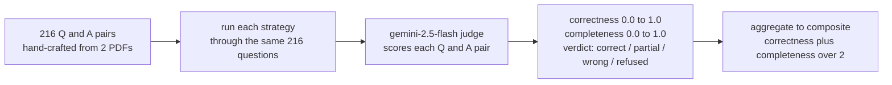

<div align="center">

# 🏆 docparse — Full Evaluation Results

**216 questions · 8 strategies · judged by gemini-2.5-flash**


<sub>Last run: 2026-04-30  ·  Eval corpus: 2 enterprise reports (industry analysis + competitive-intelligence pricing)</sub>

</div>

## TL;DR

| | |
|---|---|
| 🥇 **Winner** | `rag_md_v2` — docparse markdown · per-page chunks · RAG Engine · Gemini 3 flash · top_k=20 · exhaustive system prompt |
| 🎯 **Composite score** | **92.9%** (correctness 92.9%, completeness 93.0%) |
| 🔍 **Eval set** | 216 hand-crafted Q&A pairs across 2 enterprise PDFs (customer data redacted for public release) |
| ⚖️ **Judge** | `gemini-2.5-flash` via Cloud Run service in sharepoint-wif — direct REST API to avoid SDK truncation issues |
| 📐 **Composite** | (correctness + completeness) / 2, both 0.0–1.0 |
| 🏗️ **Production stack lives in** | [`docparse-rag-agent/`](./README.md) |

---

## 1 · Leaderboard

Composite score across all 216 questions, with the verdict mix that produced it.

| Rank | Strategy | Composite | Visual | ✓ correct | × wrong | ? refused | ~ partial |
|---:|---|---:|---|---:|---:|---:|---:|
| 🥇 | **`rag_md_v2`** | **92.9%** | `███████████████████░` | 196 | 10 | 3 | 7 |
| 🥈 | **`rag_md`** | **87.4%** | `█████████████████░░░` | 182 | 11 | 12 | 11 |
| 🥉 | **`digital_v2`** | **81.2%** | `████████████████░░░░` | 168 | 16 | 23 | 9 |
| 4 | **`digital`** | **81.0%** | `████████████████░░░░` | 170 | 17 | 21 | 7 |
| 5 | **`ocr`** | **80.8%** | `████████████████░░░░` | 168 | 15 | 24 | 8 |
| 6 | **`layout`** | **75.2%** | `███████████████░░░░░` | 153 | 11 | 35 | 15 |
| 7 | **`digital_200`** | **69.4%** | `██████████████░░░░░░` | 143 | 15 | 46 | 10 |
| 8 | **`rag_pdf`** | **63.8%** | `█████████████░░░░░░░` | 121 | 61 | 13 | 19 |

**Read this as:** the gap between the top three (~81–93%) shows engine + retrieval matters; the gap to bottom (63.8% for `rag_pdf`) shows extraction matters. Both axes stack.

---

## 1b · What each strategy is

The full stack behind each strategy name.

| Strategy | Full stack description |
|---|---|
| `rag_md_v2` | docparse markdown → **Vertex AI RAG Engine** (72 per-page files, chunk 1000) → **gemini-3-flash-preview** (direct retrieval tool, top_k=20) → **ADK Agent** deployed to Agent Engine → registered in **Gemini Enterprise** |
| `rag_md` | docparse markdown → **Vertex AI RAG Engine** (2 whole-doc files, auto-chunked 500) → **gemini-3-flash-preview** (direct retrieval tool, top_k=5) |
| `digital_v2` | docparse markdown → **Vertex AI Search** (GCS connector, digitalParsingConfig, chunk 500) → **Gemini Enterprise streamAssist** + maximal config (system instruction, web grounding off, managed agents deleted) |
| `digital` | docparse markdown → **Vertex AI Search** (GCS connector, digitalParsingConfig, chunk 500) → **Gemini Enterprise streamAssist** (default assistant config) |
| `ocr` | docparse markdown → **Vertex AI Search** (GCS connector, **ocrParsingConfig**, chunk 500) → **Gemini Enterprise streamAssist** |
| `layout` | docparse markdown → **Vertex AI Search** (GCS connector, **layoutParsingConfig + image annotation**, chunk 500) → **Gemini Enterprise streamAssist** |
| `digital_200` | docparse markdown → **Vertex AI Search** (GCS connector, digitalParsingConfig, **chunk 200**) → **Gemini Enterprise streamAssist** |
| `rag_pdf` | **raw PDFs (NO docparse extraction)** → **Vertex AI RAG Engine** (PDFs direct-imported, RAG's built-in PDF chunker) → **gemini-3-flash-preview** (direct retrieval tool) — ablation test to isolate extraction quality |

**The 1P baseline = strategies 3–7** (Vertex AI Search → Gemini Enterprise, the out-of-the-box GCS-connector experience). Strategies 1–2 and 8 bypass Vertex AI Search and use Vertex AI RAG Engine directly.

---

## 1a · Detailed metrics

Composite is the headline, but correctness + completeness matter for production.

| Strategy | Composite | Correctness | Completeness | ✓ | × | ? | ~ |
|---|---:|---:|---:|---:|---:|---:|---:|
| `rag_md_v2` | **92.9%** | 92.9% | 93.0% | 196 | 10 | 3 | 7 |
| `rag_md` | **87.4%** | 88.4% | 86.5% | 182 | 11 | 12 | 11 |
| `digital_v2` | **81.2%** | 81.3% | 81.1% | 168 | 16 | 23 | 9 |
| `digital` | **81.0%** | 80.9% | 81.1% | 170 | 17 | 21 | 7 |
| `ocr` | **80.8%** | 81.0% | 80.6% | 168 | 15 | 24 | 8 |
| `layout` | **75.2%** | 75.3% | 75.1% | 153 | 11 | 35 | 15 |
| `digital_200` | **69.4%** | 69.6% | 69.3% | 143 | 15 | 46 | 10 |
| `rag_pdf` | **63.8%** | 63.5% | 64.2% | 121 | 61 | 13 | 19 |

**Note:** Per-question data and sample failures redacted for customer privacy. Full evaluation dataset available internally.

---

## 2 · The two-axis ablation

| Comparison | Δ composite | What it isolates |
|---|---:|---|
| `rag_md_v2` vs `rag_md` (same engine, swap chunking strategy) | **+5.5 pts** | per-page chunks + exhaustive prompt vs vanilla RAG |
| `rag_md` vs `digital_v2` (same markdown, swap engine) | **+6.2 pts** | RAG Engine + Gemini beats DE streamAssist |
| `rag_md_v2` vs `rag_pdf` (same engine, swap input) | **+29.1 pts** | docparse extraction beats raw-PDF ingestion |
| `digital_v2` vs `rag_pdf` (better extraction, worse engine) | **+17.4 pts** | extraction > engine when you can't have both |

---

## 3 · How we tested



**Composite formula:** `composite = mean( (correctness + completeness) / 2 )` across all answered questions.

**Verdict labels:**
- `correct` — answer matches ground truth in substance.
- `partial` — some right, some missing or wrong.
- `wrong` — confidently incorrect fact.
- `refused` — assistant said it couldn't find / answer.

**Judge methodology:** gemini-2.5-flash deployed as a Cloud Run service (POST /judge endpoint). Uses direct REST API calls to avoid SDK response truncation. Prompt forces strict JSON output format. Originally tested with Claude Opus for cross-model validation, switched to Gemini for production consistency and simplified auth.

**Question categories:** page-anchored lookups, chart-cell reads, math/aggregation, text-lookup, photo/vision, and diagram interpretation. See full evaluation methodology in internal docs.

---

## 4 · All 8 configurations tested

Every extraction × indexing × parser combination we benchmarked.

| # | Strategy | Extraction | Indexing product | Parser / chunking | Answering | Composite |
|---:|---|---|---|---|---|---:|
| 1 | `rag_md_v2` | docparse markdown | Vertex AI RAG Engine | 72 per-page files, chunk 1000/overlap 100 | gemini-3-flash + retrieval tool, top_k=20 | **92.9%** |
| 2 | `rag_md` | docparse markdown | Vertex AI RAG Engine | 2 full files, auto-chunked 500/overlap 100 | gemini-3-flash + retrieval tool, top_k=5 | **87.4%** |
| 3 | `digital_v2` | docparse markdown | Vertex AI Search (GCS connector) | digitalParsingConfig, chunk 500, + system instr + web off + agents deleted | Gemini Enterprise streamAssist | **81.2%** |
| 4 | `digital` | docparse markdown | Vertex AI Search (GCS connector) | digitalParsingConfig, chunk 500, default config | Gemini Enterprise streamAssist | **81.0%** |
| 5 | `ocr` | docparse markdown | Vertex AI Search (GCS connector) | **ocrParsingConfig**, chunk 500 | Gemini Enterprise streamAssist | **80.8%** |
| 6 | `layout` | docparse markdown | Vertex AI Search (GCS connector) | **layoutParsingConfig** + image annotation, chunk 500 | Gemini Enterprise streamAssist | **75.2%** |
| 7 | `digital_200` | docparse markdown | Vertex AI Search (GCS connector) | digitalParsingConfig, **chunk 200** | Gemini Enterprise streamAssist | **69.4%** |
| 8 | `rag_pdf` | **raw PDFs (no extraction)** | Vertex AI RAG Engine | PDFs direct-import, RAG's built-in PDF chunker | gemini-3-flash + retrieval tool | **63.8%** |

**The 1P baseline = rows 3-7** (Vertex AI Search → Gemini Enterprise). Rows 1-2 and 8 use Vertex AI RAG Engine instead (bypassing Vertex AI Search).

---

## 5 · Reproduce

Eval scaffolding lives in this repo's `eval/` directory. The public release includes:

- `questions.json` — 216 Q&A pairs with structure preserved but content redacted
- `judged/*.json` — composite scores and verdict counts for each strategy (per-question data redacted)
- `build_results_md_sanitized.py` — regenerates this RESULTS.md from sanitized data

Full evaluation dataset (with actual questions and answers) available internally at `~/docparse-eval-private/`.

To regenerate this document:

```bash
cd eval/
python3 build_results_md_sanitized.py
```

---

<div align="center"><sub>Generated from sanitized eval data · 8 strategies · 216 questions per strategy</sub></div>
