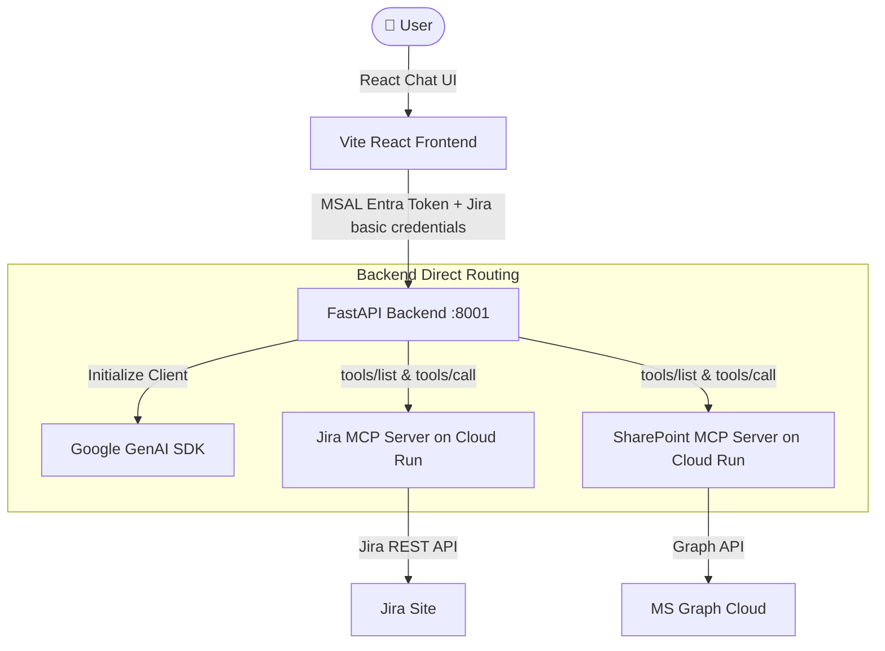

# Gemini Enterprise MCP Co-work Portal

This project replicates the visual layout and dynamics of the **Gemini Enterprise** UI, but swaps out the standard GCP-managed 1P/3P connectors for an **Anthropic Claude Cowork/Projects-style** local MCP harness. 

Instead of deploying a complex agentic routing engine on Vertex AI reasoning engines, it implements a lightweight, high-performance client-side tool registry on a FastAPI backend. This registry dynamically queries available MCP servers, binds their tool schemas directly to a single `gemini-2.5-flash` or `gemini-2.5-pro` model instance via standard function declarations, and streams execution logs and answers to a React frontend.

---

## 🏛️ Architecture



---

## 🚀 Key Features

1. **Gemini Enterprise UI Replication**:
   - Header with `Gemini Enterprise` branding and `Plus` badge.
   - Collapsible left sidebar for workspace navigation.
   - User message bubbles styled as dark rounded pills on the right.
   - Clean assistant responses on the left, starting with `Gemini Assistant` headers.
   - **Grounded Sources**: Displays file/ticket reference links at the bottom of the responses with appropriate icons and direct web URLs.
   
2. **Anthropic Claude Co-work Integrations Drawer**:
   - Toggled via the **Database Stack icon** inside the chat input pill.
   - Slides out from the right showing active connectors.
   - **Microsoft SharePoint Connector**: Authenticates user via Microsoft MSAL popup in the frontend, capturing the Entra ID Bearer token and sending it to the SharePoint MCP server.
   - **Atlassian Jira Connector**: Supports instant Basic authentication. Users enter their Jira site URL, email, and API token directly in the UI (no complex OAuth console setups required for local developers).
   - **Google Search Grounding**: Toggle built-in web grounding on or off for general query context.
   
3. **Low-latency Direct Loop**:
   - The backend runs a standard GenAI function-calling loop. When a tool call is requested by the model, the backend invokes the tool directly on the Cloud Run MCP servers and yields progress events to the client.
   - Progress events streamed via SSE:
     - `event: status` (e.g., "Thinking...", "Calling Jira tool...")
     - `event: tool_call` (indicates active tool name and arguments)
     - `event: tool_result` (indicates execution success)
     - `event: text` (final text response chunks)
     - `event: sources` (extracted ticket and document links)

---

## ⚙️ Prerequisites

1. **Python 3.12+**
2. **Node.js v18+**
3. **Google Cloud CLI** authenticated (`gcloud auth login`) with access to the `vtxdemos` project (where Gemini models are enabled).

---

## 🛠️ Setup, Run, and Teardown

### 1. Configure Environment Variables
Create a `.env` file in the root of the project:
```env
# Google GenAI Settings
# Set to 'true' to use Vertex AI, or 'false' to use Google Developer API (requires GOOGLE_API_KEY)
GOOGLE_GENAI_USE_VERTEXAI=true
GOOGLE_CLOUD_PROJECT=vtxdemos
GOOGLE_CLOUD_LOCATION=us-central1

# Model to use (must be one of: gemini-2.5-flash, gemini-2.5-pro, gemini-3-flash-preview, gemini-3-pro-preview)
GEMINI_MODEL=gemini-2.5-flash

# Deployed MCP Server URLs (configured to real Cloud Run instances)
JIRA_MCP_URL=https://jira-mcp-server-254356041555.us-central1.run.app/mcp
SHAREPOINT_MCP_URL=https://ge-custom-sharepoint-mcp-254356041555.us-central1.run.app/mcp
```

### 2. Start Servers
Run the single executable startup script:
```bash
./start.sh
```
This script will:
- Spin up the FastAPI backend on `http://localhost:8001`.
- Spin up the React/Vite development server on `http://localhost:5173`.

### 3. Teardown / Stop Servers
To stop the running servers and free up the backend and frontend ports:
1. Press `Ctrl+C` in the terminal where `./start.sh` is running.
2. If any background processes remain active, you can clean them up by running:
   ```bash
   # Terminate backend process running on port 8001
   kill -9 $(lsof -t -i:8001) 2>/dev/null
   # Terminate frontend process running on port 5173
   kill -9 $(lsof -t -i:5173) 2>/dev/null
   ```

### 4. Clean Dependencies Reset
If you ever need to clean and reinstall all packages from scratch:
```bash
# Clean frontend build artifacts and dependencies
cd frontend
rm -rf node_modules package-lock.json dist
npm install
cd ..

# Clean backend Python compiled cache
cd backend
find . -type d -name "__pycache__" -exec rm -rf {} +
cd ..
```

---

## 🧪 Verification Walkthrough

1. Open `http://localhost:5173` in your browser.
2. Click the **Database stack icon** in the chat input card to slide out the **Integrations & Tools** drawer.
3. **Test Jira**:
   - Enter your Jira site URL (`https://sockcop.atlassian.net`), Email, and API token, then click **Save & Connect Jira**.
   - Check that the connection status updates to **Connected** and exposes all 9 Jira MCP tools.
   - Close the drawer and submit the search query: *"Search Jira for issues containing 'Ducati'"*.
   - The query will fetch matching issues from the real Cloud Run Jira MCP server and display them with proper key links and custom chat bubbles.
4. **Test SharePoint**:
   - Click the **Connect via Entra ID** button, sign in with your Microsoft account, and toggle the SharePoint connection.

