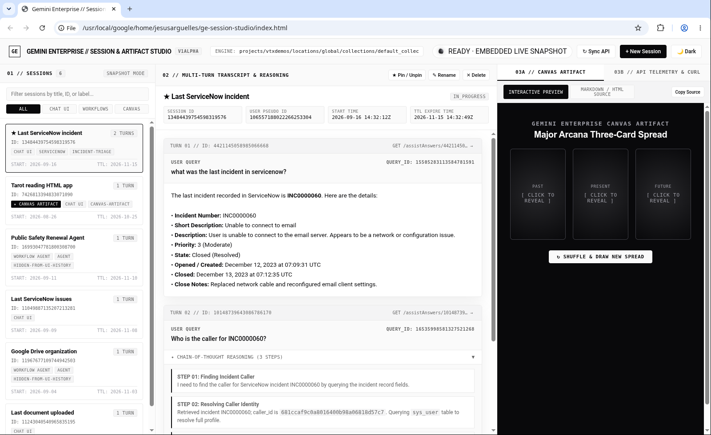
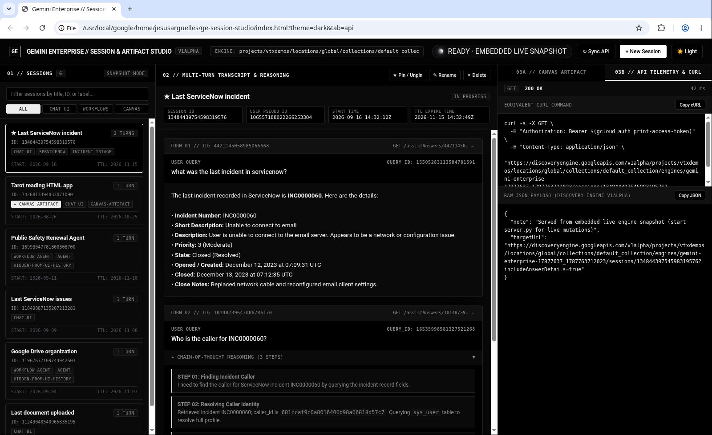

# Gemini Enterprise // Session & Artifact Studio (`v1alpha`)

An architectural developer console and API workbench for **Gemini Enterprise (Google Cloud Discovery Engine `v1alpha`)** built strictly to the **Vercel Monochrome Architecture UI** standard (`Light Mode Default` + Dynamic `🌙 Dark / ☀️ Light` Toggle + **Claude-Code Shrinking & Shining Ink Loader**).

---

## 1. Visual Architecture & UI/UX Preview

### Light Mode (Default Architecture) — Multi-Turn Reasoning & Live Canvas App Preview


### OLED Dark Mode — Real-Time API Telemetry, cURL Generator & Raw JSON Inspector


---

## 2. Core Capabilities

1. **Full Session Discovery (`ListSessions`)**
   - Browse all active sessions in any Gemini Enterprise engine (`projects/{project}/locations/{location}/collections/default_collection/engines/{engine}`).
   - Instant filtering across **All Sessions**, **Chat UI Sessions**, **Agent Workflow Editor Sessions** (automatically tagged with `hidden-from-ui-history:workflow-agent-editor`), and **Canvas Artifact Sessions**.

2. **Multi-Turn Transcript & Chain-of-Thought Reasoning Inspector (`GetSession?includeAnswerDetails=true`)**
   - Inspect every turn's `queryId`, `turnId`, and `assistAnswer` resource path.
   - Expandable **Chain-of-Thought Reasoning Accordions** (`thought: true` parts inside `detailedAssistAnswer.replies[].groundedContent.content.parts[]`), allowing engineers to debug multi-step tool calls (e.g., ServiceNow incident lookup -> `caller_id` extraction -> `sys_user` table resolution).

3. **Sandboxed Canvas / Immersive Artifact Inspector (`immersiveArtifact`)**
   - Automatically extracts inline Canvas artifacts (`detailedAssistAnswer.replies[].immersiveArtifact[]`) from session turns.
   - **Interactive Preview**: Renders single-file HTML5/CSS/JS Canvas applications (such as the **Interactive HTML Tarot Reading App**) inside a live sandboxed `<iframe>`.
   - **Markdown / HTML Source**: View and copy the raw `docArtifact.text` source code.

4. **Full Session CRUD Lifecycle & Live cURL Telemetry (`POST`, `PATCH`, `DELETE`)**
   - **Create Session (`POST /sessions`)**: Provision new sessions with custom `displayName`, `userPseudoId`, and `labels`.
   - **Pin / Rename Session (`PATCH /sessions/{id}?updateMask=...`)**: Mutate session metadata (`isPinned`, `displayName`, `labels`) in real time.
   - **Delete Session (`DELETE /sessions/{id}`)**: Cleanly delete test or expired sessions.
   - Every UI action generates the exact **copyable `curl` command** (using `$(gcloud auth print-access-token)`), HTTP status code, latency in milliseconds, and formatted Raw JSON payload.

---

## 3. Quickstart & SSH Tunnel Setup

### Prerequisites
- Python 3.8+ (uses standard library `http.server` and `urllib.request` — **zero external pip dependencies**).
- Authenticated Google Cloud SDK (`gcloud auth login` or active workstation credentials).

### Start the Local Proxy & Studio Server
```bash
cd /usr/local/google/home/jesusarguelles/ge-session-studio
python3 server.py
```
The server listens on `http://127.0.0.1:8765`.

### Accessing Remotely via SSH Tunnel
If running on a remote workstation (e.g., `jesus.c.googlers.com`), create a local port-forwarding tunnel from your laptop:

```bash
ssh -L 8765:127.0.0.1:8765 jesus.c.googlers.com
```
*(Or run in the background without opening a shell using `ssh -N -L 8765:127.0.0.1:8765 jesus.c.googlers.com`)*.

Then open in your local browser:
👉 **[http://localhost:8765](http://localhost:8765)**

> **Offline / Standalone Mode:** You can also open `index.html` directly via `file://` in any browser. It includes an embedded live snapshot of the 6 sessions, ServiceNow multi-turn reasoning traces, and the Tarot HTML Canvas artifact so it functions standalone without a backend server.

---

## 4. Discovery Engine `v1alpha` Session & Artifact API Reference

All session and chat history management in Gemini Enterprise is powered by the `SessionService` REST/gRPC interface.

### A. List All Sessions (`ListSessions`)
```bash
curl -s -X GET \
  -H "Authorization: Bearer $(gcloud auth print-access-token)" \
  -H "Content-Type: application/json" \
  "https://discoveryengine.googleapis.com/v1alpha/projects/vtxdemos/locations/global/collections/default_collection/engines/gemini-enterprise-17877637_1787763712023/sessions?pageSize=20"
```

### B. Get Session Transcript, Reasoning & Inline Canvas Artifacts (`GetSession`)
Passing `?includeAnswerDetails=true` populates `turns[].detailedAssistAnswer`, which contains both model thoughts (`thought: true`) and Canvas artifacts (`immersiveArtifact[]`):
```bash
curl -s -X GET \
  -H "Authorization: Bearer $(gcloud auth print-access-token)" \
  -H "Content-Type: application/json" \
  "https://discoveryengine.googleapis.com/v1alpha/projects/vtxdemos/locations/global/collections/default_collection/engines/gemini-enterprise-17877637_1787763712023/sessions/13484439754598319576?includeAnswerDetails=true"
```

### C. Inspect a Single Turn's AssistAnswer Directly (`GetAssistAnswer`)
```bash
curl -s -X GET \
  -H "Authorization: Bearer $(gcloud auth print-access-token)" \
  -H "Content-Type: application/json" \
  "https://discoveryengine.googleapis.com/v1alpha/projects/vtxdemos/locations/global/collections/default_collection/engines/gemini-enterprise-17877637_1787763712023/sessions/7426813394833071090/assistAnswers/3003692094340454270"
```

### D. Create Session (`CreateSession`)
```bash
curl -s -X POST \
  -H "Authorization: Bearer $(gcloud auth print-access-token)" \
  -H "Content-Type: application/json" \
  -d '{
    "displayName": "API Demo Test Session",
    "userPseudoId": "demo-user-123",
    "labels": ["api-test", "demo"]
  }' \
  "https://discoveryengine.googleapis.com/v1alpha/projects/vtxdemos/locations/global/collections/default_collection/engines/gemini-enterprise-17877637_1787763712023/sessions"
```

### E. Update / Pin / Rename Session (`UpdateSession`)
```bash
curl -s -X PATCH \
  -H "Authorization: Bearer $(gcloud auth print-access-token)" \
  -H "Content-Type: application/json" \
  -d '{
    "displayName": "API Demo Session (Updated & Pinned)",
    "isPinned": true,
    "labels": ["api-test", "demo"]
  }' \
  "https://discoveryengine.googleapis.com/v1alpha/projects/vtxdemos/locations/global/collections/default_collection/engines/gemini-enterprise-17877637_1787763712023/sessions/15883627835937039047?updateMask=displayName,isPinned,labels"
```

### F. Delete Session (`DeleteSession`)
```bash
curl -s -X DELETE \
  -H "Authorization: Bearer $(gcloud auth print-access-token)" \
  -H "Content-Type: application/json" \
  "https://discoveryengine.googleapis.com/v1alpha/projects/vtxdemos/locations/global/collections/default_collection/engines/gemini-enterprise-17877637_1787763712023/sessions/15883627835937039047"
```

---

## 5. Architectural Reference: Salesforce Federated Connector vs. Custom MCP (`BYOMCP`) in Agent Workflows

### Why the Out-of-the-Box Salesforce Federated Connector Cannot Be Used in Agent Workflows
1. **BAP Config Gate Closed (`bap_utils.py`)**: The `_AGENTFLOW_BAP_CONFIG_FLAGS` allowlist fails closed for `SALESFORCE_AGENT` inside Agent Workflows (`AgentFlow` / `AgentNode`), whereas `SERVICENOW_AGENT` and `JIRA_CLOUD_AGENT` are explicitly enabled.
2. **Legacy Non-BAP Path Incompatibility (`salesforce_agent.py`)**: The standard Federated Salesforce connector executes via a legacy non-BAP tool handler designed only for top-level Assistant chat turns, not Agent Flow nodes.
3. **OAuth 3LO Token Forwarding Limitation (`auth_util.cc`)**: Sub-agent workflow execution contexts do not automatically propagate user-level 3LO Salesforce OAuth tokens across asynchronous workflow steps.

### Workaround: Integrating Salesforce Hosted MCP Server via Custom MCP (`BYOMCP`)
To use Salesforce objects (`Account`, `Contact`, `Opportunity`, `Case`, etc.) inside **Agent Workflows**, configure Salesforce's GA Hosted MCP Server (`sobject-all`) via **Connected data stores -> Create data store -> Custom MCP Server**:

| Field | Value / Setting |
| :--- | :--- |
| **MCP Server Endpoint URL** | `https://api.salesforce.com/platform/mcp/v1/platform/sobject-all` |
| **Authentication Type** | **OAuth 2.0 (3LO User Authentication)** |
| **Authorization URL** | `https://<YOUR_MY_DOMAIN>.my.salesforce.com/services/oauth2/authorize` |
| **Token URL** | `https://<YOUR_MY_DOMAIN>.my.salesforce.com/services/oauth2/token` |
| **Client ID / Secret** | Consumer Key & Consumer Secret from your Salesforce External Client App |
| **Scopes** | `api refresh_token offline_access` |
| **Use HTTP Basic Authentication (`client_secret_basic_override`)** | **MUST BE UNCHECKED (`false`)** — *Critical: Salesforce `/services/oauth2/token` rejects `Authorization: Basic` headers with `400 invalid_client` and requires `client_secret_post` form fields.* |

---

## 6. UI/UX Standard: Vercel Monochrome Architecture & Claude-Code Ink Loader

This repository enforces the **Vercel Monochrome Architecture UI** standard:
- **Light Mode Default (`:root`)**: Crisp `#FAFAFA` off-white canvas with `48px` hairline grid (`#EAEAEA`), `#FFFFFF` surface cards, `1px solid` structural borders, and pure obsidian (`#09090B`) typography (`Inter` + `JetBrains Mono`).
- **Dynamic Theme Toggle (`toggleTheme()`)**: Instant switch to OLED Dark Mode (`#000000` canvas, `#111111` grid, `#0A0A0A` surfaces, `#EDEDED` typography).
- **Claude-Code Shrinking & Shining Ink Loader (`.shrinking-shining-ink` + `.sweep-text`)**: Morphing liquid ink droplet paired with a linear shimmer sweep for all asynchronous API telemetry states.
